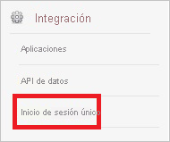
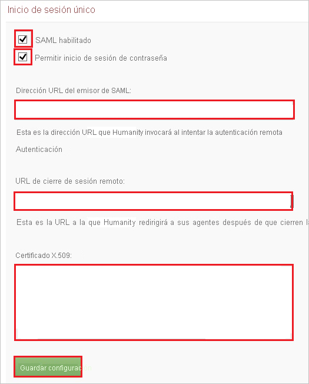
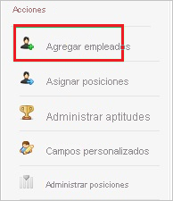

# Tutorial: Integración del inicio de sesión único de Azure AD con Humanity

En este tutorial, aprenderá a integrar Humanity con Azure Active Directory (Azure AD). Gracias a la integración de Humanity con Azure AD puede:

* Controlar en Azure AD quién tiene acceso a Humanity.
* Permitir que los usuarios inicien sesión automáticamente en Humanity con sus cuentas de Azure AD.
* Administrar las cuentas desde una ubicación central (Azure Portal).

## Requisitos previos

Para empezar, necesita los siguientes elementos:

* Una suscripción de Azure AD. Si no tiene una suscripción, puede crear una [cuenta gratuita](https://azure.microsoft.com/free/).
* Una suscripción habilitada para el inicio de sesión único en Humanity.

## Descripción del escenario

En este tutorial, puede configurar y probar el inicio de sesión único de Azure AD en un entorno de prueba.

* Humanity admite el inicio de sesión único iniciado por **SP**.

> [!NOTE]
> El identificador de esta aplicación es un valor de cadena fijo, por lo que solo se puede configurar una instancia en un inquilino.

## Adición de Humanity desde la galería

Para configurar la integración de Humanity en Azure AD, deberá agregar Humanity desde la galería a la lista de aplicaciones SaaS administradas.

1. Inicie sesión en Azure Portal con una cuenta personal, profesional o educativa de Microsoft.
1. En el panel de navegación de la izquierda, seleccione el servicio **Azure Active Directory**.
1. Vaya a **Aplicaciones empresariales** y seleccione **Todas las aplicaciones**.
1. Para agregar una nueva aplicación, seleccione **Nueva aplicación**.
1. En la sección **Agregar desde la galería**, escriba **Humanity** en el cuadro de búsqueda.
1. Seleccione **Humanity** en el panel de resultados y agregue la aplicación. Espere unos segundos mientras la aplicación se agrega al inquilino.

## Configuración y prueba del inicio de sesión único de Azure AD para Humanity

Configure y pruebe el inicio de sesión único de Azure AD con Humanity mediante un usuario de prueba llamado **B.Simon**. Para que el inicio de sesión único funcione, es preciso establecer una relación de vinculación entre un usuario de Azure AD y el usuario correspondiente de Humanity.

Para configurar y probar el inicio de sesión único de Azure AD con Humanity, siga estos pasos:

1. **[Configuración del inicio de sesión único de Azure AD](#configure-azure-ad-sso)** , para permitir que los usuarios puedan utilizar esta característica.
    1. **[Creación de un usuario de prueba de Azure AD](#create-an-azure-ad-test-user)**, para probar el inicio de sesión único de Azure AD con B.Simon.
    1. **[Asignación del usuario de prueba de Azure AD](#assign-the-azure-ad-test-user)** , para habilitar a B.Simon para que use el inicio de sesión único de Azure AD.
1. **[Configuración del inicio de sesión único en Humanity](#configure-humanity-sso)** , para configurar los valores de Inicio de sesión único en la aplicación.
    1. **[Creación de un usuario de prueba de Humanity](#create-humanity-test-user)** , para tener un homólogo de B.Simon en Humanity que esté vinculado a la representación del usuario en Azure AD.
1. **[Prueba del inicio de sesión único](#test-sso)** : para comprobar si la configuración funciona.

## Configuración del inicio de sesión único de Azure AD

Siga estos pasos para habilitar el inicio de sesión único de Azure AD en Azure Portal.

1. En Azure Portal, en la página de integración de aplicaciones de **Humanity**, busque la sección **Administrar** y seleccione **Inicio de sesión único**.
1. En la página **Seleccione un método de inicio de sesión único**, elija **SAML**.
1. En la página **Configuración del inicio de sesión único con SAML**, haga clic en el icono de lápiz de **Configuración básica de SAML** para editar la configuración.

   

4. En la sección **Configuración básica de SAML**, siga estos pasos:

    a. En el cuadro de texto **Identificador (id. de entidad)** , escriba la dirección URL: `https://company.humanity.com/app/`.

    b. En el cuadro de texto **Dirección URL de inicio de sesión**, escriba la dirección URL: `https://company.humanity.com/includes/saml/`

    > [!NOTE]
    > Estos valores no son reales. Actualice estos valores con el identificador y la dirección URL de inicio de sesión reales. Póngase en contacto con el [equipo de soporte de cliente de Humanity](https://www.humanity.com/support/) para obtener estos valores. También puede hacer referencia a los patrones que se muestran en la sección **Configuración básica de SAML** de Azure Portal.

4. En la página **Configurar el inicio de sesión único con SAML**, en la sección **Certificado de firma de SAML**, haga clic en **Descargar** para descargar el **certificado (Base64)** de las opciones proporcionadas según sus requisitos y guárdelo en el equipo.

    

6. En la sección **Configurar Humanity**, copie las direcciones URL adecuadas según sus requisitos.

    

### Creación de un usuario de prueba de Azure AD

En esta sección, va a crear un usuario de prueba llamado B.Simon en Azure Portal.

1. En el panel izquierdo de Azure Portal, seleccione **Azure Active Directory**, **Usuarios** y **Todos los usuarios**.
1. Seleccione **Nuevo usuario** en la parte superior de la pantalla.
1. En las propiedades del **usuario**, siga estos pasos:
   1. En el campo **Nombre**, escriba `B.Simon`.  
   1. En el campo **Nombre de usuario**, escriba username@companydomain.extension. Por ejemplo, `B.Simon@contoso.com`.
   1. Active la casilla **Show password** (Mostrar contraseña) y, después, anote el valor que se muestra en el cuadro **Contraseña**.
   1. Haga clic en **Crear**.

### Asignación del usuario de prueba de Azure AD

En esta sección, va a permitir que B.Simon acceda a Humanity mediante el inicio de sesión único de Azure.

1. En Azure Portal, seleccione sucesivamente **Aplicaciones empresariales** y **Todas las aplicaciones**.
1. En la lista de aplicaciones, seleccione **Humanity**.
1. En la página de información general de la aplicación, busque la sección **Administrar** y seleccione **Usuarios y grupos**.
1. Seleccione **Agregar usuario**. A continuación, en el cuadro de diálogo **Agregar asignación**, seleccione **Usuarios y grupos**.
1. En el cuadro de diálogo **Usuarios y grupos**, seleccione **B.Simon** de la lista de usuarios y haga clic en el botón **Seleccionar** de la parte inferior de la pantalla.
1. Si espera que se asigne un rol a los usuarios, puede seleccionarlo en la lista desplegable **Seleccionar un rol**. Si no se ha configurado ningún rol para esta aplicación, verá seleccionado el rol "Acceso predeterminado".
1. En el cuadro de diálogo **Agregar asignación**, haga clic en el botón **Asignar**.

## Configuración del inicio de sesión único de Humanity

1. En otra ventana del explorador web, inicie sesión en el sitio de **Humanity** de la compañía como administrador.

2. En el menú de la parte superior, haga clic en **Administrador**.

    

3. En **Integración**, haga clic en **Inicio de sesión único**.

    

4. En la sección **Inicio de sesión único** , siga estos pasos:

    

    a. Seleccione **SAML habilitado**.

    b. Seleccione **Allow Password Login** (Permitir inicio de sesión de contraseña).

    c. En el cuadro de texto **SAML Issuer URL** (Dirección URL del emisor de SAML), pegue la **dirección URL de cierre de sesión** que ha copiado de Azure Portal.

    d. En el cuadro de texto **Logout URL** (Dirección URL de cierre de sesión), pegue la **Dirección URL de cierre de sesión** que ha copiado de Azure Portal.

    e. Abra el certificado codificado en base 64 en el Bloc de notas, copie el contenido del mismo en el Portapapeles y luego péguelo en el cuadro de texto **Certificado X.509** .

    f. Haga clic en **Guardar configuración**.

### Creación de un usuario de prueba de Humanity

Para permitir que los usuarios de Azure AD inicien sesión en Humanity, deben aprovisionarse en Humanity. En el caso de Humanity, el aprovisionamiento es una tarea manual.

**Para aprovisionar una cuenta de usuario, realice estos pasos:**

1. Inicie sesión en su sitio de la compañía de **Humanity** como administrador.

2. Haga clic en **Administrador**.

    

3. Haga clic en **Personal**.

    

4. En **Acciones**, haga clic en **Agregar empleados**.

    

5. En la sección **Agregar empleados** , lleve a cabo estos pasos:

    

    a. Escriba los datos de una cuenta de Azure AD válida que desee aprovisionar en los cuadros de texto correspondientes: **Nombre**, **Apellidos** y **Correo electrónico**.

    b. Haga clic en **Guardar empleados**.

> [!NOTE]
> Puede usar cualquier otra API o herramienta de creación de cuentas de usuario de Humanity que proporcione Humanity para aprovisionar cuentas de usuario de Azure AD.

## Prueba de SSO

En esta sección, probará la configuración de inicio de sesión único de Azure AD con las siguientes opciones. 

* Haga clic en **Probar esta aplicación** en Azure Portal. Esta acción le redirigirá a la dirección URL de inicio de sesión de Humanity, donde puede comenzar el flujo de inicio de sesión. 

* Vaya directamente a la dirección URL de inicio de sesión de Humanity e inicie el flujo de inicio de sesión desde allí.

* Puede usar Mis aplicaciones de Microsoft. Al hacer clic en el icono de Humanity, que se encuentra en Aplicaciones, se le redirigirá a la dirección URL de inicio de sesión de dicha aplicación. Para más información acerca de Aplicaciones, consulte [Inicio de sesión e inicio de aplicaciones desde el portal Aplicaciones](../user-help/my-apps-portal-end-user-access.md).

## Pasos siguientes

Una vez configurado Humanity, puede aplicar el control de sesión, que protege la filtración y la infiltración de la información confidencial de la organización en tiempo real. El control de sesión procede del acceso condicional. [Aprenda a aplicar el control de sesión con Microsoft Defender para aplicaciones en la nube](/cloud-app-security/proxy-deployment-aad).
