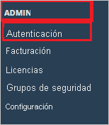
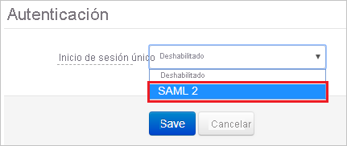

# Tutorial: Integración de Azure Active Directory con Skills Base

En este tutorial, aprenderá a integrar Skills Base con Azure Active Directory (Azure AD). Al integrar Skills Base con Azure AD, puede hacer lo siguiente:

* Controlar en Azure AD quién tiene acceso a Skills Base.
* Permitir que los usuarios inicien sesión automáticamente en Skills Base con sus cuentas de Azure AD.
* Administrar las cuentas desde una ubicación central (Azure Portal).

## Requisitos previos

Para empezar, necesita los siguientes elementos:

* Una suscripción de Azure AD. Si no tiene una suscripción, puede crear una [cuenta gratuita](https://azure.microsoft.com/free/).
* Una suscripción habilitada para inicio de sesión único (SSO) en Skills Base.

> [!NOTE]
> Esta integración también está disponible para usarse desde el entorno de la nube del gobierno de EE. UU de Azure AD. Puede encontrar esta aplicación en la galería de aplicaciones de la nube del gobierno de EE. UU. de Azure AD y configurarla de la misma manera que en la nube pública.

## Descripción del escenario

En este tutorial, puede configurar y probar el inicio de sesión único de Azure AD en un entorno de prueba.

* Skills Base admite el inicio de sesión único iniciado por **SP**.
* Skills Base admite el aprovisionamiento de usuarios **Just-In-Time**.

> [!NOTE]
> El identificador de esta aplicación es un valor de cadena fijo, por lo que solo se puede configurar una instancia en un inquilino.

## Adición de Skills Base desde la galería

Para configurar la integración de Skills Base en Azure AD, es preciso agregar Skills Base desde la galería a la lista de aplicaciones SaaS administradas.

1. Inicie sesión en Azure Portal con una cuenta personal, profesional o educativa de Microsoft.
1. En el panel de navegación de la izquierda, seleccione el servicio **Azure Active Directory**.
1. Vaya a **Aplicaciones empresariales** y seleccione **Todas las aplicaciones**.
1. Para agregar una nueva aplicación, seleccione **Nueva aplicación**.
1. En la sección **Agregar desde la galería**, escriba **Skills Base** en el cuadro de búsqueda.
1. Seleccione **Skills Base** en el panel de resultados y, a continuación, agregue la aplicación. Espere unos segundos mientras la aplicación se agrega al inquilino.

## Configuración y prueba del inicio de sesión único de Azure AD para Skills Base

Configure y pruebe el inicio de sesión único de Azure AD con Skills Base mediante un usuario de prueba llamado **B.Simon**. Para que el inicio de sesión único funcione, es preciso establecer una relación de vinculación entre un usuario de Azure AD y el usuario correspondiente de Skills Base.

Para configurar y probar el inicio de sesión único de Azure AD con Skills Base, lleve a cabo los siguientes pasos:

1. **[Configuración del inicio de sesión único de Azure AD](#configure-azure-ad-sso)** , para permitir que los usuarios puedan utilizar esta característica.
    1. **[Creación de un usuario de prueba de Azure AD](#create-an-azure-ad-test-user)** , para probar el inicio de sesión único de Azure AD con B.Simon.
    1. **[Asignación del usuario de prueba de Azure AD](#assign-the-azure-ad-test-user)** , para habilitar a B.Simon para que use el inicio de sesión único de Azure AD.
1. **[Configuración del inicio de sesión único en Skills Base](#configure-skills-base-sso)** : para definir los valores de inicio de sesión único en la aplicación.
    1. **[Creación de un usuario de prueba en Skills Base](#create-skills-base-test-user)** : para tener un homólogo de B.Simon en Skills Base que esté vinculado a la representación de ella en Azure AD.
1. **[Prueba del inicio de sesión único](#test-sso)** : para comprobar si la configuración funciona.

## Configuración del inicio de sesión único de Azure AD

Siga estos pasos para habilitar el inicio de sesión único de Azure AD en Azure Portal.

1. En Azure Portal, en la página de integración de aplicaciones de **Skills Base**, busque la sección **Administrar** y seleccione **Inicio de sesión único**.
1. En la página **Seleccione un método de inicio de sesión único**, elija **SAML**.
1. En la página **Configuración del inicio de sesión único con SAML**, haga clic en el icono de lápiz de **Configuración básica de SAML** para editar la configuración.

   

4. En la sección **Configuración básica de SAML**, siga estos pasos:

    En el cuadro de texto **URL de inicio de sesión**, escriba una dirección URL con el siguiente patrón: `https://app.skills-base.com/o/<customer-unique-key>`

    > [!NOTE]
    > Puede obtener la dirección URL de inicio de sesión de la aplicación de Skills Base. Inicie sesión como administrador y vaya a Administración -> Configuración -> Detalles de instancia -> Shortcut link (Vínculo de acceso directo). Copie la dirección URL de inicio de sesión y péguela encima del cuadro de texto.

5. En la página **Configurar el inicio de sesión único con SAML**, en la sección **Certificado de firma de SAML**, haga clic en **Descargar** para descargar el **XML de metadatos de federación** de las opciones proporcionadas según sus requisitos y guárdelo en el equipo.

    

6. En la sección **Set up Skills Base** (Configurar Skills Base), copie las direcciones URL adecuadas según sus necesidades.

    

### Creación de un usuario de prueba de Azure AD

En esta sección, va a crear un usuario de prueba llamado B.Simon en Azure Portal.

1. En el panel izquierdo de Azure Portal, seleccione **Azure Active Directory**, **Usuarios** y **Todos los usuarios**.
1. Seleccione **Nuevo usuario** en la parte superior de la pantalla.
1. En las propiedades del **usuario**, siga estos pasos:
   1. En el campo **Nombre**, escriba `B.Simon`.  
   1. En el campo **Nombre de usuario**, escriba username@companydomain.extension. Por ejemplo, `B.Simon@contoso.com`.
   1. Active la casilla **Show password** (Mostrar contraseña) y, después, anote el valor que se muestra en el cuadro **Contraseña**.
   1. Haga clic en **Crear**.

### Asignación del usuario de prueba de Azure AD

En esta sección va a permitir que B.Simon acceda a Skills Base mediante el inicio de sesión único de Azure.

1. En Azure Portal, seleccione sucesivamente **Aplicaciones empresariales** y **Todas las aplicaciones**.
1. En la lista de aplicaciones, seleccione **Skills Base**.
1. En la página de información general de la aplicación, busque la sección **Administrar** y seleccione **Usuarios y grupos**.
1. Seleccione **Agregar usuario**. A continuación, en el cuadro de diálogo **Agregar asignación**, seleccione **Usuarios y grupos**.
1. En el cuadro de diálogo **Usuarios y grupos**, seleccione **B.Simon** de la lista de usuarios y haga clic en el botón **Seleccionar** de la parte inferior de la pantalla.
1. Si espera que se asigne un rol a los usuarios, puede seleccionarlo en la lista desplegable **Seleccionar un rol**. Si no se ha configurado ningún rol para esta aplicación, verá seleccionado el rol "Acceso predeterminado".
1. En el cuadro de diálogo **Agregar asignación**, haga clic en el botón **Asignar**.

## Configuración del inicio de sesión único de Skills Base

1. En otra ventana del explorador web, inicie sesión en Skills Base como administrador de seguridad.

2. En el lado izquierdo del menú, bajo **ADMIN** haga clic en **Authentication** (Autenticación).

    

3. En la página **Authentication** (Autenticación), seleccione el inicio de sesión único como **SAML 2**.

    

4. En la página **Authentication** (Autenticación), realice los siguientes pasos:

    

    a. Haga clic en el botón **Update IdP metadata** (Actualizar metadatos de IdP) junto a la opción **Status** (Estado) y pegue el contenido del XML de metadatos que descargó de Azure Portal en el cuadro de texto especificado.

    > [!Note]
    > También puede validar los metadatos de IdP mediante la herramienta de **validador de metadatos**, como se resalta en la captura de pantalla anterior.

    b. Haga clic en **Save**(Guardar).

### Creación de un usuario de prueba de Skills Base

En esta sección, se crea un usuario llamado Britta Simon en Skills Base. Skills Base admite el aprovisionamiento de usuarios Just-In-Time, que está habilitado de forma predeterminada. No hay ningún elemento de acción para usted en esta sección. Si un usuario ya no existe en Skills Base, se crea uno después de la autenticación.

> [!Note]
> Si necesita crear manualmente un usuario, siga las instrucciones que se indican [aquí](http://wiki.skills-base.net/index.php?title=Adding_people_and_enabling_them_to_log_in).

## Prueba de SSO

En esta sección, probará la configuración de inicio de sesión único de Azure AD con las siguientes opciones. 

* Haga clic en **Probar esta aplicación** en Azure Portal. Esta acción le redirigirá a la dirección URL de inicio de sesión de Skills Base, donde puede iniciar el flujo de inicio de sesión. 

* Vaya directamente a la dirección URL de inicio de sesión de Skills Base e inicie el flujo de inicio de sesión desde allí.

* Puede usar Mis aplicaciones de Microsoft. Al hacer clic en el icono de Skills Base en Aplicaciones, se le redirigirá a la dirección URL de inicio de sesión de esa aplicación. Para más información acerca de Aplicaciones, consulte [Inicio de sesión e inicio de aplicaciones desde el portal Aplicaciones](https://support.microsoft.com/account-billing/sign-in-and-start-apps-from-the-my-apps-portal-2f3b1bae-0e5a-4a86-a33e-876fbd2a4510).

## Pasos siguientes

Una vez que haya configurado Skills Base, puede aplicar el control de sesión, que protege su organización en tiempo real frente a la filtración e infiltración de información confidencial. El control de sesión procede del acceso condicional. [Aprenda a aplicar el control de sesión con Microsoft Cloud App Security](/cloud-app-security/proxy-deployment-aad).