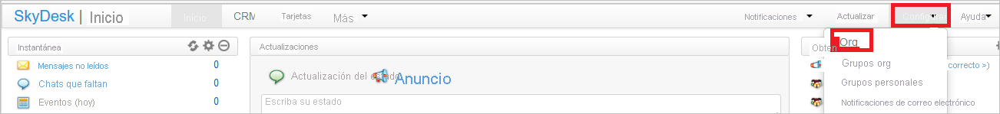
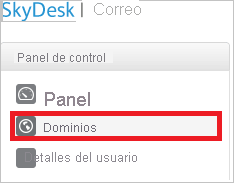
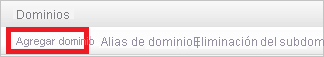
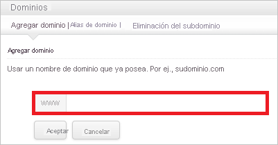
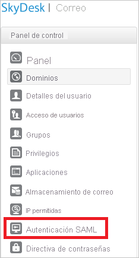
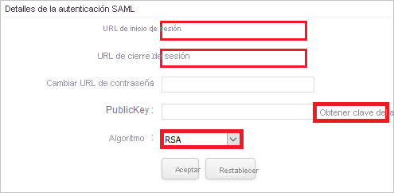
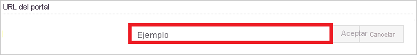
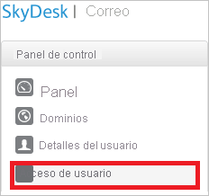

# Tutorial: Integración del inicio de sesión único de Azure AD con SkyDesk Email

En este tutorial, aprenderá a integrar SkyDesk Email con Azure Active Directory (Azure AD). Al integrar Skydesk Email con Azure AD, puede hacer lo siguiente:

* Controlar en Azure AD quién tiene acceso a SkyDesk Email.
* Permitir que los usuarios inicien sesión automáticamente en SkyDesk Email con sus cuentas de Azure AD.
* Administrar las cuentas desde una ubicación central (Azure Portal).

## Requisitos previos

Para empezar, necesita los siguientes elementos:

* Una suscripción de Azure AD. Si no tiene una suscripción, puede crear una [cuenta gratuita](https://azure.microsoft.com/free/).
* Una suscripción habilitada para el inicio de sesión único (SSO) en Skydesk Email.

## Descripción del escenario

En este tutorial, puede configurar y probar el inicio de sesión único de Azure AD en un entorno de prueba.

* Skydesk Email admite el inicio de sesión único iniciado por **SP**.

> [!NOTE]
> El identificador de esta aplicación es un valor de cadena fijo, por lo que solo se puede configurar una instancia en un inquilino.

## Agregar Skydesk Email desde la galería

Para configurar la integración de Skydesk Email en Azure AD, será preciso que agregue Skydesk Email desde la galería a la lista de aplicaciones SaaS administradas.

1. Inicie sesión en Azure Portal con una cuenta personal, profesional o educativa de Microsoft.
1. En el panel de navegación de la izquierda, seleccione el servicio **Azure Active Directory**.
1. Vaya a **Aplicaciones empresariales** y seleccione **Todas las aplicaciones**.
1. Para agregar una nueva aplicación, seleccione **Nueva aplicación**.
1. En la sección **Agregar desde la galería**, escriba **SkyDesk Email** en el cuadro de búsqueda.
1. Seleccione **SkyDesk Email** en el panel de resultados y, a continuación, agregue la aplicación. Espere unos segundos mientras la aplicación se agrega al inquilino.

## Configuración y prueba del inicio de sesión único de Azure AD para SkyDesk Email

Configure y pruebe el inicio de sesión único de Azure AD con SkyDesk Email mediante un usuario de prueba llamado **B.Simon**. Para que el inicio de sesión único funcione, es preciso establecer una relación de vinculación entre un usuario de Azure AD y el usuario correspondiente de SkyDesk Email.

Para configurar y probar el inicio de sesión único de Azure AD con SkyDesk Email, siga estos pasos:

1. **[Configuración del inicio de sesión único de Azure AD](#configure-azure-ad-sso)** , para permitir que los usuarios puedan utilizar esta característica.
    1. **[Creación de un usuario de prueba de Azure AD](#create-an-azure-ad-test-user)**, para probar el inicio de sesión único de Azure AD con B.Simon.
    1. **[Asignación del usuario de prueba de Azure AD](#assign-the-azure-ad-test-user)** , para habilitar a B.Simon para que use el inicio de sesión único de Azure AD.
1. **[Configuración del inicio de sesión único en SkyDesk Email](#configure-skydesk-email-sso)** : para configurar los valores de inicio de sesión único en la aplicación.
    1. **[Creación de un usuario de prueba de Skydesk Email](#create-skydesk-email-test-user)** : para tener un homólogo de B.Simon en Skydesk Email que esté vinculado a la representación del usuario en Azure AD.
1. **[Prueba del inicio de sesión único](#test-sso)** : para comprobar si la configuración funciona.

## Configuración del inicio de sesión único de Azure AD

Siga estos pasos para habilitar el inicio de sesión único de Azure AD en Azure Portal.

1. En Azure Portal, en la página de integración de la aplicación **SkyDesk Email**, busque la sección **Administrar** y seleccione **Inicio de sesión único**.
1. En la página **Seleccione un método de inicio de sesión único**, elija **SAML**.
1. En la página **Configuración del inicio de sesión único con SAML**, haga clic en el icono de lápiz de **Configuración básica de SAML** para editar la configuración.

   

4. En la sección **Configuración básica de SAML**, siga estos pasos:

    En el cuadro de texto **URL de inicio de sesión**, escriba una dirección URL con el siguiente patrón: `https://mail.skydesk.jp/portal/<companyname>`

    > [!NOTE]
    > Este valor no es real. Actualícelo con la dirección URL de inicio de sesión real. Póngase en contacto con el [equipo de soporte técnico de SkyDesk Email](https://www.skydesk.jp/apps/support/) para obtener este valor. También puede hacer referencia a los patrones que se muestran en la sección **Configuración básica de SAML** de Azure Portal.

5. En la página **Configurar el inicio de sesión único con SAML**, en la sección **Certificado de firma de SAML**, haga clic en **Descargar** para descargar el **certificado (Base64)** de las opciones proporcionadas según sus requisitos y guárdelo en el equipo.

    

6. En la sección **Set up Skydesk Email** (Configurar Skydesk Email), copie las direcciones URL adecuadas según sus necesidades.

    

### Creación de un usuario de prueba de Azure AD

En esta sección, va a crear un usuario de prueba llamado B.Simon en Azure Portal.

1. En el panel izquierdo de Azure Portal, seleccione **Azure Active Directory**, **Usuarios** y **Todos los usuarios**.
1. Seleccione **Nuevo usuario** en la parte superior de la pantalla.
1. En las propiedades del **usuario**, siga estos pasos:
   1. En el campo **Nombre**, escriba `B.Simon`.  
   1. En el campo **Nombre de usuario**, escriba username@companydomain.extension. Por ejemplo, `B.Simon@contoso.com`.
   1. Active la casilla **Show password** (Mostrar contraseña) y, después, anote el valor que se muestra en el cuadro **Contraseña**.
   1. Haga clic en **Crear**.

### Asignación del usuario de prueba de Azure AD

En esta sección, va a permitir que B.Simon acceda a SkyDesk Email mediante el inicio de sesión único de Azure.

1. En Azure Portal, seleccione sucesivamente **Aplicaciones empresariales** y **Todas las aplicaciones**.
1. En la lista de aplicaciones, seleccione **Skydesk Email**.
1. En la página de información general de la aplicación, busque la sección **Administrar** y seleccione **Usuarios y grupos**.
1. Seleccione **Agregar usuario**. A continuación, en el cuadro de diálogo **Agregar asignación**, seleccione **Usuarios y grupos**.
1. En el cuadro de diálogo **Usuarios y grupos**, seleccione **B.Simon** de la lista de usuarios y haga clic en el botón **Seleccionar** de la parte inferior de la pantalla.
1. Si espera que se asigne un rol a los usuarios, puede seleccionarlo en la lista desplegable **Seleccionar un rol**. Si no se ha configurado ningún rol para esta aplicación, verá seleccionado el rol "Acceso predeterminado".
1. En el cuadro de diálogo **Agregar asignación**, haga clic en el botón **Asignar**.

## Configuración del inicio de sesión único de Skydesk Email

1. En un explorador web diferente, inicie sesión en su cuenta de SkyDesk Email como administrador.

1. En el menú en la parte superior, haga clic en **Setup** (Configurar) y seleccione **Org** (Organización).

    
  
1. En el panel izquierdo, haga clic en **Domains** (Dominios).

    

1. Haga clic en **Add Domain** (Agregar dominio).

    

1. Escriba el nombre de dominio y, a continuación, compruebe el dominio.

    

1. Haga clic en **SAML Authentication** (Autenticación SAML) desde el panel izquierdo.

    

1. En la página de diálogo **SAML Authentication** (Autenticación SAML), siga estos pasos:

    

    > [!NOTE]
    > Para usar la autenticación basada en SAML, necesita **comprobar el dominio** o configurar la **dirección URL del portal**. Puede configurar la dirección URL del portal con el nombre único.

    

    a. En el cuadro de texto **Login URL** (Dirección URL de inicio de sesión), pegue el valor de la **dirección URL de inicio de sesión** que ha copiado de Azure Portal.

    b. En el cuadro de texto **Logout URL** (URL de cierre de sesión), pegue el valor de la **dirección URL de cierre de sesión** que copió de Azure Portal.

    c. **Cambiar dirección URL de contraseña** es opcional, déjelo en blanco.

    d. Haga clic en **Get Key From File** (Obtener clave de archivo) para seleccionar el certificado descargado desde Azure Portal y, después, haga clic en **Abrir** para cargar el certificado.

    e. En **Algoritmo**, seleccione **RSA**.

    f. Haga clic en **Aceptar** para guardar los cambios.

### Creación de un usuario de prueba de SkyDesk Email

En esta sección, creará un usuario llamado Britta Simon en Skydesk Email.

Haga clic en **User Access** (Acceso de usuario) en el panel de la izquierda de Skydesk Email y, a continuación, escriba su nombre de usuario.

> [!NOTE]
> Si necesita crear usuarios de forma masiva, debe ponerse en contacto con el [equipo de soporte al cliente de Skydesk Email](https://www.skydesk.jp/apps/support/).

## Prueba de SSO

En esta sección, probará la configuración de inicio de sesión único de Azure AD con las siguientes opciones. 

* Haga clic en **Probar esta aplicación** en Azure Portal. Esto le redirigirá a la dirección URL de inicio de sesión de SkyDesk Email, donde podrá iniciar el flujo de inicio de sesión. 

* Vaya directamente a la dirección URL de inicio de sesión de SkyDesk Email e inicie el flujo de inicio de sesión desde allí.

* Puede usar Mis aplicaciones de Microsoft. Al hacer clic en el icono de Skydesk Email en Aplicaciones, se le redirigirá a la dirección URL de inicio de sesión de SkyDesk Email. Para más información acerca de Aplicaciones, consulte [Inicio de sesión e inicio de aplicaciones desde el portal Aplicaciones](../user-help/my-apps-portal-end-user-access.md).

## Pasos siguientes

Una vez que haya configurado SkyDesk Email, puede aplicar el control de sesión, que protege a la organización en tiempo real frente a la filtración e infiltración de información confidencial. El control de sesión procede del acceso condicional. [Aprenda a aplicar el control de sesión con Microsoft Defender para aplicaciones en la nube](/cloud-app-security/proxy-deployment-aad).
