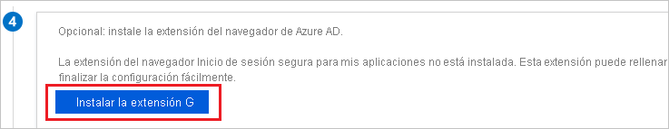
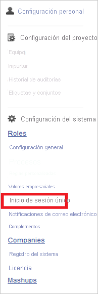
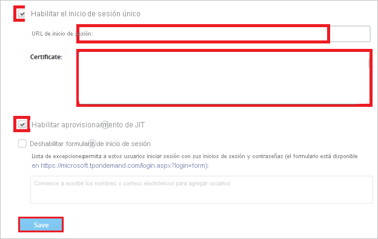

# Tutorial: Integración de Azure Active Directory con TargetProcess

En este tutorial, aprenderá a integrar TargetProcess con Azure Active Directory (Azure AD). Al integrar TargetProcess con Azure AD, puede hacer lo siguiente:

* Controlar en Azure AD quién tiene acceso a TargetProcess.
* Permitir que los usuarios inicien sesión automáticamente en TargetProcess con sus cuentas de Azure AD.
* Administrar las cuentas desde una ubicación central (Azure Portal).

## Requisitos previos

Para empezar, necesita los siguientes elementos:

* Una suscripción de Azure AD. Si no tiene una suscripción, puede crear una [cuenta gratuita](https://azure.microsoft.com/free/).
* Una suscripción habilitada para el inicio de sesión único (SSO) en TargetProcess.

## Descripción del escenario

En este tutorial, puede configurar y probar el inicio de sesión único de Azure AD en un entorno de prueba.

* TargetProcess admite el inicio de sesión único iniciado por **SP**.
* TargetProcess admite el aprovisionamiento de usuarios **Just-In-Time**.

## Incorporación de TargetProcess desde la galería

Para configurar la integración de TargetProcess en Azure AD, deberá agregar TargetProcess desde la galería a la lista de aplicaciones SaaS administradas.

1. Inicie sesión en Azure Portal con una cuenta personal, profesional o educativa de Microsoft.
1. En el panel de navegación de la izquierda, seleccione el servicio **Azure Active Directory**.
1. Vaya a **Aplicaciones empresariales** y seleccione **Todas las aplicaciones**.
1. Para agregar una nueva aplicación, seleccione **Nueva aplicación**.
1. En la sección **Agregar desde la galería**, escriba **TargetProcess** en el cuadro de búsqueda.
1. Seleccione **TargetProcess** en el panel de resultados y agregue la aplicación. Espere unos segundos mientras la aplicación se agrega al inquilino.

## Configuración y prueba del inicio de sesión único de Azure AD para TargetProcess

Configure y pruebe el inicio de sesión único de Azure AD con TargetProcess utilizando un usuario de prueba llamado **B.Simon**. Para que el inicio de sesión único funcione, es preciso establecer una relación de vínculo entre un usuario de Azure AD y el usuario relacionado de TargetProcess.

Para configurar y probar el inicio de sesión único de Azure AD con TargetProcess, lleve a cabo los siguientes pasos:

1. **[Configuración del inicio de sesión único de Azure AD](#configure-azure-ad-sso)** , para permitir que los usuarios puedan utilizar esta característica.
    1. **[Creación de un usuario de prueba de Azure AD](#create-an-azure-ad-test-user)** , para probar el inicio de sesión único de Azure AD con B.Simon.
    1. **[Asignación del usuario de prueba de Azure AD](#assign-the-azure-ad-test-user)** , para habilitar a B.Simon para que use el inicio de sesión único de Azure AD.
1. **[Configuración del inicio de sesión único en TargetProcess](#configure-targetprocess-sso)** , para configurar los valores de Inicio de sesión único en la aplicación.
    1. **[Creación de un usuario de prueba de TargetProcess](#create-targetprocess-test-user)** , para tener un homólogo de B.Simon en TargetProcess que esté vinculado a su representación de usuario en Azure AD.
1. **[Prueba del inicio de sesión único](#test-sso)** : para comprobar si la configuración funciona.

## Configuración del inicio de sesión único de Azure AD

Siga estos pasos para habilitar el inicio de sesión único de Azure AD en Azure Portal.

1. En Azure Portal, en la página de integración de la aplicación **TargetProcess**, busque la sección **Administrar** y seleccione **Inicio de sesión único**.
1. En la página **Seleccione un método de inicio de sesión único**, elija **SAML**.
1. En la página **Configuración del inicio de sesión único con SAML**, haga clic en el icono de lápiz de **Configuración básica de SAML** para editar la configuración.

   

4. En la sección **Configuración básica de SAML**, siga estos pasos:

    a. En el cuadro de texto **Identificador (id. de entidad)** , escriba una dirección URL con el siguiente patrón: `https://<SUBDOMAIN>.tpondemand.com/`

    b. En el cuadro de texto **URL de inicio de sesión**, escriba una dirección URL con el siguiente patrón: `https://<SUBDOMAIN>.tpondemand.com/`

    > [!NOTE]
    > Estos valores no son reales. Actualice estos valores con el identificador y la dirección URL de inicio de sesión reales. Póngase en contacto con el [equipo de atención al cliente de TargetProcess](mailto:support@targetprocess.com) para obtener estos valores. También puede hacer referencia a los patrones que se muestran en la sección **Configuración básica de SAML** de Azure Portal.

5. En la página **Configurar el inicio de sesión único con SAML**, en la sección **Certificado de firma de SAML**, haga clic en **Descargar** para descargar el **certificado (Base64)** de las opciones proporcionadas según sus requisitos y guárdelo en el equipo.

    

6. En la sección **Configurar TargetProcess**, copie las direcciones URL que necesite.

    

### Creación de un usuario de prueba de Azure AD

En esta sección, va a crear un usuario de prueba llamado B.Simon en Azure Portal.

1. En el panel izquierdo de Azure Portal, seleccione **Azure Active Directory**, **Usuarios** y **Todos los usuarios**.
1. Seleccione **Nuevo usuario** en la parte superior de la pantalla.
1. En las propiedades del **usuario**, siga estos pasos:
   1. En el campo **Nombre**, escriba `B.Simon`.  
   1. En el campo **Nombre de usuario**, escriba username@companydomain.extension. Por ejemplo, `B.Simon@contoso.com`.
   1. Active la casilla **Show password** (Mostrar contraseña) y, después, anote el valor que se muestra en el cuadro **Contraseña**.
   1. Haga clic en **Crear**.

### Asignación del usuario de prueba de Azure AD

En esta sección va a permitir que B.Simon acceda a TargetProcess mediante el inicio de sesión único de Azure.

1. En Azure Portal, seleccione sucesivamente **Aplicaciones empresariales** y **Todas las aplicaciones**.
1. En la lista de aplicaciones, seleccione **TargetProcess**.
1. En la página de información general de la aplicación, busque la sección **Administrar** y seleccione **Usuarios y grupos**.
1. Seleccione **Agregar usuario**. A continuación, en el cuadro de diálogo **Agregar asignación**, seleccione **Usuarios y grupos**.
1. En el cuadro de diálogo **Usuarios y grupos**, seleccione **B.Simon** de la lista de usuarios y haga clic en el botón **Seleccionar** de la parte inferior de la pantalla.
1. Si espera que se asigne un rol a los usuarios, puede seleccionarlo en la lista desplegable **Seleccionar un rol**. Si no se ha configurado ningún rol para esta aplicación, verá seleccionado el rol "Acceso predeterminado".
1. En el cuadro de diálogo **Agregar asignación**, haga clic en el botón **Asignar**.

## Configuración del inicio de sesión único de TargetProcess

1. Para automatizar la configuración en **TargetProcess**, debe instalar la **extensión de explorador de inicio de sesión seguro de Mis aplicaciones**. Para ello, haga clic en **Install the extension** (Instalar la extensión).

    

1. Después de agregar la extensión al explorador, haga clic en **Configurar TargetProcess** para ir a la aplicación TargetProcess. Desde allí, proporcione las credenciales de administrador para iniciar sesión en TargetProcess. La extensión de explorador configurará automáticamente la aplicación y automatizará los pasos 3 a 7.

    

    **Si desea configurar la aplicación manualmente, realice los siguientes pasos:**

1. Inicie sesión en su aplicación TargetProcess como administrador.

1. En el menú de la parte superior, haga clic en **Configuración**.

    

1. Haga clic en la pestaña **Configuración**.

    

1. Haga clic en **Inicio de sesión único**.

    

1. En el cuadro de diálogo Configuración de inicio de sesión único, siga estos pasos:

    

    a. Haga lic en **Habilitar inicio de sesión único**.

    b. En el cuadro de texto **Sign-on URL** (Dirección URL de inicio de sesión), pegue el valor de la **dirección URL de inicio de sesión**, que ha copiado de Azure Portal.

    c. Abra el certificado descargado en el Bloc de notas, copie el contenido y luego péguelo en el cuadro de texto **Certificado** .

    d. Haga clic en **Habilitar aprovisionamiento de JIT**.

    e. Haga clic en **Save**(Guardar).

### Creación de un usuario de prueba de TargetProcess

En esta sección, se crea un usuario llamado Britta Simon en TargetProcess. TargetProcess admite el aprovisionamiento de usuarios Just-In-Time, que está habilitado de forma predeterminada. No hay ningún elemento de acción para usted en esta sección. Si un usuario deja de existir en TargetProcess, se crea uno nuevo después de la autenticación.

> [!Note]
> Si necesita crear manualmente un usuario, póngase en contacto con el [equipo de soporte técnico de TargetProcess](mailto:support@targetprocess.com).

## Prueba de SSO

En esta sección, probará la configuración de inicio de sesión único de Azure AD con las siguientes opciones. 

* Haga clic en **Probar esta aplicación** en Azure Portal. Esto le redirigirá a la dirección URL de inicio de sesión de TargetProcess, donde puede iniciar el flujo de inicio de sesión. 

* Acceda directamente a la dirección URL de inicio de sesión de TargetProcess y comience el flujo de inicio de sesión desde ahí.

* Puede usar Mis aplicaciones de Microsoft. Si en Mis aplicaciones hace clic en el icono de TargetProcess, debería acceder automáticamente a la dirección URL de inicio de sesión de esta aplicación. Para más información acerca de Aplicaciones, consulte [Inicio de sesión e inicio de aplicaciones desde el portal Aplicaciones](../user-help/my-apps-portal-end-user-access.md).

## Pasos siguientes

Una vez configurado TargetProcess, puede aplicar el control de sesión, que protege la información confidencial de la organización de la filtración y la infiltración en tiempo real. El control de sesión procede del acceso condicional. [Aprenda a aplicar el control de sesión con Microsoft Cloud App Security](/cloud-app-security/proxy-deployment-aad).
