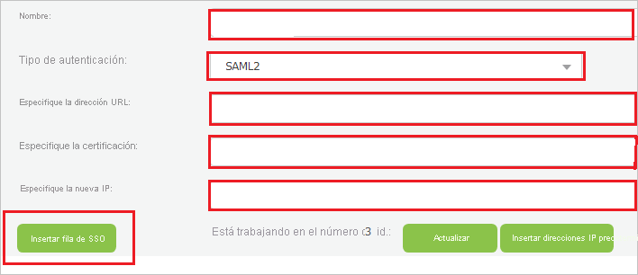

# Tutorial: Integración de Azure Active Directory con TAS

En este tutorial, aprenderá a integrar TAS con Azure Active Directory (Azure AD). Al integrar TAS con Azure AD, puede hacer lo siguiente:

* Controlar en Azure AD quién tiene acceso a TAS.
* Permitir que los usuarios inicien sesión automáticamente en TAS con sus cuentas de Azure AD.
* Administrar las cuentas desde una ubicación central (Azure Portal).

## Requisitos previos

Para empezar, necesita los siguientes elementos:

* Una suscripción de Azure AD. Si no tiene una suscripción, puede crear una [cuenta gratuita](https://azure.microsoft.com/free/).
* Una suscripción habilitada para el inicio de sesión único (SSO) en TAS.

## Descripción del escenario

En este tutorial, puede configurar y probar el inicio de sesión único de Azure AD en un entorno de prueba.

* TAS admite el inicio de sesión único iniciado por **SP e IDP**.

## Adición de TAS desde la galería

Para configurar la integración de TAS en Azure AD, será preciso agregar TAS desde la galería a la lista de aplicaciones SaaS administradas.

1. Inicie sesión en Azure Portal con una cuenta personal, profesional o educativa de Microsoft.
1. En el panel de navegación de la izquierda, seleccione el servicio **Azure Active Directory**.
1. Vaya a **Aplicaciones empresariales** y seleccione **Todas las aplicaciones**.
1. Para agregar una nueva aplicación, seleccione **Nueva aplicación**.
1. En la sección **Agregar desde la galería**, escriba **TAS** en el cuadro de búsqueda.
1. Seleccione **TAS** en el panel de resultados y agregue la aplicación. Espere unos segundos mientras la aplicación se agrega al inquilino.

## Configuración y prueba del inicio de sesión único de Azure AD en TAS

Configure y pruebe el inicio de sesión único de Azure AD con TAS mediante un usuario de prueba llamado **B.Simon**. Para que el inicio de sesión único funcione, es preciso establecer una relación de vinculación entre un usuario de Azure AD y el usuario relacionado de TAS.

Para configurar y probar el inicio de sesión único de Azure AD con TAS, lleve a cabo los siguientes pasos:

1. **[Configuración del inicio de sesión único de Azure AD](#configure-azure-ad-sso)** , para permitir que los usuarios puedan utilizar esta característica.
    1. **[Creación de un usuario de prueba de Azure AD](#create-an-azure-ad-test-user)** , para probar el inicio de sesión único de Azure AD con B.Simon.
    1. **[Asignación del usuario de prueba de Azure AD](#assign-the-azure-ad-test-user)** , para habilitar a B.Simon para que use el inicio de sesión único de Azure AD.
1. **[Configuración del inicio de sesión único en TAS](#configure-tas-sso)** : para configurar el inicio de sesión único en la aplicación.
    1. **[Creación de un usuario de prueba en TAS](#create-tas-test-user)** : para tener un homólogo de B.Simon en TAS que esté vinculado a su representación en Azure AD.
1. **[Prueba del inicio de sesión único](#test-sso)** : para comprobar si la configuración funciona.

## Configuración del inicio de sesión único de Azure AD

Siga estos pasos para habilitar el inicio de sesión único de Azure AD en Azure Portal.

1. En Azure Portal, en la página de integración de aplicaciones de **TAS**, busque la sección **Administrar** y seleccione **Inicio de sesión único**.
1. En la página **Seleccione un método de inicio de sesión único**, elija **SAML**.
1. En la página **Configuración del inicio de sesión único con SAML**, haga clic en el icono de lápiz de **Configuración básica de SAML** para editar la configuración.

   

4. En la sección **Configuración básica de SAML**, si desea configurar la aplicación en el modo iniciado por **IDP** siga estos pasos:

    a. En el cuadro de texto **Identificador**, escriba una dirección URL con el patrón siguiente: `https://taseu.combtas.com/<DOMAIN>`

    b. En el cuadro de texto **URL de respuesta**, escriba una dirección URL con el siguiente patrón: `https://taseu.combtas.com/<ENVIRONMENT_NAME>/AssertionService.aspx`

5. Haga clic en **Establecer direcciones URL adicionales** y siga este paso si desea configurar la aplicación en el modo iniciado por **SP**:

    En el cuadro de texto **URL de inicio de sesión**, escriba una dirección URL con el siguiente patrón: `https://taseu.combtas.com/<DOMAIN>`

    > [!NOTE]
    > Estos valores no son reales. Estos valores se actualizará con la dirección URL de inicio de sesión, la dirección URL de respuesta y el identificador reales, que se explican más adelante en el tutorial. También puede hacer referencia a los patrones que se muestran en la sección **Configuración básica de SAML** de Azure Portal.

6. En la página **Configurar el inicio de sesión único con SAML**, en la sección **Certificado de firma de SAML**, haga clic en **Descargar** para descargar el **certificado (Base64)** de las opciones proporcionadas según sus requisitos y guárdelo en el equipo.

    

7. En la sección **Set up TAS** (Configurar TAS), copie las direcciones URL adecuada según sus necesidades.

    

### Creación de un usuario de prueba de Azure AD 

En esta sección, va a crear un usuario de prueba llamado B.Simon en Azure Portal.

1. En el panel izquierdo de Azure Portal, seleccione **Azure Active Directory**, **Usuarios** y **Todos los usuarios**.
1. Seleccione **Nuevo usuario** en la parte superior de la pantalla.
1. En las propiedades del **usuario**, siga estos pasos:
   1. En el campo **Nombre**, escriba `B.Simon`.  
   1. En el campo **Nombre de usuario**, escriba username@companydomain.extension. Por ejemplo, `B.Simon@contoso.com`.
   1. Active la casilla **Show password** (Mostrar contraseña) y, después, anote el valor que se muestra en el cuadro **Contraseña**.
   1. Haga clic en **Crear**.

### Asignación del usuario de prueba de Azure AD

En esta sección, va a permitir que B.Simon acceda a TAS mediante el inicio de sesión único de Azure.

1. En Azure Portal, seleccione sucesivamente **Aplicaciones empresariales** y **Todas las aplicaciones**.
1. En la lista de aplicaciones, seleccione **TAS**.
1. En la página de información general de la aplicación, busque la sección **Administrar** y seleccione **Usuarios y grupos**.
1. Seleccione **Agregar usuario**. A continuación, en el cuadro de diálogo **Agregar asignación**, seleccione **Usuarios y grupos**.
1. En el cuadro de diálogo **Usuarios y grupos**, seleccione **B.Simon** de la lista de usuarios y haga clic en el botón **Seleccionar** de la parte inferior de la pantalla.
1. Si espera que se asigne un rol a los usuarios, puede seleccionarlo en la lista desplegable **Seleccionar un rol**. Si no se ha configurado ningún rol para esta aplicación, verá seleccionado el rol "Acceso predeterminado".
1. En el cuadro de diálogo **Agregar asignación**, haga clic en el botón **Asignar**.

## Configuración del inicio de sesión único en TAS

1. En otra ventana del explorador web, inicie sesión en TAS como administrador.

2. En el lado izquierdo del menú, haga clic en **Configuración** y vaya a **Administrador** y, finalmente, haga clic en **Manage Single sign on** (Administrar inicio de sesión único).

    

3. En la página **Manage Single sign on** (Administrar inicio de sesión único) realice los pasos siguientes:

    

    a. En el cuadro de texto **Nombre**, escriba el nombre del entorno.
    
    b. Seleccione **SAML2** como **Tipo de autenticación**.

    c. En el cuadro de texto **Enter URL** (Escribir dirección URL), pegue el valor de **Dirección URL de inicio de sesión** que copió de Azure Portal.

    d. En el Bloc de notas, abra el certificado codificado en Base 64 que ha descargado de Azure Portal, copie el contenido y, después, péguelo en el cuadro de texto **Especificar certificación**.

    e. En el cuadro de texto **Enter New IP** (Escribir nueva dirección IP), escriba la dirección IP.

    >[!NOTE]
    > Póngase en contacto con el [equipo de soporte técnico de TAS](mailto:support@combtas.com) para obtener la dirección IP.

    f. Copie la dirección URL de **Single Sign On** (Inicio de sesión único) y péguela en el **identificador (Entity ID)** (ID de entidad) y en el cuadro de texto **Sign on URL** (Dirección URL de inicio de sesión) de **Configuración básica de SAML** en Azure Portal. Tenga en cuenta que la dirección URL distingue mayúsculas de minúsculas y debe terminar con una barra diagonal (/).

    g. Copie el valor de **Reply URL (ACS)** (Dirección URL de respuesta [ACS]) y péguelo en el cuadro de texto **URL de respuesta** de **Basic SAML Configuration** (Configuración básica de SAML) de Azure Portal.

    h. Haga clic en **Insert SSO row** (Insertar fila de SSO).

### Creación de un usuario de prueba de TAS

En esta sección, creará un usuario llamado Britta Simon en TAS. Trabaje con el [equipo de soporte técnico de TAS](mailto:support@combtas.com) para agregar los usuarios a la plataforma de TAS. Los usuarios se tienen que crear y activar antes de usar el inicio de sesión único.

## Prueba de SSO 

En esta sección, probará la configuración de inicio de sesión único de Azure AD con las siguientes opciones. 

#### Iniciado por SP:

* Haga clic en **Probar esta aplicación** en Azure Portal. Esta acción le redirigirá a la dirección URL de inicio de sesión de TAS, donde puede poner en marcha el flujo de inicio de sesión.  

* Vaya directamente a la dirección URL de inicio de sesión de TAS y comience el flujo de inicio de sesión desde allí.

#### Iniciado por IDP:

* Haga clic en **Probar esta aplicación** en Azure Portal; iniciará sesión automáticamente en la instancia de TAS para la que configuró el inicio de sesión único. 

También puede usar Aplicaciones de Microsoft para probar la aplicación en cualquier modo. Al hacer clic en el icono de TAS en Aplicaciones, si se ha configurado en modo SP, se le redirigirá a la página de inicio de sesión de la aplicación para comenzar el flujo de inicio de sesión; y, si se ha configurado en modo IDP, iniciará sesión automáticamente en la instancia de TAS para la que configuró el inicio de sesión único. Para más información acerca de Aplicaciones, consulte [Inicio de sesión e inicio de aplicaciones desde el portal Aplicaciones](https://support.microsoft.com/account-billing/sign-in-and-start-apps-from-the-my-apps-portal-2f3b1bae-0e5a-4a86-a33e-876fbd2a4510).

## Pasos siguientes

Una vez configurado TAS, puede aplicar el control de sesión, que protege a la organización en tiempo real contra la filtración y la infiltración de la información confidencial. El control de sesión procede del acceso condicional. [Aprenda a aplicar el control de sesión con Microsoft Cloud App Security](/cloud-app-security/proxy-deployment-aad).