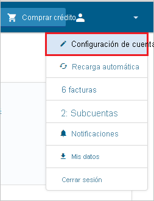

# Tutorial: Integración del inicio de sesión único (SSO) de Azure Active Directory con TextMagic

En este tutorial aprenderá a integrar TextMagic con Azure Active Directory (Azure AD). Al integrar TextMagic con Azure AD, se puede:

* Controlar en Azure AD quién tiene acceso a TextMagic.
* Permitir que los usuarios inicien sesión automáticamente en TextMagic con sus cuentas de Azure AD.
* Administrar las cuentas desde una ubicación central (Azure Portal).

## Requisitos previos

Para empezar, necesita los siguientes elementos:

* Una suscripción de Azure AD. Si no tiene una suscripción, puede crear una [cuenta gratuita](https://azure.microsoft.com/free/).
* Una suscripción habilitada para el inicio de sesión único (SSO) en TextMagic.

## Descripción del escenario

En este tutorial, va a configurar y probar el inicio de sesión único de Azure AD en un entorno de prueba.

* TextMagic admite el SSO iniciado por **IDP**.

* TextMagic admite el aprovisionamiento de usuarios **Just-In-Time**.

> [!NOTE]
> El identificador de esta aplicación es un valor de cadena fijo, por lo que solo se puede configurar una instancia en un inquilino.

## Incorporación de TextMagic desde la galería

Para configurar la integración de TextMagic en Azure AD, deberá agregar TextMagic desde la galería a la lista de aplicaciones SaaS administradas.

1. Inicie sesión en Azure Portal con una cuenta personal, profesional o educativa de Microsoft.
1. En el panel de navegación de la izquierda, seleccione el servicio **Azure Active Directory**.
1. Vaya a **Aplicaciones empresariales** y seleccione **Todas las aplicaciones**.
1. Para agregar una nueva aplicación, seleccione **Nueva aplicación**.
1. En la sección **Agregar desde la galería**, escriba **TextMagic** en el cuadro de búsqueda.
1. Seleccione **TextMagic** en el panel de resultados y agregue la aplicación. Espere unos segundos mientras la aplicación se agrega al inquilino.

## Configuración y prueba del inicio de sesión único de Azure AD para TextMagic

Configure y pruebe el inicio de sesión único de Azure AD con TextMagic mediante un usuario de prueba llamado **B.Simon**. Para que el inicio de sesión único funcione, es preciso establecer una relación de vínculo entre un usuario de Azure AD y el usuario relacionado de TextMagic.

Para configurar y probar el SSO de Azure AD con TextMagic, lleve a cabo los siguientes pasos:

1. **[Configuración del inicio de sesión único de Azure AD](#configure-azure-ad-sso)** , para permitir que los usuarios puedan utilizar esta característica.
    1. **[Creación de un usuario de prueba de Azure AD](#create-an-azure-ad-test-user)** , para probar el inicio de sesión único de Azure AD con B.Simon.
    1. **[Asignación del usuario de prueba de Azure AD](#assign-the-azure-ad-test-user)** , para habilitar a B.Simon para que use el inicio de sesión único de Azure AD.
1. **[Configuración del inicio de sesión único en TextMagic](#configure-textmagic-sso)** : para configurar los valores de inicio de sesión único en la aplicación.
    1. **[Creación de un usuario de prueba en TextMagic](#create-textmagic-test-user)** : para tener un homólogo de B.Simon en TextMagic vinculado a la representación del usuario en Azure AD.
1. **[Prueba del inicio de sesión único](#test-sso)** : para comprobar si la configuración funciona.

## Configuración del inicio de sesión único de Azure AD

Siga estos pasos para habilitar el inicio de sesión único de Azure AD en Azure Portal.

1. En Azure Portal, en la página de integración de la aplicación **TextMagic**, busque la sección **Administrar** y seleccione **Inicio de sesión único**.
1. En la página **Seleccione un método de inicio de sesión único**, elija **SAML**.
1. En la página **Configuración del inicio de sesión único con SAML**, haga clic en el icono de lápiz de **Configuración básica de SAML** para editar la configuración.

   

1. En la sección **Configuración básica de SAML**, siga estos pasos:

    En el cuadro de texto **Identificador**, escriba la dirección URL `https://my.textmagic.com/saml/metadata`

5. La aplicación TextMagic espera las aserciones de SAML en un formato específico, que requiere que se agreguen asignaciones de atributos personalizados a la configuración de los atributos del token de SAML. La siguiente captura de pantalla muestra la lista de atributos predeterminados, donde **nameidentifier** se asigna con **user.userprincipalname**. La aplicación TextMagic espera que **nameidentifier** se corresponda con **user.mail**, por lo que debe editar la asignación de atributos haciendo clic en el icono **Editar** y cambiar dicha asignación.

    

1. Además de lo anterior, la aplicación TextMagic espera que se devuelvan algunos atributos más, que se muestran a continuación, en la respuesta de SAML. Estos atributos también se rellenan previamente, pero puede revisarlos según sus requisitos.

    | Nombre |   Atributo de origen| Espacio de nombres  |
    | --------------- | --------------- | --------------- |
    | company | user.companyname | http://schemas.xmlsoap.org/ws/2005/05/identity/claims |
    | firstName | user.givenname |  http://schemas.xmlsoap.org/ws/2005/05/identity/claims |
    | lastName | user.surname |  http://schemas.xmlsoap.org/ws/2005/05/identity/claims |
    | phone | user.telephonenumber |  http://schemas.xmlsoap.org/ws/2005/05/identity/claims |

1. En la página **Configurar el inicio de sesión único con SAML**, en la sección **Certificado de firma de SAML**, busque **Certificado (Base64)** y seleccione **Descargar** para descargarlo y guardarlo en el equipo.

    

1. En la sección **Set up TextMagic** (Configurar TextMagic), copie las direcciones URL que necesite.

    

### Creación de un usuario de prueba de Azure AD

En esta sección, va a crear un usuario de prueba llamado B.Simon en Azure Portal.

1. En el panel izquierdo de Azure Portal, seleccione **Azure Active Directory**, **Usuarios** y **Todos los usuarios**.
1. Seleccione **Nuevo usuario** en la parte superior de la pantalla.
1. En las propiedades del **usuario**, siga estos pasos:
   1. En el campo **Nombre**, escriba `B.Simon`.  
   1. En el campo **Nombre de usuario**, escriba username@companydomain.extension. Por ejemplo, `B.Simon@contoso.com`.
   1. Active la casilla **Show password** (Mostrar contraseña) y, después, anote el valor que se muestra en el cuadro **Contraseña**.
   1. Haga clic en **Crear**.

### Asignación del usuario de prueba de Azure AD

En esta sección va a permitir que B.Simon acceda a TextMagic mediante el inicio de sesión único de Azure.

1. En Azure Portal, seleccione sucesivamente **Aplicaciones empresariales** y **Todas las aplicaciones**.
1. En la lista de aplicaciones, seleccione **TextMagic**.
1. En la página de información general de la aplicación, busque la sección **Administrar** y seleccione **Usuarios y grupos**.
1. Seleccione **Agregar usuario**. A continuación, en el cuadro de diálogo **Agregar asignación**, seleccione **Usuarios y grupos**.
1. En el cuadro de diálogo **Usuarios y grupos**, seleccione **B.Simon** de la lista de usuarios y haga clic en el botón **Seleccionar** de la parte inferior de la pantalla.
1. Si espera que haya un valor de rol en la aserción de SAML, en el cuadro de diálogo **Seleccionar rol**, seleccione en la lista el rol adecuado para el usuario y haga clic en el botón **Seleccionar** en la parte inferior de la pantalla.
1. En el cuadro de diálogo **Agregar asignación**, haga clic en el botón **Asignar**.

## Configuración del inicio de sesión único en TextMagic

1. Para automatizar la configuración en TextMagic, debe instalar la **extensión del explorador de inicio de sesión seguro de Mis aplicaciones**. Para ello, haga clic en **Instalar la extensión**.

    

2. Después de agregar la extensión al explorador, haga clic en **Set up TextMagic** (Configurar TextMagic) para ir a la aplicación del mismo nombre. En ella, escriba las credenciales de administrador para iniciar sesión en TextMagic. La extensión de explorador configurará automáticamente la aplicación y automatizará los pasos 3 a 5.

    

3. Si quiere configurar TextMagic manualmente, abra una nueva ventana del explorador web, inicie sesión en el sitio de empresa de TextMagic como administrador y lleve a cabo los siguientes pasos:

4. Seleccione **Configuración de la cuenta** bajo el nombre de usuario.

    

5. Haga clic en la pestaña **Inicio de sesión único (SSO)** y rellene los campos siguientes:  

    

    a. En el cuadro de texto **Identificador de entidad del proveedor de identidades:** , pegue el valor del campo **Identificador de Azure AD** que ha copiado de Azure Portal.

    b. En el cuadro de texto **URL de SSO del proveedor de identidades:** , pegue el valor de **Dirección URL de inicio de sesión**  que ha copiado de Azure Portal.

    c. En el cuadro de texto **URL de SLO del proveedor de identidades:** , pegue el valor de **Dirección URL de cierre de sesión** que ha copiado de Azure Portal.

    d. Abra el **certificado codificado en base 64** descargado de Azure Portal en el Bloc de notas, copie su contenido en el Portapapeles y luego péguelo en el cuadro de texto **Certificado x509 público**.

    e. Haga clic en **Save**(Guardar).

### Creación de un usuario de prueba de TextMagic

En esta sección se crea un usuario de nombre B.Simon en TextMagic. TextMagic admite el aprovisionamiento de usuarios Just-In-Time, que está habilitado de manera predeterminada. No hay ningún elemento de acción para usted en esta sección. Si aún no existe ningún usuario en TextMagic, se crea uno después de la autenticación.

## Prueba de SSO 

En esta sección, probará la configuración de inicio de sesión único de Azure AD con las siguientes opciones.

* Haga clic en Probar esta aplicación en Azure Portal; se debería iniciar sesión automáticamente en la instancia de TextMagic para la que ha configurado el SSO.

* Puede usar Mis aplicaciones de Microsoft. Al hacer clic en el icono de TextMagic en Aplicaciones, debería iniciar sesión automáticamente en la instancia de TextMagic para la que ha configurado el SSO. Para más información acerca de Aplicaciones, consulte [Inicio de sesión e inicio de aplicaciones desde el portal Aplicaciones](https://support.microsoft.com/account-billing/sign-in-and-start-apps-from-the-my-apps-portal-2f3b1bae-0e5a-4a86-a33e-876fbd2a4510).

## Pasos siguientes

Una vez que haya configurado TextMagic, puede aplicar el control de sesión, que protege la organización, en tiempo real, frente a la filtración e infiltración de información confidencial. El control de sesión procede del acceso condicional. [Aprenda a aplicar el control de sesión con Microsoft Cloud App Security](/cloud-app-security/proxy-deployment-aad).