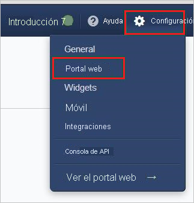
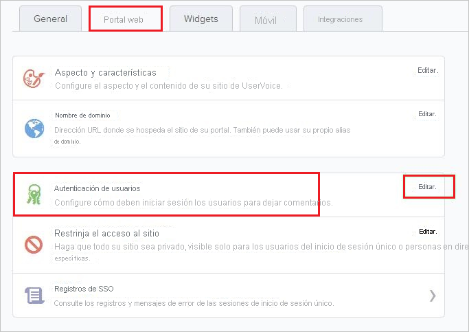
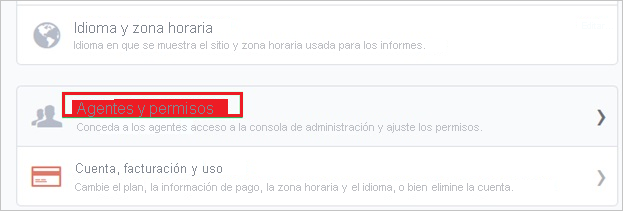
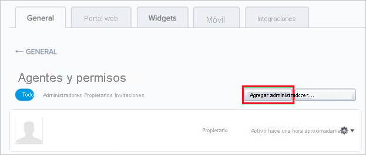
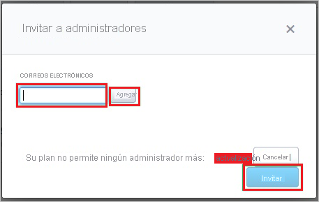

# Tutorial: Integración de Azure Active Directory con UserVoice

En este tutorial aprenderá a integrar UserVoice con Azure Active Directory (Azure AD). Al integrar UserVoice con Azure AD, puede hacer lo siguiente:

* Controlar en Azure AD quién tiene acceso a UserVoice.
* Permitir que los usuarios inicien sesión automáticamente en UserVoice con sus cuentas de Azure AD.
* Administrar las cuentas desde una ubicación central (Azure Portal).

## Requisitos previos

Para configurar la integración de Azure AD con UserVoice, necesita los siguientes elementos:

* Una suscripción de Azure AD. Si no dispone de un entorno de Azure AD, puede obtener [una cuenta gratuita](https://azure.microsoft.com/free/).
* Una suscripción habilitada para el inicio de sesión único en UserVoice

## Descripción del escenario

En este tutorial, puede configurar y probar el inicio de sesión único de Azure AD en un entorno de prueba.

* UserVoice admite el inicio de sesión único iniciado por **SP**.

## Adición de UserVoice desde la galería

Para configurar la integración de UserVoice en Azure AD, deberá agregar UserVoice desde la galería a la lista de aplicaciones SaaS administradas.

1. Inicie sesión en Azure Portal con una cuenta personal, profesional o educativa de Microsoft.
1. En el panel de navegación de la izquierda, seleccione el servicio **Azure Active Directory**.
1. Vaya a **Aplicaciones empresariales** y seleccione **Todas las aplicaciones**.
1. Para agregar una nueva aplicación, seleccione **Nueva aplicación**.
1. En la sección **Agregar desde la galería**, escriba **UserVoice** en el cuadro de búsqueda.
1. Seleccione **UserVoice** en el panel de resultados y agregue la aplicación. Espere unos segundos mientras la aplicación se agrega al inquilino.

## Configuración y prueba del inicio de sesión único de Azure AD para UserVoice

Configure y pruebe el inicio de sesión único de Azure AD con UserVoice mediante un usuario de prueba llamado **B.Simon**. Para que el inicio de sesión único funcione, es necesario establecer una relación de vínculo entre un usuario de Azure AD y el usuario relacionado de UserVoice.

Para configurar y probar el inicio de sesión único de Azure AD con UserVoice, siga estos pasos:

1. **[Configuración del inicio de sesión único de Azure AD](#configure-azure-ad-sso)** , para permitir que los usuarios puedan utilizar esta característica.
    1. **[Creación de un usuario de prueba de Azure AD](#create-an-azure-ad-test-user)** , para probar el inicio de sesión único de Azure AD con B.Simon.
    1. **[Asignación del usuario de prueba de Azure AD](#assign-the-azure-ad-test-user)** , para habilitar a B.Simon para que use el inicio de sesión único de Azure AD.
1. **[Configuración del inicio de sesión único en UserVoice](#configure-uservoice-sso)** : para configurar los valores de inicio de sesión único en la aplicación.
    1. **[Creación de un usuario de prueba de UserVoice](#create-uservoice-test-user)** : para tener un homólogo de B.Simon en UserVoice que esté vinculado a la representación del usuario en Azure AD.
1. **[Prueba del inicio de sesión único](#test-sso)** : para comprobar si la configuración funciona.

## Configuración del inicio de sesión único de Azure AD

Siga estos pasos para habilitar el inicio de sesión único de Azure AD en Azure Portal.

1. En Azure Portal, en la página de integración de la aplicación **UserVoice**, busque la sección **Administrar** y seleccione **Inicio de sesión único**.
1. En la página **Seleccione un método de inicio de sesión único**, elija **SAML**.
1. En la página **Configuración del inicio de sesión único con SAML**, haga clic en el icono de lápiz de **Configuración básica de SAML** para editar la configuración.

   

4. En la sección **Configuración básica de SAML**, siga estos pasos:

    a. En el cuadro de texto **Identificador (id. de entidad)** , escriba una dirección URL con el siguiente patrón: `https://<TENANT_NAME>.UserVoice.com`

    b. En el cuadro de texto **URL de inicio de sesión**, escriba una dirección URL con el siguiente patrón: `https://<TENANT_NAME>.UserVoice.com`

    > [!NOTE]
    > Estos valores no son reales. Actualice estos valores con el identificador y la dirección URL de inicio de sesión reales. Póngase en contacto con el [equipo de soporte técnico de UserVoice](https://www.uservoice.com/) para obtener estos valores. También puede hacer referencia a los patrones que se muestran en la sección **Configuración básica de SAML** de Azure Portal.

5. En la sección **Certificado de firma de SAML**, haga clic en el botón **Editar** para abrir el cuadro de diálogo **Certificado de firma de SAML**.

    

6. En la sección **Certificado de firma de SAML**, copie el valor de **Huella digital** en el equipo.

    

7. En la sección **Set up UserVoice** (Configurar UserVoice), copie las direcciones URL adecuadas según sus necesidades.

    

### Creación de un usuario de prueba de Azure AD 

En esta sección, va a crear un usuario de prueba llamado B.Simon en Azure Portal.

1. En el panel izquierdo de Azure Portal, seleccione **Azure Active Directory**, **Usuarios** y **Todos los usuarios**.
1. Seleccione **Nuevo usuario** en la parte superior de la pantalla.
1. En las propiedades del **usuario**, siga estos pasos:
   1. En el campo **Nombre**, escriba `B.Simon`.  
   1. En el campo **Nombre de usuario**, escriba username@companydomain.extension. Por ejemplo, `B.Simon@contoso.com`.
   1. Active la casilla **Show password** (Mostrar contraseña) y, después, anote el valor que se muestra en el cuadro **Contraseña**.
   1. Haga clic en **Crear**.

### Asignación del usuario de prueba de Azure AD

En esta sección, va a permitir que B.Simon acceda a UserVoice mediante el inicio de sesión único de Azure.

1. En Azure Portal, seleccione sucesivamente **Aplicaciones empresariales** y **Todas las aplicaciones**.
1. En la lista de aplicaciones, seleccione **UserVoice**.
1. En la página de información general de la aplicación, busque la sección **Administrar** y seleccione **Usuarios y grupos**.
1. Seleccione **Agregar usuario**. A continuación, en el cuadro de diálogo **Agregar asignación**, seleccione **Usuarios y grupos**.
1. En el cuadro de diálogo **Usuarios y grupos**, seleccione **B.Simon** de la lista de usuarios y haga clic en el botón **Seleccionar** de la parte inferior de la pantalla.
1. Si espera que se asigne un rol a los usuarios, puede seleccionarlo en la lista desplegable **Seleccionar un rol**. Si no se ha configurado ningún rol para esta aplicación, verá seleccionado el rol "Acceso predeterminado".
1. En el cuadro de diálogo **Agregar asignación**, haga clic en el botón **Asignar**.

## Configuración del inicio de sesión único de UserVoice

1. En otra ventana del explorador web, inicie sesión en su sitio de la compañía de UserVoice como administrador.

2. En la barra de herramientas de la parte superior, haga clic en **Configuración** y luego seleccione **Portal web** en el menú.
   
    

3. En la pestaña **Portal web** de la sección **Autenticación del usuario**, haga clic en **Editar** para abrir la página de diálogo **Editar autenticación de usuario**.
   
    

4. En la página de diálogo **Editar autenticación del usuario** , realice los pasos siguientes:
   
    
   
    a. Haga clic en **Inicio de sesión único (SSO)** .
 
    b. Pegue el valor de **URL de inicio de sesión** que copió de Azure Portal en el cuadro de texto **SSO Remote Sign-In** (Inicio de sesión remoto de SSO).

    c. Pegue el valor de **URL de cierre de sesión** que copió de Azure Portal en el cuadro de texto **SSO Remote Sign-Out** (Cierre de sesión remoto de SSO).
 
    d. Pegue el valor de **huella digital** que ha copiado de Azure Portal en el cuadro de texto **Current certificate SHA1 fingerprint** (Huella digital de SHA1 del certificado actual).
    
    e. Haga clic en **Guardar configuración de autenticación**.

### Creación de un usuario de prueba en UserVoice

Para permitir que los usuarios de Azure AD inicien sesión en UserVoice, deben aprovisionarse en UserVoice. En el caso de UserVoice, el aprovisionamiento es una tarea manual.

### Para aprovisionar una cuenta de usuario, realice estos pasos:

1. Inicie sesión en su inquilino de **UserVoice**.

2. Vaya a **Configuración**.
   
    

3. Haga clic en **General**.

4. Haga clic en **Agentes y permisos**.
   
    

5. Haga clic en **Agregar administradores**.
   
    

6. En el cuadro de diálogo **Invitar a administradores** , realice los pasos siguientes:
   
    
   
    a. En el cuadro de texto de correos electrónicos, escriba la dirección de correo electrónico de la cuenta que quiere aprovisionar y luego haga clic en **Agregar**.
   
    b. Haga clic en **Invitar**.

> [!NOTE]
> Puede usar cualquier otra API o herramienta de creación de cuentas de usuario de UserVoice ofrecida por UserVoice para aprovisionar cuentas de usuario de Azure AD.

## Prueba de SSO 

En esta sección, probará la configuración de inicio de sesión único de Azure AD con las siguientes opciones. 

* Haga clic en **Probar esta aplicación** en Azure Portal. Esto le redirigirá a la dirección URL de inicio de sesión de UserVoice, donde puede iniciar el flujo de inicio de sesión. 

* Vaya directamente a la dirección URL de inicio de sesión de UserVoice e inicie el flujo de inicio de sesión desde allí.

* Puede usar Mis aplicaciones de Microsoft. Al hacer clic en el icono de UserVoice en Mis aplicaciones, se le redirigirá a la URL de inicio de sesión de la aplicación. Para más información acerca de Aplicaciones, consulte [Inicio de sesión e inicio de aplicaciones desde el portal Aplicaciones](../user-help/my-apps-portal-end-user-access.md).

## Pasos siguientes

Una vez que haya configurado UserVoice, podrá aplicar el control de sesión, que protege a la organización en tiempo real frente a la filtración e infiltración de información confidencial. El control de sesión procede del acceso condicional. [Aprenda a aplicar el control de sesión con Microsoft Cloud App Security](/cloud-app-security/proxy-deployment-aad).
