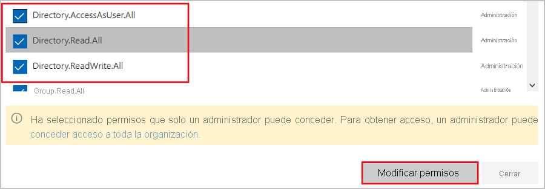
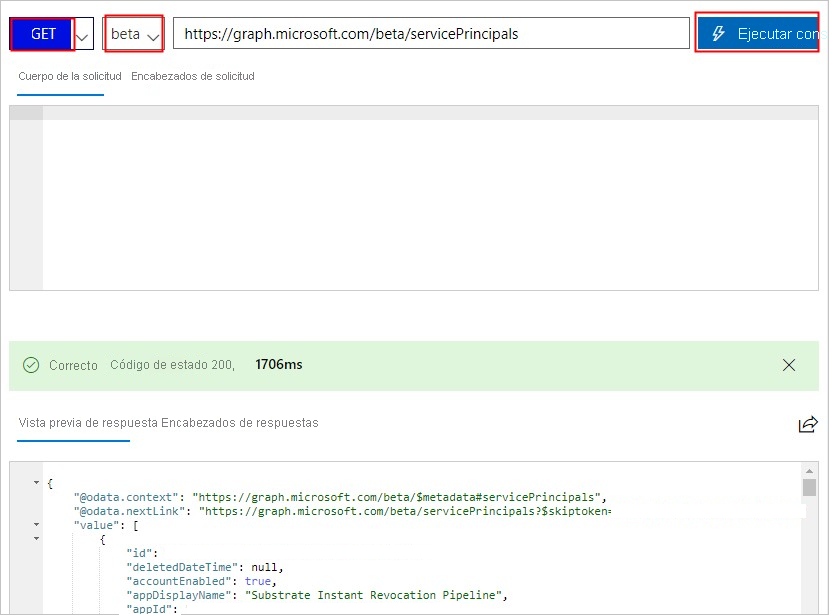

# <a name="tutorial-azure-ad-sso-integration-with-vida"></a>Tutorial: Integración del inicio de sesión único de Azure AD con VIDA

En este tutorial aprenderá a integrar VIDA con Azure Active Directory (Azure AD). Al integrar VIDA con Azure AD, puede:

* Controlar en Azure AD quién tiene acceso a VIDA.
* Permitir que los usuarios inicien sesión automáticamente en VIDA con sus cuentas de Azure AD.
* Administrar las cuentas desde una ubicación central (Azure Portal).

## <a name="prerequisites"></a>Requisitos previos

Para empezar, necesita los siguientes elementos:

* Una suscripción de Azure AD. Si no tiene una suscripción, puede crear una [cuenta gratuita](https://azure.microsoft.com/free/).
* Suscripción habilitada para el inicio de sesión único (SSO) en VIDA.

## <a name="scenario-description"></a>Descripción del escenario

En este tutorial, va a configurar y probar el inicio de sesión único de Azure AD en un entorno de prueba.

* VIDA admite el inicio de sesión único iniciado por **SP**.

* VIDA admite el aprovisionamiento de usuarios **Just-In-Time**.

## <a name="adding-vida-from-the-gallery"></a>Adición de VIDA desde la galería

Para configurar la integración de VIDA en Azure AD, es preciso agregar VIDA desde la galería a la lista de aplicaciones SaaS administradas.

1. Inicie sesión en Azure Portal con una cuenta personal, profesional o educativa de Microsoft.
1. En el panel de navegación de la izquierda, seleccione el servicio **Azure Active Directory**.
1. Vaya a **Aplicaciones empresariales** y seleccione **Todas las aplicaciones**.
1. Para agregar una nueva aplicación, seleccione **Nueva aplicación**.
1. En la sección **Agregar desde la galería**, escriba **VIDA** en el cuadro de búsqueda.
1. Seleccione **VIDA** en el panel de resultados y, a continuación, agregue la aplicación. Espere unos segundos mientras la aplicación se agrega al inquilino.


## <a name="configure-and-test-azure-ad-sso-for-vida"></a>Configuración y prueba del inicio de sesión único de Azure AD para VIDA

Configure y pruebe el inicio de sesión único de Azure AD con VIDA con un usuario de prueba llamado **B.Simon**. Para que el inicio de sesión único funcione, es preciso establecer una relación de vinculación entre un usuario de Azure AD y el usuario relacionado de VIDA.

Para configurar y probar el inicio de sesión único de Azure AD con VIDA, lleve a cabo los siguientes pasos:

1. **[Configuración del inicio de sesión único de Azure AD](#configure-azure-ad-sso)** , para permitir que los usuarios puedan utilizar esta característica.
    1. **[Creación de un usuario de prueba de Azure AD](#create-an-azure-ad-test-user)** , para probar el inicio de sesión único de Azure AD con B.Simon.
    1. **[Asignación del usuario de prueba de Azure AD](#assign-the-azure-ad-test-user)** , para habilitar a B.Simon para que use el inicio de sesión único de Azure AD.
1. **[Configuración del inicio de sesión único en VIDA](#configure-vida-sso)** , para configurar los valores de Inicio de sesión único en la aplicación.
    1. **[Creación de un usuario de prueba de VIDA](#create-vida-test-user)** : para tener un homólogo de B.Simon en VIDA que esté vinculado a la representación del usuario en Azure AD.
1. **[Prueba del inicio de sesión único](#test-sso)** : para comprobar si la configuración funciona.

## <a name="configure-azure-ad-sso"></a>Configuración del inicio de sesión único de Azure AD

Siga estos pasos para habilitar el inicio de sesión único de Azure AD en Azure Portal.

1. En Azure Portal, en la página de integración de aplicaciones de **VIDA**, busque la sección **Administrar** y seleccione **Inicio de sesión único**.
1. En la página **Seleccione un método de inicio de sesión único**, elija **SAML**.
1. En la página **Configuración del inicio de sesión único con SAML**, haga clic en el icono de lápiz de **Configuración básica de SAML** para editar la configuración.

   

1. En la sección **Configuración básica de SAML**, especifique los valores de los siguientes campos:

    a. En el cuadro de texto **Identificador (id. de entidad)** , escriba el valor: `urn:amazon:cognito:sp:eu-west-2_IDmTxjGr6`
    
    b. En el cuadro de texto **URL de respuesta**, escriba la dirección URL: `https://vitruevida.auth.eu-west-2.amazoncognito.com/saml2/idpresponse`
    
    c. En el cuadro de texto **Dirección URL de inicio de sesión**, escriba una dirección URL con el siguiente patrón:
    
    `https://vitruevida.com/?teamid=<ID>&idp=<IDP_NAME>`

    > [!NOTE]
    > El valor de la dirección URL de inicio de sesión no es real. Actualícelo con la dirección URL de inicio de sesión real. Póngase en contacto con el [equipo de soporte técnico al cliente de VIDA](mailto:support@vitruehealth.com) para obtener el valor. También puede hacer referencia a los patrones que se muestran en la sección **Configuración básica de SAML** de Azure Portal.

1. La aplicación VIDA espera las aserciones de SAML en un formato específico, que requiere que se agreguen asignaciones de atributos personalizados a la configuración de los atributos del token de SAML. La siguiente captura de muestra la lista de atributos predeterminados.

    

1. Además de lo anterior, la aplicación VIDA espera que se devuelvan algunos atributos más, que se muestran a continuación, en la respuesta de SAML. Estos atributos también se rellenan previamente, pero puede revisarlos según sus requisitos.
    
    | Nombre | Atributo de origen|
    | ---------------- | --------- |
    | assignedroles | user.assignedroles |

1. En la página **Configurar el inicio de sesión único con SAML**, en la sección **Certificado de firma de SAML**, busque **XML de metadatos de federación** y seleccione **Descargar** para descargar el certificado y guardarlo en su equipo.

    

1. En la sección **Configurar VIDA**, copie las direcciones URL adecuadas según sus necesidades.

    

### <a name="create-an-azure-ad-test-user"></a>Creación de un usuario de prueba de Azure AD

En esta sección, va a crear un usuario de prueba llamado B.Simon en Azure Portal.

1. En el panel izquierdo de Azure Portal, seleccione **Azure Active Directory**, **Usuarios** y **Todos los usuarios**.
1. Seleccione **Nuevo usuario** en la parte superior de la pantalla.
1. En las propiedades del **usuario**, siga estos pasos:
   1. En el campo **Nombre**, escriba `B.Simon`.  
   1. En el campo **Nombre de usuario**, escriba username@companydomain.extension. Por ejemplo, `B.Simon@contoso.com`.
   1. Active la casilla **Show password** (Mostrar contraseña) y, después, anote el valor que se muestra en el cuadro **Contraseña**.
   1. Haga clic en **Crear**.

### <a name="assign-the-azure-ad-test-user"></a>Asignación del usuario de prueba de Azure AD

En esta sección va a permitir que B.Simon acceda a VIDA mediante el inicio de sesión único de Azure.

1. En Azure Portal, seleccione sucesivamente **Aplicaciones empresariales** y **Todas las aplicaciones**.
1. En la lista de aplicaciones, seleccione **VIDA**.
1. En la página de información general de la aplicación, busque la sección **Administrar** y seleccione **Usuarios y grupos**.
1. Seleccione **Agregar usuario**. A continuación, en el cuadro de diálogo **Agregar asignación**, seleccione **Usuarios y grupos**.
1. En el cuadro de diálogo **Usuarios y grupos**, seleccione **B.Simon** de la lista de usuarios y haga clic en el botón **Seleccionar** de la parte inferior de la pantalla.
1. Si espera que se asigne un rol a los usuarios, puede seleccionarlo en la lista desplegable **Seleccionar un rol**. Si no se ha configurado ningún rol para esta aplicación, verá seleccionado el rol "Acceso predeterminado".
1. En el cuadro de diálogo **Agregar asignación**, haga clic en el botón **Asignar**.

## <a name="configure-role-based-single-sign-on-in-vida"></a>Configuración del inicio de sesión único basado en roles de VIDA

1. Para asociar el rol de VIDA con el usuario de Azure AD, debe crear un rol en Azure AD mediante estos pasos:

    a. Inicie sesión en el [explorador de Microsoft Graph](https://developer.microsoft.com/graph/graph-explorer).

    b. Haga clic en **Modificar permisos** para obtener los permisos necesarios para crear un rol.

    

    c. Seleccione los permisos siguientes en la lista y haga clic en **Modificar permisos**, como se muestra en la ilustración siguiente.

    

    >[!NOTE]
    >Una vez concedidos los permisos, inicie sesión en el Explorador de Graph de nuevo.

    d. En la página del Explorador de Graph, seleccione **GET** en la primera lista desplegable y **beta** en la segunda. A continuación, escriba `https://graph.microsoft.com/beta/servicePrincipals` en el campo situado junto a las listas desplegables y haga clic en **Ejecutar consulta**.

    

    >[!NOTE]
    >Si usa varios directorios, puede escribir `https://graph.microsoft.com/beta/contoso.com/servicePrincipals` en el campo de la consulta.

    e. En la sección **Response Preview** (Vista previa de la respuesta), extraiga la propiedad appRoles de "Entidad de servicio" para su uso posterior.

    

    >[!NOTE]
    >Puede encontrar la propiedad appRoles escribiendo `https://graph.microsoft.com/beta/servicePrincipals/<objectID>` en el campo de la consulta. Tenga en cuenta que `objectID` es el identificador del objeto que ha copiado de la página de **propiedades** de Azure AD.

    f. Vuelva al Explorador de Graph, cambie el método de **GET** a **PATCH**, pegue el siguiente contenido en la sección **Cuerpo de la solicitud** y haga clic en **Ejecutar consulta**:
    
   ```
   { 
   "appRoles": [
       {
           "allowedMemberTypes": [
           "User"
           ],
           "description": "User",
           "displayName": "User",
           "id": "18d14569-c3bd-439b-9a66-3a2aee01****",
           "isEnabled": true,
           "origin": "Application",
           "value": null
       },
       {
           "allowedMemberTypes": [
           "User"
           ],
           "description": "msiam_access",
           "displayName": "msiam_access",
           "id": "b9632174-c057-4f7e-951b-be3adc52****",
           "isEnabled": true,
           "origin": "Application",
           "value": null
       },
       {
       "allowedMemberTypes": [
           "User"
       ],
       "description": "VIDACompanyAdmin",
       "displayName": "VIDACompanyAdmin",
       "id": "293414bb-2215-48b4-9864-64520937d437",
       "isEnabled": true,
       "origin": "ServicePrincipal",
       "value": "VIDACompanyAdmin"
       },
       {
       "allowedMemberTypes": [
           "User"
       ],
       "description": "VIDATeamAdmin",
       "displayName": "VIDATeamAdmin",
       "id": "2884f1ae-5c0d-4afd-bf28-d7d11a3d7b2c",
       "isEnabled": true,
       "origin": "ServicePrincipal",
       "value": "VIDATeamAdmin"
       },
       {
       "allowedMemberTypes": [
           "User"
       ],
       "description": "VIDAUser",
       "displayName": "VIDAUser",
       "id": "37b3218c-0c06-484f-90e6-4390ce5a8787",
       "isEnabled": true,
       "origin": "ServicePrincipal",
       "value": "VIDAUser"
       }
   ]
   }
   ```
   > [!NOTE]
   > Azure AD enviará el valor de estos roles como valor de notificación en la respuesta de SAML. Sin embargo, solo puede agregar nuevos roles después del elemento `msiam_access` para la operación de revisión. Para facilitar el proceso de creación, se recomienda que use un generador de identificadores, como GUID Generator, para generar identificadores en tiempo real.

   g. Una vez que haya revisado la entidad de servicio con el rol necesario, asocie el rol con el usuario de Azure AD (B.Simon) siguiendo los pasos de la sección **Asignación del usuario de prueba de Azure AD** del tutorial.

## <a name="configure-vida-sso"></a>Configuración del inicio de sesión único de VIDA

Para configurar el inicio de sesión único en **VIDA**, es preciso enviar el **XML de metadatos de federación** descargado y las direcciones URL correspondientes copiadas de Azure Portal al [equipo de soporte técnico de VIDA](mailto:support@vitruehealth.com). Dicho equipo lo configura para establecer la conexión de SSO de SAML correctamente en ambos lados.

### <a name="create-vida-test-user"></a>Creación de un usuario de prueba de VIDA

En esta sección, se crea el usuario B.Simon en VIDA. VIDA admite el aprovisionamiento de usuarios Just-In-Time, que está habilitado de forma predeterminada. No hay ningún elemento de acción para usted en esta sección. Si un usuario no existe aún en VIDA, se crea uno nuevo después de la autenticación.

## <a name="test-sso"></a>Prueba de SSO 

En esta sección, probará la configuración de inicio de sesión único de Azure AD con las siguientes opciones. 

* Haga clic en **Probar esta aplicación** en Azure Portal. Esto le redirigirá a la dirección URL de inicio de sesión de VIDA, donde puede poner en marcha el flujo de inicio de sesión. 

* Vaya directamente a la dirección URL de inicio de sesión de VIDA e inicie el flujo de inicio de sesión desde allí.

* Puede usar Mis aplicaciones de Microsoft. Al hacer clic en el icono de VIDA en Aplicaciones, se le redirigirá a la URL de inicio de sesión de la aplicación. Para más información acerca de Aplicaciones, consulte [Inicio de sesión e inicio de aplicaciones desde el portal Aplicaciones](../user-help/my-apps-portal-end-user-access.md).

## <a name="next-steps"></a>Pasos siguientes

Una vez configurado VIDA, puede aplicar el control de sesión, que protege la filtración y la infiltración de la información confidencial de la organización en tiempo real. El control de sesión procede del acceso condicional. [Aprenda a aplicar el control de sesión con Microsoft Cloud App Security](/cloud-app-security/proxy-deployment-aad).

