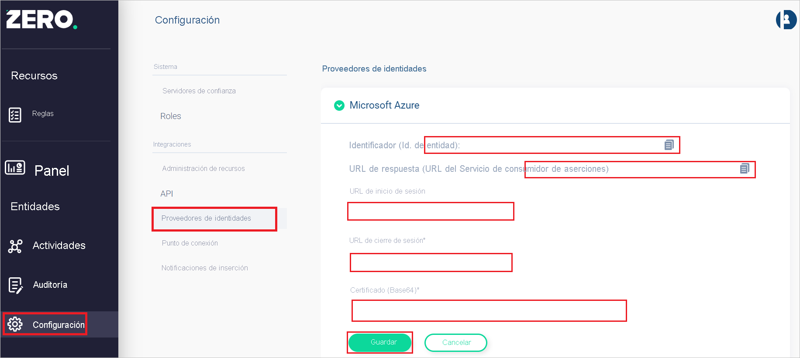

# Tutorial: Integración del inicio de sesión único (SSO) de Azure Active Directory con Zero Networks

En este tutorial aprenderá a integrar Zero Networks con Azure Active Directory (Azure AD). Al integrar Zero Networks con Azure AD, podrá hacer lo siguiente:

* Controlar en Azure AD quién tiene acceso a Zero Networks.
* Permitir que los usuarios inicien sesión automáticamente en Zero Networks con sus cuentas de Azure AD.
* Administrar las cuentas desde una ubicación central (Azure Portal).

## Requisitos previos

Para empezar, necesita los siguientes elementos:

* Una suscripción de Azure AD. Si no tiene una suscripción, puede crear una [cuenta gratuita](https://azure.microsoft.com/free/).
* Una suscripción habilitada para inicio de sesión único en Zero Networks.

## Descripción del escenario

En este tutorial, va a configurar y probar el inicio de sesión único de Azure AD en un entorno de prueba.

* Zero Networks admite el inicio de sesión único iniciado por **SP**.

> [!NOTE]
> El identificador de esta aplicación es un valor de cadena fijo, por lo que solo se puede configurar una instancia en un inquilino.

## Incorporación de Zero Networks desde la galería

Para configurar la integración de Zero Networks en Azure AD, es preciso agregar Zero Networks desde la galería a la lista de aplicaciones SaaS administradas.

1. Inicie sesión en Azure Portal con una cuenta personal, profesional o educativa de Microsoft.
1. En el panel de navegación de la izquierda, seleccione el servicio **Azure Active Directory**.
1. Vaya a **Aplicaciones empresariales** y seleccione **Todas las aplicaciones**.
1. Para agregar una nueva aplicación, seleccione **Nueva aplicación**.
1. En la sección **Agregar desde la galería**, escriba **Zero Networks** en el cuadro de búsqueda.
1. Seleccione **Zero Networks** en el panel de resultados y agregue la aplicación. Espere unos segundos mientras la aplicación se agrega al inquilino.

## Configuración y prueba del inicio de sesión único de Azure AD para Zero Networks

Configure y pruebe el inicio de sesión único de Azure AD con Zero Networks con un usuario de prueba llamado **B.Simon**. Para que el inicio de sesión único funcione, es necesario establecer una relación de vínculo entre un usuario de Azure AD y correspondiente en Zero Networks.

Para configurar y probar el inicio de sesión único de Azure AD con Zero Networks, lleve a cabo los siguientes pasos:

1. **[Configuración del inicio de sesión único de Azure AD](#configure-azure-ad-sso)** , para permitir que los usuarios puedan utilizar esta característica.
    1. **[Creación de un usuario de prueba de Azure AD](#create-an-azure-ad-test-user)** , para probar el inicio de sesión único de Azure AD con B.Simon.
    1. **[Asignación del usuario de prueba de Azure AD](#assign-the-azure-ad-test-user)** , para habilitar a B.Simon para que use el inicio de sesión único de Azure AD.
1. **[Configuración del inicio de sesión único en Zero Networks](#configure-zero-networks-sso)** : para configurar los valores de inicio de sesión único en la aplicación.
    1. **[Creación de un usuario de prueba en Zero Networks](#create-zero-networks-test-user)** : para tener un homólogo de B.Simon en Zero Networks vinculado a la representación del usuario en Azure AD.
1. **[Prueba del inicio de sesión único](#test-sso)** : para comprobar si la configuración funciona.

## Configuración del inicio de sesión único de Azure AD

Siga estos pasos para habilitar el inicio de sesión único de Azure AD en Azure Portal.

1. En Azure Portal, en la página de integración de la aplicación **Zero Networks**, busque la sección **Administrar** y seleccione **Inicio de sesión único**.
1. En la página **Seleccione un método de inicio de sesión único**, elija **SAML**.
1. En la página **Configuración del inicio de sesión único con SAML**, haga clic en el icono de lápiz de **Configuración básica de SAML** para editar la configuración.

   

1. En la sección **Configuración básica de SAML**, siga el paso a continuación.

    a. En el cuadro de texto **Dirección URL de inicio de sesión**, escriba la dirección URL: `https://portal.zeronetworks.com/#/login`

1. En la página **Configurar el inicio de sesión único con SAML**, en la sección **Certificado de firma de SAML**, busque **Certificado (Base64)** y seleccione **Descargar** para descargarlo y guardarlo en el equipo.

    

1. En la sección **Set up Zero Networks** (Configurar Zero Networks), copie las direcciones URL que necesite.

    

### Creación de un usuario de prueba de Azure AD

En esta sección, va a crear un usuario de prueba llamado B.Simon en Azure Portal.

1. En el panel izquierdo de Azure Portal, seleccione **Azure Active Directory**, **Usuarios** y **Todos los usuarios**.
1. Seleccione **Nuevo usuario** en la parte superior de la pantalla.
1. En las propiedades del **usuario**, siga estos pasos:
   1. En el campo **Nombre**, escriba `B.Simon`.  
   1. En el campo **Nombre de usuario**, escriba username@companydomain.extension. Por ejemplo, `B.Simon@contoso.com`.
   1. Active la casilla **Show password** (Mostrar contraseña) y, después, anote el valor que se muestra en el cuadro **Contraseña**.
   1. Haga clic en **Crear**.

### Asignación del usuario de prueba de Azure AD

En esta sección va a permitir que B.Simon acceda a Zero Networks mediante el inicio de sesión único de Azure.

1. En Azure Portal, seleccione sucesivamente **Aplicaciones empresariales** y **Todas las aplicaciones**.
1. En la lista de aplicaciones, seleccione **Zero Networks**.
1. En la página de información general de la aplicación, busque la sección **Administrar** y seleccione **Usuarios y grupos**.
1. Seleccione **Agregar usuario**. A continuación, en el cuadro de diálogo **Agregar asignación**, seleccione **Usuarios y grupos**.
1. En el cuadro de diálogo **Usuarios y grupos**, seleccione **B.Simon** de la lista de usuarios y haga clic en el botón **Seleccionar** de la parte inferior de la pantalla.
1. Si espera que se asigne un rol a los usuarios, puede seleccionarlo en la lista desplegable **Seleccionar un rol**. Si no se ha configurado ningún rol para esta aplicación, verá seleccionado el rol "Acceso predeterminado".
1. En el cuadro de diálogo **Agregar asignación**, haga clic en el botón **Asignar**.

## Configuración del inicio de sesión único en Zero Networks

1. Inicie sesión en el sitio de la empresa Zero Networks como administrador.

1. Vaya a **Settings** > **Identity Providers** (Configuración > Proveedores de identidades).

1. Haga clic en **Microsoft Azure** y siga los pasos a continuación.
    
    

    1. Copie el valor del **identificador de entidad** y péguelo en el cuadro de texto **Identificador** de la sección **Configuración básica de SAML** en Azure Portal.

    1. Copie el valor de **Reply URL (Assertion Consumer Service URL)** (Dirección URL de respuesta [URL del Servicio de consumidor de aserciones]) y péguelo en el cuadro **URL de respuesta**, en la sección **Configuración básica de SAML** de Azure Portal.

    1. En el cuadro de texto **Login URL** (Dirección URL de inicio de sesión), pegue el valor de **Dirección URL de inicio de sesión** que copió de Azure Portal.

    1. En el cuadro de texto **Logout URL** (Dirección URL de cierre de sesión), pegue el valor de **Logout URL** (Dirección URL de cierre de sesión) que copió de Azure Portal.

    1. En el Bloc de notas abra el archivo del **certificado (Base64)** que descargó de Azure Portal, copie el contenido y péguelo en el cuadro de texto **Certificate(Base64)** (Certificado [Base64]).

    1. Haga clic en **Guardar**.

### Creación de un usuario de prueba en Zero Networks

En esta sección creará un usuario llamado B.Simon en Zero Networks. Trabaje con el [equipo de soporte técnico de Zero Networks](mailto:support@zeronetworks.com) para agregar los usuarios a la plataforma de Zero Networks. Los usuarios se tienen que crear y activar antes de usar el inicio de sesión único.

## Prueba de SSO 

En esta sección, probará la configuración de inicio de sesión único de Azure AD con las siguientes opciones. 

* Haga clic en **Probar esta aplicación** en Azure Portal. Esta acción le redirigirá a la dirección URL de inicio de sesión de Zero Networks, donde podrá iniciar el flujo de inicio de sesión. 

* Vaya directamente a la dirección URL de inicio de sesión de Zero Networks e inicie el flujo de inicio de sesión desde allí.

* Puede usar Mis aplicaciones de Microsoft. Al hacer clic en el icono de Zero Networksen Aplicaciones, se le redirigirá a la URL de inicio de sesión de esa plataforma. Para más información acerca de Aplicaciones, consulte [Inicio de sesión e inicio de aplicaciones desde el portal Aplicaciones](../user-help/my-apps-portal-end-user-access.md).

## Pasos siguientes

Una vez configurado Zero Networks, podrá aplicar el control de sesión, que protege la información confidencial de la organización de la filtración y la infiltración en tiempo real. El control de sesión procede del acceso condicional. [Aprenda a aplicar el control de sesión con Microsoft Cloud App Security](/cloud-app-security/proxy-deployment-aad).