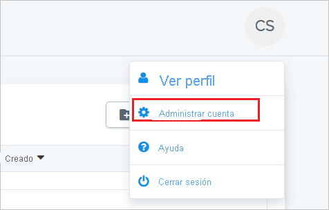
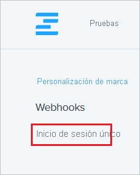
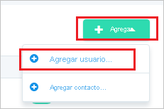
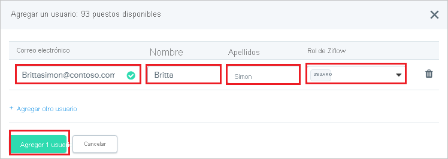

# Tutorial: Integración de Azure Active Directory con Ziflow

En este tutorial aprenderá a integrar Ziflow con Azure Active Directory (Azure AD). Al integrar Ziflow con Azure AD, puede hacer lo siguiente:

* Controlar en Azure AD quién tiene acceso a Ziflow.
* Permitir que los usuarios inicien sesión automáticamente en Ziflow con sus cuentas de Azure AD.
* Administrar las cuentas desde una ubicación central (Azure Portal).

## Requisitos previos

Para configurar la integración de Azure AD con Ziflow, necesita los siguientes elementos:

* Una suscripción de Azure AD. Si no dispone de un entorno de Azure AD, puede obtener [una cuenta gratuita](https://azure.microsoft.com/free/).
* Una suscripción habilitada para el inicio de sesión único en Ziflow.

## Descripción del escenario

En este tutorial, puede configurar y probar el inicio de sesión único de Azure AD en un entorno de prueba.

* Ziflow admite el inicio de sesión único iniciado por **SP**.

## Adición de Ziflow desde la galería

Para configurar la integración de Ziflow en Azure AD, debe agregar Ziflow de la galería a la lista de aplicaciones SaaS administradas.

1. Inicie sesión en Azure Portal con una cuenta personal, profesional o educativa de Microsoft.
1. En el panel de navegación de la izquierda, seleccione el servicio **Azure Active Directory**.
1. Vaya a **Aplicaciones empresariales** y seleccione **Todas las aplicaciones**.
1. Para agregar una nueva aplicación, seleccione **Nueva aplicación**.
1. En la sección **Agregar desde la galería**, escriba **Ziflow** en el cuadro de búsqueda.
1. Seleccione **Ziflow** en el panel de resultados y agregue la aplicación. Espere unos segundos mientras la aplicación se agrega al inquilino.

## Configuración y prueba del inicio de sesión único de Azure AD para Ziflow

Configure y pruebe el inicio de sesión único de Azure AD con Ziflow mediante un usuario de prueba llamado **B.Simon**. Para que el inicio de sesión único funcione, es necesario establecer una relación de vínculo entre un usuario de Azure AD y el usuario relacionado de Ziflow.

Para configurar y probar el inicio de sesión único de Azure AD con Ziflow, siga estos pasos:

1. **[Configuración del inicio de sesión único de Azure AD](#configure-azure-ad-sso)** , para permitir que los usuarios puedan utilizar esta característica.
    1. **[Creación de un usuario de prueba de Azure AD](#create-an-azure-ad-test-user)** , para probar el inicio de sesión único de Azure AD con B.Simon.
    1. **[Asignación del usuario de prueba de Azure AD](#assign-the-azure-ad-test-user)** , para habilitar a B.Simon para que use el inicio de sesión único de Azure AD.
1. **[Configuración del inicio de sesión único en Ziflow](#configure-ziflow-sso)** : para configurar los valores de inicio de sesión único en la aplicación.
    1. **[Creación de un usuario de prueba de Ziflow](#create-ziflow-test-user)** : para tener un homólogo de B.Simon en Ziflow que esté vinculado a la representación del usuario en Azure AD.
1. **[Prueba del inicio de sesión único](#test-sso)** : para comprobar si la configuración funciona.

## Configuración del inicio de sesión único de Azure AD

Siga estos pasos para habilitar el inicio de sesión único de Azure AD en Azure Portal.

1. En Azure Portal, en la página de integración de la aplicación **Ziflow**, busque la sección **Administrar** y seleccione **Inicio de sesión único**.
1. En la página **Seleccione un método de inicio de sesión único**, elija **SAML**.
1. En la página **Configuración del inicio de sesión único con SAML**, haga clic en el icono de lápiz de **Configuración básica de SAML** para editar la configuración.

   

4. En la sección **Configuración básica de SAML**, siga estos pasos:

    a. En el cuadro de texto **Identificador (id. de entidad)** , escriba un valor con el siguiente patrón: `urn:auth0:ziflow-production:<UNIQUE_ID>`

    b. En el cuadro de texto **URL de inicio de sesión**, escriba una dirección URL con el siguiente patrón: `https://ziflow-production.auth0.com/login/callback?connection=<UNIQUE_ID>`

    > [!NOTE]
    > Los valores anteriores no son reales. Tendrá que actualizar tanto el valor del identificador como la URL de inicio de sesión con su valor real, esto se explica más adelante en el tutorial.

5. En la página **Configurar el inicio de sesión único con SAML**, en la sección **Certificado de firma de SAML**, haga clic en **Descargar** para descargar el **certificado (Base64)** de las opciones proporcionadas según sus requisitos y guárdelo en el equipo.

    

6. En la sección **Configurar Ziflow**, copie la dirección o direcciones URL adecuadas según sus necesidades.

    

### Creación de un usuario de prueba de Azure AD 

En esta sección, va a crear un usuario de prueba llamado B.Simon en Azure Portal.

1. En el panel izquierdo de Azure Portal, seleccione **Azure Active Directory**, **Usuarios** y **Todos los usuarios**.
1. Seleccione **Nuevo usuario** en la parte superior de la pantalla.
1. En las propiedades del **usuario**, siga estos pasos:
   1. En el campo **Nombre**, escriba `B.Simon`.  
   1. En el campo **Nombre de usuario**, escriba username@companydomain.extension. Por ejemplo, `B.Simon@contoso.com`.
   1. Active la casilla **Show password** (Mostrar contraseña) y, después, anote el valor que se muestra en el cuadro **Contraseña**.
   1. Haga clic en **Crear**.

### Asignación del usuario de prueba de Azure AD

En esta sección, va a permitir que B.Simon acceda a Ziflow mediante el inicio de sesión único de Azure.

1. En Azure Portal, seleccione sucesivamente **Aplicaciones empresariales** y **Todas las aplicaciones**.
1. En la lista de aplicaciones, seleccione **Ziflow**.
1. En la página de información general de la aplicación, busque la sección **Administrar** y seleccione **Usuarios y grupos**.
1. Seleccione **Agregar usuario**. A continuación, en el cuadro de diálogo **Agregar asignación**, seleccione **Usuarios y grupos**.
1. En el cuadro de diálogo **Usuarios y grupos**, seleccione **B.Simon** de la lista de usuarios y haga clic en el botón **Seleccionar** de la parte inferior de la pantalla.
1. Si espera que se asigne un rol a los usuarios, puede seleccionarlo en la lista desplegable **Seleccionar un rol**. Si no se ha configurado ningún rol para esta aplicación, verá seleccionado el rol "Acceso predeterminado".
1. En el cuadro de diálogo **Agregar asignación**, haga clic en el botón **Asignar**.

## Configuración del inicio de sesión único de Ziflow

1. En otra ventana del explorador web, inicie sesión en Ziflow como administrador de seguridad.

2. Haga clic en Avatar en la esquina superior derecha y, a continuación, haga clic en **Manage account** (Administrar cuenta).

    

3. En la parte superior izquierda, haga clic en **Single Sign-On** (Inicio de sesión único).

    

4. En la página **Single Sign-On** (Inicio de sesión único) realice los pasos siguientes:

    

    a. En **Type** (Tipo), seleccione **SAML2.0**.

    b. En el cuadro de texto **Sign In URL** (Dirección URL de inicio de sesión), pegue el valor de la **URL de inicio de sesión** que ha copiado de Azure Portal.

    c. Cargue el certificado codificado en base 64 que ha descargado de Azure Portal en la **certificado de firma X509**.

    d. En el cuadro de texto **Sign Out URL** (Dirección URL de cierre de sesión), pegue el valor de la **URL de cierre de sesión** que ha copiado de Azure Portal.

    e. En la sección **Configuration Settings for your Identifier Provider** (Configuración del proveedor de identidades), copie el valor de identificación único resaltado y anéxelo al identificador y la dirección URL de inicio de sesión de la sección **Configuración básica de SAML** en Azure Portal.

### Creación de un usuario de prueba de Ziflow

Para permitir que los usuarios de Azure AD inicien sesión en Ziflow, tienen que aprovisionarse en Ziflow. En Ziflow, el aprovisionamiento es una tarea manual.

Para aprovisionar una cuenta de usuario, realice estos pasos:

1. Inicie sesión en Ziflow como administrador de seguridad.

2. Vaya a **People** (Personas) en la parte superior.

    

3. Haga clic en **Add** (Agregar) y, luego, en **Add user** (Agregar usuario).

    

4. En la ventana emergente **Add a user** (Agregar un usuario), realice los siguientes pasos:

    

    a. En el cuadro de texto **E-mail** (Correo electrónico), escriba el correo electrónico del usuario, por ejemplo, brittasimon@contoso.com.

    b. En el cuadro de texto **First Name** (Nombre), escriba el nombre del usuario, en este caso Britta.

    c. En el cuadro de texto **Last Name** (Apellidos), escriba los apellidos del usuario, en este caso Simon.

    d. Seleccione su rol de Ziflow.

    e. Haga clic en **Add 1 user** (Agregar 1 usuario).

    > [!NOTE]
    > El titular de la cuenta de Azure Active Directory recibirá un mensaje de correo y seguirá un vínculo para confirmar su cuenta antes de que se active.

## Prueba de SSO 

En esta sección, probará la configuración de inicio de sesión único de Azure AD con las siguientes opciones. 

* Haga clic en **Probar esta aplicación** en Azure Portal. Esto le redirigirá a la dirección URL de inicio de sesión de Ziflow, donde puede iniciar el flujo de inicio de sesión. 

* Vaya directamente a la dirección URL de inicio de sesión de Ziflow e inicie el flujo de inicio de sesión desde allí.

* Puede usar Mis aplicaciones de Microsoft. Al hacer clic en el icono de Ziflow en Mis aplicaciones, se le redirigirá a la URL de inicio de sesión de la aplicación. Para más información acerca de Aplicaciones, consulte [Inicio de sesión e inicio de aplicaciones desde el portal Aplicaciones](https://support.microsoft.com/account-billing/sign-in-and-start-apps-from-the-my-apps-portal-2f3b1bae-0e5a-4a86-a33e-876fbd2a4510).

## Pasos siguientes

Una vez que haya configurado Ziflow, podrá aplicar el control de sesión, que protege a la organización en tiempo real frente a la filtración e infiltración de información confidencial. El control de sesión procede del acceso condicional. [Aprenda a aplicar el control de sesión con Microsoft Cloud App Security](/cloud-app-security/proxy-deployment-aad).