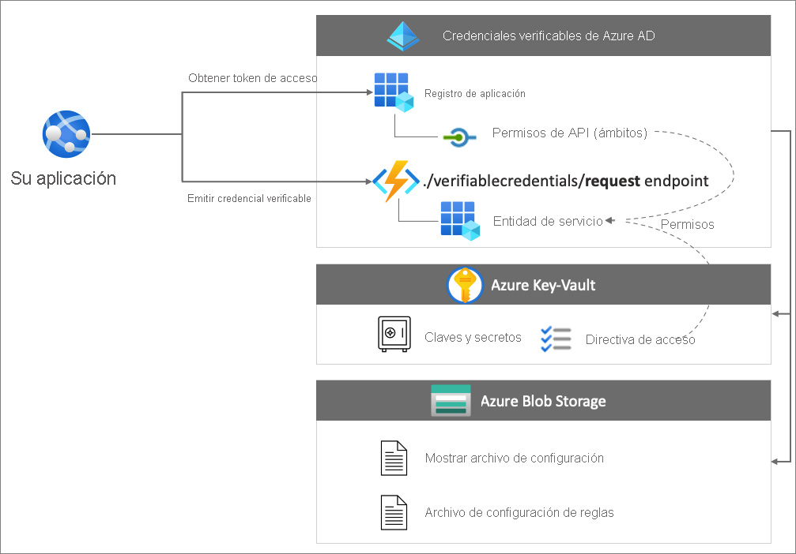
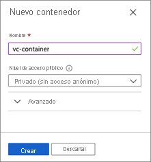
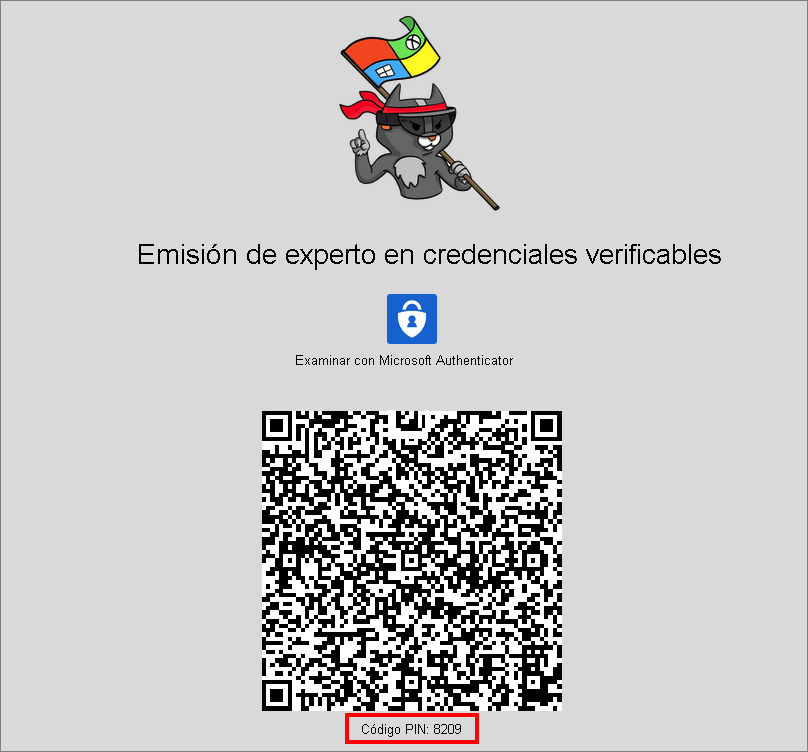
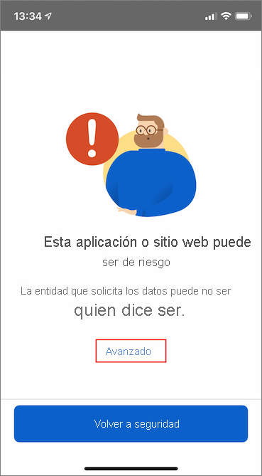
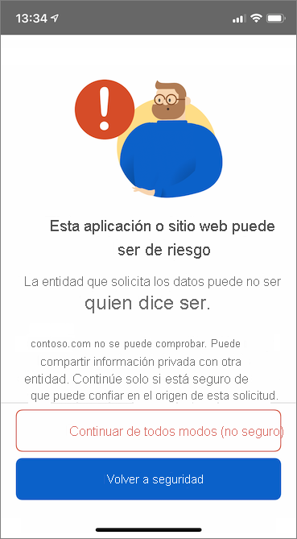
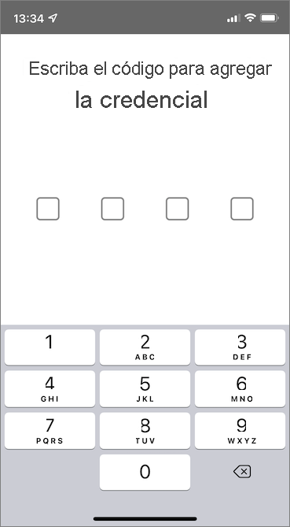
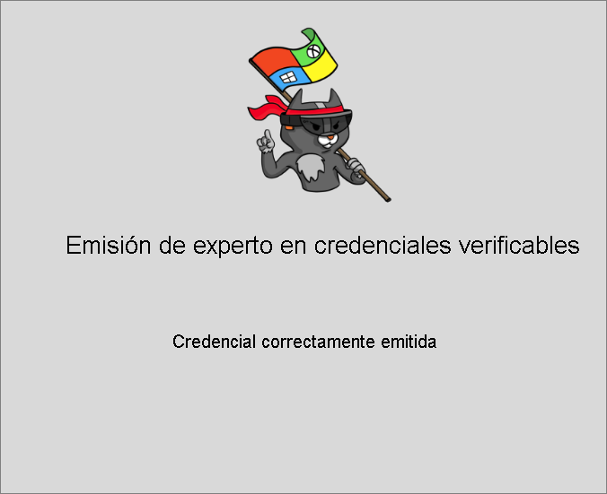
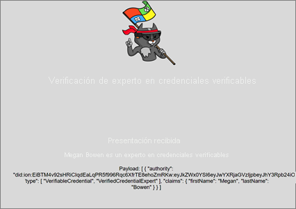

# <a name="issue-azure-ad-verifiable-credentials-from-an-application-preview"></a>Emisión de credenciales verificables de Azure AD desde una aplicación (versión preliminar)

En este tutorial, ejecutará una aplicación de ejemplo desde la máquina local que se conecta al inquilino de Azure Active Directory (Azure AD). Con la aplicación, va a emitir una tarjeta de experto en credenciales verificadas y la va a comprobar.

En este artículo aprenderá a:

> [!div class="checklist"]
>
> - Configurar una instancia de Azure Blob Storage para almacenar los archivos de configuración de credenciales verificables.
> - Creará y cargará los archivos de configuración de credenciales verificables.
> - Creará la tarjeta de experto en credenciales verificadas en Azure.
> - Recopilará las credenciales y los detalles del entorno para configurar la aplicación de ejemplo.
> - Descargará el código de la aplicación de ejemplo en la máquina local.
> - Actualizará la aplicación de ejemplo con la tarjeta de experto en credenciales verificadas y los detalles del entorno.
> - Ejecutará la aplicación de ejemplo y emitirá su primera tarjeta de experto en credenciales verificadas.
> - Comprobará la tarjeta de experto en credenciales verificadas.

En el diagrama siguiente se muestra la arquitectura de las credenciales verificables de Azure AD y el componente que se configura.



## <a name="prerequisites"></a>Prerrequisitos

- Antes de empezar, es importante [configurar un inquilino para las credenciales verificables de Azure AD](./verifiable-credentials-configure-tenant.md).
- Para clonar el repositorio que hospeda la aplicación de ejemplo, instale [GIT](https://git-scm.com/downloads).
- [Visual Studio Code](https://code.visualstudio.com/Download) u otro editor de código.
- [.NET 5.0](https://dotnet.microsoft.com/download/dotnet/5.0)
- [NGROK](https://ngrok.com/) gratis.
- Un dispositivo móvil con Microsoft Authenticator
  - Android 6.2108.5654 o una versión posterior instalado
  - iOS 6.5.82 o una versión posterior instalado

## <a name="create-a-storage-account"></a>Crear una cuenta de almacenamiento

Azure Blob Storage es la solución de almacenamiento de objetos de Microsoft para la nube. El servicio de credenciales verificables de Azure AD usa [Azure Blob Storage](../../storage/blobs/storage-blobs-introduction.md) para almacenar los archivos de configuración de credenciales verificables al emitir estas.

Cree y configure la instancia de Azure Blob Storage siguiendo estos pasos:

1. Si no dispone de una cuenta de Azure Blob Storage, [cree una cuenta de almacenamiento](../../storage/common/storage-account-create.md).
1. A continuación, cree un contenedor. En el menú izquierdo de la cuenta de almacenamiento, desplácese a la sección **Almacenamiento de datos** y, después, seleccione **Contenedores**.
1. Seleccione el botón **+ Contenedor**.
1. Escriba un **nombre** para el nuevo contenedor. El nombre del contenedor debe escribirse en minúsculas, comenzar por una letra o un número, y solo puede incluir letras, números y el carácter de guión (-). Por ejemplo, *vc-container*.
1. Establezca el valor de **Nivel de acceso público** en **Privado** (sin acceso anónimo).
1. Seleccione **Crear**.  

    En la captura de pantalla siguiente se muestra cómo crear un contenedor:  

   

## <a name="grant-access-to-the-container"></a>Concesión de acceso al contenedor

Antes de crear el contenedor, conceda al usuario que ha iniciado sesión la asignación de roles correcta para que pueda acceder a los archivos en Storage Blob.

1. En la lista de contenedores, seleccione *vc-container*.

1. En el menú, seleccione **Control de acceso (IAM)** .

1. Seleccione **+Agregar** y, luego, **Agregar asignación de roles**.

     

1. En la página **Agregar asignación de roles**:

    1. En **Rol**, seleccione **Lector de datos de Storage Blob**.

    1. En **Asignar acceso a**, seleccione **Usuario, grupo o entidad de servicio**.

    1. A continuación, busque la cuenta que está usando para realizar estos pasos y selecciónela.

        

>[!IMPORTANT]
>De forma predeterminada, a los creadores de contenedores se les asigna el rol Propietario. El rol Propietario no es suficiente por sí solo. Su cuenta necesita el rol Lector de datos de Storage Blob. Para más información, consulte [Uso de Azure Portal para asignar un rol de Azure para el acceso a datos de blobs y colas](../../storage/blobs/assign-azure-role-data-access.md).

### <a name="upload-the-configuration-files"></a>Carga de los archivos de configuración

El servicio de credenciales verificables de Azure AD usa dos archivos de configuración JSON: los archivos de reglas y de visualización. 

- El archivo de reglas describe propiedades importantes de las credenciales verificables. En concreto, describe las notificaciones que los sujetos (usuarios) deben proporcionar antes de que se les emita una credencial verificable. 
- El archivo de visualización controla la personalización de marca de la credencial y el estilo de las notificaciones.

En esta sección, cargará una regla de ejemplo y mostrará los archivos en el almacenamiento. Para más información sobre cómo personalizar estos archivos, consulte [Personalización de las credenciales verificables](credential-design.md).

Para cargar los archivos de configuración, siga estos pasos:

1. Copie el siguiente código JSON y guarde el contenido en un archivo llamado VerifiedCredentialExpertDisplay.json.

    ```json
    {
      "default": {
        "locale": "en-US",
        "card": {
          "title": "Verified Credential Expert",
          "issuedBy": "Microsoft",
          "backgroundColor": "#2E4053",
          "textColor": "#ffffff",
          "logo": {
            "uri": "https://didcustomerplayground.blob.core.windows.net/public/VerifiedCredentialExpert_icon.png",
            "description": "Verified Credential Expert Logo"
          },
          "description": "Use your verified credential to prove to anyone that you know all about verifiable credentials."
        },
        "consent": {
          "title": "Do you want to get your Verified Credential?",
          "instructions": "Sign in with your account to get your card."
        },
        "claims": {
          "vc.credentialSubject.firstName": {
            "type": "String",
            "label": "First name"
          },
          "vc.credentialSubject.lastName": {
            "type": "String",
            "label": "Last name"
          }
        }
      }
    }
    ```

1. Copie el siguiente código JSON y guarde el contenido en un archivo llamado VerifiedCredentialExpertRules.json. La siguiente credencial verificable define un par de notificaciones simples en ella: firstName y lastName.

    ```json
    {
      "attestations": {
        "idTokens": [
          {
            "id": "https://self-issued.me",
            "mapping": {
              "firstName": { "claim": "$.given_name" },
              "lastName": { "claim": "$.family_name" }
            },
            "configuration": "https://self-issued.me",
            "client_id": "",
            "redirect_uri": ""
          }
        ]
      },
      "validityInterval": 2592001,
      "vc": {
        "type": [ "VerifiedCredentialExpert" ]
      }
    }
    ```
    
1. En Azure Portal, vaya al contenedor de Azure Blob Storage que [ha creado](#create-a-storage-account).

1. En el menú izquierdo, seleccione **Contenedores** para mostrar una lista de los blobs que contiene. Luego, seleccione el contenedor **vc-container** que creó anteriormente.

1. Seleccione el botón **Cargar** para abrir la hoja con el mismo nombre y examine el sistema de archivos local para buscar un archivo para cargar. Seleccione los archivos **VerifiedCredentialExpertDisplay.json** y **VerifiedCredentialExpertRules.json**. Luego, seleccione **Cargar** para cargar los archivos en el contenedor.

## <a name="create-the-verifiable-credential-expert-card-in-azure"></a>Creación de la tarjeta de experto en credenciales verificables en Azure

En este paso, creará la tarjeta de experto en credenciales verificables mediante las credenciales verificables de Azure AD. Después de crear una credencial verificada, el inquilino de Azure AD puede emitir esta credencial a los usuarios que inician un proceso de emisión de credenciales verificables.

1. En la entrada de búsqueda principal de [Azure Portal](https://portal.azure.com/), busque **credenciales verificables**. A continuación, seleccione **Verifiable Credentials (Preview)** (Credenciales verificables [versión preliminar]).
1. Después de [configurar el inquilino](verifiable-credentials-configure-tenant.md), debería aparecer la pantalla **Create a new credential** (Crear nueva credencial). Si no se abre o quiere crear más credenciales, seleccione **Credenciales** en el menú izquierdo. Luego, seleccione **+ Credencial**.
1. En la página para crear una credencial, haga lo siguiente:

    1. En **Nombre**, escriba **VerifiedCredentialExpert** como nombre de la credencial. Este nombre su usa en el portal para identificar las credenciales verificables. Se incluye como parte del contrato de credenciales verificables.

    1. Seleccione la **suscripción** de Azure AD en la que creó la instancia de Azure Blob Storage.

    1. En **Display file** (Archivo de visualización), **seleccione el archivo de visualización**. En la sección de cuentas de almacenamiento, elija **vc-container**. Luego, elija el archivo **VerifiedCredentialExpertDisplay.json** y haga clic en **Seleccionar**.

    1. En **Archivo de reglas**, **seleccione el archivo de reglas**. En la sección de cuentas de almacenamiento, elija **vc-container**. Luego, seleccione el archivo **VerifiedCredentialExpertRules.json** y haga clic en **Seleccionar**.

    En la captura de pantalla siguiente, se muestra cómo crear una credencial:

    

1. En la pantalla Create a new credential (Crear una nueva credencial), elija **Create** (Crear).

## <a name="gather-credentials-and-environment-details-to-set-up-your-sample-application"></a>Recopilación de credenciales y detalles del entorno para configurar la aplicación de ejemplo

Ahora que tiene una nueva credencial, va a recopilar información sobre su entorno y la credencial que ha creado. Estos fragmentos de información los usará al configurar la aplicación de ejemplo.

1. En las credenciales verificables, seleccione **Credenciales** y, luego, en la lista de credenciales, seleccione el elemento VerifiedCredentialExpert que creó anteriormente.

    

1. Copie la **dirección URL de emisión de credenciales**. La dirección URL es la combinación de los archivos de reglas y de visualización. Es la dirección URL que Authenticator evalúa antes de mostrar los requisitos de emisión de las credenciales verificables al usuario. Anótela para usarla en otro momento.

1. Copie el **identificador descentralizado** y anótelo para usarlo en otro momento.

1. Copie el **identificador de inquilino** y anótelo para usarlo en otro momento. En la captura de pantalla siguiente se muestra cómo copiar los valores necesarios:

    

## <a name="download-the-sample-code"></a>Descarga del código de ejemplo

La aplicación de ejemplo está disponible en .NET y el código se mantiene en un repositorio de GitHub. Descargue nuestro código de ejemplo de Github [aquí](https://github.com/Azure-Samples/active-directory-verifiable-credentials-dotnet), o bien, clone el repositorio en la máquina local:


```bash
git clone git@github.com:Azure-Samples/active-directory-verifiable-credentials-dotnet.git
```

## <a name="configure-the-verifiable-credentials-app"></a>Configuración de la aplicación de credenciales verificables

Cree un secreto de cliente para la aplicación registrada que ha creado. La aplicación de ejemplo usa el secreto de cliente para demostrar su identidad al solicitar tokens.

1. Vaya a la página **Registros de aplicaciones** situada dentro de **Azure Active Directory**

1. Seleccione la aplicación **verifiable-credentials-app** que creó anteriormente.

1. Seleccione el nombre para entrar en los detalles de "Registros de aplicaciones".

1. Copie el valor de **Id. de aplicación (cliente)** y guárdelo para usarlo más adelante.  

     

1. Mientras está en los detalles del registro de aplicaciones, en el menú principal, en **Administrar**, seleccione **Certificates & secrets** (Certificados y secretos).

1. Elija **Nuevo secreto de cliente**.

    1. En el cuadro **Descripción**, escriba una descripción para el secreto de cliente (por ejemplo, **vc-sample-secret**).

    1. En **Expira**, seleccione el tiempo durante el cual el secreto es válido (por ejemplo, 6 meses) y, luego, elija **Agregar**.

    1. Registre el **Valor** del secreto. Este valor se usará para la configuración en un paso posterior. El valor del secreto no se volverá a mostrar ni se podrá recuperar por ningún otro medio, de modo que anótelo en cuanto sea visible.

En este momento, debe tener toda la información necesaria para configurar la aplicación de ejemplo.

## <a name="update-the-sample-application"></a>Actualización de la aplicación de ejemplo

Ahora, realizará modificaciones en el código del emisor de la aplicación de ejemplo para actualizarlo con la dirección URL de la credencial verificable. Este paso le permite emitir credenciales verificables mediante su propio inquilino.

1. En la carpeta *active-directory-verifiable-credentials-dotnet-main*, abra Visual Studio Code y seleccione el proyecto dentro de la carpeta **1.asp-net-core-api-idtokenhint**.

1. En la carpeta raíz del proyecto, abra el archivo appsettings.json. Este archivo contiene información sobre las credenciales verificables de Azure AD. Actualice las siguientes propiedades con la información que ha anotado antes durante los pasos anteriores.

    1. **Id. de inquilino:** su identificador de inquilino
    1. **Id. de cliente:** su identificador de cliente
    1. **Secreto de cliente**: su secreto de cliente
    1. **IssuerAuthority**: su identificador descentralizado
    1. **VerifierAuthority**: su identificador descentralizado
    1. **Credential Manifest** (Manifiesto de credencial): dirección URL de la emisión de credenciales

1. Guarde el archivo *appSettings.json*.

El siguiente JSON muestra un archivo appsettings.json completo.

```json
{
  "AppSettings": {
    "Endpoint": "https://beta.did.msidentity.com/v1.0/{0}/verifiablecredentials/request",
    "VCServiceScope": "bbb94529-53a3-4be5-a069-7eaf2712b826/.default",
    "Instance": "https://login.microsoftonline.com/{0}",

    "TenantId": "12345678-0000-0000-0000-000000000000",
    "ClientId": "33333333-0000-0000-0000-000000000000",
    "ClientSecret": "123456789012345678901234567890",
    "CertificateName": "[Or instead of client secret: Enter here the name of a certificate (from the user cert store) as registered with your application]",
    "IssuerAuthority": "did:ion:EiCcn9dz_OC6HY60AYBXF2Dd8y5_2UYIx0Ni6QIwRarjzg:eyJkZWx0YSI6eyJwYXRjaGVzIjpbeyJhY3Rpb24iOiJyZXBsYWNlIiwiZG9jdW1lbnQiOnsicHVibGljS2V5cyI6W3siaWQiOiJzaWdfN2U4MmYzNjUiLCJwdWJsaWNLZXlKd2siOnsiY3J2Ijoic2VjcDI1NmsxIiwia3R5IjoiRUMiLCJ4IjoiaUo0REljV09aWVA...",
    "VerifierAuthority": " did:ion:EiCcn9dz_OC6HY60AYBXF2Dd8y5_2UYIx0Ni6QIwRarjzg:eyJkZWx0YSI6eyJwYXRjaGVzIjpbeyJhY3Rpb24iOiJyZXBsYWNlIiwiZG9jdW1lbnQiOnsicHVibGljS2V5cyI6W3siaWQiOiJzaWdfN2U4MmYzNjUiLCJwdWJsaWNLZXlKd2siOnsiY3J2Ijoic2VjcDI1NmsxIiwia3R5IjoiRUMiLCJ4IjoiaUo0REljV09aWVA...",
    "CredentialManifest":  "https://beta.did.msidentity.com/v1.0/12345678-0000-0000-0000-000000000000/verifiableCredential/contracts/VerifiedCredentialExpert"
  }
}
```

## <a name="issuing-your-first-verified-expert-card"></a>Emisión de la primera tarjeta de experto verificada

Ahora está listo para emitir su primera tarjeta de experto verificada mediante la ejecución de la aplicación de ejemplo.

1. En Visual Studio Code, ejecute el proyecto Verifiable_credentials_DotNet. O bien, desde el shell de comandos, ejecute los siguientes comandos:

    ```bash
    cd active-directory-verifiable-credentials-dotnet/1. asp-net-core-api-idtokenhint  dotnet build "asp-net-core-api-idtokenhint.csproj" -c Debug -o .\\bin\\Debug\\netcoreapp3.  dotnet run
    ```

1. En otro terminal, ejecute el comando siguiente. Este comando ejecuta [ngrok](https://ngrok.com/) para configurar una dirección URL en 3000 y hacer que esté disponible públicamente en Internet.

    ```bash
    ngrok http 3000
    ```

    >[!NOTE]
    > En algunos equipos, podría tener que ejecutar el comando en este formato `./ngrok http 3000`.

1. Abra la dirección URL HTTPS generada por ngrok.

     

1. En un explorador web, seleccione **Get Credential** (Obtener credencial).

     

1. Con el dispositivo móvil, digitalice el código QR con la aplicación Authenticator. También puede digitalizar el código QR directamente desde la cámara, que abrirá la aplicación Authenticator automáticamente.

    

1. En este momento, verá un mensaje que le advierte que esta aplicación o sitio web puede ser de riesgo. Seleccione **Avanzado**.

     

1. En la advertencia de sitio web de riesgo, seleccione **Proceed anyways (unsafe)** (Continuar de todos modos [no seguro]). Esta advertencia aparece porque el dominio no está vinculado a su DID. Para comprobar el dominio, siga la guía del artículo [Vinculación del dominio al identificador descentralizado (DID)](how-to-dnsbind.md). En este tutorial, puede omitir el registro de dominio y seleccionar **Proceed anyways (unsafe)** (Continuar de todos modos [no seguro]).

     

1. Se le pedirá que escriba un código PIN que se muestra en la pantalla donde ha digitalizado el código QR. El PIN se usa para agregar una capa adicional de protección a la carga de emisión. Este código se genera aleatoriamente cada vez que se muestra un código QR de emisión.

     

1. Después de escribir el número PIN, se muestra la pantalla **Agregar una credencial**. En la parte superior de la pantalla, puede ver el mensaje **No comprobado** en color rojo. Esta advertencia está relacionada con la validación de dominio mencionada anteriormente.

1. Seleccione **Agregar** para aceptar la nueva credencial verificable.

    

1. ¡Enhorabuena! Ahora tiene una credencial verificable del experto en credenciales verificadas.

    

Vuelva a la aplicación de ejemplo. Muestra que una credencial se emitió correctamente.

  

## <a name="verifying-the-verified-expert-card"></a>Comprobación de la tarjeta de experto verificada

Ahora ya está listo para comprobar la tarjeta de experto verificada; para ello, ejecute de nuevo la aplicación de ejemplo.

1. Presione el botón "Atrás" en el explorador para volver a la página principal de la aplicación de ejemplo.

1. Seleccione **Verify credentials** (Comprobar credenciales).  

   

1. Con la aplicación de autenticación, digitalice el código QR o hágalo directamente con la cámara del móvil.

1. Cuando vea el mensaje que le advierte que esta aplicación o sitio web puede ser de riesgo, seleccione **Avanzado**. Luego, seleccione **Proceed anyways (unsafe)** (Continuar de todos modos [no seguro]).

1. Para aprobar la solicitud de presentación, seleccione **Permitir**.

    

1. Después de aprobar la solicitud de presentación, puede ver que la solicitud se ha aprobado. También puede consultar el registro. Para ver el registro, seleccione la credencial verificable:  

    

1. Luego, seleccione **Recent history** (Historial reciente).  

    

1. La **actividad reciente** muestra las actividades recientes de la credencial verificable.

    

1. Vuelva a la aplicación de ejemplo. Muestra que se ha recibido la presentación de las credenciales verificables.  
    

## <a name="verifiable-credential-names&quot;></a>Nombres de credenciales verificables 

La credencial verificable contiene **Megan Bowen**, correspondiente a los valores de nombre y apellido de la credencial. Estos valores se codificaron de forma rígida en la aplicación de ejemplo y se agregaron a la credencial verificable en el momento de la emisión de la carga. 

En escenarios reales, la aplicación extraerá los detalles del usuario de un proveedor de identidades. El siguiente fragmento de código muestra dónde se establece el nombre en la aplicación de ejemplo. En un ejemplo de seguimiento, le mostraremos cómo insertar los valores directamente desde el proveedor de identidades en la credencial verificable.

```csharp
//file: IssuerController.cs
[HttpGet(&quot;/api/issuer/issuance-request")]
public async Task<ActionResult> issuanceRequest()
  {
    ...

    // Here you could change the payload manifest and change the first name and last name.
    payload["issuance"]["claims"]["given_name"] = "Megan";
    payload["issuance"]["claims"]["family_name"] = "Bowen";
    ...
}
  ```

## <a name="next-steps"></a>Pasos siguientes

En este artículo, ha aprendido cómo:

> [!div class="checklist"]
> * Configurar el servicio de credenciales verificables de Azure AD.
> * Emitir y comprobar las credenciales con el mismo inquilino de Azure AD.

En el [paso siguiente](verifiable-credentials-configure-verifier.md) descubrirá cómo la aplicación de terceros, también conocida como aplicación de usuario de confianza, puede comprobar sus credenciales con su propio servicio de API de credenciales verificables del inquilino de Azure AD.