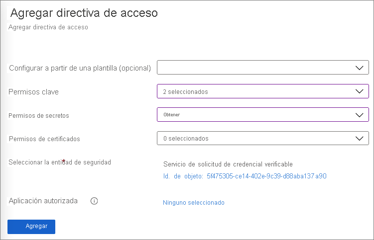
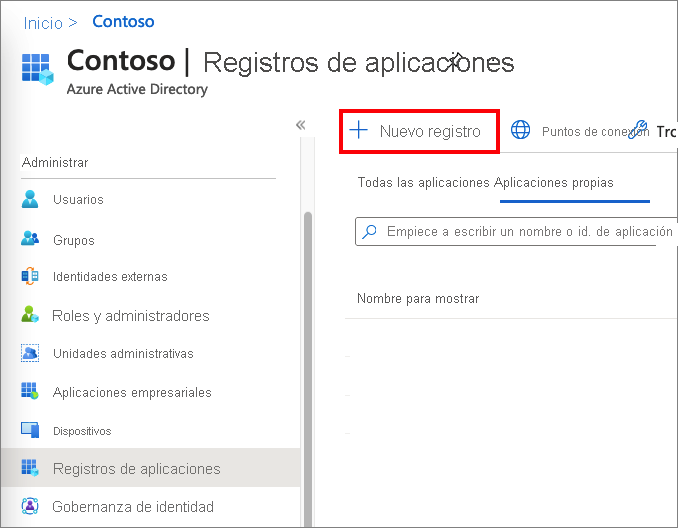
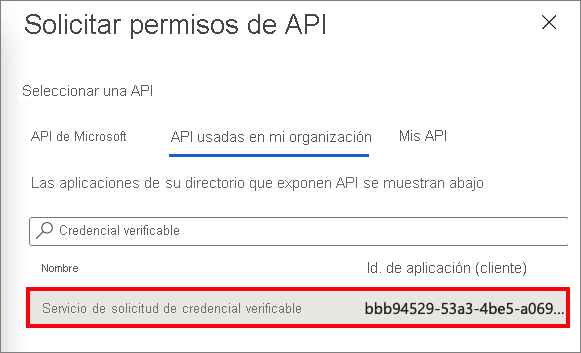
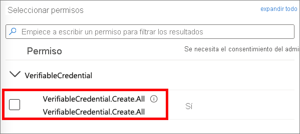

# <a name="configure-your-tenant-for-azure-ad-verifiable-credentials-preview"></a>Configuración del inquilino para las credenciales verificables Azure AD (versión preliminar)

Las credenciales verificables de Azure Active Directory (Azure AD) protegen su organización con una solución de identidad fácil y descentralizada. El servicio le permite emitir y comprobar credenciales. Para los emisores, Azure AD proporciona un servicio que pueden personalizar y usar para emitir sus propias credenciales verificables. Para los comprobadores, el servicio proporciona una API REST gratuita que facilita la solicitud y aceptación de credenciales verificables en sus aplicaciones y servicios.

En este tutorial, aprenderá a configurar el inquilino de Azure AD para que pueda usar este servicio de credenciales.

Específicamente, aprenderá sobre lo siguiente:

> [!div class="checklist"]
>
> - Configuración de una entidad de servicio
> - Creación de un almacén de claves en Azure Key Vault
> - Registrar una aplicación en Azure AD
> - Configuración del servicio de credenciales verificables

En el diagrama siguiente se muestra la arquitectura de las credenciales verificables de Azure AD y el componente que se configura.


## <a name="prerequisites"></a>Prerrequisitos

- Si no tiene una suscripción a Azure, [créela de forma gratuita](https://azure.microsoft.com/free/?WT.mc_id=A261C142F).
- Suscríbase a las [ediciones de Azure Active Directory Premium](../../active-directory/fundamentals/active-directory-get-started-premium.md) en su inquilino.
- Asegúrese de que tiene el permiso de [administrador global](../../active-directory/roles/permissions-reference.md#global-administrator) para el directorio que quiera configurar.
- Asegúrese de que tiene instalado [PowerShell](/powershell/scripting/install/installing-powershell) 7.0.6 LTS-x64, PowerShell 7.1.3-x64 o una versión posterior.

## <a name="set-up-a-service-principal"></a>Configuración de una entidad de servicio

Cree una entidad de servicio para la API de servicio de solicitud. La API de servicio es el servicio de Microsoft que se usa para emitir o comprobar credenciales verificables de Azure AD.

Para crear la entidad de servicio:

1. Ejecute los comandos de PowerShell siguientes. Estos comandos instalan e importan el módulo `AzureAD`. Para más información, consulte [Instalación del módulo Azure Az PowerShell](/powershell/azure/install-az-ps#installation).

    ```powershell
    if ((Get-Module -ListAvailable -Name "AzureAD") -eq $null) {  Install-Module "AzureAD" -Scope CurrentUser }  Import-Module AzureAD
    ```

1. Ejecute el siguiente comando de PowerShell para conectarse al inquilino de Azure AD. Reemplace \<*your-tenant-ID*> por el [identificador de inquilino de Azure AD](../../active-directory/fundamentals/active-directory-how-to-find-tenant.md).

    ```powershell
    Connect-AzureAD -TenantId <your-tenant-ID>
    ```

1. Ejecute los comandos siguientes en la misma sesión de PowerShell. `AppId` `bbb94529-53a3-4be5-a069-7eaf2712b826` hace referencia al servicio de Microsoft de credenciales verificables.

    ```powershell
    New-AzureADServicePrincipal -AppId "bbb94529-53a3-4be5-a069-7eaf2712b826" -DisplayName "Verifiable Credential Request Service" 
    ```

## <a name="create-a-key-vault"></a>Creación de un Almacén de claves

[Azure Key Vault](../../key-vault/general/basic-concepts.md) es un servicio en la nube que permite el almacenamiento seguro y el acceso de secretos y claves. El servicio de credenciales verificables almacena las claves públicas y privadas en Azure Key Vault. Estas claves se usan para firmar y comprobar las credenciales.

Si no tiene una instancia de Azure Key Vault, siga estos pasos para crear un almacén de claves mediante Azure Portal.

>[!NOTE]
>De manera predeterminada, la cuenta que crea el almacén de claves es la única con acceso. El servicio de credenciales verificables necesita acceso al almacén de claves. Debe configurar el almacén de claves con una directiva de acceso que permita a la cuenta usada durante la configuración crear y eliminar claves. La cuenta usada durante la configuración también requiere permiso para firmar para crear el enlace de dominio de credenciales verificables. Si usa la misma cuenta mientras realiza las pruebas, modifique la directiva predeterminada para conceder el permiso de firma de la cuenta, además de los permisos predeterminados concedidos a los creadores del almacén.

### <a name="set-access-policies-for-the-key-vault"></a>Establecimiento de directivas de acceso para Key Vault

Después de crear el almacén de claves, credenciales verificables genera un conjunto de claves que se usa para proporcionar seguridad de mensajes. Estas claves se almacenan en Key Vault. Use un conjunto de claves para firmar, actualizar y recuperar credenciales verificables.

Una [directiva de acceso](../../key-vault/general/assign-access-policy.md) de Key Vault define si una entidad de seguridad concreta puede realizar distintas operaciones en los secretos y claves de Key Vault. Establezca directivas de acceso en el almacén de claves tanto para la cuenta de administrador del servicio de credenciales verificables de Azure AD como para la entidad de seguridad de API de servicio de solicitud que creó.

1. En [Azure Portal](https://portal.azure.com/), vaya al almacén de claves que utiliza para este tutorial.

1. En **Configuración**, seleccione **Directivas de acceso**.

1. En **Agregar directivas de acceso**, en **USER**, seleccione la cuenta que usa para seguir este tutorial.

1. En **Permisos clave**, compruebe que los siguientes permisos están seleccionados: **Crear**, **Eliminar** y **Firmar**. De forma predeterminada, **Crear** y **Eliminar** ya están habilitados. **Firmar** debe ser el único permiso de claves que tenga que actualizar.

    

1. Seleccione **Guardar** para guardar los cambios.

1. Seleccione **+ Agregar directiva de acceso** para agregar permiso a la entidad de servicio del **servicio de solicitud de credenciales verificables**.

1. En **Agregar directiva de acceso**:

    1. En **Permisos clave**, seleccione **Obtener** y **Firmar**.

    1. En **Permisos de secretos**, seleccione **Obtener**.

    1. En **Seleccionar entidad de seguridad**, seleccione el **Servicio de solicitud de credenciales verificables**.

    1. Seleccione **Agregar**.  
        
       

1. Seleccione **Guardar** para guardar la directiva nueva que ha creado.

## <a name="register-an-application-in-azure-ad"></a>Registrar una aplicación en Azure AD

El servicio de solicitud de credenciales verificables de Azure AD debe poder obtener tokens de acceso para la emisión y comprobación. Para obtener tokens de acceso, registre una aplicación web y conceda permiso de API para el servicio de solicitud de credenciales verificables de API que ha configurado en el paso anterior.

1. Inicie sesión en [Azure Portal](https://portal.azure.com/) con su cuenta de administrador.

1. Si tiene acceso a varios inquilinos, elija el icono **Directorio y suscripción** :::image type="icon" source="media/verifiable-credentials-configure-tenant/portal-directory-subscription-filter.png" border="false":::. A continuación, busque y seleccione el servicio **Azure Active Directory**.

1. En **Administrar**, seleccione **Registros de aplicaciones** >  y, luego, **Nuevo registro**.  

   

1. Escriba un nombre para mostrar para la aplicación. Por ejemplo, *verifiable-credentials-app*.

1. Para los **Tipos de cuenta admitidos**, seleccione **Solo cuentas de este directorio organizativo (Solo directorio predeterminado: inquilino único)** .

1. Seleccione **Registrar** para crear la aplicación.

   

### <a name="grant-permissions-to-get-access-tokens"></a>Concesión de permisos para obtener tokens de acceso

En este paso, concederá permisos a la entidad de servicio de solicitud de credenciales verificables creada en el [paso 1](#set-up-a-service-principal).

Para asignar los permisos necesarios, siga estos pasos:

1. Permanezca en la página de detalles de la aplicación **verifiable-credentials-app**. Seleccione **Permisos de API** > **Agregar un permiso**.
    
    

1. Seleccione **API usadas en mi organización**.

1. Busque la entidad de servicio que creó anteriormente, **Servicio de solicitud de credenciales verificables** y selecciónelo.
    
    

1. Elija **Permiso de aplicación** y expanda **VerifiableCredential.Create.All**.

    

1. Seleccione **Agregar permisos**.

1. Seleccione **Conceder consentimiento de administrador para \<your tenant name\>** .

## <a name="set-up-verifiable-credentials"></a>Configuración de credenciales verificables 

Para configurar las credenciales verificables de Azure AD, siga estos pasos:

1. En [Azure Portal](https://portal.azure.com/), busque *credenciales verificables*. A continuación, seleccione **Verifiable Credentials (Preview)** (Credenciales verificables [versión preliminar]).

1. En el menú izquierdo, seleccione **Introducción**.

1. Configure la organización; para ello, proporcione la siguiente información:

    1. **Nombre de la organización**: escriba un nombre para hacer referencia a su empresa en las credenciales verificables. Los clientes no ven este nombre.

    1. **Dominio**: introduzca el dominio especificado que se agrega a un punto de conexión de servicio del documento de identidad descentralizada (DID). El dominio es lo que enlaza la DID a algo tangible que el usuario puede saber sobre su empresa. Microsoft Authenticator y otras carteras digitales usan esta información para validar que el DID se ha vinculado al dominio. Si la cartera puede verificar el DID, se muestra un símbolo de verificación. Si la cartera no puede verificar el DID, esta informa al usuario de que la credencial fue emitida por una organización que no ha podido validar.   
            
        >[!IMPORTANT]
        > El dominio no puede ser un redireccionamiento. De lo contrario, la DID y el dominio no se pueden vincular. Asegúrese de usar HTTPS para el dominio. Por ejemplo: `https://contoso.com`.

    1. **Almacén de claves**: escriba el nombre del almacén de claves que ha creado anteriormente.

1. Seleccione **Save and create credential** (Guardar y crear credencial).  
    
    

## <a name="next-steps"></a>Pasos siguientes

- [Aprenda a emitir credenciales verificables de Azure AD desde una aplicación web](verifiable-credentials-configure-issuer.md).
- [Aprenda a verificar credenciales verificables de Azure AD](verifiable-credentials-configure-verifier.md).
