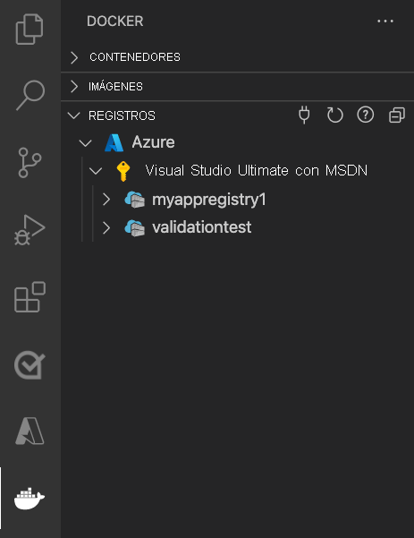
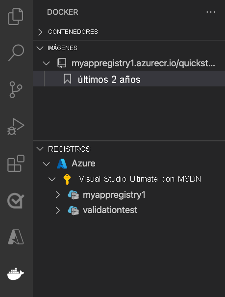
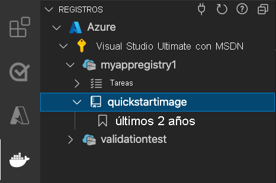

# <a name="run-a-custom-container-in-azure"></a>Ejecución de un contenedor personalizado en Azure

::: zone pivot="container-windows"
[Azure App Service](overview.md) proporciona las pilas de aplicaciones predefinidas en Windows, como ASP.NET o Node.js, que se ejecutan en IIS. Sin embargo, las pilas de aplicaciones preconfiguradas [bloquean el sistema operativo e impiden el acceso de bajo nivel](operating-system-functionality.md). Los contenedores de Windows personalizados no tienen estas restricciones y permiten a los desarrolladores personalizar completamente los contenedores y proporcionar a las aplicaciones contenedorizadas acceso total a la funcionalidad de Windows. 

En este inicio rápido se muestra cómo implementar una aplicación ASP.NET, que está en una imagen de Windows, en [Azure Container Registry](../container-registry/container-registry-intro.md) desde Visual Studio. La aplicación se ejecuta en un contenedor personalizado en Azure App Service.

## <a name="prerequisites"></a>Requisitos previos

Para realizar este tutorial:

- Instalar <a href="https://docs.docker.com/docker-for-windows/install/" target="_blank">Docker para Windows</a>.
- <a href="/virtualization/windowscontainers/quick-start/quick-start-windows-10" target="_blank">Cambiar Docker para ejecutar contenedores de Windows</a>.
- <a href="https://www.visualstudio.com/downloads/" target="_blank">Instale Visual Studio 2022</a> con las cargas de trabajo **ASP.NET y desarrollo web** y **desarrollo de Azure**. En *Visual Studio 2022 Community*, asegúrese de que el componente de **plantillas de proyecto y elemento de .NET Framework** está seleccionado con la **carga de trabajo de ASP.NET y desarrollo web**. Si ya ha instalado Visual Studio 2022:
    - Para instalar las actualizaciones más recientes de Visual Studio, seleccione **Ayuda** > **Buscar actualizaciones**.
    - Para agregar las cargas de trabajo en Visual Studio, seleccione **Herramientas** > **Obtener herramientas y características**.

## <a name="create-an-aspnet-web-app"></a>Creación de una aplicación web de ASP.NET

Cree una aplicación web ASP.NET siguiendo estos pasos:

1. Abra Visual Studio y seleccione **Crear un proyecto**.

1. En **Crear un proyecto**, busque y elija **Aplicación web ASP.NET Core (.NET Framework)** para C# y, a continuación, seleccione **Siguiente**.

   :::image type="content" source="./media/quickstart-custom-container/create-new-project.png?text=VS create a new project" alt-text="Creación de un nuevo proyecto":::

1. En **Configurar el nuevo proyecto**, en **Nombre de proyecto**, asigne el nombre de _myfirstazurewebapp_ a la aplicación. En **Marco**, seleccione **.NET Framework 4.8** y después **Crear**.

    :::image type="content" source="./media/quickstart-custom-container/configure-web-app-project-container.png?text=Configure your web app project" alt-text="Configuración del proyecto de aplicación web":::

1. Puede implementar cualquier tipo de aplicación web de ASP.NET en Azure. Para este inicio rápido, elija la plantilla **MVC**.

1. En **Autenticación**, seleccione **Ninguna**. En **Avanzadas**, seleccione **Compatibilidad con Docker** y desactive **Configurar para HTTPS**. Seleccione **Crear**.

     :::image type="content" source="./media/quickstart-custom-container/select-mvc-template-for-container.png?text=Create ASP.NET Web Application" alt-text="Creación de una aplicación web ASP.NET":::

1. Si el archivo _Dockerfile_ no se abre automáticamente, ábralo desde el **Explorador de soluciones**.

1. Necesita una [imagen principal compatible](configure-custom-container.md#supported-parent-images). Cambie la imagen primaria reemplazando la línea `FROM` con el código siguiente y guarde el archivo:

   ```dockerfile
   FROM mcr.microsoft.com/dotnet/framework/aspnet:4.8-windowsservercore-ltsc2019
   ```

1. En el menú de Visual Studio, seleccione **Depurar** > **Iniciar sin depurar** para ejecutar la aplicación web localmente.

    :::image type="content" source="./media/quickstart-custom-container/local-web-app.png?text=Run app locally" alt-text="Ejecución de la aplicación de forma local":::

## <a name="publish-to-azure-container-registry"></a>Publicación en Azure Container Registry

1. En **Explorador de soluciones**, haga clic con el botón derecho en el proyecto **myfirstazurewebapp** y seleccione **Publicar**.

1. En **Destino**, seleccione **Container Registry para Docker** y, espués, haga clic en **Siguiente**.

    :::image type="content" source="./media/quickstart-custom-container/select-docker-container-registry-visual-studio-2022.png?text=Select Docker Container Registry" alt-text="Selección de Container Registry para Docker":::

1. En **Destino específico**, seleccione **Azure Container Registry** y, después, haga clic en **Siguiente**.

    :::image type="content" source="./media/quickstart-custom-container/publish-to-azure-container-registry-visual-studio-2022.png?text=Publish to Azure Container Registry" alt-text="Publicar desde la página de información general del proyecto":::

1. En **Publicar**, asegúrese de que se ha seleccionado la suscripción correcta. En **Registros de contenedor**, seleccione el botón **+** para crear una nueva instancia de Azure Container Registry.

    :::image type="content" source="./media/quickstart-custom-container/create-new-azure-container-registry.png?text=Create new Azure Container Registry" alt-text="Creación de una instancia de Azure Container Registry":::

1. En **Crear nuevo**, asegúrese de que se ha elegido la suscripción correcta. En **Grupo de recursos**, seleccione **Nuevo** y escriba *myResourceGroup* como nombre y haga clic en **Aceptar**. En **SKU**, seleccione **Básico**. En **Ubicación del Registro**, seleccione una ubicación del Registro y, a continuación, haga clic en **Crear**.

    :::image type="content" source="./media/quickstart-custom-container/new-azure-container-registry-details.png?text=Azure Container Registry details" alt-text="Dealles de Azure Container Registry":::

1. En **Publicar**, en **Container Registry**, seleccione el registro que creó y, después, **Finalizar**.

    :::image type="content" source="./media/quickstart-custom-container/select-existing-azure-container-registry.png?text=Select existing Azure Container Registry" alt-text="Selección de una instancia existente de Azure Container Registry":::

   Espere a que la implementación se complete. La página **Publicar** muestra ahora el nombre del repositorio. Seleccione el *botón de copia* para copiar el **repositorio** para su uso posterior.

    :::image type="content" source="./media/quickstart-custom-container/published-docker-repository-visual-studio-2022.png?text=Screenshot that highlights the repository name." alt-text="Captura de pantalla en la que se resalta el nombre del repositorio.":::

## <a name="create-a-windows-container-app"></a>Creación de una aplicación de contenedor de Windows

1. Inicie sesión en [Azure Portal](https://portal.azure.com).

1. Elija **Crear un recurso** en la esquina superior izquierda de Azure Portal.

1. En **Servicios populares**, seleccione **Crear** en **Aplicación web**.

1. En **Crear aplicación web**, elija la suscripción y un **grupo de recursos**. Si es necesario, puede crear un grupo de recursos.

1. Proporcione un nombre de aplicación, como *win-container-demo*. Elija **Contenedor de Docker** para **Publicar** y **Windows** para **Sistema operativo**. Seleccione **Siguiente: Docker** para continuar.

   

1. En **Origen de imagen**, elija **Docker Hub** y en **Imagen y etiqueta**, escriba el nombre del repositorio que copió en [Publicar en Azure Container Registry](#publish-to-azure-container-registry).

   

    Si tiene una imagen personalizada de la aplicación web en otra parte como, por ejemplo, en [Azure Container Registry](../container-registry/index.yml) o en cualquier otro repositorio privado, puede configurarla aquí.

1. Seleccione **Revisar y crear** y, después, **Crear** y espere que Azure cree los recursos necesarios.

## <a name="browse-to-the-container-app"></a>Desplazamiento a la aplicación de contenedor

Una vez completada la operación de Azure, se muestra un cuadro de notificación.


1. Haga clic en **Ir al recurso**.

1. En la información general de este recurso, siga el vínculo situado junto a **URL**.

Se abre una nueva página del explorador en la página siguiente:


Espere unos minutos e inténtelo de nuevo, hasta que llegue a la página principal predeterminada de ASP.NET:


**¡Enhorabuena!** Ya está ejecutando el primer contenedor de Windows personalizado en Azure App Service.

## <a name="see-container-start-up-logs"></a>Consulta de los registros de inicio del contenedor

El contenedor de Windows puede tardar un tiempo en cargarse. Para ver el progreso, vaya a la siguiente dirección URL sustituyendo *\<app_name>* por el nombre de la aplicación.
```
https://<app_name>.scm.azurewebsites.net/api/logstream
```

Los registros transmitidos tienen este aspecto:

```
2018-07-27T12:03:11  Welcome, you are now connected to log-streaming service.
27/07/2018 12:04:10.978 INFO - Site: win-container-demo - Start container succeeded. Container: facbf6cb214de86e58557a6d073396f640bbe2fdec88f8368695c8d1331fc94b
27/07/2018 12:04:16.767 INFO - Site: win-container-demo - Container start complete
27/07/2018 12:05:05.017 INFO - Site: win-container-demo - Container start complete
27/07/2018 12:05:05.020 INFO - Site: win-container-demo - Container started successfully
```

## <a name="update-locally-and-redeploy"></a>Actualización local y nueva implementación

1. En Visual Studio, en el **Explorador de soluciones**, abra **Vistas** > **Inicio** > **Index.cshtml**.

1. Busque la etiqueta HTML `<div class="jumbotron">` en la parte superior y reemplace el elemento entero por el código siguiente:

   ```html
   <div class="jumbotron">
       <h1>ASP.NET in Azure!</h1>
       <p class="lead">This is a simple app that we've built that demonstrates how to deploy a .NET app to Azure App Service.</p>
   </div>
   ```

1. Para volver a realizar la implementación en Azure, haga clic con el botón derecho en el proyecto **myfirstazurewebapp**, en el **Explorador de soluciones** y elija **Publicar**.

1. En la página de publicación, seleccione **Publicar** y espere hasta que la publicación se complete.

1. Para indicar a App Service que extraiga la nueva imagen de Docker Hub, reinicie la aplicación. Volviendo a la página de aplicación en el portal, haga clic en **Reiniciar** > **Sí**.

   

Vuelva a [desplazarse a la aplicación de contenedor](#browse-to-the-container-app). Al actualizar la página web, la aplicación debe volver a la página "Iniciando" al principio y luego volver a mostrar la página web actualizada transcurridos unos minutos.


## <a name="next-steps"></a>Pasos siguientes

> [!div class="nextstepaction"]
> [Migrar al contenedor de Windows en Azure](tutorial-custom-container.md)

O bien, eche un vistazo a otros recursos:

> [!div class="nextstepaction"]
> [Configuración de un contenedor personalizado](configure-custom-container.md)

::: zone-end  

::: zone pivot="container-linux"
App Service en Linux proporciona pilas de aplicaciones predefinidas en Linux con compatibilidad con lenguajes como .NET, PHP o Node.js entre otros. También puede usar una imagen personalizada de Docker para ejecutar la aplicación web en una pila de aplicaciones aún sin definir en Azure. En este inicio rápido se muestra cómo implementar una imagen desde [Azure Container Registry](../container-registry/index.yml) (ACR) en App Service.

## <a name="prerequisites"></a>Requisitos previos

* Una [cuenta de Azure](https://azure.microsoft.com/free/?utm_source=campaign&utm_campaign=vscode-tutorial-docker-extension&mktingSource=vscode-tutorial-docker-extension)
* [Docker](https://www.docker.com/community-edition)
* [Visual Studio Code](https://code.visualstudio.com/)
* La [extensión de Azure App Service para VS Code](https://marketplace.visualstudio.com/items?itemName=ms-azuretools.vscode-azureappservice). Puede usar esta extensión para crear, administrar e implementar Web Apps de Linux en la Plataforma como servicio (PaaS) de Azure.
* La [extensión de Docker para VS Code](https://marketplace.visualstudio.com/items?itemName=ms-azuretools.vscode-docker). Puede usar esta extensión para simplificar la administración de imágenes y comandos locales de Docker e implementar imágenes de aplicaciones compiladas en Azure.

## <a name="create-a-container-registry"></a>Creación de un registro de contenedor

En este inicio rápido, se usa Azure Container Registry como registro de su elección. Puede usar otros registros, pero los pasos pueden diferir ligeramente.

Cree un registro de contenedor según las instrucciones que se indican en [Inicio rápido: Creación de un instancia de Azure Container Registry mediante Azure Portal](../container-registry/container-registry-get-started-portal.md).

> [!IMPORTANT]
> Asegúrese de establecer la opción **Usuario administrador** en **Habilitar** al crear el registro de contenedor de Azure. También puede establecerla en la sección **Claves de acceso** de la página de registro en Azure Portal. Esta opción de configuración es necesaria para el acceso a App Service. Para obtener información sobre la identidad administrada, consulte [Implementación desde el tutorial de ACR](tutorial-custom-container.md?pivots=container-linux#configure-app-service-to-deploy-the-image-from-the-registry).

## <a name="sign-in"></a>Iniciar sesión

1. Inicie Visual Studio Code. 
1. Seleccione el logotipo de **Azure** en la [barra de actividades](https://code.visualstudio.com/docs/getstarted/userinterface), vaya al explorador **APP SERVICE**, después, seleccione **Iniciar sesión en Azure** y siga las instrucciones.

    

1. En la [barra de estado](https://code.visualstudio.com/docs/getstarted/userinterface) de la parte inferior, compruebe la dirección de correo electrónico de la cuenta de Azure. Se debe mostrar la suscripción en el explorador **APP SERVICE**.

1. En la barra de actividades, seleccione el logotipo de **Docker**. En el explorador **REGISTROS**, compruebe que aparece el registro de contenedor que ha creado.

    

## <a name="check-prerequisites"></a>Comprobación de los requisitos previos

Compruebe que tiene Docker instalado y en ejecución. El siguiente comando mostrará la versión de Docker si se está ejecutando.

```bash
docker --version
```

## <a name="create-and-build-image"></a>Creación y compilación de una imagen

1. En Visual Studio Code, abra una carpeta vacía y agregue un archivo llamado `Dockerfile`. En el archivo Dockerfile, pegue el contenido en función del marco de lenguaje deseado:

# <a name="net"></a>[.NET](#tab/dotnet)

<!-- https://mcr.microsoft.com/v2/appsvc%2Fdotnetcore/tags/list -->
```dockerfile
FROM mcr.microsoft.com/appsvc/dotnetcore:lts

ENV PORT 8080
EXPOSE 8080

ENV ASPNETCORE_URLS "http://*:${PORT}"

ENTRYPOINT ["dotnet", "/defaulthome/hostingstart/hostingstart.dll"]
```

En este archivo Dockerfile, la imagen primaria es uno de los contenedores de .NET integrados de App Service. Puede encontrar los archivos de código fuente [en el repositorio de GitHub Azure-App-Service/ImageBuilder, en GenerateDockerFiles/dotnetcore](https://github.com/Azure-App-Service/ImageBuilder/tree/master/GenerateDockerFiles/dotnetcore). Su archivo [Dockerfile](https://github.com/Azure-App-Service/ImageBuilder/blob/master/GenerateDockerFiles/dotnetcore/debian-9/Dockerfile) copia una aplicación sencilla de .NET en `/defaulthome/hostingstart`. El archivo Dockerfile simplemente inicia esa aplicación.

# <a name="nodejs"></a>[Node.js](#tab/node)

<!-- https://mcr.microsoft.com/v2/appsvc%2Fnode/tags/list -->
```dockerfile
FROM mcr.microsoft.com/appsvc/node:10-lts

ENV HOST 0.0.0.0
ENV PORT 8080
EXPOSE 8080

ENTRYPOINT ["pm2", "start", "--no-daemon", "/opt/startup/default-static-site.js"]
```

En este archivo Dockerfile, la imagen primaria es uno de los contenedores de Node.js integrados de App Service. Puede encontrar los archivos de código fuente [en el repositorio de GitHub Azure-App-Service/ImageBuilder, en GenerateDockerFiles/node/node-template](https://github.com/Azure-App-Service/ImageBuilder/tree/master/GenerateDockerFiles/node/node-template). Su archivo [Dockerfile](https://github.com/Azure-App-Service/ImageBuilder/blob/master/GenerateDockerFiles/node/node-template/Dockerfile) copia una aplicación sencilla de Node.js en `/opt/startup`. El archivo Dockerfile simplemente inicia esa aplicación mediante PM2, que ya está instalado por la imagen primaria.

# <a name="python"></a>[Python](#tab/python)

<!-- https://mcr.microsoft.com/v2/appsvc%2Fpython/tags/list -->
```dockerfile
FROM mcr.microsoft.com/appsvc/python:latest

ENV PORT 8080
EXPOSE 8080

ENTRYPOINT ["gunicorn", "--timeout", "600", "--access-logfile", "'-'", "--error-logfile", "'-'", "--chdir=/opt/defaultsite", "application:app"]
```

En este archivo Dockerfile, la imagen primaria es uno de los contenedores de Python integrados de App Service. Puede encontrar los archivos de código fuente [en el repositorio de GitHub Azure-App-Service/ImageBuilder, en GenerateDockerFiles/python/template-3.9](https://github.com/Azure-App-Service/ImageBuilder/tree/master/GenerateDockerFiles/python/template-3.9). Su archivo [Dockerfile](https://github.com/Azure-App-Service/ImageBuilder/blob/master/GenerateDockerFiles/python/template-3.9/Dockerfile) copia una aplicación sencilla de Python en `/opt/defaultsite`. El archivo Dockerfile simplemente inicia esa aplicación mediante Gunicorn, que ya está instalado por la imagen primaria.

# <a name="java"></a>[Java](#tab/java)

<!-- https://mcr.microsoft.com/v2/azure-app-service%2Fjava/tags/list -->
```dockerfile
FROM mcr.microsoft.com/azure-app-service/java:11-java11_stable

ENV PORT 80
EXPOSE 80

ENTRYPOINT ["java", "-Dserver.port=80", "-jar", "/tmp/appservice/parkingpage.jar"]
```

En este archivo Dockerfile, la imagen primaria es uno de los contenedores de Java integrados de App Service. Puede encontrar los archivos de código fuente [en el repositorio de GitHub Azure-App-Service/java, en java/tree/dev/java11-alpine](https://github.com/Azure-App-Service/java/tree/dev/java11-alpine). Su archivo [Dockerfile](https://github.com/Azure-App-Service/java/blob/dev/java11-alpine/Dockerfile) copia una aplicación sencilla de Java en `/tmp/appservice`. El archivo Dockerfile simplemente inicia esa aplicación.

-----

2. [Abra la paleta de comandos](https://code.visualstudio.com/docs/getstarted/userinterface#_command-palette) y escriba **Docker Images: Build Image** (Imágenes de Docker: compilar imagen). Pulse **Entrar** para ejecutar el comando.

3. En el cuadro de etiqueta de imagen, especifique la etiqueta que desee en el formato siguiente: `<acr-name>.azurecr.io/<image-name>/<tag>`, donde `<acr-name>` es el nombre del registro de contenedor que ha creado. Presione **ENTRAR**.

4. Cuando la imagen termine de compilarse, haga clic en **Actualizar** en la parte superior del explorador **IMÁGENES** y compruebe que la imagen se ha compilado correctamente.

    

## <a name="deploy-to-container-registry"></a>Implementación en el registro de contenedor

1. En la barra de actividades, haga clic en el icono de **Docker**. En el explorador **IMÁGENES**, busque la imagen que acaba de compilar.
1. Expanda la imagen, haga clic con el botón derecho en la etiqueta que desee y haga clic en **Insertar**.
1. Asegúrese de que la etiqueta de imagen comienza por `<acr-name>.azurecr.io` y pulse **Entrar**.
1. Cuando Visual Studio Code finalice la inserción de la imagen en el registro de contenedor, haga clic en **Actualizar** en la parte superior del explorador **REGISTROS** y compruebe que la imagen se ha insertado correctamente.

    

## <a name="deploy-to-app-service"></a>Implementación en App Service

1. En el explorador **REGISTROS**, expanda la imagen, haga clic con el botón derecho en la etiqueta y haga clic en **Deploy image to Azure App Service** (Implementar imagen en Azure App Service).
1. Siga las indicaciones para elegir una suscripción, un nombre de aplicación globalmente único, un grupo de recursos y un plan de App Service. Elija **B1 Básico** como plan de tarifa y una región cercana.

Después de la implementación, la aplicación está disponible en `http://<app-name>.azurewebsites.net`.

Un **grupo de recursos** es una colección con nombre de todos los recursos de la aplicación en Azure. Por ejemplo, un grupo de recursos puede contener una referencia a un sitio web, una base de datos y una función de Azure.

Un **plan de App Service** define los recursos físicos que se van a usar para hospedar el sitio web. Este inicio rápido usa un plan de hospedaje **básico** en la infraestructura de **Linux**, lo que significa que el sitio se hospedará en una máquina Linux junto con otros sitios web. Si empieza con el plan **básico**, puede usar Azure Portal para escalar verticalmente de modo que el suyo sea el único sitio que se ejecute en una máquina. Para conocer los precios, consulte [Precios de App Service](https://azure.microsoft.com/pricing/details/app-service/linux).

## <a name="browse-the-website"></a>Examinar el sitio web

El panel **Salida** muestra el estado de las operaciones de implementación. Cuando finalice la operación, haga clic en **Abrir sitio** en la notificación emergente para abrir el sitio en el explorador.

> [!div class="nextstepaction"]
> [He tenido un problema](https://www.research.net/r/PWZWZ52?tutorial=quickstart-docker&step=deploy-app)

## <a name="next-steps"></a>Pasos siguientes

Ha completado correctamente este inicio rápido.

La aplicación de App Service extrae del registro de contenedor cada vez que se inicia. Si recompila la imagen, solo tiene que insertarla en el registro de contenedor y la aplicación extrae la imagen actualizada cuando se reinicia. Para indicar a la aplicación que extraiga la imagen actualizada inmediatamente, reiníciela.

> [!div class="nextstepaction"]
> [Configuración de un contenedor personalizado](configure-custom-container.md)

> [!div class="nextstepaction"]
> [Migración de software personalizado a Azure App Service mediante un contenedor personalizado](tutorial-custom-container.md)

> [!div class="nextstepaction"]
> [Tutorial: Creación de una aplicación de varios contenedores (versión preliminar) en Web App for Containers](tutorial-multi-container-app.md)

Otras extensiones de Azure:

* [Cosmos DB](https://marketplace.visualstudio.com/items?itemName=ms-azuretools.vscode-cosmosdb)
* [Funciones de Azure](https://marketplace.visualstudio.com/items?itemName=ms-azuretools.vscode-azurefunctions)
* [Herramientas de la CLI de Azure](https://marketplace.visualstudio.com/items?itemName=ms-vscode.azurecli)
* [Herramientas de Azure Resource Manager](https://marketplace.visualstudio.com/items?itemName=msazurermtools.azurerm-vscode-tools)
* El paquete de extensiones [Azure Tools](https://marketplace.visualstudio.com/items?itemName=ms-vscode.vscode-node-azure-pack) incluye todas las extensiones anteriores.

::: zone-end
