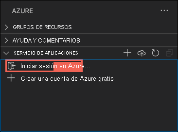
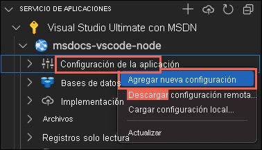

# <a name="create-a-nodejs-web-app-in-azure"></a>Creación de una aplicación web de Node.js en Azure

En este inicio rápido, aprenderá a crear e implementar su primera aplicación web de Node.js ([Express](https://www.expressjs.com)) en [Azure App Service](overview.md). App Service admite varias versiones de Node.js en Linux y Windows. 

En este inicio rápido se configura una aplicación de App Service en el nivel **Gratis** y no supone ningún costo para la suscripción de Azure.

## <a name="set-up-your-initial-environment"></a>Configuración del entorno inicial

:::zone target="docs" pivot="development-environment-vscode"

- Disponga de una cuenta de Azure con una suscripción activa. [Cree una cuenta gratuita](https://azure.microsoft.com/free/?utm_source=campaign&utm_campaign=vscode-tutorial-app-service-extension&mktingSource=vscode-tutorial-app-service-extension).
- Instale [Node.js y npm](https://nodejs.org). Ejecute el comando `node --version` para comprobar que Node.js está instalado.
- Instale [Visual Studio Code](https://code.visualstudio.com/).
- La [extensión Azure App Service](https://marketplace.visualstudio.com/items?itemName=ms-azuretools.vscode-azureappservice) para Visual Studio Code.
 <!-- - <a href="https://git-scm.com/" target="_blank">Install Git</a> -->

::: zone-end

:::zone target="docs" pivot="development-environment-cli"

- Disponga de una cuenta de Azure con una suscripción activa. [Cree una cuenta gratuita](https://azure.microsoft.com/free/?utm_source=campaign&utm_campaign=vscode-tutorial-app-service-extension&mktingSource=vscode-tutorial-app-service-extension).
- Instale [Node.js y npm](https://nodejs.org). Ejecute el comando `node --version` para comprobar que Node.js está instalado.
- Instale la <a href="/cli/azure/install-azure-cli" target="_blank">CLI de Azure</a>, con la que se ejecutan comandos en cualquier shell para aprovisionar y configurar los recursos de Azure.

::: zone-end


:::zone target="docs" pivot="development-environment-azure-portal"

- Disponga de una cuenta de Azure con una suscripción activa. [Cree una cuenta gratuita](https://azure.microsoft.com/free/?utm_source=campaign&utm_campaign=vscode-tutorial-app-service-extension&mktingSource=vscode-tutorial-app-service-extension).
- Instale [Node.js y npm](https://nodejs.org). Ejecute el comando `node --version` para comprobar que Node.js está instalado.
- Use un cliente FTP (por ejemplo, [FileZilla](https://filezilla-project.org)) para conectarse a la aplicación.

::: zone-end
## <a name="create-your-nodejs-application"></a>Creación de una aplicación de Node.js

En este paso, creará una aplicación de inicio de Node.js y se asegurará de que se ejecute en el equipo.

> [!TIP]
> Si ya ha completado el [tutorial de Node.js](https://code.visualstudio.com/docs/nodejs/nodejs-tutorial), puede ir directamente al paso [Implementación en Azure](#deploy-to-azure).

1. Cree una aplicación de Node.js con [Express Generator](https://expressjs.com/starter/generator.html), que se instala de forma predeterminada con Node.js y NPM.

    ```bash
    npx express-generator myExpressApp --view pug
    ```

1. Cambie al directorio de la aplicación e instale los paquetes NPM.

    ```bash
    cd myExpressApp
    npm install
    ```

1. Inicie el servidor de desarrollo.

    ```bash
    npm start
    ```

1. En un navegador, vaya a `http://localhost:3000`. Deberíamos ver algo parecido a lo siguiente:

    

:::zone target="docs" pivot="development-environment-vscode"
> [!div class="nextstepaction"]
> [He tenido un problema](https://www.research.net/r/PWZWZ52?tutorial=node-deployment-azure-app-service&step=create-app)
::: zone-end

## <a name="deploy-to-azure"></a>Implementar en Azure

Antes de continuar, asegúrese de haber instalado y configurado todos los requisitos previos.

> [!NOTE]
> Para que la aplicación de Node.js se ejecute en Azure, debe escuchar en el puerto proporcionado por la variable de entorno `PORT`. En la aplicación Express generada, esta variable de entorno ya se usa en el script de inicio *bin/www* (busque `process.env.PORT`).
>

:::zone target="docs" pivot="development-environment-vscode"

#### <a name="sign-in-to-azure"></a>Inicio de sesión en Azure

1. En el terminal, asegúrese de que se encuentra en la carpeta *myExpressApp* y, a continuación, inicie Visual Studio Code con el siguiente comando:

    ```bash
    code .
    ```

1. En Visual Studio Code, en la [barra de actividades](https://code.visualstudio.com/docs/getstarted/userinterface), seleccione el logotipo de **Azure**.

1. En el explorador de **App Service**, seleccione **Iniciar sesión en Azure...** y siga las instrucciones.

    En Visual Studio Code, verá su dirección de correo electrónico de Azure en la barra de estado, y la suscripción en el explorador de **AZURE APP SERVICE**.

    

> [!div class="nextstepaction"]
> [He tenido un problema](https://www.research.net/r/PWZWZ52?tutorial=node-deployment-azure-app-service&step=getting-started)

#### <a name="configure-the-app-service-app-and-deploy-code"></a>Configuración de la aplicación de App Service e implementación de código

1. En el explorador de **App Service**, seleccione el icono **Implementar en aplicación web**.

    :::image type="content" source="media/quickstart-nodejs/deploy.png" alt-text="Captura de pantalla de Azure App Service en Visual Studio Code que muestra el icono de flecha azul seleccionado.":::
        
1. Elija la carpeta *myExpressApp*.

# <a name="deploy-to-linux"></a>[Implementar en Linux](#tab/linux)

3. Seleccione la opción **Crear Web App**. De forma predeterminada, se usa un contenedor de Linux.
1. Escriba un nombre único global para la aplicación web y presione **Intro**. El nombre debe ser único en todo Azure y usar solo caracteres alfanuméricos ("A-Z", "a-z" y "0-9") y guiones ("-").
1. En Seleccione una pila del entorno en tiempo de ejecución, seleccione la versión de Node.js que desee. Se recomienda una versión **LTS**.
1. En Seleccione un plan de tarifa, seleccione **Gratis (F1)** y espere a que los recursos se aprovisionen en Azure.
1. En el elemento emergente **Implementar siempre en el área de trabajo "myExpressApp" en \<app-name>"** , seleccione **Sí**. De este modo, siempre que se encuentre en la misma área de trabajo, Visual Studio Code se implementará en la misma aplicación de App Service todas las veces.

    Mientras Visual Studio Code aprovisiona los recursos de Azure e implementa el código, muestra las [notificaciones de progreso](https://code.visualstudio.com/api/references/extension-guidelines#notifications).

1. Cuando finalice la implementación, seleccione **Examinar sitio web** en el elemento emergente de notificación. El explorador debe mostrar la página predeterminada de Express.

# <a name="deploy-to-windows"></a>[Implementación en Windows](#tab/windows)

3. Elija **Create new Web App...Advanced** (Crear aplicación web...avanzada).
1. Escriba un nombre único global para la aplicación web y presione **Intro**. El nombre debe ser único en todo Azure y usar solo caracteres alfanuméricos ("A-Z", "a-z" y "0-9") y guiones ("-").
1. Seleccione **Crear un nuevo grupo de recursos** y escriba un nombre para este, como *AppServiceQS-rg*.
1. Seleccione la versión de Node.js que desee. Se recomienda una versión **LTS**.
1. Seleccione **Windows** como sistema operativo.
1. Seleccione la ubicación desde la que quiere proporcionar la aplicación. Por ejemplo, *Oeste de Europa*.
1. Seleccione **Create new App Service plan** (Crear nuevo plan de App Service) y, a continuación, escriba un nombre para el plan (por ejemplo, *AppServiceQS-plan*); después, seleccione **F1 Free** (F1 gratis) como plan de tarifa.
1. En **Select an Application Insights resource for your app**(Seleccionar un recurso de Application Insights para la aplicación), seleccione **Skip for now** (Omitir por ahora) y espere a que los recursos se aprovisionen en Azure.
1. En el elemento emergente **Implementar siempre en el área de trabajo "myExpressApp" en \<app-name>"** , seleccione **Sí**. De este modo, siempre que se encuentre en la misma área de trabajo, Visual Studio Code se implementará en la misma aplicación de App Service todas las veces.

    Mientras Visual Studio Code aprovisiona los recursos de Azure e implementa el código, muestra las [notificaciones de progreso](https://code.visualstudio.com/api/references/extension-guidelines#notifications).

    > [!NOTE]
    > Cuando se completa la implementación, la aplicación de Azure aún no se ejecuta porque la raíz del proyecto no tiene un archivo *web.config*. Siga los pasos restantes para generarlo automáticamente. Para más información, consulte [No tiene permiso para ver este directorio o esta página](configure-language-nodejs.md#you-do-not-have-permission-to-view-this-directory-or-page).

1. En el explorador de **App Service** en Visual Studio Code, expanda el nodo de la nueva aplicación, haga clic con el botón derecho en **Configuración de la aplicación** y seleccione **Agregar nueva configuración**:

    

1. Escriba `SCM_DO_BUILD_DURING_DEPLOYMENT` como clave de configuración.
1. Escriba `true` como valor de configuración.

    Esta configuración de la aplicación permite la automatización de compilaciones en el momento de la implementación, la cual detecta automáticamente el script de inicio y genera el archivo *web.config* con él.

1. En el explorador de **App Service**, vuelva a seleccionar el icono **Implementar en aplicación web** y para confirmar, haga clic en **Implementar** de nuevo.
1. Espere a que finalice la implementación y, a continuación, seleccione **Examinar sitio web** en el elemento emergente de notificación. El explorador debe mostrar la página predeterminada de Express.

-----

> [!div class="nextstepaction"]
> [He tenido un problema](https://www.research.net/r/PWZWZ52?tutorial=node-deployment-azure-app-service&step=deploy-app)

::: zone-end

:::zone target="docs" pivot="development-environment-cli"

En el terminal, asegúrese de que está en el directorio *myExpressApp* e implemente el código en la carpeta local (*myExpressApp*) mediante el comando `az webapp up`:

# <a name="deploy-to-linux"></a>[Implementar en Linux](#tab/linux)

```azurecli
az webapp up --sku F1 --name <app-name>
```

# <a name="deploy-to-windows"></a>[Implementación en Windows](#tab/windows)

```azurecli
az webapp up --sku F1 --name <app-name> --os-type Windows
```

-----

- Si no se reconoce el comando `az`, asegúrese de que tiene instalada la CLI de Azure tal y como se describe en [Configuración del entorno inicial](#set-up-your-initial-environment).
- Reemplace `<app_name>` por un nombre que sea único en todo Azure (*los caracteres válidos son `a-z`, `0-9` y `-`* ). Un buen patrón es usar una combinación del nombre de la empresa y un identificador de la aplicación.
- El argumento `--sku F1` crea la aplicación web en el plan de tarifa Gratis, en el cual no se incurre en ningún costo.
- Opcionalmente, incluya el argumento `--location <location-name>`, donde `<location_name>` es una región de Azure disponible. Puede recuperar una lista de las regiones permitidas para su cuenta de Azure mediante la ejecución del comando [`az account list-locations`](/cli/azure/appservice#az_appservice_list_locations).
- El comando crea una aplicación Linux para Node.js de forma predeterminada. Para crear una aplicación Windows, use el argumento `--os-type`. 
- Si ve el error "No se pudo detectar automáticamente la pila en tiempo de ejecución de la aplicación", asegúrese de que está ejecutando el comando en el directorio *myExpressApp* (consulte [Solución de problemas de detección automática con az webapp up](https://github.com/Azure/app-service-linux-docs/blob/master/AzWebAppUP/runtime_detection.md)).

El comando puede tardar varios minutos en completarse. Mientras se ejecuta, proporciona mensajes sobre la creación del grupo de recursos, el plan de App Service y el recurso de la aplicación, la configuración del registro y la implementación del archivo ZIP. A continuación, se muestra el mensaje "Puede iniciar la aplicación en http://&lt;nombre_de_la_aplicación&gt;.azurewebsites.net", que es la dirección URL de la aplicación en Azure.

<pre>
The webapp '&lt;app-name>' doesn't exist
Creating Resource group '&lt;group-name>' ...
Resource group creation complete
Creating AppServicePlan '&lt;app-service-plan-name>' ...
Creating webapp '&lt;app-name>' ...
Configuring default logging for the app, if not already enabled
Creating zip with contents of dir /home/cephas/myExpressApp ...
Getting scm site credentials for zip deployment
Starting zip deployment. This operation can take a while to complete ...
Deployment endpoint responded with status code 202
You can launch the app at http://&lt;app-name>.azurewebsites.net
{
  "URL": "http://&lt;app-name>.azurewebsites.net",
  "appserviceplan": "&lt;app-service-plan-name>",
  "location": "centralus",
  "name": "&lt;app-name>",
  "os": "&lt;os-type>",
  "resourcegroup": "&lt;group-name>",
  "runtime_version": "node|10.14",
  "runtime_version_detected": "0.0",
  "sku": "FREE",
  "src_path": "//home//cephas//myExpressApp"
}
</pre>

[!include [az webapp up command note](../../includes/app-service-web-az-webapp-up-note.md)]

::: zone-end

:::zone target="docs" pivot="development-environment-azure-portal"
### <a name="sign-in-to-azure-portal"></a>Inicio de sesión en Azure Portal

Inicie sesión en Azure Portal en https://portal.azure.com.

### <a name="create-azure-resources"></a>Creación de recursos de Azure

1. Escriba **app services** en la búsqueda. En **Servicios**, seleccione **App Services**.

     :::image type="content" source="./media/quickstart-nodejs/portal-search.png?text=Azure portal search details" alt-text="Captura de pantalla de la búsqueda en el portal":::

1. En la página **App Services**, seleccione **Crear**.
1. En la pestaña **Aspectos básicos**, en **Detalles del proyecto**, asegúrese de que esté seleccionada la suscripción correcta y luego elija **Crear nuevo** grupo de recursos. Escriba *myResourceGroup* para el nombre.

    :::image type="content" source="./media/quickstart-nodejs/project-details.png" alt-text="Captura de pantalla de la sección Detalles del proyecto en la que se muestra dónde se selecciona la suscripción de Azure y el grupo de recursos de la aplicación web.":::

1. En **Detalles de la instancia**, escriba un nombre único global para la aplicación web y seleccione **Código**. Elija *Pila del entorno en tiempo de ejecución* **Node 14 LTS**, un **sistema operativo** y una **región** desde la que quiera atender la aplicación.

    :::image type="content" source="./media/quickstart-nodejs/instance-details.png" alt-text="Captura de pantalla de la sección Detalles de la instancia, en la que se proporciona un nombre para la máquina virtual y se selecciona su región, imagen y tamaño":::

1. En **Plan de servicio de aplicaciones**, elija **Crear nuevo** plan de App Service. Escriba *myAppServicePlan* como nombre. Para cambiar al nivel Gratis, haga clic en **Cambiar tamaño**, elija la pestaña **Desarrollo y pruebas**, seleccione **F1** y seleccione el botón **Aplicar** situado en la parte inferior de la página.

    :::image type="content" source="./media/quickstart-nodejs/app-service-plan-details.png" alt-text="Captura de pantalla de la sección Cuenta de administrador, en la que se especifican el nombre de usuario y la contraseña del administrador":::

1. Seleccione el botón **Revisar y crear** de la parte inferior de la página.

    :::image type="content" source="./media/quickstart-nodejs/review-create.png" alt-text="Captura de pantalla en que se muestra el botón Revisar y crear de la parte inferior de la página":::

1. Después de que se ejecute la validación, seleccione el botón **Crear** en la parte inferior de la página.

1. Una vez finalizada la implementación, seleccione **Ir al recurso**.

    :::image type="content" source="./media/quickstart-nodejs/next-steps.png" alt-text="Captura de pantalla que muestra el siguiente paso de ir al recurso":::

### <a name="get-ftp-credentials"></a>Obtención de credenciales de FTP

Azure App Service admite [**dos tipos de credenciales**](deploy-configure-credentials.md) para la implementación de FTP/S. Estas credenciales no son las mismas que las de su suscripción a Azure. En esta sección, obtendrá las *credenciales del ámbito de la aplicación* que se usarán con FileZilla.

1. En la página de la aplicación App Service, haga clic en **Centro de implementación** en el menú de la izquierda y seleccione la pestaña **Credenciales de FTPS**.

    :::image type="content" source="./media/quickstart-nodejs/ftps-deployment-credentials.png" alt-text="Credenciales de implementación de FTPS":::

1. Abra **FileZilla** y cree un nuevo sitio.

1. En la pestaña **Credenciales de FTPS**, copie el **punto de conexión de FTPS**, el **nombre de usuario** y la **contraseña** en FileZilla.

    :::image type="content" source="./media/quickstart-nodejs/filezilla-ftps-connection.png" alt-text="Detalles de la conexión FTPS":::

1. Haga clic en **Conectar** en FileZilla.
 
### <a name="deploy-files-with-ftp"></a>Implementación de archivos con FTP

1. Copie todos los archivos y archivos de directorio en el [directorio **/site/wwwroot**](https://github.com/projectkudu/kudu/wiki/File-structure-on-azure) de Azure.
    
    :::image type="content" source="./media/quickstart-nodejs/filezilla-deploy-files.png" alt-text="Archivos de implementación de FileZilla":::

1. Vaya a la dirección URL de la aplicación para comprobar que la aplicación se está ejecutando correctamente.

::: zone-end
## <a name="redeploy-updates"></a>Reimplementación de actualizaciones

Para implementar cambios en esta aplicación, realice modificaciones en Visual Studio Code, guarde los archivos y, a continuación, vuelva a implementar en la aplicación de Azure. Por ejemplo:

1. En el proyecto de ejemplo, abra *views/index.pug* y cambie

    ```PUG
    p Welcome to #{title}
    ```

    to
    
    ```PUG
    p Welcome to Azure!
    ```

:::zone target="docs" pivot="development-environment-vscode"

2. En el explorador de **App Service**, vuelva a seleccionar el icono **Implementar en aplicación web** y para confirmar, haga clic en **Implementar** de nuevo.

1. Espere a que finalice la implementación y, a continuación, seleccione **Examinar sitio web** en el elemento emergente de notificación. Debería ver que el mensaje `Welcome to Express` se ha cambiado a `Welcome to Azure!`.

::: zone-end

:::zone target="docs" pivot="development-environment-cli"

2. Guarde los cambios y vuelva a implementar la aplicación con el comando `az webapp up` sin argumentos:

    ```azurecli
    az webapp up
    ```
    
    Este comando utiliza valores que se almacenan en caché de forma local en el archivo *.azure/config*, como el nombre de la aplicación, el grupo de recursos y el plan de App Service.
    
1. Una vez terminada la implementación, actualice la página web `http://<app-name>.azurewebsites.net`. Debería ver que el mensaje `Welcome to Express` se ha cambiado a `Welcome to Azure!`.

::: zone-end

:::zone target="docs" pivot="development-environment-azure-portal"

2. Guarde los cambios y vuelva a implementar la aplicación con el cliente FTP.
    
1. Una vez terminada la implementación, actualice la página web `http://<app-name>.azurewebsites.net`. Debería ver que el mensaje `Welcome to Express` se ha cambiado a `Welcome to Azure!`.

::: zone-end

## <a name="stream-logs"></a>Transmitir registros

:::zone target="docs" pivot="development-environment-vscode"

Puede transmitir la salida del registro (llamadas a `console.log()`) desde la aplicación de Azure directamente en la ventana de salida de Visual Studio Code.

1. En el explorador de **App Service**, haga clic con el botón derecho en el nodo de la aplicación y elija **Start Streaming Logs** (Iniciar transmisión de registros).

    

1. Si se le pide que reinicie la aplicación, haga clic en **Sí**. Después de reiniciar la aplicación, se abrirá la ventana de salida de Visual Studio Code con una conexión a la transmisión de registros.

1. Después de unos segundos, la ventana de salida muestra un mensaje donde se indica que está conectado al servicio de transmisión de registros. Puede generar más actividad de salida actualizando la página en el explorador.

    <pre>
    Connecting to log stream...
    2020-03-04T19:29:44  Welcome, you are now connected to log-streaming service. The default timeout is 2 hours.
    Change the timeout with the App Setting SCM_LOGSTREAM_TIMEOUT (in seconds).
    </pre>

> [!div class="nextstepaction"]
> [He tenido un problema](https://www.research.net/r/PWZWZ52?tutorial=node-deployment-azure-app-service&step=tailing-logs)

::: zone-end

:::zone target="docs" pivot="development-environment-cli"

Puede acceder a los registros de consola generados desde dentro de la aplicación y del contenedor en que esta se ejecuta. Los registros incluyen cualquier salida generada por las llamadas a `console.log()`.

Para transmitir registros, ejecute el comando [az webapp log tail](/cli/azure/webapp/log#az_webapp_log_tail):

```azurecli
az webapp log tail
```

Este comando usa el nombre del grupo de recursos almacenado en la memoria caché del archivo *.azure/config*.

También puede incluir el parámetro `--logs` con el comando `az webapp up` para abrir automáticamente la secuencia de registro en la implementación.

Actualice la aplicación en el explorador para que se generen registros de la consola, que incluyen mensajes que describen las solicitudes HTTP a la aplicación. Si no aparece la salida inmediatamente, inténtelo de nuevo en 30 segundos.

Para detener el streaming de registros en cualquier momento, presione **Ctrl**+**C** en el terminal.

::: zone-end

:::zone target="docs" pivot="development-environment-azure-portal"

Puede acceder a los registros de consola generados desde dentro de la aplicación y del contenedor en que esta se ejecuta. Puede transmitir la salida del registro (llamadas a `console.log()`) desde la aplicación Node.js directamente en Azure Portal.

1. En la misma página **App Service** de la aplicación, use el menú izquierdo para desplazarse a la sección *Supervisión* y haga clic en **Secuencia de registro**.

    :::image type="content" source="./media/quickstart-nodejs/log-stream.png" alt-text="Captura de pantalla de la secuencia de registro en Azure App Service.":::

1. Después de unos segundos, la ventana de salida muestra un mensaje donde se indica que está conectado al servicio de transmisión de registros. Puede generar más actividad de salida actualizando la página en el explorador.

    <pre>
    Connecting...
    2021-10-26T21:04:14  Welcome, you are now connected to log-streaming service.
    Starting Log Tail -n 10 of existing logs ----
    /appsvctmp/volatile/logs/runtime/81b1b83b27ea1c3d598a1cdec28c71c4074ce66c735d0be57f15a8d07cb3178e.log
    2021-10-26T21:04:08.614384810Z: [INFO]
    2021-10-26T21:04:08.614393710Z: [INFO]  # Enter the source directory to make sure the script runs where the user expects
    2021-10-26T21:04:08.614399010Z: [INFO]  cd "/home/site/wwwroot"
    2021-10-26T21:04:08.614403210Z: [INFO]
    2021-10-26T21:04:08.614407110Z: [INFO]  export NODE_PATH=/usr/local/lib/node_modules:$NODE_PATH
    2021-10-26T21:04:08.614411210Z: [INFO]  if [ -z "$PORT" ]; then
    2021-10-26T21:04:08.614415310Z: [INFO]          export PORT=8080
    2021-10-26T21:04:08.614419610Z: [INFO]  fi
    2021-10-26T21:04:08.614423411Z: [INFO]
    2021-10-26T21:04:08.614427211Z: [INFO]  node /opt/startup/default-static-site.js
    Ending Log Tail of existing logs ---
    </pre>

::: zone-end

## <a name="clean-up-resources"></a>Limpieza de recursos

:::zone target="docs" pivot="development-environment-vscode"

En los pasos anteriores, creó recursos de Azure en un grupo de recursos. Los pasos de creación de este inicio rápido ponen todos los recursos en este grupo de recursos. Para quitarlos, solo tiene que eliminar el grupo de recursos.


1. En la extensión de Azure de Visual Studio, expanda el explorador de **grupos de recursos**.

1. Expanda la suscripción, haga clic con el botón derecho en el grupo de recursos que creó anteriormente y seleccione **Eliminar**.

    :::image type="content" source="media/quickstart-nodejs/clean-up.png" alt-text="Captura de pantalla de la navegación de Visual Studio Code para eliminar un recurso que contiene recursos de App Service.":::

1. Cuando se le solicite, confirme la eliminación; para ello, escriba el nombre del grupo de recursos que va a eliminar. Una vez que lo confirme, se eliminará el grupo de recursos y verá una [notificación](https://code.visualstudio.com/api/references/extension-guidelines#notifications) cuando haya terminado.

> [!div class="nextstepaction"]
> [He tenido un problema](https://www.research.net/r/PWZWZ52?tutorial=node-deployment-azure-app-service&step=clean-up)

::: zone-end

:::zone target="docs" pivot="development-environment-cli"

En los pasos anteriores, creó recursos de Azure en un grupo de recursos. El grupo de recursos tiene un nombre como "appsvc_rg_Linux_CentralUS", en función de su ubicación.

Si prevé que no necesitará estos recursos en el futuro, ejecute el siguiente comando para eliminar el grupo de recursos:

```azurecli
az group delete --no-wait
```

Este comando usa el nombre del grupo de recursos almacenado en la memoria caché del archivo *.azure/config*.

El argumento `--no-wait` permite la devolución del comando antes de que se complete la operación.

::: zone-end

:::zone target="docs" pivot="development-environment-azure-portal"

Cuando ya no los necesite, puede eliminar el grupo de recursos, App Service y todos los recursos relacionados.

1. En la página *Información general* de App Service, haga clic en el *grupo de recursos* que creó en el paso [Creación de recursos de Azure](#create-azure-resources).

    :::image type="content" source="./media/quickstart-nodejs/resource-group.png" alt-text="Grupo de recursos en la página de información general de App Service":::

1. En la página del *grupo de recursos*, seleccione **Eliminar grupo de recursos**. Confirme el nombre del grupo de recursos para terminar de eliminar los recursos.

    Eliminación de un grupo de recursos

::: zone-end

## <a name="next-steps"></a>Pasos siguientes

Ha completado correctamente este inicio rápido.

> [!div class="nextstepaction"]
> [Tutorial: Aplicación Node.js con MongoDB](tutorial-nodejs-mongodb-app.md)

> [!div class="nextstepaction"]
> [Configuración de la aplicación Node.js](configure-language-nodejs.md)

Compruebe las demás extensiones de Azure.

* [Cosmos DB](https://marketplace.visualstudio.com/items?itemName=ms-azuretools.vscode-cosmosdb)
* [Funciones de Azure](https://marketplace.visualstudio.com/items?itemName=ms-azuretools.vscode-azurefunctions)
* [Herramientas de Docker](https://marketplace.visualstudio.com/items?itemName=PeterJausovec.vscode-docker)
* [Herramientas de la CLI de Azure](https://marketplace.visualstudio.com/items?itemName=ms-vscode.azurecli)
* [Herramientas de Azure Resource Manager](https://marketplace.visualstudio.com/items?itemName=msazurermtools.azurerm-vscode-tools)

También puede conseguirlas todas si instala el paquete de extensiones [Azure Tools](https://marketplace.visualstudio.com/items?itemName=ms-vscode.vscode-node-azure-pack).
