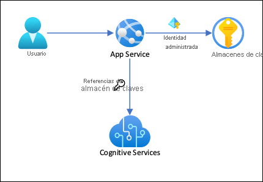
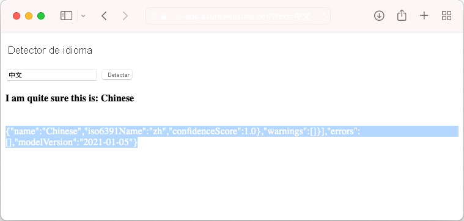

# <a name="tutorial-secure-cognitive-service-connection-from-app-service-using-key-vault"></a>Tutorial: Proteger la conexión de Cognitive Service desde App Service mediante Key Vault

[Azure App Service](overview.md) puede utilizar [identidades administradas](overview-managed-identity.md) para conectarse a servicios back-end sin una cadena de conexión, lo que elimina los secretos de conexión para administrar y mantiene la conectividad de back-end segura en un entorno de producción. En el caso de los servicios back-end que no admiten identidades administradas y que todavía requieren secretos de conexión, puede usar Key Vault para administrar los secretos de conexión. En este tutorial se utiliza Cognitive Services como ejemplo para mostrar cómo se hace en la práctica. Cuando haya terminado, tendrá una aplicación que realiza llamadas mediante programación a Cognitive Services, sin almacenar secretos de conexión dentro de App Service.

> [!TIP]
> Azure Cognitive Services admite la [autenticación a través de identidades administradas](../cognitive-services/authentication.md#authorize-access-to-managed-identities), pero en este tutorial se usa la [autenticación de clave de suscripción](../cognitive-services/authentication.md#authenticate-with-a-single-service-subscription-key) para demostrar cómo podría conectarse a un servicio de Azure que no admite identidades administradas desde App Services.



Con esta arquitectura: 

- La conectividad con Key Vault está protegida por identidades administradas
- App Service accede a los secretos mediante [referencias Key Vault](app-service-key-vault-references.md) como valores de la aplicación.
- El acceso al almacén de claves está restringido a la aplicación. Los colaboradores de la aplicación, como los administradores, pueden tener un control completo de los recursos de App Service y, al mismo tiempo, no tienen acceso a los secretos de Key Vault.
- Si el código de la aplicación ya tiene acceso a los secretos de conexión con los valores de la aplicación, no se requiere ningún cambio.

Lo qué aprenderá:

> [!div class="checklist"]
> * Habilitar identidades administradas
> * Uso de identidades administradas para conectarse a Key Vault
> * Uso de referencias de Key Vault
> * Acceso a Cognitive Services

## <a name="prerequisites"></a>Requisitos previos

Prepare el entorno para la CLI de Azure.

[!INCLUDE [azure-cli-prepare-your-environment-no-header.md](../../includes/azure-cli-prepare-your-environment-no-header.md)]

## <a name="create-app-with-connectivity-to-cognitive-services"></a>Creación de una aplicación con conectividad a Cognitive Services

1. Cree un grupo de recursos que contenga todos los recursos:

    ```azurecli-interactive
    # Save resource group name as variable for convenience
    groupName=myKVResourceGroup
    region=westeurope

    az group create --name $groupName --location $region
    ```

1. Cree un recurso de Cognitive Services. Reemplace *\<cs-resource-name>* por un nombre único de su elección.

    ```azurecli-interactive
    # Save resource name as variable for convenience. 
    csResourceName=<cs-resource-name>

    az cognitiveservices account create --resource-group $groupName --name $csResourceName --location $region --kind TextAnalytics --sku F0 --custom-domain $csResourceName
    ```

    > [!NOTE]
    > `--sku F0` crea un recurso de Cognitive Services gratuito. Cada suscripción está limitada a una cuota de un recurso `TextAnalytics` gratuito. Si ya supera la cuota, use `--sku S` en su lugar.

1. Clone el repositorio de ejemplo localmente e implemente la aplicación de ejemplo en App Service. Reemplace *\<app-name>* por un nombre único.

    ### <a name="net-5"></a>[.NET 5](#tab/dotnet)

    ```azurecli-interactive
    # Save app name as variable for convenience
    appName=<app-name>

    # Clone sample application
    git clone https://github.com/Azure-Samples/app-service-language-detector.git
    cd app-service-language-detector/dotnet
    
    az webapp up --sku F1 --resource-group $groupName --name $appName --plan $appName --location $region
    ```

    ### <a name="php"></a>[PHP](#tab/php)

    ```azurecli-interactive
    # Clone and prepare sample application
    git clone https://github.com/Azure-Samples/app-service-language-detector.git
    cd app-service-language-detector/php
    zip default.zip index.php
    
    # Save app name as variable for convenience
    appName=<app-name>

    az appservice plan create --resource-group $groupName --name $appName --sku FREE --location $region
    az webapp create --resource-group $groupName --plan $appName --name $appName
    az webapp deployment source config-zip --resource-group $groupName --name $appName --src ./default.zip
    ```

    -----

1. Configure los secretos de Cognitive Services como valores de la aplicación `CS_ACCOUNT_NAME` y `CS_ACCOUNT_KEY`.

    ```azurecli-interactive
    # Get subscription key for Cognitive Services resource
    csKey1=$(az cognitiveservices account keys list --resource-group $groupName --name $csResourceName --query key1 --output tsv)

    az webapp config appsettings set --resource-group $groupName --name $appName --settings CS_ACCOUNT_NAME="$csResourceName" CS_ACCOUNT_KEY="$csKey1"
    ````

1. En el explorador, vaya a la aplicación de implementación en `<app-name>.azurewebsites.net` y pruebe el detector de idioma con cadenas en varios idiomas.

    

    Si mira el código de la aplicación, puede observar que la salida de depuración de los resultados de la detección tiene el mismo color de fuente que el fondo. Puede verlo intentando resaltar el espacio en blanco directamente debajo del resultado.

## <a name="secure-back-end-connectivity"></a>Conectividad de back-end segura

En este momento, los secretos de conexión se almacenan como configuración de la aplicación en la aplicación App Service. Este enfoque ya está protegiendo los secretos de conexión desde el código base de la aplicación. Sin embargo, cualquier colaborador que pueda administrar la aplicación también puede ver los valores de la aplicación. En este paso, moverá los secretos de conexión a un almacén de claves y bloqueará el acceso para que solo pueda administrarlo y para que solo la aplicación App Service pueda leerlo mediante su identidad administrada.

1. Cree un almacén de claves. Reemplace *\<vault-name>* por un nombre único.

    ```azurecli-interactive
    # Save app name as variable for convenience
    vaultName=<vault-name>

    az keyvault create --resource-group $groupName --name $vaultName --location $region --sku standard --enable-rbac-authorization
    ```

    El `--enable-rbac-authorization` parámetro [establece el control de acceso basado en rol (RBAC)de Azure como el modelo de permisos](../key-vault/general/rbac-guide.md#using-azure-rbac-secret-key-and-certificate-permissions-with-key-vault). Esta configuración invalida de manera predeterminada todos los permisos de las directivas de acceso.

1. Otórguese a sí mismo el rol RBAC de *Agente de secretos de Key Vault* para el almacén.
    
    ```azurecli-interactive
    vaultResourceId=$(az keyvault show --name $vaultName --query id --output tsv)
    myId=$(az ad signed-in-user show --query objectId --output tsv)
    az role assignment create --role "Key Vault Secrets Officer" --assignee-object-id $myId --assignee-principal-type User --scope $vaultResourceId
    ```

1. Habilite la identidad administrada asignada por el sistema para la aplicación y asígnele el rol RBAC de *usuario de secretos de Key Vault* para el almacén.

    ```azurecli-interactive
    az webapp identity assign --resource-group $groupName --name $appName --scope $vaultResourceId --role  "Key Vault Secrets User"
    ```

1. Agregue el nombre del recurso de Cognitive Services y la clave de suscripción como secretos al almacén y guarde sus identificadores como variables de entorno para el paso siguiente.

    ```azurecli-interactive
    csResourceKVUri=$(az keyvault secret set --vault-name $vaultName --name csresource --value $csResourceName --query id --output tsv)
    csKeyKVUri=$(az keyvault secret set --vault-name $vaultName --name cskey --value $csKey1 --query id --output tsv)
    ```

1. Anteriormente, los secretos se establecen como valores de la aplicación `CS_ACCOUNT_NAME` y `CS_ACCOUNT_KEY` en la aplicación. Ahora, en su lugar, defínalos como [referencias del almacén de claves](app-service-key-vault-references.md).

    ```azurecli-interactive
    az webapp config appsettings set --resource-group $groupName --name $appName --settings CS_ACCOUNT_NAME="@Microsoft.KeyVault(SecretUri=$csResourceKVUri)" CS_ACCOUNT_KEY="@Microsoft.KeyVault(SecretUri=$csKeyKVUri)"
    ```

1. En el explorador, vuelva a navegar a `<app-name>.azurewebsites.net`. Si obtiene los resultados de la detección, se conectará al punto de conexión de Cognitive Services con referencias del almacén de claves.

Enhorabuena, la aplicación se está conectando a Cognitive Services mediante secretos guardados en el almacén de claves, sin cambios en el código de la aplicación.

## <a name="clean-up-resources"></a>Limpieza de recursos

En los pasos anteriores, creó recursos de Azure en un grupo de recursos. Si prevé que no necesitará estos recursos en el futuro, elimine el grupo de recursos ejecutando el siguiente comando en Cloud Shell:

```azurecli-interactive
az group delete --name $groupName
```

Este comando puede tardar varios segundos en ejecutarse.

## <a name="next-steps"></a>Pasos siguientes

- [Tutorial: Aislar la comunicación de back-end con integración de Virtual Network](tutorial-networking-isolate-vnet.md)
- [Integración de su aplicación con una instancia de Azure Virtual Network](overview-vnet-integration.md)
- [Características de redes de App Service](networking-features.md)