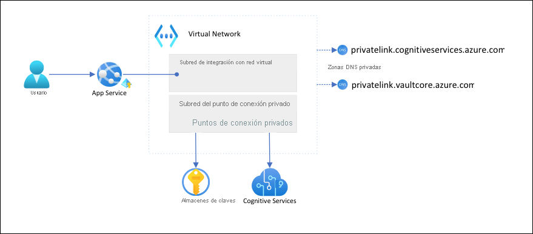

# <a name="tutorial-isolate-back-end-communication-in-azure-app-service-with-virtual-network-integration"></a>Tutorial: Aislamiento de la comunicación de back-end en Azure App Service con la integración de red virtual

En este artículo va a configurar una aplicación de App Service con comunicación segura con aislamiento de red con servicios de back-end. El escenario de ejemplo usado está en [Tutorial: Protección de la conexión de Cognitive Service desde App Service mediante Key Vault](tutorial-connect-msi-key-vault.md). Cuando termine tendrá una aplicación de App Service que accede tanto a Key Vault como a Cognitive Services por medio de una [red virtual (VNet) de Azure](../virtual-network/virtual-networks-overview.md), y no se permitirá que ningún otro tráfico acceda a esos recursos de back-end. Todo el tráfico estará aislado dentro de la red virtual mediante la [integración de red virtual](web-sites-integrate-with-vnet.md) y [puntos de conexión privados](../private-link/private-endpoint-overview.md).

Como servicio multiinquilino, el tráfico de red saliente desde la aplicación de App Service a otros servicios de Azure comparte el mismo entorno con otras aplicaciones o incluso otras suscripciones. Aunque el propio tráfico se puede cifrar, determinados escenarios pueden exigir un nivel adicional de seguridad mediante el aislamiento de la comunicación de back-end de otro tráfico de red. Estos escenarios suelen ser accesibles para grandes empresas con un alto nivel de experiencia, pero App Service los pone al alcance de cualquiera con la integración de red virtual.  



Con esta arquitectura: 

- El tráfico público a los servicios de back-end se bloquea.
- El tráfico saliente de App Service se enruta a la red virtual y puede llegar a los servicios de back-end.
- App Service puede realizar la resolución DNS en los servicios de back-end mediante zonas DNS privadas.

Lo qué aprenderá:

> [!div class="checklist"]
> * Creación de una red virtual y subredes para la integración de red virtual de App Service
> * Creación de zonas DNS privadas
> * Creación de puntos de conexión privados
> * Configuración de la integración de red virtual de App Service

## <a name="prerequisites"></a>Prerrequisitos

En el tutorial se da por hecho que ha seguido [Tutorial: Protección de la conexión de Cognitive Service desde App Service mediante Key Vault](tutorial-connect-msi-key-vault.md) y ha creado la aplicación de detección de idiomas. 

El tutorial sigue usando las siguientes variables de entorno del tutorial anterior. Asegúrese de establecerlas correctamente.

```azurecli-interactive
    groupName=myKVResourceGroup
    region=westeurope
    csResourceName=<cs-resource-name>
    appName=<app-name>
    vaultName=<vault-name>
```

## <a name="create-vnet-and-subnets"></a>Creación de una red virtual y subredes

1. Crear una red virtual Reemplace *\<virtual-network-name>* por un nombre único.

    ```azurecli-interactive
    # Save vnet name as variable for convenience
    vnetName=<virtual-network-name>

    az network vnet create --resource-group $groupName --location $region --name $vnetName --address-prefixes 10.0.0.0/16
    ```

1. Cree una subred para la integración de red virtual de App Service.

    ```azurecli-interactive
    az network vnet subnet create --resource-group $groupName --vnet-name $vnetName --name vnet-integration-subnet --address-prefixes 10.0.0.0/24 --delegations Microsoft.Web/serverfarms
    ```

    En App Service, se recomienda que la subred de integración de red virtual tenga un bloque CIDR de `/26` como mínimo (vea [Requisitos de subred de integración de red virtual](overview-vnet-integration.md#subnet-requirements)). `/24` es más que suficiente. `--delegations Microsoft.Web/serverfarms` especifica que la subred se [delega para la integración de red virtual de App Service](../virtual-network/subnet-delegation-overview.md).

1. Cree otra subred para los puntos de conexión privados.

    ```azurecli-interactive
    az network vnet subnet create --resource-group $groupName --vnet-name $vnetName --name private-endpoint-subnet --address-prefixes 10.0.1.0/24 --disable-private-endpoint-network-policies
    ```

    En las subredes de puntos de conexión privados, debe [deshabilitar las directivas de red de punto de conexión privado](../private-link/disable-private-endpoint-network-policy.md).

## <a name="create-private-dns-zones"></a>Creación de zonas DNS privadas

Dado que los recursos de Key Vault y Cognitive Services se encuentran tras [puntos de conexión privados](../private-link/private-endpoint-overview.md), debe definir [zonas DNS privadas](../dns/private-dns-privatednszone.md) para ellos. Estas zonas se usan para hospedar los registros DNS de los puntos de conexión privados y para permitir que los clientes encuentren los servicios de back-end por nombre. 

1. Cree dos zonas DNS privadas, una para el recurso de Cognitive Services y otra para el almacén de claves.

    ```azurecli-interactive
    az network private-dns zone create --resource-group $groupName --name privatelink.cognitiveservices.azure.com
    az network private-dns zone create --resource-group $groupName --name privatelink.vaultcore.azure.net
    ```

    Para obtener más información sobre esta configuración, vea [Configuración de DNS para puntos de conexión privados de Azure](../private-link/private-endpoint-dns.md#azure-services-dns-zone-configuration)

1. Vincule las zonas DNS privadas a la red virtual.

    ```azurecli-interactive
    az network private-dns link vnet create --resource-group $groupName --name cognitiveservices-zonelink --zone-name privatelink.cognitiveservices.azure.com --virtual-network $vnetName --registration-enabled False
    az network private-dns link vnet create --resource-group $groupName --name vaultcore-zonelink --zone-name privatelink.vaultcore.azure.net --virtual-network $vnetName --registration-enabled False
    ```

## <a name="create-private-endpoints"></a>Creación de puntos de conexión privados

1. En la subred del punto de conexión privado de la red virtual, cree un punto de conexión privado para el almacén de claves.

    ```azurecli-interactive
    # Get Cognitive Services resource ID
    csResourceId=$(az cognitiveservices account show --resource-group $groupName --name $csResourceName --query id --output tsv)

    az network private-endpoint create --resource-group $groupName --name securecstext-pe --location $region --connection-name securecstext-pc --private-connection-resource-id $csResourceId --group-id account --vnet-name $vnetName --subnet private-endpoint-subnet
    ```

1. Cree un grupo de zonas DNS para el punto de conexión privado de Cognitive Services. El grupo de zonas DNS es un vínculo entre la zona DNS privada y el punto de conexión privado. Este vínculo le ayuda a actualizar automáticamente la zona DNS privada cuando hay una actualización del punto de conexión privado.  

    ```azurecli-interactive
    az network private-endpoint dns-zone-group create --resource-group $groupName --endpoint-name securecstext-pe --name securecstext-zg --private-dns-zone privatelink.cognitiveservices.azure.com --zone-name privatelink.cognitiveservices.azure.com
    ```

1. Bloquee el tráfico público al recurso de Cognitive Services.

    ```azurecli-interactive
    az rest --uri $csResourceId?api-version=2021-04-30 --method PATCH --body '{"properties":{"publicNetworkAccess":"Disabled"}}' --headers 'Content-Type=application/json'

    # Repeat following command until output is "Succeeded"
    az cognitiveservices account show --resource-group $groupName --name $csResourceName --query properties.provisioningState
    ```

    > [!NOTE]
    > Asegúrese de que el estado de aprovisionamiento del cambio es `"Succeeded"`. Luego puede observar el cambio de comportamiento en la aplicación de ejemplo. Todavía puede cargar la aplicación, pero si intenta hacer clic en el botón **Detectar**, se produce un error `HTTP 500`. La aplicación ha perdido su conectividad con el recurso de Cognitive Services a través de las redes compartidas.

1. Repita los pasos anteriores para el almacén de claves.

    ```azurecli-interactive
    # Create private endpoint for key vault
    vaultResourceId=$(az keyvault show --name $vaultName --query id --output tsv)
    az network private-endpoint create --resource-group $groupName --name securekeyvault-pe --location $region --connection-name securekeyvault-pc --private-connection-resource-id $vaultResourceId --group-id vault --vnet-name $vnetName --subnet private-endpoint-subnet
    # Create DNS zone group for the endpoint
    az network private-endpoint dns-zone-group create --resource-group $groupName --endpoint-name securekeyvault-pe --name securekeyvault-zg --private-dns-zone privatelink.vaultcore.azure.net --zone-name privatelink.vaultcore.azure.net
    # Block public traffic to key vault
    az keyvault update --name $vaultName --default-action Deny
    ```

1. Fuerce una nueva captura inmediata de las [referencias del almacén de claves](app-service-key-vault-references.md) en la aplicación mediante el restablecimiento de la configuración de la aplicación (para obtener más información, vea [Rotación](app-service-key-vault-references.md#rotation)).

    ```azurecli-interactive
    az webapp config appsettings set --resource-group $groupName --name $appName --settings CS_ACCOUNT_NAME="@Microsoft.KeyVault(SecretUri=$csResourceKVUri)" CS_ACCOUNT_KEY="@Microsoft.KeyVault(SecretUri=$csKeyKVUri)"
    ```

    <!-- If above is not run then it takes a whole day for references to update? https://docs.microsoft.com/en-us/azure/app-service/app-service-key-vault-references#rotation -->

    > [!NOTE]
    > Una vez más puede observar el cambio de comportamiento en la aplicación de ejemplo. Ya no puede cargar la aplicación porque ya no puede acceder a las referencias del almacén de claves. La aplicación ha perdido su conectividad con el almacén de claves a través de las redes compartidas.

Los dos puntos de conexión privados solo son accesibles para los clientes de dentro de la red virtual creada. Ni siquiera puede acceder a los secretos del almacén de claves por medio de la página **Secretos** de Azure Portal, ya que el portal accede a ellos a través de la red pública de Internet (vea [Administración de los recursos bloqueados](#manage-the-locked-down-resources)).

## <a name="configure-vnet-integration-in-your-app"></a>Configuración de la integración de red virtual en la aplicación

1. Escale la aplicación al nivel **estándar**. La integración de red virtual requiere el nivel **estándar** o superior (vea [Integración de la aplicación con una red virtual de Azure](overview-vnet-integration.md)).

    ```azurecli-interactive
    az appservice plan update --name $appName --resource-group $groupName --sku S1
    ```

1. No relacionado con este escenario, pero también importante, aplique HTTPS para las solicitudes entrantes.

    ```azurecli-interactive
    az webapp update --resource-group $groupName --name $appName --https-only
    ```

1. Habilite la integración de red virtual en la aplicación.

    ```azurecli-interactive
    az webapp vnet-integration add --resource-group $groupName --name $appName --vnet $vnetName --subnet vnet-integration-subnet
    ```
    
    La integración de red virtual permite que el tráfico saliente fluya directamente a la red virtual. De manera predeterminada, solo el tráfico IP local definido en [RFC-1918](https://tools.ietf.org/html/rfc1918#section-3) se enruta a la red virtual, que es lo que necesita para los puntos de conexión privados. Para enrutar todo el tráfico a la red virtual, vea [Administración del enrutamiento de la integración de red virtual](configure-vnet-integration-routing.md). También se puede usar el enrutamiento de todo el tráfico si se quiere enrutar el tráfico de Internet a través de la red virtual, por ejemplo, a través de [NAT de red virtual de Azure](../virtual-network/nat-gateway/nat-overview.md) o [Azure Firewall](../firewall/overview.md).

1. En el explorador, vaya a `<app-name>.azurewebsites.net` de nuevo y espere a que la integración se aplique. Si recibe un error HTTP 500, espere unos minutos e inténtelo de nuevo. Si puede cargar la página y obtener resultados de detección, se está conectando al punto de conexión de Cognitive Services con referencias del almacén de claves.

    >[!NOTE]
    > Si sigue recibiendo errores HTTP 500 después de mucho tiempo, forzar una nueva captura de las [referencias del almacén de claves](app-service-key-vault-references.md) puede ayudar, así:
    >
    > ```azurecli-interactive
    > az webapp config appsettings set --resource-group $groupName --name $appName --settings CS_ACCOUNT_NAME="@Microsoft.KeyVault(SecretUri=$csResourceKVUri)" CS_ACCOUNT_KEY="@Microsoft.KeyVault(SecretUri=$csKeyKVUri)"
    > ```


## <a name="manage-the-locked-down-resources"></a>Administración de los recursos bloqueados

En función de los escenarios, es posible que no pueda administrar los recursos protegidos del punto de conexión privado mediante Azure Portal, la CLI de Azure o Azure PowerShell (por ejemplo, Key Vault). Todas estas herramientas hacen llamadas API de REST para acceder a los recursos a través de la red pública de Internet, y están bloqueadas por la configuración. Estas son algunas opciones para acceder a los recursos bloqueados:

- En Key Vault, agregue la dirección IP pública de la máquina local para ver o actualizar los secretos protegidos del punto de conexión privado.
- Si la red local se extiende a la red virtual de Azure mediante una [puerta de enlace de VPN](../vpn-gateway/vpn-gateway-about-vpngateways.md) o [ExpressRoute](../expressroute/expressroute-introduction.md), puede administrar los recursos protegidos del punto de conexión privado directamente desde la red local. 
- Administre los recursos protegidos del punto de conexión privado desde un [servidor de salto](https://wikipedia.org/wiki/Jump_server) de la red virtual.
- [Implemente Cloud Shell en la red virtual](../cloud-shell/private-vnet.md).

## <a name="clean-up-resources"></a>Limpieza de recursos

En los pasos anteriores, creó recursos de Azure en un grupo de recursos. Si prevé que no necesitará estos recursos en el futuro, elimine el grupo de recursos ejecutando el siguiente comando en Cloud Shell:

```azurecli-interactive
az group delete --name $groupName
```

Este comando puede tardar varios segundos en ejecutarse.

## <a name="next-steps"></a>Pasos siguientes

- [Integración de su aplicación con una instancia de Azure Virtual Network](overview-vnet-integration.md)
- [Características de redes de App Service](networking-features.md)