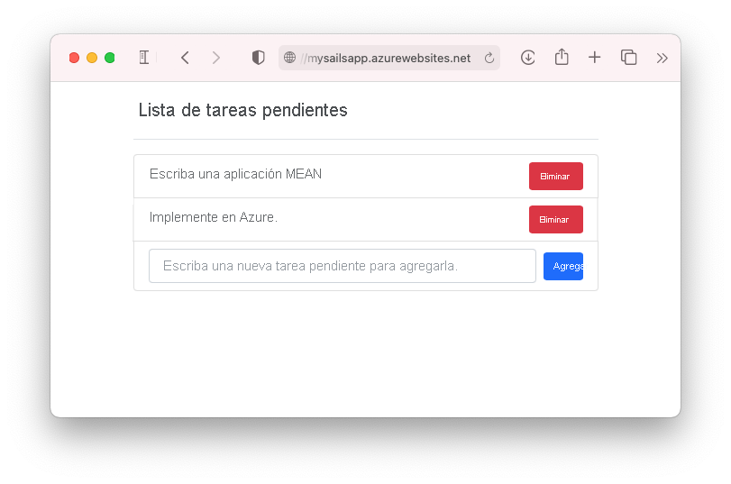
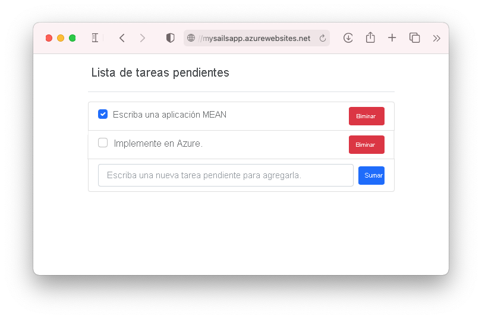

# <a name="tutorial-build-a-nodejs-and-mongodb-app-in-azure"></a>Tutorial: Compilación de una aplicación Node.js y MongoDB en Azure

::: zone pivot="platform-windows"  

[Azure App Service](overview.md) proporciona un servicio de hospedaje web muy escalable y con aplicación de revisiones de un modo automático. En este tutorial se muestra cómo crear una aplicación de Node.js en App Service en Windows y conectarla a una base de datos de MongoDB. Cuando haya terminado, tendrá una aplicación MEAN (MongoDB, Express, AngularJS y Node.js) que se ejecuta en [Azure App Service](overview.md). La aplicación de ejemplo usa una combinación de [Sails.js](https://sailsjs.com/) y [Angular 12](https://angular.io/).

::: zone-end

::: zone pivot="platform-linux"


[Azure App Service](overview.md) proporciona un servicio de hospedaje web muy escalable y con aplicación automática de revisiones con el sistema operativo Linux. En este tutorial se muestra cómo crear una aplicación de Node.js en App Service en Linux, conectarla localmente a una base de datos de MongoDB y luego implementarla en una base de datos en la API de Azure Cosmos DB para MongoDB. Cuando haya terminado, tendrá una aplicación MEAN (MongoDB, Express, AngularJS y Node.js) que se ejecuta en App Service en Linux. La aplicación de ejemplo usa una combinación de [Sails.js](https://sailsjs.com/) y [Angular 12](https://angular.io/).

::: zone-end



Temas que se abordarán:

> [!div class="checklist"]
> * Crear una base de datos MongoDB en Azure
> * Conectar una aplicación Node.js a MongoDB
> * Implementar la aplicación en Azure
> * Actualizar el modelo de datos y volver a implementar la aplicación
> * Transmitir registros de diagnóstico desde Azure
> * Administrar la aplicación en Azure Portal

[!INCLUDE [quickstarts-free-trial-note](../../includes/quickstarts-free-trial-note.md)]

## <a name="prerequisites"></a>Requisitos previos

Para completar este tutorial:

- [Instalación de Git](https://git-scm.com/)
- [Instalación de Node.js y NPM](https://nodejs.org/)
[!INCLUDE [azure-cli-prepare-your-environment-no-header.md](../../includes/azure-cli-prepare-your-environment-no-header.md)] 

## <a name="create-local-nodejs-app"></a>Creación de una aplicación local Node.js

En este paso, configurará el proyecto local de Node.js.

### <a name="clone-the-sample-application"></a>Clonación de la aplicación de ejemplo

En la ventana del terminal, use `cd` para cambiar a un directorio de trabajo.  

Ejecute el comando siguiente para clonar el repositorio de ejemplo. 

```bash
git clone https://github.com/Azure-Samples/mean-todoapp.git
```

> [!NOTE]
> Para información sobre cómo se crea la aplicación de ejemplo, vea [https://github.com/Azure-Samples/mean-todoapp](https://github.com/Azure-Samples/mean-todoapp).

### <a name="run-the-application"></a>Ejecución de la aplicación

Instale los comandos siguientes para instalar los paquetes necesarios e inicie la aplicación.

```bash
cd mean-todoapp
npm install
node app.js --alter
```

Cuando la aplicación se haya cargado completamente, verá algo similar al siguiente mensaje:

<pre>
debug: -------------------------------------------------------
debug: :: Fri Jul 09 2021 13:10:34 GMT+0200 (Central European Summer Time)

debug: Environment : development
debug: Port        : 1337
debug: -------------------------------------------------------
</pre>

Vaya a `http://localhost:1337` en un explorador. Agregue algunos elementos de tareas pendientes.

La aplicación de ejemplo MEAN almacena datos de usuario en la base de datos. De forma predeterminada, usa una base de datos de desarrollo basada en disco. Si puede crear y ver elementos de tareas pendientes, significa que la aplicación lee y escribe datos.


Para detener Node.js en cualquier momento, presione `Ctrl+C` en el terminal. 

## <a name="create-production-mongodb"></a>Creación de una base de datos de MongoDB de producción

En este paso, creará una base de datos MongoDB en Azure. Cuando la aplicación se implementa en Azure, utiliza esta base de datos en la nube.

Para MongoDB, en este tutorial se usa [Azure Cosmos DB](../cosmos-db/index.yml). Cosmos DB admite las conexiones del cliente de MongoDB.

### <a name="create-a-resource-group"></a>Crear un grupo de recursos

[!INCLUDE [Create resource group](../../includes/app-service-web-create-resource-group-no-h.md)] 

### <a name="create-a-cosmos-db-account"></a>Creación de una cuenta de Cosmos DB

> [!NOTE]
> Hay un costo por la creación de las bases de datos de Azure Cosmos DB en este tutorial en su propia suscripción de Azure. Para usar una cuenta gratuita de Azure Cosmos DB durante siete días, puede usar la experiencia [Pruebe gratis Azure Cosmos DB](https://azure.microsoft.com/try/cosmosdb/). Simplemente haga clic en el botón **Crear** en el icono de MongoDB para crear una base de datos gratuita de MongoDB en Azure. Una vez creada la base de datos, vaya a **Cadena de conexión** en el portal y recupere la cadena de conexión de Azure Cosmos DB para su uso posterior en el tutorial.
>

En Cloud Shell, cree una cuenta de Cosmos DB con el comando [`az cosmosdb create`](/cli/azure/cosmosdb#az_cosmosdb_create).

En el siguiente comando, sustituya el marcador de posición *\<cosmosdb-name>* por un nombre único de base de datos de Cosmos DB. Este nombre se usa como parte del punto de conexión de Cosmos DB, `https://<cosmosdb-name>.documents.azure.com/`, por lo que el nombre debe ser único en todas las cuentas de Cosmos DB de Azure. El nombre debe contener solo letras minúsculas, números y el carácter de guion (-), y debe tener una longitud de entre 3 y 50 caracteres.

```azurecli-interactive
az cosmosdb create --name <cosmosdb-name> --resource-group myResourceGroup --kind MongoDB
```

El parámetro *--kind MongoDB* habilita las conexiones de cliente de MongoDB.

Cuando se crea la cuenta de Cosmos DB, la CLI de Azure muestra información similar a la del ejemplo siguiente:

<pre>
{
  "apiProperties": {
    "serverVersion": "3.6"
  },
  "backupPolicy": {
    "periodicModeProperties": {
      "backupIntervalInMinutes": 240,
      "backupRetentionIntervalInHours": 8,
      "backupStorageRedundancy": "Geo"
    },
    "type": "Periodic"
  },
  "capabilities": [
    {
      "name": "EnableMongo"
    }
  ],
  "connectorOffer": null,
  "consistencyPolicy": {
    "defaultConsistencyLevel": "Session",
    "maxIntervalInSeconds": 5,
    "maxStalenessPrefix": 100
  },
  "cors": [],
  "databaseAccountOfferType": "Standard",
  "defaultIdentity": "FirstPartyIdentity",
  "disableKeyBasedMetadataWriteAccess": false,
  "documentEndpoint": "https://&lt;cosmosdb-name&gt;.documents.azure.com:443/",
  ...
  &lt; Output truncated for readability &gt;
}
</pre>

## <a name="connect-app-to-production-mongodb"></a>Conexión de la aplicación a la base de datos MongoDB de producción

En este paso, conectará la aplicación de ejemplo a la base de datos Cosmos DB que acaba de crear mediante una cadena de conexión de MongoDB. 

### <a name="retrieve-the-database-key"></a>Recuperación de la clave de base de datos

Para conectarse a la base de datos Cosmos DB, necesita la clave de base de datos. En Cloud Shell, use el comando [`az cosmosdb keys list`](/cli/azure/cosmosdb#az_cosmosdb_keys_list) para recuperar la clave principal.

```azurecli-interactive
az cosmosdb keys list --name <cosmosdb-name> --resource-group myResourceGroup
```

La CLI de Azure muestra información similar a la del ejemplo siguiente:

<pre>
{
  "primaryMasterKey": "RS4CmUwzGRASJPMoc0kiEvdnKmxyRILC9BWisAYh3Hq4zBYKr0XQiSE4pqx3UchBeO4QRCzUt1i7w0rOkitoJw==",
  "primaryReadonlyMasterKey": "HvitsjIYz8TwRmIuPEUAALRwqgKOzJUjW22wPL2U8zoMVhGvregBkBk9LdMTxqBgDETSq7obbwZtdeFY7hElTg==",
  "secondaryMasterKey": "Lu9aeZTiXU4PjuuyGBbvS1N9IRG3oegIrIh95U6VOstf9bJiiIpw3IfwSUgQWSEYM3VeEyrhHJ4rn3Ci0vuFqA==",
  "secondaryReadonlyMasterKey": "LpsCicpVZqHRy7qbMgrzbRKjbYCwCKPQRl0QpgReAOxMcggTvxJFA94fTi0oQ7xtxpftTJcXkjTirQ0pT7QFrQ=="
}
</pre>

Copie el valor de `primaryMasterKey`. Esta información la necesitará en el siguiente paso.

<a name="devconfig"></a>
### <a name="configure-the-connection-string-in-your-sample-application"></a>Configuración de la cadena de conexión en la aplicación de ejemplo

En el repositorio local, en _config/datastores.js_, reemplace el contenido existente por el código siguiente y guarde los cambios.

```javascript
module.exports.datastores = {
  default: {
    adapter: 'sails-mongo',
    url: process.env.MONGODB_URI,
    ssl: true,
  },
};
```

Se necesita la opción `ssl: true` porque [Cosmos DB requiere TLS/SSL](../cosmos-db/connect-mongodb-account.md#connection-string-requirements). `url` se establece en una variable de entorno, que especificará a continuación. 

En el terminal, establezca la variable de entorno `MONGODB_URI`. Asegúrese de reemplazar los dos marcadores de posición \<cosmosdb-name> por el nombre de la base de datos de Cosmos DB y el marcador de posición \<cosmosdb-key> por la clave que copió en el paso anterior.

```bash
export MONGODB_URI=mongodb://<cosmosdb-name>:<cosmosdb-key>@<cosmosdb-name>.documents.azure.com:10250/todoapp
```

> [!NOTE]
> Esta cadena de conexión sigue el formato definido en la [documentación de Sails.js](https://sailsjs.com/documentation/reference/configuration/sails-config-datastores#?the-connection-url).

### <a name="test-the-application-with-mongodb"></a>Prueba de la aplicación con MongoDB

En una ventana de terminal local, vuelva a ejecutar `node app.js --alter`.

```bash
node app.js --alter
```

Vaya de nuevo a `http://localhost:1337`. Si puede crear y ver elementos de tareas pendientes, la aplicación lee y escribe datos mediante la base de datos Cosmos DB en Azure. 

En el terminal, detenga Node.js escribiendo `Ctrl+C`. 

## <a name="deploy-app-to-azure"></a>Implementación de la aplicación en Azure

En este paso, implementará la aplicación Node.js conectada a MongoDB en Azure App Service.

### <a name="configure-a-deployment-user"></a>Configuración de un usuario de implementación

[!INCLUDE [Configure deployment user](../../includes/configure-deployment-user-no-h.md)]

### <a name="create-an-app-service-plan"></a>Creación de un plan de App Service

::: zone pivot="platform-windows"  

En Cloud Shell, cree un plan de App Service con el comando [`az appservice plan create`](/cli/azure/appservice/plan).

En el siguiente ejemplo se crea un plan de App Service denominado `myAppServicePlan` con el plan de tarifa **B1**:

```azurecli-interactive
az appservice plan create --name myAppServicePlan --resource-group myResourceGroup --sku B1
```

Cuando se crea el plan de App Service, la CLI de Azure muestra información similar al ejemplo siguiente:

<pre>
{ 
  "freeOfferExpirationTime": null,
  "geoRegion": "UK West",
  "hostingEnvironmentProfile": null,
  "hyperV": false,
  "id": "/subscriptions/0000-0000/resourceGroups/myResourceGroup/providers/Microsoft.Web/serverfarms/myAppServicePlan",
  "isSpot": false,
  "isXenon": false,
  "kind": "app",
  "location": "ukwest",
  "maximumElasticWorkerCount": 1,
  "maximumNumberOfWorkers": 0,
  &lt; JSON data removed for brevity. &gt;
} 
</pre>

::: zone-end

::: zone pivot="platform-linux"

En Cloud Shell, cree un plan de App Service con el comando [`az appservice plan create`](/cli/azure/appservice/plan).

<!-- [!INCLUDE [app-service-plan](app-service-plan.md)] -->

En el siguiente ejemplo se crea un plan de App Service denominado `myAppServicePlan` con el plan de tarifa **B1**:

```azurecli-interactive
az appservice plan create --name myAppServicePlan --resource-group myResourceGroup --sku B1 --is-linux
```

Cuando se crea el plan de App Service, la CLI de Azure muestra información similar al ejemplo siguiente:

<pre>
{ 
  "freeOfferExpirationTime": null,
  "geoRegion": "West Europe",
  "hostingEnvironmentProfile": null,
  "id": "/subscriptions/0000-0000/resourceGroups/myResourceGroup/providers/Microsoft.Web/serverfarms/myAppServicePlan",
  "kind": "linux",
  "location": "West Europe",
  "maximumNumberOfWorkers": 1,
  "name": "myAppServicePlan",
  &lt; JSON data removed for brevity. &gt;
  "targetWorkerSizeId": 0,
  "type": "Microsoft.Web/serverfarms",
  "workerTierName": null
} 
</pre>

::: zone-end

<a name="create"></a>
### <a name="create-a-web-app"></a>Creación de una aplicación web

::: zone pivot="platform-windows"  

[!INCLUDE [Create web app](../../includes/app-service-web-create-web-app-nodejs-no-h.md)] 

::: zone-end

::: zone pivot="platform-linux"

[!INCLUDE [Create web app](../../includes/app-service-web-create-web-app-nodejs-linux-no-h.md)] 

::: zone-end

### <a name="configure-an-environment-variable"></a>Configuración de una variable de entorno

Recuerde que la aplicación de ejemplo ya está configurada para usar la variable de entorno `MONGODB_URI` en `config/datastores.js`. En App Service, esta variable se inserta mediante una [configuración de aplicación](configure-common.md#configure-app-settings). 

Para establecer la configuración de la aplicación, utilice el comando [`az webapp config appsettings set`](/cli/azure/webapp/config/appsettings#az_webapp_config_appsettings_set) en Cloud Shell. 

En el ejemplo siguiente se realiza una configuración de aplicación `MONGODB_URI` en la aplicación de Azure. De nuevo, reemplace los marcadores *\<app-name>* , *\<cosmosdb-name>* y *\<cosmosdb-key>* .

```azurecli-interactive
az webapp config appsettings set --name <app-name> --resource-group myResourceGroup --settings MONGODB_URI='mongodb://<cosmosdb-name>:<cosmosdb-key>@<cosmosdb-name>.documents.azure.com:10250/todoapp' DEPLOYMENT_BRANCH='main'
```

> [!NOTE]
> `DEPLOYMENT_BRANCH` es una configuración de aplicación especial que indica al motor de implementación en qué rama de Git va a implementar en App Service.

### <a name="push-to-azure-from-git"></a>Inserción en Azure desde Git

[!INCLUDE [app-service-plan-no-h](../../includes/app-service-web-git-push-to-azure-no-h.md)]

::: zone pivot="platform-windows"

<pre>
Enumerating objects: 5, done.
Counting objects: 100% (5/5), done.
Delta compression using up to 8 threads
Compressing objects: 100% (3/3), done.
Writing objects: 100% (3/3), 318 bytes | 318.00 KiB/s, done.
Total 3 (delta 2), reused 0 (delta 0), pack-reused 0
remote: Updating branch 'main'.
remote: Updating submodules.
remote: Preparing deployment for commit id '4eb0ca7190'.
remote: Generating deployment script.
remote: Running deployment command...
remote: Handling node.js deployment.
remote: Creating app_offline.htm
remote: KuduSync.NET from: 'D:\home\site\repository' to: 'D:\home\site\wwwroot'
remote: Copying file: 'package.json'
remote: Deleting app_offline.htm
remote: Looking for app.js/server.js under site root.
remote: Using start-up script app.js
remote: Generated web.config.
.
.
.
remote: Deployment successful.
To https://&lt;app-name&gt;.scm.azurewebsites.net/&lt;app-name&gt;.git
 * [new branch]      main -> main
</pre>

> [!TIP]
> Durante la implementación de Git, el motor de implementación ejecuta `npm install --production` como parte de su automatización de compilación.
>
> - Tal como se define en `package.json`, `npm install` selecciona el script `postinstall` que ejecuta `ng build` para generar los archivos de producción para Angular e implementarlos en la carpeta [assets](https://sailsjs.com/documentation/concepts/assets).
> - Los `scripts` de `package.json` pueden usar las herramientas instaladas en `node_modules/.bin`. Puesto que `npm install` también ha instalado `node_modules/.bin/ng`, puede usarlo para implementar los archivos cliente de Angular. Este comportamiento de npm es exactamente el mismo en Azure App Service.
> Los paquetes de `devDependencies` en `package.json` no se instalan. Cualquier paquete que necesite en el entorno de producción debe moverse a `dependencies`.
>
> Si la aplicación necesita omitir la automatización predeterminada y ejecutar la automatización personalizada, consulte [Ejecución de Grunt/Bower/Gulp](configure-language-nodejs.md#run-gruntbowergulp).

::: zone-end

::: zone pivot="platform-linux"

<pre>
Enumerating objects: 5, done.
Counting objects: 100% (5/5), done.
Delta compression using up to 8 threads
Compressing objects: 100% (3/3), done.
Writing objects: 100% (3/3), 347 bytes | 347.00 KiB/s, done.
Total 3 (delta 2), reused 0 (delta 0), pack-reused 0
remote: Deploy Async
remote: Updating branch 'main'.
remote: Updating submodules.
remote: Preparing deployment for commit id 'f776be774a'.
remote: Repository path is /home/site/repository
remote: Running oryx build...
remote: Operation performed by Microsoft Oryx, https://github.com/Microsoft/Oryx
remote: You can report issues at https://github.com/Microsoft/Oryx/issues
remote: 
remote: Oryx Version: 0.2.20210420.1, Commit: 85c6e9278aae3980b86cb1d520aaad532c814ed7, ReleaseTagName: 20210420.1
remote: 
remote: Build Operation ID: |qwejn9R4StI=.5e8a3529_
remote: Repository Commit : f776be774a3ea8abc48e5ee2b5132c037a636f73
.
.
.
remote: Deployment successful.
remote: Deployment Logs : 'https://&lt;app-name&gt;.scm.azurewebsites.net/newui/jsonviewer?view_url=/api/deployments/a6fcf811136739f145e0de3be82ff195bca7a68b/log'
To https://&lt;app-name&gt;.scm.azurewebsites.net/&lt;app-name&gt;.git
   4f7e3ac..a6fcf81  main -> main
</pre>

> [!TIP]
> Durante la implementación de Git, el motor de implementación ejecuta `npm install` como parte de su automatización de compilación.
>
> - Tal como se define en `package.json`, `npm install` selecciona el script `postinstall` que ejecuta `ng build` para generar los archivos de producción para Angular e implementarlos en la carpeta [assets](https://sailsjs.com/documentation/concepts/assets).
> - Los `scripts` de `package.json` pueden usar las herramientas instaladas en `node_modules/.bin`. Puesto que `npm install` también ha instalado `node_modules/.bin/ng`, puede usarlo para implementar los archivos cliente de Angular. Este comportamiento de npm es exactamente el mismo en Azure App Service.
> Una vez completada la automatización de la compilación, todo el repositorio completado se copia en la carpeta `/home/site/wwwroot`, desde la que se hospeda la aplicación.
>
> Si la aplicación necesita omitir la automatización predeterminada y ejecutar la automatización personalizada, consulte [Ejecución de Grunt/Bower/Gulp](configure-language-nodejs.md#run-gruntbowergulp).

::: zone-end

### <a name="browse-to-the-azure-app"></a>Navegación hasta la aplicación de Azure 

Vaya a la aplicación implementada mediante el explorador web. 

```bash 
https://<app-name>.azurewebsites.net 
``` 

Si puede crear y ver elementos de tareas pendientes en el explorador, la aplicación de ejemplo de Azure tiene conectividad con la base de datos de MongoDB (Cosmos DB). 


**¡Enhorabuena!** Está ejecutando una aplicación Node.js orientada a datos en Azure App Service.

## <a name="update-data-model-and-redeploy"></a>Actualización del modelo de datos y nueva implementación

En este paso, se cambia el modelo de datos de `Todo` y se publica el cambio en Azure.

### <a name="update-the-server-side-model"></a>Actualización del modelo del lado servidor

En Sails.js, cambiar el modelo del lado servidor y el código de API es tan sencillo como cambiar el modelo de datos, porque [Sails.js ya define las rutas comunes](https://sailsjs.com/documentation/concepts/blueprints/blueprint-routes#?restful-routes) para un modelo de forma predeterminada. 

En el repositorio local, abra _api/models/Todo.js_ y agregue un atributo `done`. Cuando haya finalizado, su código de esquema tendrá este aspecto:

```javascript
module.exports = {

  attributes: {
    value: {type: 'string'},
    done: {type: 'boolean', defaultsTo: false}
  },

};
```

### <a name="update-the-client-code"></a>Actualización del código de cliente

Hay tres archivos que debe modificar: el modelo de cliente, la plantilla HTML y el archivo de componente. 

Abra _client/src/app/todo.ts_ y agregue una propiedad `done`. Cuando haya terminado, el modelo debe tener este aspecto:

```typescript
export class Todo {
    id!: String;
    value!: String;
    done!: Boolean;
}
```

Abra _client/src/app/app.component.html_. Justo encima del único elemento `<span>`, agregue el código siguiente para agregar una casilla al principio de cada elemento de tarea pendiente:

```html
<input class="form-check-input me-2" type="checkbox" [checked]="todo.done" (click)="toggleDone(todo.id, i)" [disabled]="isProcessing">
```

Abra _client/src/app/app.component.ts_. Justo encima de la última llave de cierre (`}`), inserte el método siguiente. El código de plantilla anterior lo llama cuando se hace clic en la casilla y actualiza los datos del lado servidor.

```typescript
toggleDone(id:any, i:any) {
  console.log("Toggled checkbox for " + id);
  this.isProcessing = true;
  this.Todos[i].done = !this.Todos[i].done;
  this.restService.updateTodo(id, this.Todos[i])
  .subscribe((res) => {
      console.log('Data updated successfully!');
      this.isProcessing = false;
    }, (err) => {
      console.log(err);
      this.Todos[i].done = !this.Todos[i].done;
  });
}
```

### <a name="test-your-changes-locally"></a>Prueba de los cambios localmente

En la ventana de terminal local, compile el código de cliente Angular con el script de compilación definido en `package.json`.

```bash
npm run build
```

Vuelva a probar los cambios con `node app.js --alter`. Puesto que ha cambiado el modelo del lado servidor, la marca `--alter` permite que `Sails.js` modifique la estructura de datos en la base de Cosmos DB.

```bash
node app.js --alter
```

Vaya a `http://localhost:1337`. Ahora debería ver una casilla delante del elemento de tarea pendiente. Al seleccionar o desactivar una casilla, se actualiza la base de datos de Cosmos DB en Azure para indicar que el elemento de tarea pendiente se ha realizado.


En el terminal, detenga Node.js escribiendo `Ctrl+C`. 

### <a name="publish-changes-to-azure"></a>Publicación de los cambios en Azure

En la ventana del terminal local, confirme los cambios en Git e inserte los cambios de código en Azure.

```bash
git commit -am "added done field"
git push azure main
```

Una vez que `git push` esté completo, vaya a la aplicación de Azure y pruebe la nueva funcionalidad.



Si agregó anteriormente artículos, aún puede verlos. Los datos existentes en Cosmos DB no se pierden. Además, se actualiza el esquema de datos y los datos existentes permanecen sin cambios.

## <a name="stream-diagnostic-logs"></a>Transmisión de registros de diagnóstico 

::: zone pivot="platform-windows"  

Mientras se ejecuta la aplicación de Node.js en Azure App Service, los registros de la consola se canalizan a su terminal. De este modo, puede obtener los mismos mensajes de diagnóstico para ayudarle a depurar errores de la aplicación.

Para iniciar la transmisión del registro, use el comando [`az webapp log tail`](/cli/azure/webapp/log#az_webapp_log_tail) en Cloud Shell.

```azurecli-interactive
az webapp log tail --name <app-name> --resource-group myResourceGroup
``` 

Cuando se inicie la secuencia de registro, actualice la aplicación de Azure en el explorador para obtener algún tráfico web. Ahora verá los registros de la consola canalizados a su terminal.

Para detener las secuencias de registro en cualquier momento, escriba `Ctrl+C`. 

::: zone-end

::: zone pivot="platform-linux"

[!INCLUDE [Access diagnostic logs](../../includes/app-service-web-logs-access-no-h.md)]

::: zone-end

## <a name="manage-your-azure-app"></a>Administración de la aplicación de Azure

Vaya a [Azure Portal](https://portal.azure.com) para ver la aplicación que ha creado.

En el menú izquierdo, haga clic en **App Services** y, luego, en el nombre de la aplicación de Azure.


De manera predeterminada, el portal muestra la página **Información general** de la aplicación. Esta página proporciona una visión del funcionamiento de la aplicación. En este caso, también puede realizar tareas de administración básicas como examinar, detener, iniciar, reiniciar y eliminar. Las pestañas del lado izquierdo de la página muestran las diferentes páginas de configuración que puede abrir.


[!INCLUDE [cli-samples-clean-up](../../includes/cli-samples-clean-up.md)]

<a name="next"></a>
## <a name="next-steps"></a>Pasos siguientes

¿Qué ha aprendido?

> [!div class="checklist"]
> * Crear una base de datos MongoDB en Azure
> * Conectar una aplicación Node.js a MongoDB
> * Implementar la aplicación en Azure
> * Actualizar el modelo de datos y volver a implementar la aplicación
> * Transmitir registros desde Azure a un terminal
> * Administrar la aplicación en Azure Portal

Pase al siguiente tutorial para aprender cómo asignar un nombre DNS personalizado a la aplicación.

> [!div class="nextstepaction"] 
> [Asignación de un nombre DNS personalizado existente a Azure App Service](app-service-web-tutorial-custom-domain.md)

O bien, eche un vistazo a otros recursos:

- [Configuración de la aplicación Node.js](configure-language-nodejs.md)
- [Environment variables and app settings reference](reference-app-settings.md)