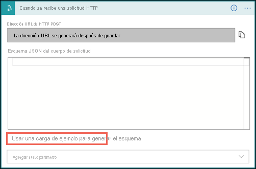
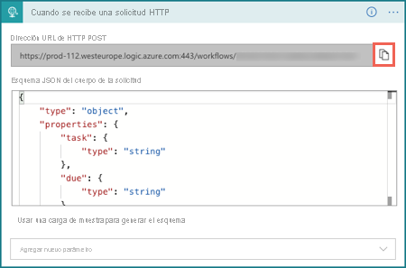
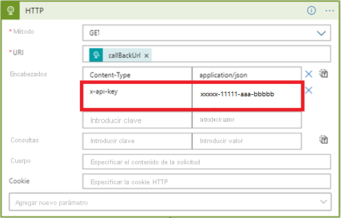
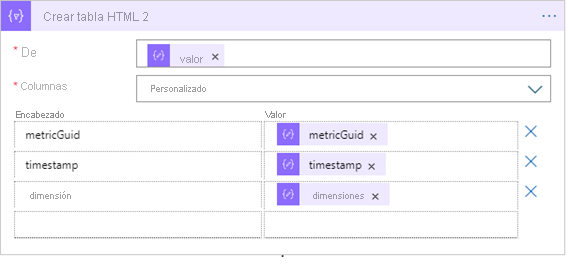
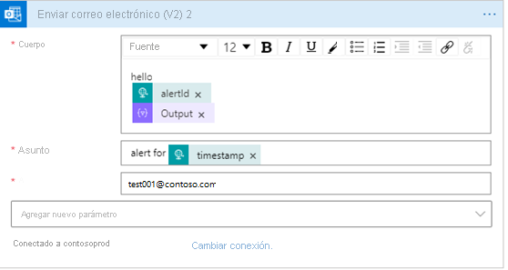
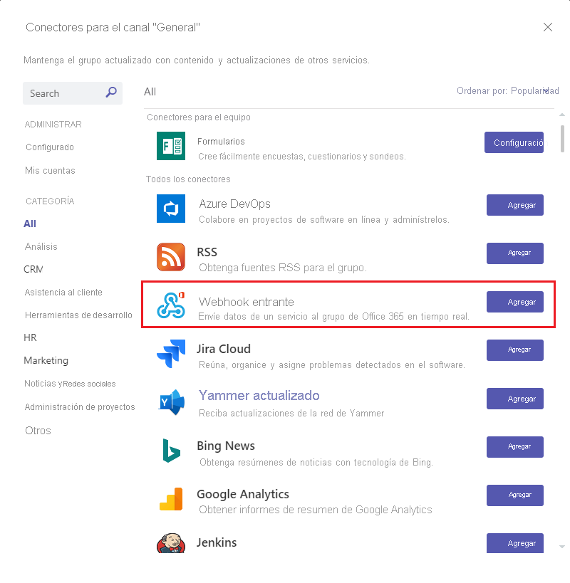
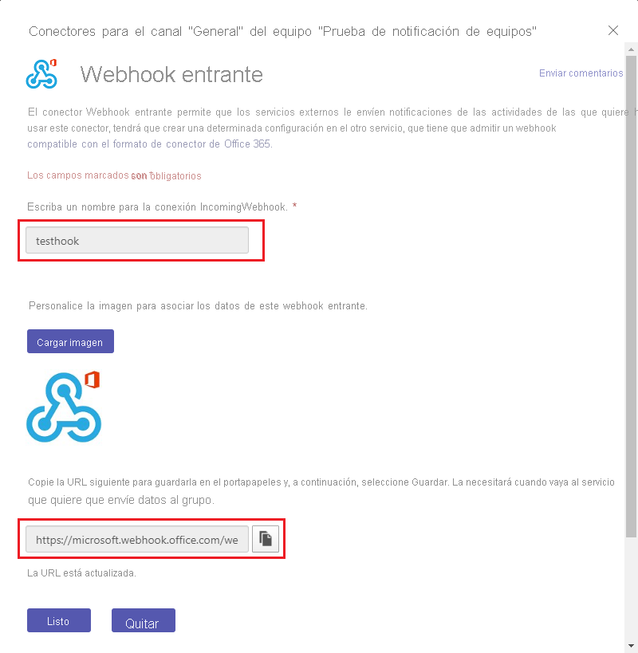
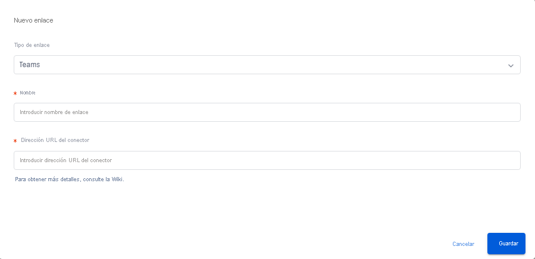
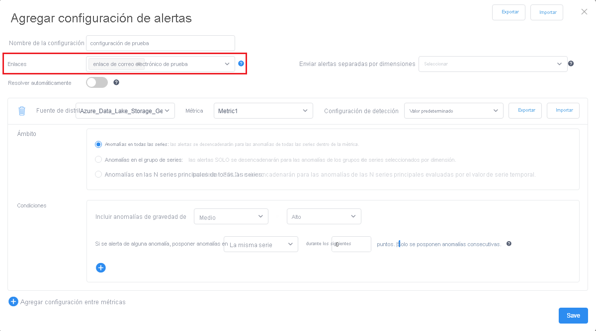

# <a name="tutorial-enable-anomaly-notification-in-metrics-advisor"></a>Tutorial: Habilitación de la notificación de anomalías en Metrics Advisor 

<!-- 2. Introductory paragraph 
Required. Lead with a light intro that describes, in customer-friendly language, 
what the customer will learn, or do, or accomplish. Answer the fundamental “why 
would I want to do this?” question. Keep it short.
-->


<!-- 3. Tutorial outline 
Required. Use the format provided in the list below.
-->

En este tutorial aprenderá a:

> [!div class="checklist"]
> * Crear un enlace en Metrics Advisor
> * Enviar notificaciones con Azure Logic Apps
> * Enviar notificaciones a Microsoft Teams
> * Enviar notificaciones mediante el servidor SMTP

<!-- 4. Prerequisites 
Required. First prerequisite is a link to a free trial account if one exists. If there 
are no prerequisites, state that no prerequisites are needed for this tutorial.
-->

## <a name="prerequisites"></a>Requisitos previos
### <a name="create-a-metrics-advisor-resource"></a>Creación de un recurso de Metrics Advisor

Para explorar las funcionalidades de Metrics Advisor, es posible que tenga que <a href="https://go.microsoft.com/fwlink/?linkid=2142156"  title="crear un recurso de Metrics Advisor"  target="_blank">create a Metrics Advisor resource </a> en Azure Portal para implementar la instancia de Metrics Advisor.

### <a name="create-a-hook-in-metrics-advisor"></a>Creación de un enlace en Metrics Advisor
Un enlace de Metrics Advisor es un puente que permite al cliente suscribirse a anomalías de métricas y enviar notificaciones por medio de diferentes canales. En Metrics Advisor hay cuatro tipos de enlaces: 
    
- Enlace de correo electrónico
- webhook
- Enlace de Teams
- Enlace de Azure DevOps

Cada tipo de enlace se corresponde a un canal específico por el que se notificará la anomalía. 

<!-- 5. H2s
Required. Give each H2 a heading that sets expectations for the content that follows. 
Follow the H2 headings with a sentence about how the section contributes to the whole.
-->

## <a name="send-notifications-with-logic-apps-teams-and-smtp"></a>Envío de notificaciones con Logic Apps, Teams y SMTP

#### <a name="logic-apps"></a>[Logic Apps](#tab/logic)

### <a name="send-email-notification-by-using-azure-logic-apps"></a>Envío de notificaciones mediante Azure Logic Apps

<!-- Introduction paragraph -->
En Metrics Advisor se admiten dos opciones comunes para enviar notificaciones por correo electrónico. Una consiste en usar webhooks y Azure Logic Apps para enviar alertas por correo electrónico; la otra consiste en configurar un servidor SMTP y usarlo para enviar directamente las alertas por correo electrónico. Esta sección se centrará en la primera opción, que es más fácil para los clientes que no tienen un servidor SMTP disponible.

**Paso 1**: Creación de un webhook en Metrics Advisor

Un webhook es el punto de entrada de toda la información disponible en el servicio Metrics Advisor y llama a una API proporcionada por el usuario cuando se desencadena una alerta. Todas las alertas se pueden enviar por medio de un webhook.

Seleccione la pestaña **Enlaces** en el área de trabajo de Metrics Advisor y después el botón **Create hook** (Crear enlace). Elija un tipo de **enlace web**. Rellene los parámetros obligatorios y seleccione **Aceptar**. Para ver los pasos detallados, consulte [Creación de un webhook](../how-tos/alerts.md#web-hook).

Hay un parámetro adicional de **Punto de conexión** que debe rellenar y podría hacerlo después de completar el paso 3 siguiente. 


**Paso 2**: Creación de un recurso de Logic Apps

En [Azure Portal](https://portal.azure.com), cree una aplicación lógica vacía mediante las instrucciones de [Creación de una aplicación lógica](../../../logic-apps/quickstart-create-first-logic-app-workflow.md). Cuando aparezca el **diseñador de Logic Apps**, vuelva a este tutorial.


**Paso 3**: Adición de un desencadenador **Cuando se recibe una solicitud HTTP**

- En Azure Logic Apps se usan varias acciones para desencadenar flujos de trabajo definidos. En este caso de uso, se usa el desencadenador **Cuando se recibe una solicitud HTTP**. 

- En el cuadro de diálogo **Cuando se recibe una solicitud HTTP**, seleccione **Usar una carga de ejemplo para generar el esquema**.

    

    Copie el siguiente código JSON de ejemplo en el cuadro de texto y seleccione **Listo**.

    ```json
    {
    "properties": {
        "value": {
            "items": {
                "properties": {
                    "alertInfo": {
                        "properties": {
                            "alertId": {
                                "type": "string"
                            },
                            "anomalyAlertingConfigurationId": {
                                "type": "string"
                            },
                            "createdTime": {
                                "type": "string"
                            },
                            "modifiedTime": {
                                "type": "string"
                            },
                            "timestamp": {
                                "type": "string"
                            }
                        },
                        "type": "object"
                    },
                    "alertType": {
                        "type": "string"
                    },
                    "callBackUrl": {
                        "type": "string"
                    },
                    "hookId": {
                        "type": "string"
                    }
                },
                "required": [
                    "hookId",
                    "alertType",
                    "alertInfo",
                    "callBackUrl"
                ],
                "type": "object"
            },
            "type": "array"
        }
    },
    "type": "object"
     }
    ```

- Elija el método como "POST" y seleccione **Guardar**. Aparecerá la dirección URL del desencadenador de solicitudes HTTP. Seleccione el icono de copia para copiarla y rellénela en el **Punto de conexión** del paso 1. 

    

**Paso 4.** Adición de un paso siguiente mediante la acción "HTTP"

Las señales que se insertan por medio del webhook solo contienen información limitada, como la marca de tiempo, alertID, configurationID, etc. Es necesario consultar información detallada mediante la dirección URL de devolución de llamada proporcionada en la señal. Este paso consiste en consultar información detallada de las alertas.  

- Elección de un método "GET"
- Seleccione "callBackURL" en la lista "Contenido dinámico" de "URI".
- Escriba una clave "Content-Type" en "Headers" (Encabezados) y escriba un valor de "application/json".
- Escriba una clave "x-api-key" en "Headers" (Encabezados) y haga clic en la pestaña **"Claves de API"** del área de trabajo de Metrics Advisor. Este paso es para asegurarse de que el flujo de trabajo tiene permisos suficientes para las llamadas API.

    

**Paso 5.** Adición de un paso siguiente para "analizar JSON" 

Tendrá que analizar la respuesta de la API para facilitar el formato del contenido del correo electrónico. 
 
> [!NOTE] 
> En este tutorial solo se comparte un ejemplo rápido; el formato del correo electrónico final se debe diseñar todavía más. 

- Seleccione "Cuerpo" en la lista "Contenido dinámico" en "Contenido".
- Seleccione **Usar una carga de ejemplo para generar el esquema**. Copie el siguiente código JSON de ejemplo en el cuadro de texto y seleccione **Listo**.

```json
{
    "properties": {
        "@@nextLink": {},
        "value": {
            "items": {
                "properties": {
                    "properties": {
                        "properties": {
                            "IncidentSeverity": {
                                "type": "string"
                            },
                            "IncidentStatus": {
                                "type": "string"
                            }
                        },
                        "type": "object"
                    },
                    "rootNode": {
                        "properties": {
                            "createdTime": {
                                "type": "string"
                            },
                            "detectConfigGuid": {
                                "type": "string"
                            },
                            "dimensions": {
                                "properties": {
                                },
                                "type": "object"
                            },
                            "metricGuid": {
                                "type": "string"
                            },
                            "modifiedTime": {
                                "type": "string"
                            },
                            "properties": {
                                "properties": {
                                    "AnomalySeverity": {
                                        "type": "string"
                                    },
                                    "ExpectedValue": {}
                                },
                                "type": "object"
                            },
                            "seriesId": {
                                "type": "string"
                            },
                            "timestamp": {
                                "type": "string"
                            },
                            "value": {
                                "type": "number"
                            }
                        },
                        "type": "object"
                    }
                },
                "required": [
                    "rootNode",
                    "properties"
                ],
                "type": "object"
            },
            "type": "array"
        }
    },
    "type": "object"
}
```

**Paso 6.** Adición de un paso siguiente a "crear tabla HTML"

Se ha devuelto una gran cantidad de información de la llamada API, pero, en función de los escenarios, es posible que no toda la información sea útil. Elija los elementos que le interesan y que le gustaría incluir en el correo electrónico de alerta. 

A continuación se muestra un ejemplo de una tabla HTML en el que se eligen "timestamp", "metricGUID" y "dimension" para incluirlos en el correo electrónico de alerta.



**Paso 7.** Adición del paso final para "enviar un correo electrónico"

Hay varias opciones para enviar correo electrónico, tanto hospedadas por Microsoft como ofertas de terceros. Es posible que el cliente deba tener un inquilino o una cuenta para la opción elegida. Por ejemplo, al elegir "Office 365 Outlook" como servidor. El proceso de inicio de sesión se realizará para crear la conexión y la autorización. Se establecerá una conexión de API para usar el servidor de correo electrónico para enviar las alertas. 

Rellene el contenido que quiera incluir en "Cuerpo", asigne un "Asunto" al correo electrónico y rellene una dirección de correo electrónico en "Para". 


                                                                   
#### <a name="teams-channel"></a>[Canal de Teams](#tab/teams)
                                           
### <a name="send-anomaly-notification-through-a-microsoft-teams-channel"></a>Envío de notificaciones de anomalías por medio de un canal de Microsoft Teams                            
En esta sección se describirá el procedimiento de envío de notificaciones de anomalías por medio de un canal de Microsoft Teams. Esto puede ayudar a habilitar escenarios en los que los miembros del equipo colaboran en el análisis de anomalías detectadas por Metrics Advisor. El flujo de trabajo es fácil de configurar y no tiene un gran número de requisitos previos. 
                                               


**Paso 1**: Adición de un conector "Webhook entrante" al canal de Teams

- Vaya al canal de Teams al que quiera enviar la notificación y seleccione "•••" (Más opciones). 
- En la lista desplegable, seleccione "Conectores". En el cuadro de diálogo nuevo, busque "Webhook entrante" y haga clic en "Agregar".

        

- Si no puede ver la opción "Conectores", póngase en contacto con los propietarios del grupo de Teams. Seleccione "Administrar equipo", seleccione la pestaña "Configuración" en la parte superior y compruebe si la opción "Permitir a los miembros crear, actualizar y quitar conectores" está activada.

        

- Introduzca un nombre para el conector y también puede cargar una imagen que se use como avatar. Seleccione "Crear" y, después, el conector de webhook entrante se agrega correctamente al canal. Se generará una dirección URL en la parte inferior del cuadro de diálogo; asegúrese de seleccionar **"Copiar"** y después "Listo". 

     

**Paso 2**: Creación de un "Enlace de Teams" en Metrics Advisor

- Seleccione la pestaña "Enlaces" en la barra de navegación de la izquierda y después el botón "Crear enlace" en la parte superior derecha de la página. 
- Elija el tipo de enlace "Teams", escriba un nombre y pegue la dirección URL que ha copiado del paso anterior. 
- Seleccione "Save" (Guardar). 

     

**Paso 3**: Aplicación del enlace de Teams a una configuración de alerta

Seleccione una de las fuentes de distribución de datos que ha incorporado. Seleccione una métrica dentro de la fuente y abra la página de detalles de métricas. Puede crear una "configuración de alertas" para suscribirse a las anomalías detectadas y notificadas por medio de un canal de Teams. 

Seleccione el botón "+" y elija el enlace que ha creado, rellene los campos y seleccione "Guardar". Ya está listo para aplicar un enlace de Teams a una configuración de alerta. Las nuevas anomalías se notificarán por medio del canal de Teams.


#### <a name="smtp-e-mail"></a>[Correo electrónico SMTP](#tab/smtp)

### <a name="send-email-notification-by-configuring-an-smtp-server"></a>Envío de notificaciones por correo electrónico mediante la configuración de un servidor SMTP

En esta sección se compartirá el procedimiento de usar un servidor SMTP para enviar notificaciones por correo electrónico sobre las anomalías detectadas. Asegúrese de que tiene un servidor SMTP utilizable y que tiene permisos suficientes para obtener parámetros como el nombre de cuenta y la contraseña.

**Paso 1**: Asignación de la cuenta como el rol "Administrador de Metrics Advisor de Cognitive Service"  

- Un usuario con privilegios de administrador de la suscripción o de administrador del grupo de recursos debe ir al recurso de Metrics Advisor que se ha creado en Azure Portal y seleccionar la pestaña Control de acceso (IAM).
- Seleccione "Agregar asignación de roles".
- Elija un rol de "Administrador de Metrics Advisor de Cognitive Services" y seleccione la cuenta, como en la imagen siguiente.
- Seleccione el botón "Guardar" y, con esto, ya se le habrá agregado correctamente como administrador del recurso de Metrics Advisor. Todas las acciones anteriores las debe realizar el administrador de la suscripción o el administrador del grupo de recursos. Los permisos pueden tardar hasta un minuto en propagarse. 


**Paso 2**: Configuración del servidor SMTP en el área de trabajo de Metrics Advisor

Una vez que haya completado los pasos anteriores y se haya agregado correctamente como administrador del recurso de Metrics Advisor, espere unos minutos hasta que se propaguen los permisos. Después, inicie sesión en el área de trabajo de Metrics Advisor; debería poder ver una nueva pestaña denominada "Configuración de correo electrónico" en el panel de navegación de la izquierda. Selecciónela para continuar con la configuración. 

Los parámetros que debe rellenar son los siguientes: 

- Nombre del servidor SMTP (**obligatorio**): rellene el nombre del proveedor del servidor SMTP; la mayoría de los nombres de servidor se escriben con el formato "smtp.dominio.com" o "mail.dominio.com". Tome Office365 como ejemplo; se debe establecer como "smtp.office365.com". 
- Puerto del servidor SMTP (**obligatorio**): el puerto 587 es el predeterminado para el envío de SMTP en la web moderna. Aunque puede usar otros puertos para el envío (como se verá más adelante), siempre debe empezar con el puerto 587 como valor predeterminado y solo usar otro si las circunstancias lo exigen (por ejemplo, el host bloquea el puerto 587 por algún motivo).
- Remitentes de correo electrónico (**obligatorio**): esta es la cuenta de correo electrónico real que asume la responsabilidad de enviar correos electrónicos. Es posible que tenga que rellenar el nombre de cuenta y la contraseña del remitente. Puede establecer un umbral de cuota para el número máximo de correos electrónicos de alerta que se enviarán en un minuto para una cuenta. Puede establecer varios remitentes si existe la posibilidad de que se envíe un gran volumen de alertas en un minuto, pero al menos se debe establecer una cuenta. 
- Enviar en nombre de (opcional): si tiene varios remitentes configurados, pero quiere que los correos electrónicos de alerta parezcan enviarse desde una cuenta. Puede usar este campo para alinearlos. Pero recuerde que es posible que tenga que conceder permiso a los remitentes para permitir el envío de correos electrónicos en nombre de su cuenta.  
- CC predeterminado (opcional): para establecer una dirección de correo electrónico predeterminada que se incluirá como copia en todas las alertas de correo electrónico. 

A continuación se muestra un ejemplo de un servidor SMTP configurado:


**Paso 3**: Creación de un enlace de correo electrónico en Metrics Advisor

Después de configurar correctamente un servidor SMTP, está preparado para crear un "enlace de correo electrónico" en la pestaña "Enlaces" de Metrics Advisor. Para obtener más información sobre cómo crear un "enlace de correo electrónico", consulte el [artículo sobre alertas](../how-tos/alerts.md#email-hook) y siga los pasos para completarlo.

**Paso 4.** Aplicación del enlace de correo electrónico a una configuración de alerta

 Seleccione una de las fuentes de distribución de datos que ha incorporado, seleccione una métrica dentro de la fuente y abra la página de detalles de métricas. Puede crear una "configuración de alertas" para suscribirse a las anomalías detectadas y enviadas por correo electrónico. 

Seleccione el botón "+" y elija el enlace que ha creado, rellene los campos y seleccione "Guardar". Ya ha configurado correctamente un enlace de correo electrónico con una configuración de alerta personalizada y las nuevas anomalías se escalarán por medio del enlace mediante el servidor SMTP. 



---

## <a name="next-steps"></a>Pasos siguientes

Pase al siguiente artículo, donde aprenderá a
> [!div class="nextstepaction"]
> [Escritura de una consulta válida](write-a-valid-query.md)

<!--
Remove all the comments in this template before you sign-off or merge to the 
main branch.
-->
