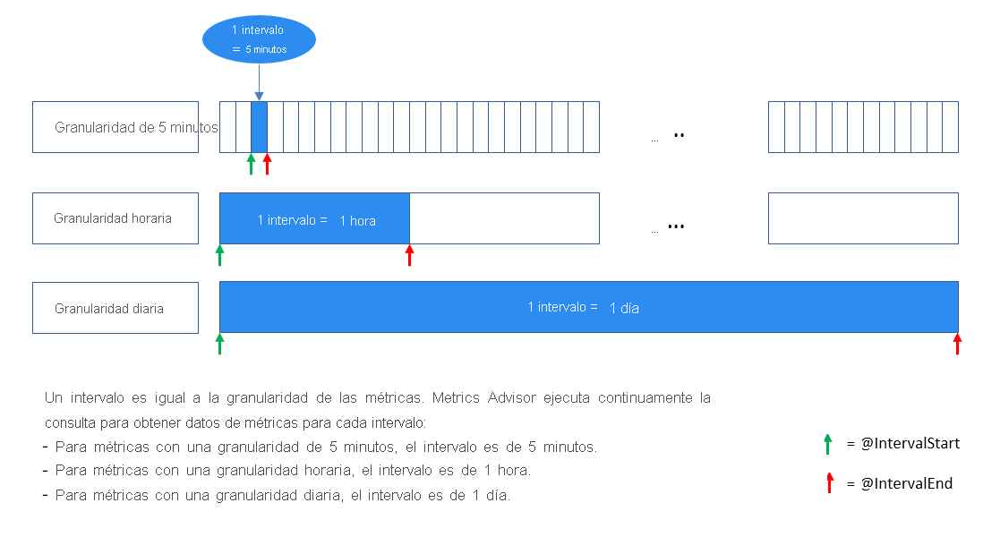
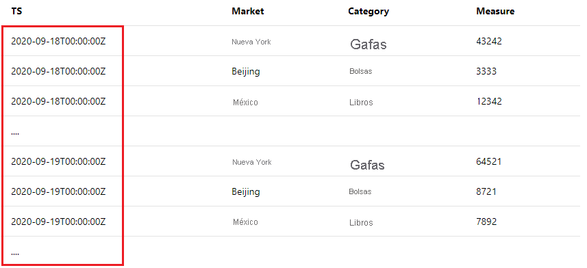
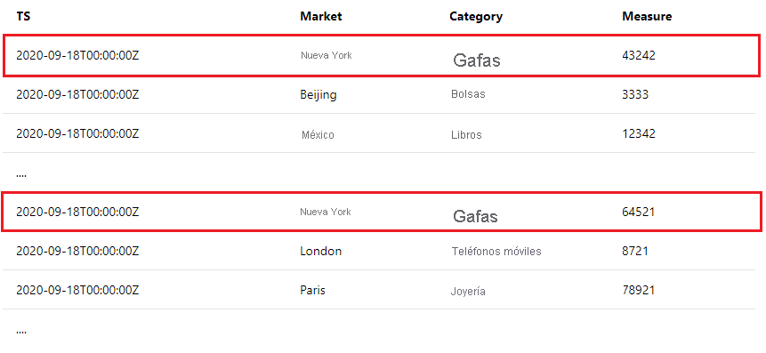

<!--
Remove all the comments in this template before you sign-off or merge to the 
main branch.
-->

<!--
This template provides the basic structure of a tutorial article.
See the [tutorial guidance](contribute-how-to-mvc-tutorial.md) in the contributor guide.

To provide feedback on this template contact 
[the templates workgroup](mailto:templateswg@microsoft.com).
-->

<!-- 1. H1 
Required. Start with "Tutorial: ". Make the first word following "Tutorial: " a 
verb.
-->

# <a name="tutorial-write-a-valid-query-to-onboard-metrics-data"></a>Tutorial: Escritura de una consulta válida para incorporar datos de métricas

<!-- 2. Introductory paragraph 
Required. Lead with a light intro that describes, in customer-friendly language, 
what the customer will learn, or do, or accomplish. Answer the fundamental “why 
would I want to do this?” question. Keep it short.
-->


<!-- 3. Tutorial outline 
Required. Use the format provided in the list below.
-->

En este tutorial aprenderá a:

> [!div class="checklist"]
> * Escritura de una consulta de incorporación de datos válida
> * Errores comunes y cómo evitarlos

<!-- 4. Prerequisites 
Required. First prerequisite is a link to a free trial account if one exists. If there 
are no prerequisites, state that no prerequisites are needed for this tutorial.
-->

## <a name="prerequisites"></a>Requisitos previos

### <a name="create-a-metrics-advisor-resource"></a>Creación de un recurso de Metrics Advisor

Para explorar las funcionalidades de Metrics Advisor, es posible que tenga que <a href="https://go.microsoft.com/fwlink/?linkid=2142156"  title="Creación de un recurso de Metrics Advisor"  target="_blank">crear un recurso de Metrics Advisor </a> en Azure Portal para implementar la instancia de Metrics Advisor.

<!-- 5. H2s
Required. Give each H2 a heading that sets expectations for the content that follows. 
Follow the H2 headings with a sentence about how the section contributes to the whole.
-->

## <a name="data-schema-requirements"></a>Requisitos del esquema de datos
<!-- Introduction paragraph -->

[!INCLUDE [data schema requirements](../includes/data-schema-requirements.md)]


## <a name="span-idingestion-workhow-does-data-ingestion-work-in-metrics-advisorspan"></a><span id="ingestion-work">¿Cómo funciona la ingesta de datos en Metrics Advisor?</span>

Por lo general, hay dos maneras de incorporar las métricas a Metrics Advisor:
<!-- Introduction paragraph -->
- Agregue previamente las métricas en el esquema esperado y almacene los datos en determinados archivos. Rellene la plantilla de ruta de acceso durante la incorporación y Metrics Advisor capturará continuamente nuevos archivos desde la ruta de acceso y realizará la detección en las métricas. Se trata de una práctica común para un origen de datos como Azure Data Lake y Azure Blob Storage.
- Si va a ingerir datos desde orígenes de datos como Azure SQL Server, Azure Data Explorer u otros orígenes, que admiten el uso de un script de consulta, entonces necesita asegurarse de que está construyendo correctamente la consulta. En este artículo se le enseñará a escribir una consulta válida para incorporar datos de métricas según lo previsto. 


### <a name="what-is-an-interval"></a>¿Qué es un intervalo?

Las métricas deben supervisarse con una granularidad determinada según los requisitos empresariales. Por ejemplo, los indicadores clave de rendimiento (KPI) empresariales se supervisan con granularidad diaria. Sin embargo, las métricas de rendimiento del servicio a menudo se supervisan en granularidad por minuto/hora. Por lo tanto, la frecuencia para recopilar datos de métricas de los orígenes es diferente. 

Metrics Advisor captura continuamente datos de métricas en cada intervalo de tiempo, **el intervalo es igual a la granularidad de las métricas.** Cada vez que Metrics Advisor ejecuta la consulta que ha escrito, ingiere datos en este intervalo específico. En función de este mecanismo de ingesta de datos, el script de consulta **no debe devolver todos los datos de métricas que existen en la base de datos, pero debe limitar el resultado a un intervalo único.**



## <a name="how-to-write-a-valid-query"></a>Escritura de una consulta válida
<!-- Introduction paragraph -->
### <a name="span-iduse-parameters-use-intervalstart-and-intervalend-to-limit-query-resultsspan"></a><span id="use-parameters"> Uso de @IntervalStart y @IntervalEnd para limitar los resultados de la consulta</span>

 Para ayudar a lograrlo, se han proporcionado dos parámetros para usarlos dentro de la consulta: **@IntervalStart** y **@IntervalEnd** . 

Cada vez que se ejecuta la consulta, @IntervalStart y @IntervalEnd se actualizarán automáticamente a la marca de tiempo del intervalo más reciente y obtiene los datos de métricas correspondientes. @IntervalEnd siempre se asigna como granularidad @IntervalStart + 1. 

Este es un ejemplo del uso adecuado de estos dos parámetros con Azure SQL Server: 

```SQL
SELECT [timestampColumnName] AS timestamp, [dimensionColumnName], [metricColumnName] FROM [sampleTable] WHERE [timestampColumnName] >= @IntervalStart and [timestampColumnName] < @IntervalEnd;
```

Al escribir el script de consulta de esta manera, las marcas de tiempo de las métricas deben estar en el mismo intervalo para cada resultado de la consulta. Metrics Advisor alineará automáticamente las marcas de tiempo con la granularidad de las métricas. 

### <a name="span-iduse-aggregation-use-aggregation-functions-to-aggregate-metricsspan"></a><span id="use-aggregation"> Uso de funciones de agregación para agregar métricas</span>

Es habitual que haya muchas columnas dentro de los orígenes de datos de los clientes; sin embargo, no tiene sentido que todas ellas se supervisen o incluyan como una dimensión. Los clientes pueden usar funciones de agregación para agregar métricas y solo incluir columnas significativas como dimensiones.

A continuación se muestra un ejemplo en el que hay más de diez columnas en el origen de datos de un cliente, pero solo algunas de ellas son significativas y deben incluirse en una métrica que se va a supervisar y agregarse a esta. 

| TS | Mercado | Sistema operativo del dispositivo | Category | ... | Medida1 | Medida2 | Medida3 |
| ----------|--------|-----------|----------|-----|----------|----------|----------|
| 2020-09-18T12:23:22Z | Nueva York | iOS | Gafas | ...| 43242 | 322 | 54546|
| 2020-09-18T12:27:34Z | Beijing | Android | Bolsas | ...| 3333 | 126 | 67677 |
| ...

Si el cliente desea supervisar **"Medida1"** con **granularidad por hora** y elegir **"Mercado"** y **"Categoría"** como dimensiones, a continuación se muestran ejemplos de cómo hacer un uso adecuado de las funciones de agregación para lograrlo: 

- Ejemplo de SQL:  

    ```sql
        SELECT dateadd(hour, datediff(hour, 0, TS),0) as NewTS
        ,Market
        ,Category
        ,sum(Measure1) as M1
        FROM [dbo].[SampleTable] where TS >= @IntervalStart and TS < @IntervalEnd
        group by Market, Category, dateadd(hour, datediff(hour, 0, TS),0)
    ```
- Ejemplo de Azure Data Explorer:

    ```kusto
        SampleTable
        | where TS >= @IntervalStart and TS < @IntervalEnd
        | summarize M1 = sum(Measure1) by Market, Category, NewTS = startofhour(TS)
    ```    

> [!Note]
> En el caso anterior, al cliente le gustaría supervisar las métricas con una granularidad horaria, pero la marca de tiempo (TS) sin procesar no está alineada. Dentro de la instrucción de agregación, **se requiere un proceso en la marca de tiempo** para alinearse con la hora y generar una nueva columna de marca de tiempo denominada "NewTS". 


## <a name="common-errors-during-onboarding"></a>Errores comunes durante la incorporación

- **Error:** Se encuentran varios valores de marca de tiempo en los resultados de la consulta

    Se trata de un error común, si no ha limitado los resultados de la consulta en un intervalo. Por ejemplo, si está supervisando una métrica con una granularidad diaria, recibirá este error si la consulta devuelve resultados como este: 

    
    
    Hay varios valores de marca de tiempo y no están en el mismo intervalo de métricas (un día). Consulte [Funcionamiento de la ingesta de datos en Metrics Advisor](#ingestion-work) y comprenda que Metrics Advisor captura datos de métricas en cada intervalo de métricas. A continuación, asegúrese de usar **@IntervalStart** y **@IntervalEnd** en la consulta para limitar los resultados en un intervalo. Consulte [Uso de @IntervalStart y @IntervalEnd para limitar los resultados de la consulta](#use-parameters) para obtener instrucciones detalladas y ejemplos. 


- **Error:** Los valores de métrica duplicados se encuentran en la misma combinación de dimensiones dentro de un intervalo de métricas
    
    Dentro de un intervalo, Metrics Advisor espera solo un valor de métrica para las mismas combinaciones de dimensiones. Por ejemplo, si está supervisando una métrica con una granularidad diaria, recibirá este error si la consulta devuelve resultados como este:

    

    Consulte [Uso de funciones de agregación para agregar métricas](#use-aggregation) para obtener instrucciones detalladas y ejemplos. 

<!-- 7. Next steps
Required: A single link in the blue box format. Point to the next logical tutorial 
in a series, or, if there are no other tutorials, to some other cool thing the 
customer can do. 
-->

## <a name="next-steps"></a>Pasos siguientes

Pase al siguiente artículo, donde aprenderá a crear.
> [!div class="nextstepaction"]
> [Habilitación de notificaciones de anomalías](enable-anomaly-notification.md)

<!--
Remove all the comments in this template before you sign-off or merge to the 
main branch.
