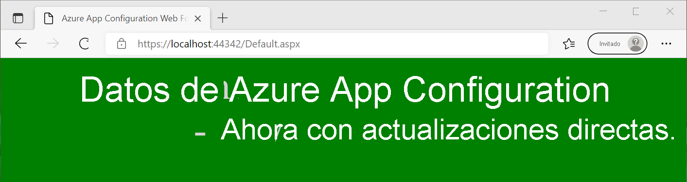

# <a name="tutorial-use-dynamic-configuration-in-an-aspnet-web-application-net-framework"></a>Tutorial: Uso de la configuración dinámica en una aplicación web ASP.NET (.NET Framework)

Los datos de App Configuration pueden cargarse como configuración de aplicación en una aplicación de .NET Framework. Para obtener más información, consulte el [inicio rápido](./quickstart-dotnet-app.md). Sin embargo, según el diseño de .NET Framework, la configuración de la aplicación solo se puede actualizar tras el reinicio de la aplicación. El proveedor .NET de App Configuration es una biblioteca .NET Standard. Admite el almacenamiento en caché y la actualización dinámica de la configuración sin reiniciar la aplicación. En este tutorial se muestra cómo puede implementar actualizaciones dinámicas de configuración en una aplicación ASP.NET Web Forms. Esta misma técnica se aplica a las aplicaciones MVC de .NET Framework.

En este tutorial, obtendrá información sobre cómo:

> [!div class="checklist"]
> * Configurar la aplicación web ASP.NET para actualizar su configuración como respuesta a los cambios en un almacén de App Configuration.
> * Insertar la configuración más reciente en las solicitudes a la aplicación.

## <a name="prerequisites"></a>Prerrequisitos

- Una suscripción a Azure: [cree una cuenta gratuita](https://azure.microsoft.com/free/)
- [Visual Studio](https://visualstudio.microsoft.com/vs)
- [.NET Framework 4.7.2 o una versión posterior](https://dotnet.microsoft.com/download/dotnet-framework)

## <a name="create-an-app-configuration-store"></a>Creación de un almacén de App Configuration

[!INCLUDE[Azure App Configuration resource creation steps](../../includes/azure-app-configuration-create.md)]

7. Seleccione **Operaciones** > **Explorador de configuración** > **Crear** > **Clave-valor** para agregar los siguientes pares clave-valor:

    | Key                                | Value                               |
    |------------------------------------|-------------------------------------|
    | *TestApp:Settings:BackgroundColor* | *Blanco*                             |
    | *TestApp:Settings:FontColor*       | *Negro*                             |
    | *TestApp:Settings:FontSize*        | *40*                                |
    | *TestApp:Settings:Message*         | *Datos de Azure App Configuration* |
    | *TestApp:Settings:Sentinel*        | *v1*                                |

    Deje **Etiqueta** y **Tipo de contenido** vacíos.

## <a name="create-an-aspnet-web-application"></a>Creación de una aplicación web ASP.NET

1. Inicie Visual Studio y seleccione **Crear un proyecto**.

1. Seleccione **Aplicación web ASP.NET (.NET Framework)** con C# en la lista de plantillas de proyecto y presione **Siguiente**.

1. En **Configurar el nuevo proyecto**, asígnele al proyecto un nombre. En **Marco**, seleccione **.NET Framework 4.7.2** o una versión posterior. Pulse **Crear**.

1. En **Crear una aplicación web ASP.NET**, seleccione **Web Forms**. Pulse **Crear**.

## <a name="reload-data-from-app-configuration"></a>Recarga de datos de App Configuration

1. Haga clic con el botón derecho en el proyecto y seleccione **Administrar paquetes NuGet**. En la pestaña **Examinar**, busque y agregue la versión más reciente del siguiente paquete NuGet al proyecto.

   *Microsoft.Extensions.Configuration.AzureAppConfiguration*

1. Abra el archivo *Global.asax.cs* y agregue los siguientes espacios de nombres.
    ```csharp
    using Microsoft.Extensions.Configuration;
    using Microsoft.Extensions.Configuration.AzureAppConfiguration;
    ```

1. Agregue las siguientes variables miembro estáticas a la clase `Global`.
    ```csharp
    public static IConfiguration Configuration;
    private static IConfigurationRefresher _configurationRefresher;
    ```

1. Agregue un método `Application_Start` a la clase `Global`. Si el método ya existe, agréguele el código siguiente.
    ```csharp
    protected void Application_Start(object sender, EventArgs e)
    {
        ConfigurationBuilder builder = new ConfigurationBuilder();
        builder.AddAzureAppConfiguration(options =>
        {
            options.Connect(Environment.GetEnvironmentVariable("ConnectionString"))
                    // Load all keys that start with `TestApp:`.
                    .Select("TestApp:*")
                    // Configure to reload configuration if the registered key 'TestApp:Settings:Sentinel' is modified.
                    .ConfigureRefresh(refresh => 
                    {
                        refresh.Register("TestApp:Settings:Sentinel", refreshAll:true);
                               .SetCacheExpiration(new TimeSpan(0, 5, 0));
                    });
            _configurationRefresher = options.GetRefresher();
        });

        Configuration = builder.Build();
    }
    ```
    Se llama al método `Application_Start` en la primera solicitud a la aplicación web. Solo se le llama una vez durante el ciclo de vida de la aplicación. Por lo tanto, es un buen lugar para inicializar el objeto `IConfiguration` y cargar datos desde App Configuration.

    En el método `ConfigureRefresh`, se registra una clave dentro del almacén de App Configuration para la supervisión de cambios. El parámetro `refreshAll` del método `Register` indica que se deben actualizar todos los valores de configuración si cambia la clave registrada. En este ejemplo, la clave *TestApp:Settings:Sentinel* es una clave de *Sentinel* especial que se actualiza después de completar el cambio de todas las demás claves. Cuando se detecta un cambio, la aplicación actualiza todos los valores de configuración. Este enfoque ayuda a garantizar la coherencia de la configuración en la aplicación en comparación con la supervisión de todos los cambios en todas las claves.
    
    El método `SetCacheExpiration` especifica el tiempo mínimo que debe transcurrir antes de que se realice una nueva solicitud a App Configuration para comprobar si hay cambios de configuración. En este ejemplo, se reemplaza el tiempo de expiración predeterminado de 30 segundos y se especifica un tiempo de 5 minutos en su lugar. Esto reduce el número posible de solicitudes realizadas al almacén de App Configuration.


1. Agregue un método `Application_BeginRequest` a la clase `Global`. Si el método ya existe, agréguele el código siguiente.
    ```csharp
    protected void Application_BeginRequest(object sender, EventArgs e)
    {
        _ = _configurationRefresher.TryRefreshAsync();
    }
    ```
    La llamada al método `ConfigureRefresh` por sí sola no hará que la configuración se actualice automáticamente. Para indicar una actualización, se llama al método `TryRefreshAsync` al principio de cada solicitud. Este diseño garantiza que la aplicación solo envía solicitudes a App Configuration cuando está activamente recibiendo solicitudes. 
    
    La llamada a `TryRefreshAsync` es una operación sin efecto antes de que pase el tiempo de expiración de la caché configurada, por lo que su impacto en el rendimiento es mínimo. Cuando se realiza una solicitud a App Configuration, como no se espera en la tarea, la configuración se actualiza de forma asincrónica sin bloquear la ejecución de la solicitud actual. Es posible que la solicitud actual no obtenga los valores de configuración actualizados, pero sí lo harán las solicitudes posteriores.

    Si se produce un error en la llamada a `TryRefreshAsync` por cualquier motivo, la aplicación seguirá usando la configuración almacenada en caché. Se realizará otro intento cuando haya vuelto a pasar el tiempo de expiración de la caché configurada y una nueva solicitud a la aplicación vuelva a desencadenar la llamada a `TryRefreshAsync`.

## <a name="use-the-latest-configuration-data"></a>Uso de los datos de configuración más recientes

1. Abra *Default.aspx* y reemplace su contenido por el marcado siguiente. Asegúrese de que el atributo *Inherits* coincide con el espacio de nombres y el nombre de clase de la aplicación.
    ```xml
    <%@ Page Language="C#" AutoEventWireup="true" CodeBehind="Default.aspx.cs" Inherits="WebFormApp.Default" %>

    <!DOCTYPE html>

    <html xmlns="http://www.w3.org/1999/xhtml">
    <head runat="server">
        <title>Azure App Configuration Web Forms Demo</title>
    </head>
    <body id="body" runat="server">
        <form id="form1" runat="server">
            <div style="text-align: center">
                <asp:Label ID="message" runat="server" />
            </div>
        </form>
    </body>
    </html>
    ```

1. Abra *Default.aspx.cs* y actualícelo con el código siguiente.
    ```cs
    using System;
    using System.Web.UI.WebControls;

    namespace WebFormApp
    {
        public partial class Default : System.Web.UI.Page
        {
            protected void Page_Load(object sender, EventArgs e)
            {
                // Read configuration from the IConfiguration object loaded from Azure App Configuration
                string messageText = Global.Configuration["TestApp:Settings:Message"] ?? "Please add the key \"TestApp:Settings:Message\" in your Azure App Configuration store.";
                string messageFontSize = Global.Configuration["TestApp:Settings:FontSize"] ?? "20";
                string messageFontColor = Global.Configuration["TestApp:Settings:FontColor"] ?? "Black";
                string backgroundColor = Global.Configuration["TestApp:Settings:BackgroundColor"] ?? "White";

                message.Text = messageText;
                message.Font.Size = FontUnit.Point(int.Parse(messageFontSize));
                message.ForeColor = System.Drawing.Color.FromName(messageFontColor);
                body.Attributes["bgcolor"] = backgroundColor;
            }
        }
    }
    ```

## <a name="build-and-run-the-application"></a>Compilación y ejecución de la aplicación

1. Establezca una variable de entorno llamada **ConnectionString** en la cadena de conexión de solo lectura obtenida durante la creación del almacén de App Configuration.

    Si usa el símbolo del sistema de Windows, ejecute el siguiente comando:
    ```console
    setx ConnectionString "connection-string-of-your-app-configuration-store"
    ```

    Si usa Windows PowerShell, ejecute el siguiente comando:
    ```powershell
    $Env:ConnectionString = "connection-string-of-your-app-configuration-store"
    ```

1. Reinicie Visual Studio para permitir que el cambio surta efecto. 

1. Presione Ctrl + F5 para compilar y ejecutar la aplicación web.

    

1. En Azure Portal, vaya al **Explorador de configuración** del almacén de App Configuration y actualice el valor de las claves siguientes. No olvide actualizar la clave de Sentinel *TestApp:Settings:Sentinel* al final.

    | Key                                | Value                                                        |
    |------------------------------------|--------------------------------------------------------------|
    | *TestApp:Settings:BackgroundColor* | *Verde*                                                      |
    | *TestApp:Settings:FontColor*       | *LightGray*                                                  |
    | *TestApp:Settings:Message*         | *Datos de Azure App Configuration: ahora con actualizaciones directas* |
    | *TestApp:Settings:Sentinel*        | *v2*                                                         |

1. Actualice la página del explorador para ver los nuevos valores de configuración. Es posible que necesite actualizar el explorador más de una vez para que se reflejen los cambios o que tenga que cambiar el tiempo de expiración de la caché para que sea inferior a 5 minutos. 

    

> [!NOTE]
> Puede descargar el código de ejemplo que se usa en este tutorial del [repositorio de GitHub de Azure App Configuration](https://github.com/Azure/AppConfiguration/tree/main/examples/DotNetFramework/WebFormApp).

## <a name="clean-up-resources"></a>Limpieza de recursos

[!INCLUDE [azure-app-configuration-cleanup](../../includes/azure-app-configuration-cleanup.md)]

## <a name="next-steps"></a>Pasos siguientes

En este tutorial, ha habilitado la aplicación ASP.NET Web Forms para actualizar dinámicamente los valores de configuración desde App Configuration. Para obtener información sobre cómo habilitar la configuración dinámica en una aplicación de .NET Framework, continúe con el siguiente tutorial:

> [!div class="nextstepaction"]
> [Habilitación de la configuración dinámica en aplicaciones de .NET Framework](./enable-dynamic-configuration-dotnet.md)

Para aprender a usar una identidad administrada de Azure para simplificar el acceso a App Configuration, vaya al siguiente tutorial:

> [!div class="nextstepaction"]
> [Integración de identidades administradas](./howto-integrate-azure-managed-service-identity.md)
