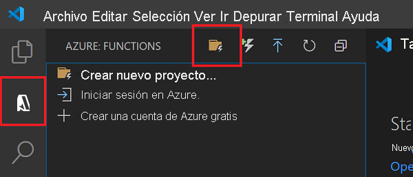

# Inicio rápido: Creación de una función de C# en Azure mediante Visual Studio Code

[!INCLUDE [functions-runtime-version-dotnet](../../includes/functions-runtime-version-dotnet.md)]

En este artículo se usa Visual Studio Code para crear una función C# que responda a solicitudes HTTP. Después de probar el código localmente, se implementa en el entorno sin servidor de Azure Functions.

::: zone pivot="programming-runtime-functions-v3"
[!INCLUDE [functions-dotnet-execution-model](../../includes/functions-dotnet-execution-model.md)]    
::: zone-end
::: zone pivot="programming-runtime-functions-v4"
> [!NOTE]
> Actualmente, Visual Studio Code admite la creación de funciones de C# que solo se ejecutan en .NET 6 mediante el [modelo de ejecución en proceso](functions-dotnet-class-library.md).
::: zone-end

Este inicio rápido supone un pequeño costo en su cuenta de Azure.

También hay una [versión basada en la CLI](create-first-function-cli-csharp.md) de este artículo.

## Configurar su entorno

Antes de empezar, asegúrese de que cumple los siguientes requisitos:

::: zone pivot="programming-runtime-functions-v3"
# [En proceso](#tab/in-process)

+ [SDK de .NET Core 3.1](https://dotnet.microsoft.com/download)

+ [Azure Functions Core Tools](functions-run-local.md#install-the-azure-functions-core-tools), versión 3.x.

+ [Visual Studio Code](https://code.visualstudio.com/) en una de las [plataformas admitidas](https://code.visualstudio.com/docs/supporting/requirements#_platforms).

+ [Extensión de C#](https://marketplace.visualstudio.com/items?itemName=ms-dotnettools.csharp) para Visual Studio Code.  

+ [Extensión de Azure Functions](https://marketplace.visualstudio.com/items?itemName=ms-azuretools.vscode-azurefunctions) para Visual Studio Code.

# [Proceso aislado](#tab/isolated-process)

+ [SDK de .NET 5.0](https://dotnet.microsoft.com/download)

+ [SDK de .NET Core 3.1](https://dotnet.microsoft.com/download). Requerido por el proceso de compilación.

+ [Azure Functions Core Tools](functions-run-local.md#install-the-azure-functions-core-tools), versión 3.x.

+ [Visual Studio Code](https://code.visualstudio.com/) en una de las [plataformas admitidas](https://code.visualstudio.com/docs/supporting/requirements#_platforms).

+ [Extensión de C#](https://marketplace.visualstudio.com/items?itemName=ms-dotnettools.csharp) para Visual Studio Code.  

+ [Extensión de Azure Functions](https://marketplace.visualstudio.com/items?itemName=ms-azuretools.vscode-azurefunctions) para Visual Studio Code.

---
::: zone-end
::: zone pivot="programming-runtime-functions-v4"
+ [SDK de .NET 6.0](https://dotnet.microsoft.com/download/dotnet/6.0)

+ [Azure Functions Core Tools](functions-run-local.md#install-the-azure-functions-core-tools), versión 4.x.

+ [Visual Studio Code](https://code.visualstudio.com/) en una de las [plataformas admitidas](https://code.visualstudio.com/docs/supporting/requirements#_platforms).

+ [Extensión de C#](https://marketplace.visualstudio.com/items?itemName=ms-dotnettools.csharp) para Visual Studio Code.  

+ [Extensión de Azure Functions](https://marketplace.visualstudio.com/items?itemName=ms-azuretools.vscode-azurefunctions) para Visual Studio Code.
::: zone-end

También necesita una cuenta de Azure con una suscripción activa. [Cree una cuenta gratuita](https://azure.microsoft.com/free/?ref=microsoft.com&utm_source=microsoft.com&utm_medium=docs&utm_campaign=visualstudio).

## Creación del proyecto local

En esta sección se usa Visual Studio Code para crear un proyecto local de Azure Functions en C#. Más adelante en este artículo, publicará el código de función en Azure.

1. Seleccione el icono de Azure en la barra de actividades y después en el área **Azure: Functions**, seleccione el icono **Crear un proyecto**.

    

1. Elija una ubicación de directorio para el área de trabajo del proyecto y elija **Seleccionar**.

    > [!NOTE]
    > Estos pasos se han diseñado para completarse fuera de un área de trabajo. Por tanto, no seleccione una carpeta de proyecto que forme parte de un área de trabajo.

1. Escriba la siguiente información cuando se le indique:

    ::: zone pivot="programming-runtime-functions-v3"
    # [En proceso](#tab/in-process) 

    |Prompt|Número de selección|
    |--|--|
    |**Seleccionar un lenguaje para el proyecto de funciones**|Elija `C#`.|
    | **Seleccione un entorno de ejecución .NET**. | Elija `.NET Core 3.1 LTS`.|
    |**Seleccionar una plantilla para la primera función de su proyecto**|Elija `HTTP trigger`.|
    |**Proporcionar un nombre de función**|Escriba `HttpExample`.|
    |**Proporcionar un espacio de nombres** | Escriba `My.Functions`. |
    |**Nivel de autorización**|Elija `Anonymous`, que permite que cualquier llame al punto de conexión de la función. Para obtener información sobre el nivel de autorización, consulte [Claves de autorización](functions-bindings-http-webhook-trigger.md#authorization-keys).|
    |**Seleccionar cómo desea que se abra el proyecto**|Elija `Add to workspace`.|

    # [Proceso aislado](#tab/isolated-process)

    |Prompt|Número de selección|
    |--|--|
    |**Seleccionar un lenguaje para el proyecto de funciones**|Elija `C#`.|
    | **Seleccione un entorno de ejecución .NET**. | Elija `.NET 5.0 Isolated`.|
    |**Seleccionar una plantilla para la primera función de su proyecto**|Elija `HTTP trigger`.|
    |**Proporcionar un nombre de función**|Escriba `HttpExample`.|
    |**Proporcionar un espacio de nombres** | Escriba `My.Functions`. |
    |**Nivel de autorización**|Elija `Anonymous`, que permite que cualquier llame al punto de conexión de la función. Para obtener información sobre el nivel de autorización, consulte [Claves de autorización](functions-bindings-http-webhook-trigger.md#authorization-keys).|
    |**Seleccionar cómo desea que se abra el proyecto**|Elija `Add to workspace`.|

    ---
    ::: zone-end
    ::: zone pivot="programming-runtime-functions-v4"
    |Prompt|Número de selección|
    |--|--|
    |**Seleccionar un lenguaje para el proyecto de funciones**|Elija `C#`.|
    | **Seleccione un entorno de ejecución .NET**. | Elija `.NET 6.0`.*|
    |**Seleccionar una plantilla para la primera función de su proyecto**|Elija `HTTP trigger`.|
    |**Proporcionar un nombre de función**|Escriba `HttpExample`.|
    |**Proporcionar un espacio de nombres** | Escriba `My.Functions`. |
    |**Nivel de autorización**|Elija `Anonymous`, que permite que cualquier llame al punto de conexión de la función. Para obtener información sobre el nivel de autorización, consulte [Claves de autorización](functions-bindings-http-webhook-trigger.md#authorization-keys).|
    |**Seleccionar cómo desea que se abra el proyecto**|Elija `Add to workspace`.|

    *Si no ve `.NET 6` como una opción en tiempo de ejecución, asegúrese de que ha instalado la versión 4.x de Azure Functions Core Tools.
    ::: zone-end
    
1. Con esta información, Visual Studio Code genera un proyecto de Azure Functions con un desencadenador HTTP. Los archivos del proyecto locales se pueden ver en Explorer. Para obtener más información sobre los archivos que se crean, consulte [Archivos del proyecto generados](functions-develop-vs-code.md#generated-project-files).

[!INCLUDE [functions-run-function-test-local-vs-code-csharp](../../includes/functions-run-function-test-local-vs-code-csharp.md)]

Después de comprobar que la función se ejecuta correctamente en el equipo local, es el momento de usar Visual Studio Code para publicar el proyecto directamente en Azure.

[!INCLUDE [functions-sign-in-vs-code](../../includes/functions-sign-in-vs-code.md)]

[!INCLUDE [functions-publish-project-vscode](../../includes/functions-publish-project-vscode.md)]

[!INCLUDE [functions-vs-code-run-remote](../../includes/functions-vs-code-run-remote.md)]

[!INCLUDE [functions-cleanup-resources-vs-code.md](../../includes/functions-cleanup-resources-vs-code.md)]

## Pasos siguientes

Ha usado [Visual Studio Code](functions-develop-vs-code.md?tabs=csharp) para crear una aplicación de función con una función simple desencadenada por HTTP. En el siguiente artículo, va a expandir esa función mediante la conexión a Azure Cosmos DB o Azure Queue Storage. Para más información sobre cómo conectarse a otros servicios de Azure, consulte [Incorporación de enlaces a una función existente de Azure Functions](add-bindings-existing-function.md?tabs=csharp). 

::: zone pivot="programming-runtime-functions-v3"
# [En proceso](#tab/in-process) 

> [!div class="nextstepaction"]
> [Conexión a Azure Cosmos DB](functions-add-output-binding-cosmos-db-vs-code.md?pivots=programming-language-csharp&tabs=in-process)
> [Conexión a Azure Queue Storage](functions-add-output-binding-storage-queue-vs-code.md?pivots=programming-language-csharp&tabs=in-process)

# [Proceso aislado](#tab/isolated-process)

> [!div class="nextstepaction"]
> [Conexión a Azure Cosmos DB](functions-add-output-binding-cosmos-db-vs-code.md?pivots=programming-language-csharp&tabs=isolated-process)
> [Conexión a Azure Queue Storage](functions-add-output-binding-storage-queue-vs-code.md?pivots=programming-language-csharp&tabs=isolated-process)

---
::: zone-end
::: zone pivot="programming-runtime-functions-v4"
> [!div class="nextstepaction"]
> [Conexión a Azure Cosmos DB](functions-add-output-binding-cosmos-db-vs-code.md?pivots=programming-language-csharp&tabs=in-process)
> [Conexión a Azure Queue Storage](functions-add-output-binding-storage-queue-vs-code.md?pivots=programming-language-csharp&tabs=in-process)
::: zone-end

[Azure Functions Core Tools]: functions-run-local.md
[Azure Functions extension for Visual Studio Code]: https://marketplace.visualstudio.com/items?itemName=ms-azuretools.vscode-azurefunctions
