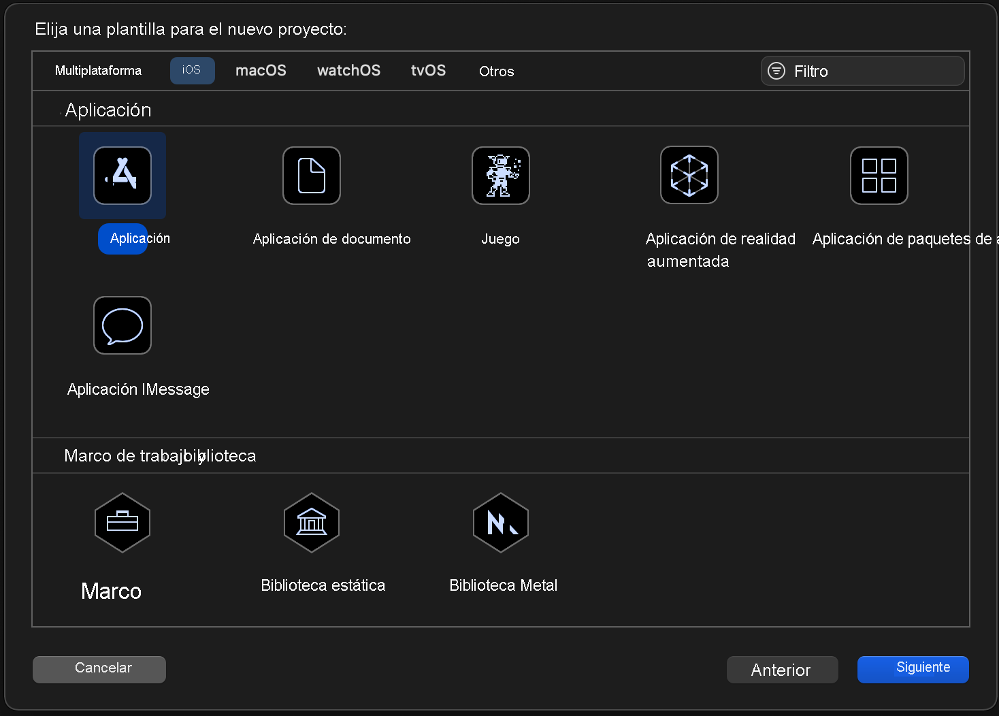
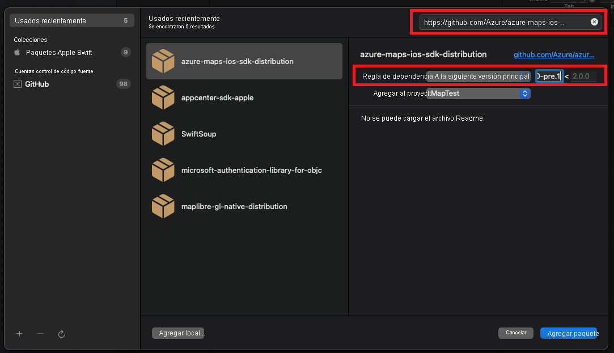
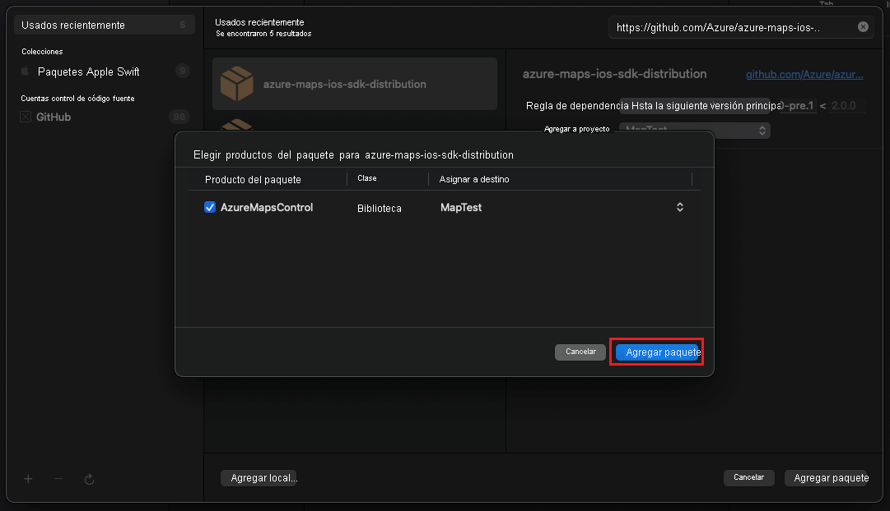
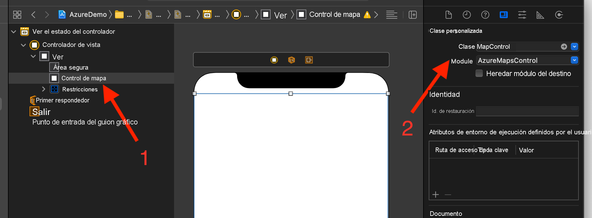

# Creación de una aplicación iOS (versión preliminar pública)

En este artículo se muestra cómo agregar Azure Maps a una aplicación de iOS. Le guía por estos pasos básicos:

* Configure un entorno de desarrollo.
* Cree su propia cuenta de Azure Maps.
* Obtenga la clave principal de Azure Maps que se usará en la aplicación.
* Haga referencia a las bibliotecas de Azure Maps desde el proyecto.
* Agregue un control de Azure Maps a la aplicación.

## Requisitos previos

* Cree una cuenta de Azure Maps, para lo que debe iniciar sesión en [Azure Portal](https://portal.azure.com/). Si no tiene una suscripción a Azure, [cree una cuenta gratuita](https://azure.microsoft.com/free/) antes de empezar.
* [Cree una cuenta de Azure Maps](quick-demo-map-app.md#create-an-azure-maps-account).
* [Obtenga una clave de suscripción principal](quick-demo-map-app.md#get-the-primary-key-for-your-account), también conocida como clave principal o clave de suscripción. Para más información sobre la autenticación en Azure Maps, consulte [Administración de la autenticación en Azure Maps](how-to-manage-authentication.md).
* Descargue [‎Xcode desde Mac App Store](https://apps.apple.com/cz/app/xcode/id497799835?mt=12) gratis.

## Crear una cuenta de Azure Maps

Cree una nueva cuenta de Azure Maps con los pasos siguientes:

1. En la esquina superior izquierda de [Azure Portal](https://portal.azure.com/), seleccione **Crear un recurso**.

2. En el cuadro _Buscar en el Marketplace_, escriba **Azure Maps**.

3. En _Resultados_, seleccione **Azure Maps** y, luego, el botón **Crear** que aparece bajo el mapa.

4. En la página **Create Maps Account** (Crear una cuenta de Azure Maps), escriba los siguientes valores:

   * La _suscripción_ que quiere usar para esta cuenta.
   * El nombre del _grupo de recursos_ para esta cuenta. Puede elegir _Crear nuevo_ o _Usar existente_ para el grupo de recursos.
   * El _nombre_ de la nueva cuenta.
   * El _Plan de tarifa_ de la cuenta.
   * Lea la _licencia_ y la _declaración de privacidad_ y active la casilla para aceptar los términos.
   * Seleccione el botón **Crear**.

    

## Obtención de la clave principal de una cuenta

Una vez que se haya creado correctamente la cuenta de Maps, recupere la clave principal que le permite consultar las API de Maps.

1. Abra su cuenta de Maps en el portal.

2. En la sección de configuración, seleccione **Autenticación**.

3. Copie la **clave principal** al Portapapeles. Guárdela localmente para usarla más adelante en este tutorial.

>[!NOTE]
> En este inicio rápido se usa el enfoque de autenticación de [Clave compartida](azure-maps-authentication.md#shared-key-authentication) con fines de demostración, pero el enfoque preferido para cualquier entorno de producción es utilizar la autenticación de [Azure Active Directory](azure-maps-authentication.md#azure-ad-authentication).
<!--
> If you use the Azure subscription key instead of the Azure Maps primary key, your map won't render properly. Also, for security purposes, it is recommended that you rotate between your primary and secondary keys. To rotate keys, update your app to use the secondary key, deploy, then press the cycle/refresh button beside the primary key to generate a new primary key. The old primary key will be disabled. For more information on key rotation, see [Set up Azure Key Vault with key rotation and auditing](../key-vault/secrets/tutorial-rotation-dual.md)
-->

## Creación de un proyecto en Xcode

En primer lugar, cree un nuevo proyecto de aplicación de iOS. Siga estos pasos para crear un proyecto de Xcode:

1. En **Archivo**, seleccione **Nuevo** -> **Proyecto**.

2. En la pestaña **iOS**, seleccione **Aplicación** y, a continuación, **Siguiente**.

3. Escriba el nombre de la aplicación, el identificador de lote y seleccione **Siguiente**.

Para obtener más ayuda con la creación de un proyecto, consulte [Creación de un proyecto de Xcode para una aplicación](https://developer.apple.com/documentation/xcode/creating-an-xcode-project-for-an-app).

## Instalación del SDK de iOS para Azure Maps

El siguiente paso en la creación de la aplicación es instalar el SDK de iOS para Azure Maps. Para instalar el SDK, siga estos pasos:

1. Con el proyecto de iOS de Xcode deseado seleccionado en el **explorador de proyectos**, seleccione el botón **+** en **Add package dependency** (Agregar dependencia de paquete).

   

2. Escriba lo siguiente tal como se indica en el cuadro de diálogo resultante:
   * Escriba `https://github.com/Azure/azure-maps-ios-sdk-distribution.git` en la barra de búsqueda que aparece en la esquina superior derecha.
   * Seleccione `Up to Next Major Version` en el campo **Dependency Rule** (Regla de dependencia).
   * Escriba `1.0.0-pre.1` en el campo **Dependency Rule** (Regla de dependencia).

   

3. Una vez resuelto el paquete junto con sus dependencias, seleccione el botón **Agregar paquete** para completar la configuración de dependencias.

   

## Adición de la vista MapControl

1. Agregue `UIView` personalizado para ver el controlador.

1. Seleccione la clase `MapControl` del módulo `AzureMapsControl`.

   

1. En el archivo **AppDelegate.swift**, tendrá que:

   * agregar la importación del SDK de Azure Maps
   * establecer la información de autenticación de Azure Maps

La configuración de la información de autenticación en la clase AzureMaps de forma global mediante los métodos `AzureMaps.configure(subscriptionKey:)` o `AzureMaps.configure(aadClient:aadAppId:aadTenant:)` hace que no tenga que agregar la información de autenticación en cada vista.

1. Seleccione el botón de ejecución, como se indica en el siguiente gráfico (o presione `CMD` + `R`), para compilar la aplicación.

   

Xcode tardará unos segundos en crear la aplicación. Una vez finalizada la compilación, puede probar la aplicación en el dispositivo iOS simulado. Debería ver un mapa como el siguiente:

## Limpieza de recursos

<!--
> [!WARNING]
> The tutorials listed in the [Next Steps](#next-steps) section detail how to use and configure Azure Maps with your account. Don't clean up the resources created in this quickstart if you plan to continue to the tutorials.
-->

Siga estos pasos para limpiar los recursos creados en este inicio rápido:

1. Cierre Xcode y elimine el proyecto que ha creado.

2. Si ha probado la aplicación en un dispositivo externo, desinstálela en ese dispositivo.

Si no planea continuar desarrollando con el SDK de iOS para Azure Maps:

1. Vaya a la página de Azure Portal. En la página principal del portal, seleccione **Todos los recursos**. O seleccione el icono de menú en la esquina superior izquierda y, luego, **Todos los recursos**.

2. Seleccione la cuenta de Azure Maps. En la parte superior de la página, seleccione **Eliminar**.

3. Si no planea seguir desarrollando aplicaciones de iOS, puede desinstalar Xcode.

## Información adicional

Para ver ejemplos de códigos adicionales, consulte los artículos siguientes:

* [Administración de la autenticación en Azure Maps](how-to-manage-authentication.md)

<!--
## Additional information

See the following articles for additional code examples:

* [Manage authentication in Azure Maps](how-to-manage-authentication.md)
* [Change map styles in iOS maps](set-map-style-ios-sdk.md)
* [Add a symbol layer](add-symbol-layer-ios.md)
* [Add a line layer](add-line-layer-to-map-ios.md)
* [Add a polygon layer](add-polygon-layer-map-ios.md)

## Next steps

In this quickstart, you created your Azure Maps account and created a demo application. Take a look at the following tutorials to learn more about Azure Maps:

> [!div class="nextstepaction"]

> [Load GeoJSON data into Azure Maps](tutorial-load-geojson-file-ios.md)
-->