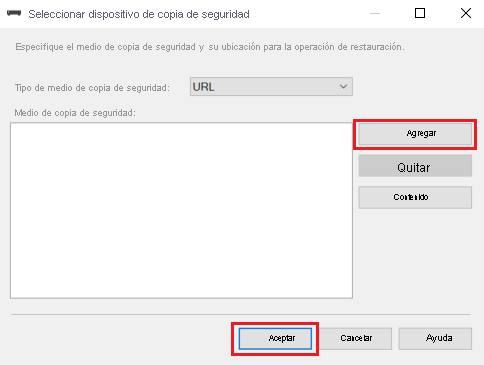
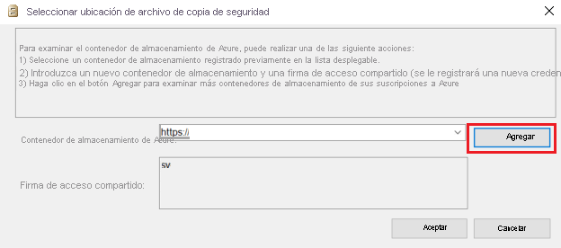
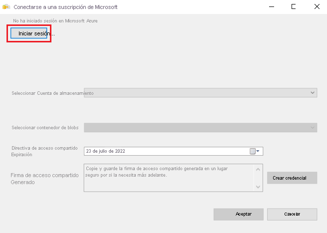
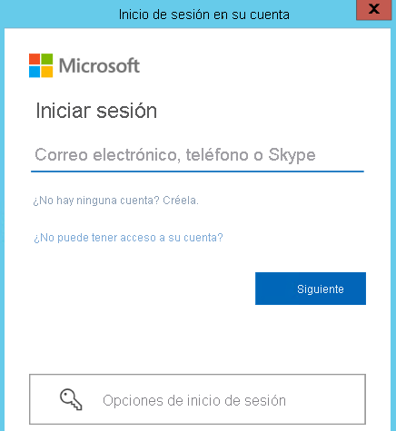
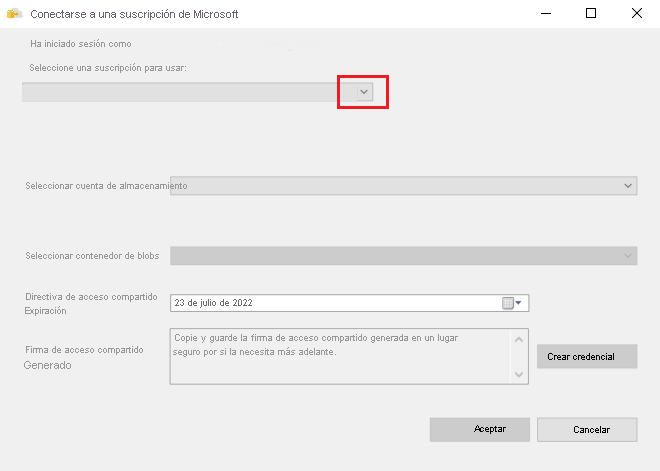
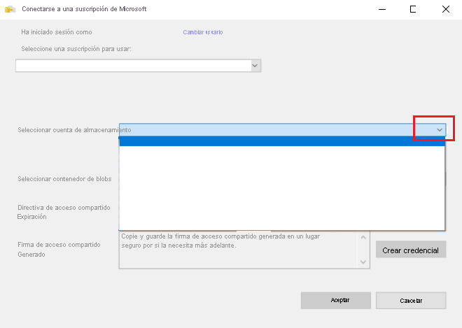
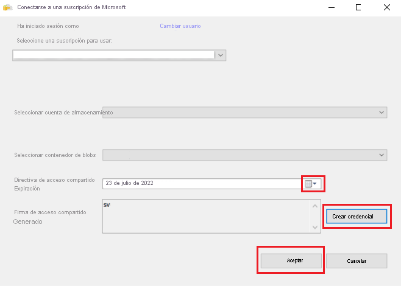
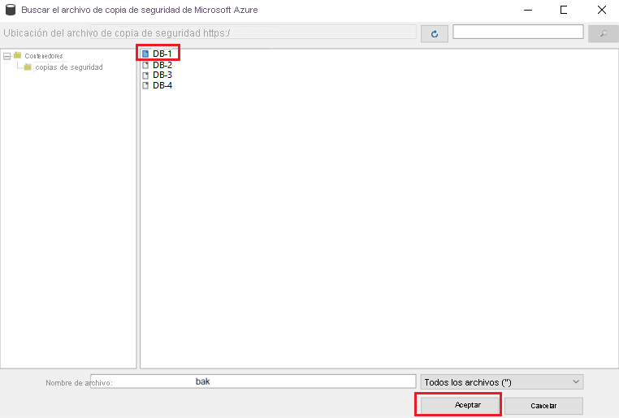
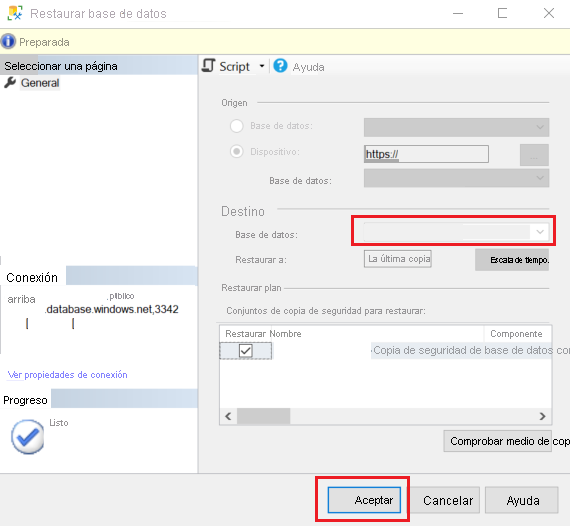
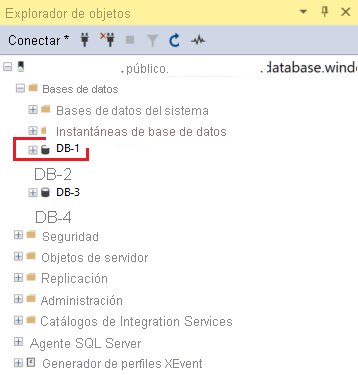

# <a name="quickstart-restore-a-database-to-azure-sql-managed-instance-with-ssms"></a>Inicio rápido: Restauración de una copia de seguridad de datos en SQL Managed Instance con SSMS
[!INCLUDE[appliesto-sqlmi](../includes/appliesto-sqlmi.md)]

En este inicio rápido, usará SQL Server Management Studio (SSMS) para restaurar una base de datos (el archivo de copia de seguridad de Wide World Importers - Standard) de Azure Blob Storage en [SQL Managed Instance](sql-managed-instance-paas-overview.md).

> [!VIDEO https://www.youtube.com/embed/RxWYojo_Y3Q]

> [!NOTE]
> Para más información sobre la migración mediante Azure Database Migration Service, consulte [Tutorial: Migración de un servidor de SQL Server a una instancia administrada de Azure mediante Database Migration Service](../../dms/tutorial-sql-server-to-managed-instance.md).
> Para más información sobre los diversos métodos de migración, consulte [Guía para la migración de SQL Server a Azure SQL Managed Instance](../migration-guides/managed-instance/sql-server-to-managed-instance-guide.md).

## <a name="prerequisites"></a>Requisitos previos

En esta guía de inicio rápido:

- Se usan los recursos del inicio rápido [Creación de una instancia administrada](instance-create-quickstart.md).
- Requiere la instalación de la versión más reciente de [SSMS](/sql/ssms/sql-server-management-studio-ssms).
- Requiere que se use SSMS para conectarse a SQL Managed Instance. Consulte estos inicios rápidos sobre procedimientos de conexión:
  - [Habilitación de un punto de conexión público](public-endpoint-configure.md) en SQL Managed Instance: este es el método que se recomienda para este tutorial.
  - [Conexión a SQL Managed Instance desde una máquina virtual de Azure](connect-vm-instance-configure.md).
  - [Configuración de una conexión de punto a sitio a SQL Managed Instance desde el entorno local](point-to-site-p2s-configure.md).

> [!NOTE]
> Para más información sobre cómo realizar una copia de seguridad de una base de datos de SQL Server y restaurarla mediante Azure Blob Storage y una clave de [Firma de acceso compartido (SAS)](../../storage/common/storage-sas-overview.md), consulte [Copia de seguridad de SQL Server en una dirección URL](/sql/relational-databases/backup-restore/sql-server-backup-to-url).

## <a name="restore-from-a-backup-file-using-the-restore-wizard"></a>Restauración desde un archivo de copia de seguridad mediante el asistente para restauración

En SSMS, siga estos pasos para restaurar la base de datos de Wide World Importers en SQL Managed Instance mediante el asistente de restauración. El archivo de copia de seguridad de base de datos se almacena en una cuenta de Azure Blob Storage configurada previamente.

1. Abra SSMS y conéctese a la instancia administrada.
2. En **Explorador de objetos**, haga clic con el botón derecho en las bases de datos de la instancia administrada y seleccione **Restaurar base de datos** para abrir el asistente para restauración.

    

3. En el nuevo asistente para restauración, seleccione los puntos suspensivos ( **...** ) para seleccionar el origen del archivo de copia de seguridad que se usará.

    

4. En **Seleccionar dispositivos de copia de seguridad**, seleccione **Agregar**. En **Tipo de medio de copia de seguridad**, la dirección **URL** es la única opción porque es el único tipo de origen admitido. Seleccione **Aceptar**.

    

5. En **Seleccionar una ubicación de archivo de copia de seguridad**, puede elegir entre tres opciones para proporcionar información sobre la ubicación de los archivos de copia de seguridad:
    - Seleccione un contenedor de almacenamiento registrado previamente en la lista desplegable.
    - Introduzca un nuevo contenedor de almacenamiento y una firma de acceso compartido. (Se registrará una nueva credencial de SQL). 
    - Seleccione **Agregar** para examinar más contenedores de almacenamiento de la suscripción de Azure.

    

    Complete los pasos siguientes si selecciona el botón **Agregar**. Si usa otro método para proporcionar la ubicación del archivo de copia de seguridad, vaya al paso 12.
6. En **Conectarse a una suscripción de Microsoft,** seleccione **Iniciar sesión** para iniciar sesión en su suscripción de Azure:

    

7. Inicie sesión en su cuenta Microsoft para iniciar la sesión en Azure:

    

8. Seleccione la suscripción donde se encuentra la cuenta de almacenamiento con los archivos de copia de seguridad:

    

9. Seleccione la cuenta de almacenamiento donde se encuentran los archivos de copia de seguridad:

    

10. Seleccione el contenedor de blobs donde se encuentran los archivos de copia de seguridad:

    

11. Especifique la fecha de expiración de la directiva de acceso compartido y seleccione **Crear credencial**. Se crea una firma de acceso compartido con los permisos correctos. Seleccione **Aceptar**.

    

12. En el panel izquierdo, expanda la estructura de carpetas para mostrar la carpeta donde se encuentran los archivos de copia de seguridad. Seleccione todos los archivos de copia de seguridad relacionados con el conjunto de copia de seguridad que se va a restaurar y, a continuación, seleccione **Aceptar**:

    

    SSMS valida el conjunto de copia de seguridad. El proceso dura unos segundos en función del tamaño del conjunto de copia de seguridad.

13. Si se valida la copia de seguridad, especifique el nombre de la base de datos de destino o deje el nombre de la base de datos del conjunto de copia de seguridad y, a continuación, seleccione **Aceptar**:

    

    Se inicia la restauración. La duración depende del tamaño del conjunto de copia de seguridad.

    

14. Cuando finaliza la restauración, un cuadro de diálogo muestra que se ha realizado correctamente. Seleccione **Aceptar**.

    

15. Compruebe la base de datos restaurada en Explorador de objetos:

    


## <a name="restore-from-a-backup-file-using-t-sql"></a>Restauración a partir de un archivo de copia de seguridad mediante T-SQL

En SQL Server Management Studio, siga estos pasos para restaurar la base de datos de Wide World Importers en SQL Managed Instance. El archivo de copia de seguridad de base de datos se almacena en una cuenta de Azure Blob Storage configurada previamente.

1. Abra SSMS y conéctese a la instancia administrada.
2. En el **Explorador de objetos**, haga clic con el botón derecho en su instancia administrada y seleccione **Nueva consulta** para abrir una nueva ventana de consulta.
3. Ejecute el siguiente script de SQL, que usa una cuenta de almacenamiento configurada previamente y la clave SAS para [crear una credencial](/sql/t-sql/statements/create-credential-transact-sql) en la instancia administrada.
 
   > [!IMPORTANT]
   > `CREDENTIAL` debe coincidir con la ruta de acceso del contenedor, empezar por `https` y no puede contener una barra diagonal al final. `IDENTITY` debe ser `SHARED ACCESS SIGNATURE`. `SECRET` debe ser el token de Firma de acceso compartido y no puede contener el signo `?` al principio.

   ```sql
   CREATE CREDENTIAL [https://mitutorials.blob.core.windows.net/databases]
   WITH IDENTITY = 'SHARED ACCESS SIGNATURE'
   , SECRET = 'sv=2017-11-09&ss=bfqt&srt=sco&sp=rwdlacup&se=2028-09-06T02:52:55Z&st=2018-09-04T18:52:55Z&spr=https&sig=WOTiM%2FS4GVF%2FEEs9DGQR9Im0W%2BwndxW2CQ7%2B5fHd7Is%3D'
   ```

    

4. Para comprobar sus credenciales, ejecute el siguiente script, que usa una dirección URL de [contenedor](https://azure.microsoft.com/services/container-instances/) para obtener una lista de archivos de copia de seguridad.

   ```sql
   RESTORE FILELISTONLY FROM URL =
      'https://mitutorials.blob.core.windows.net/databases/WideWorldImporters-Standard.bak'
   ```

    

5. Ejecute el siguiente script para restaurar la base de datos Wide World Importers.

   ```sql
   RESTORE DATABASE [Wide World Importers] FROM URL =
     'https://mitutorials.blob.core.windows.net/databases/WideWorldImporters-Standard.bak'
   ```

    

6. Ejecute el siguiente script para realizar un seguimiento del estado de la restauración.

   ```sql
   SELECT session_id as SPID, command, a.text AS Query, start_time, percent_complete
      , dateadd(second,estimated_completion_time/1000, getdate()) as estimated_completion_time
   FROM sys.dm_exec_requests r
   CROSS APPLY sys.dm_exec_sql_text(r.sql_handle) a
   WHERE r.command in ('BACKUP DATABASE','RESTORE DATABASE')
   ```

7. Cuando se complete la restauración, consulte la base de datos en el Explorador de objetos. Puede comprobar si se ha completado la restauración de bases de datos mediante la vista [sys.dm_operation_status](/sql/relational-databases/system-dynamic-management-views/sys-dm-operation-status-azure-sql-database).

> [!NOTE]
> La operación de restauración de una base de datos es asincrónica y admite reintentos. Es posible que se produzca un error en SQL Server Management Studio si se interrumpe la conexión o se agota el tiempo de espera. Azure SQL Managed Instance seguirá intentando restaurar la base de datos en segundo plano y puede realizar un seguimiento del progreso de la restauración mediante las vistas [sys.dm_exec_requests](/sql/relational-databases/system-dynamic-management-views/sys-dm-exec-requests-transact-sql) y [sys.dm_operation_status](/sql/relational-databases/system-dynamic-management-views/sys-dm-operation-status-azure-sql-database).
> En algunas fases del proceso de restauración verá un identificador único en lugar del nombre de base de datos real de las vistas del sistema. Obtenga información sobre las diferencias de comportamiento de la instrucción `RESTORE`[aquí](./transact-sql-tsql-differences-sql-server.md#restore-statement).

## <a name="next-steps"></a>Pasos siguientes

- Si, en el paso 5, se termina una restauración de una base de datos con el identificador de mensaje 22003, cree un archivo de copia de seguridad que contenga las sumas de comprobación de la copia de seguridad y vuelva a realizar la restauración. Consulte [Habilitación o deshabilitación de sumas de comprobación de copia de seguridad durante copia de seguridad o restauración](/sql/relational-databases/backup-restore/enable-or-disable-backup-checksums-during-backup-or-restore-sql-server).
- Para solucionar problemas con una copia de seguridad en la dirección URL, consulte [Prácticas recomendadas y solución de problemas de Copia de seguridad en URL de SQL Server](/sql/relational-databases/backup-restore/sql-server-backup-to-url-best-practices-and-troubleshooting).
- Para obtener información general sobre las opciones de conexión de las aplicaciones, consulte [Conexión de las aplicaciones a Instancia administrada de SQL](connect-application-instance.md).
- Para realizar consultas con sus herramientas o lenguajes favoritos, consulte [Inicios rápidos: Conexión y consulta de Azure SQL Database](../database/connect-query-content-reference-guide.md).
