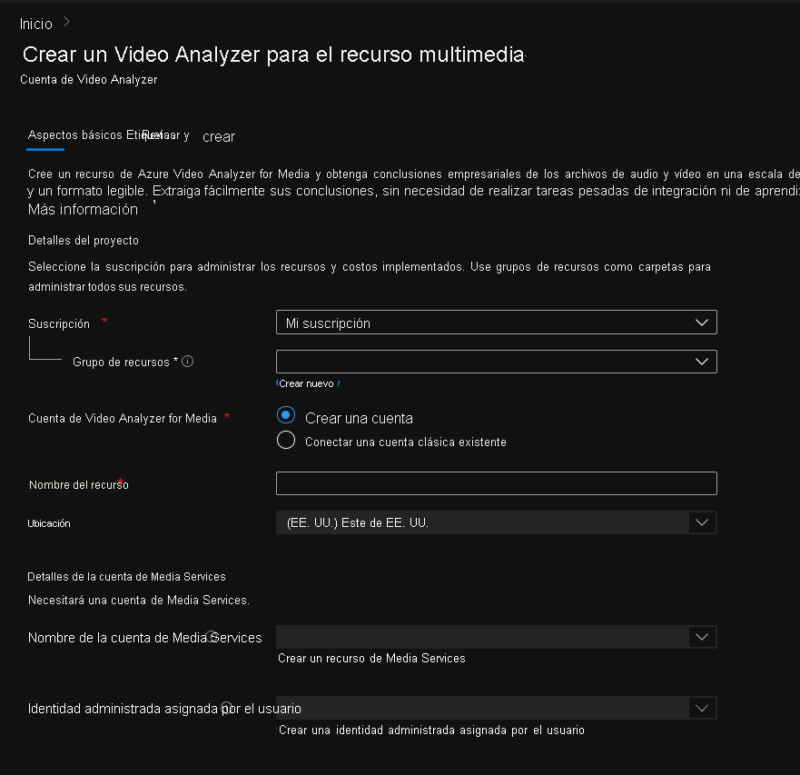
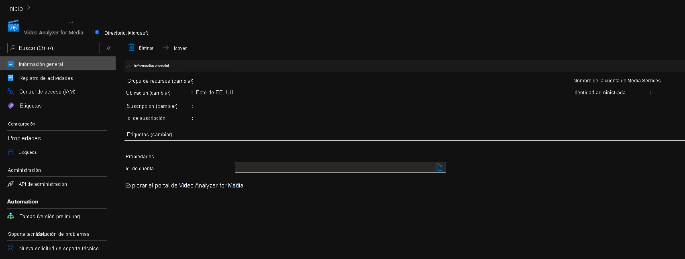
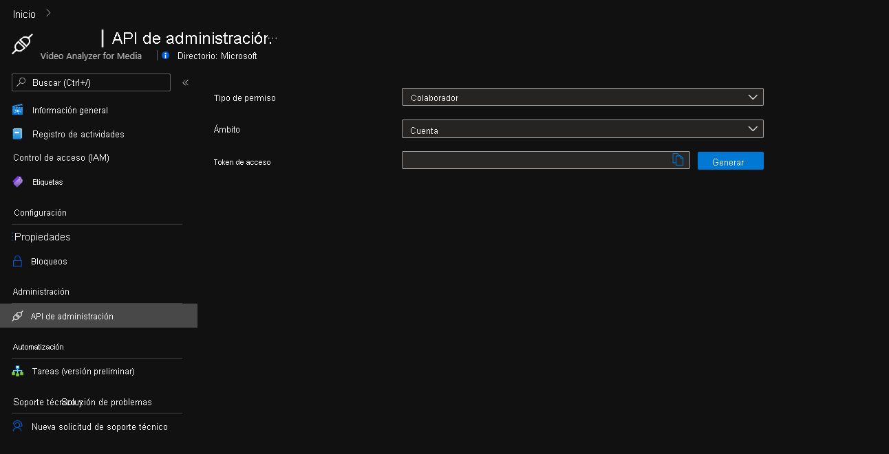

# Introducción a Azure Video Analyzer for Media en Azure Portal

Este inicio rápido le guía por los pasos necesarios para empezar a usar Azure Video Analyzer for Media. Creará una cuenta de Azure Video Analyzer for Media y sus recursos complementarios mediante Azure Portal.

Para empezar a usar Azure Video Analyzer for Media, deberá crear una cuenta de dicho servicio. La cuenta deberá estar asociada a un recurso de [Media Services][docs-ms] y a una [identidad administrada asignada por el usuario][docs-uami]. La identidad administrada deberá tener el rol de permisos de colaborador en Media Services.

## Prerrequisitos
> [!NOTE]
> Necesitará una suscripción a Azure en la que tenga acceso tanto al rol Colaborador como al rol Administrador de acceso de usuario al grupo de recursos en el que creará recursos, y al rol Colaborador tanto en Azure Media Services como en la identidad administrada asignada por el usuario. Si no tiene los permisos adecuados, pida al administrador de la cuenta que se los conceda. La instancia de Azure Media Services asociada debe estar en la misma región que la cuenta de Video Analyzer for Media.

## Azure Portal

### Creación de una cuenta de Video Analyzer for Media en Azure Portal

1. Inicie sesión en el [Portal de Azure](https://portal.azure.com/).
1. Con la barra de búsqueda de la parte superior, escriba **Video Analyzer for Media**.
1. Haga clic en *Video Analyzer for Media* en *Servicios*.

    

1. Haga clic en **Crear**.
1. En la sección **Create a Video Analyzer for Media resource** (Crear un recurso de Video Analyzer for Media), escriba los valores necesarios.

    

 
| Nombre | Descripción |
| ---|---|
|**Suscripción**|Elija la suscripción que usa para crear la cuenta de Video Analyzer for Media.|
|**Grupo de recursos**|Elija un grupo de recursos en el que crear la cuenta de Video Analyzer for Media o seleccione **Crear** para crear un nuevo grupo de recursos.|
|**Cuenta de Video Analyzer for Media**|Seleccione *Crear una nueva cuenta*.|
|**Nombre del recurso**|Escriba el nombre de la nueva cuenta de Video Analyzer for Media; el nombre puede contener letras, números y guiones sin espacios.|
|**Ubicación**|Seleccione la región geográfica que se usará para implementar la cuenta de Video Analyzer for Media. La ubicación coincide con la **ubicación del grupo de recursos** que eligió, pero, si quiere cambiarla, cambie el grupo de recursos seleccionado o cree uno en la ubicación que prefiera. [Región de Azure en la que esté disponible Video Analyzer for Media](https://azure.microsoft.com/global-infrastructure/services/?products=cognitive-services&regions=all)|
|**Nombre de la cuenta de Media Services**|Seleccione la instancia de Media Services que usará la nueva cuenta de Video Analyzer for Media para procesar los vídeos. Puede seleccionar una instancia de Media Services ya existente o crear una. La instancia de Media Services debe estar en la misma ubicación que ha seleccionado.| 
|**Identidad administrada asignada por el usuario**|Seleccione una identidad administrada asignada por el usuario, que usará la nueva cuenta de Video Analyzer for Media para acceder a la instancia de Media Services. Puede seleccionar una identidad administrada asignada por el usuario existente, o bien puede crear una nueva. A la identidad administrada asignada por el usuario se le otorgará el rol Colaborador en la instancia de Media Services.|

1. En la parte inferior del formulario, haga clic en **Revisar y crear**.

### Revisión de los recursos implementados

Puede usar Azure Portal para validar la cuenta de Azure Video Analyzer for Media y otros recursos que hayan creado. Una vez finalizada la implementación, seleccione **Ir al recurso** para ver la nueva cuenta de Video Analyzer for Media.

### Información general

Haga clic en *Explore Video Analyzer for Media's portal* (Explorar el portal de Video Analyzer for Media) para ver la nueva cuenta en el [portal de Azure Video Analyzer for Media](https://aka.ms/vi-portal-link)

### API de administración

Use la *API de administración* para generar manualmente tokens de acceso para la cuenta.
Este token se puede usar para autenticar llamadas API de esta cuenta. Cada token es válido durante una hora.

Elija lo siguiente:
* Tipo de permiso: **Colaborador** o **Lector**
* Ámbito **Cuenta**, **Proyecto** o **Vídeo**
    * En **Proyecto** o **Vídeo** debe insertar también el identificador de coincidencia.
* Haga clic en **Generar**.

---

### Pasos siguientes

Aprenda a [cargar un vídeo con C#](https://github.com/Azure-Samples/media-services-video-indexer/tree/master/ApiUsage/ArmBased).

<!-- links -->
[docs-uami]: ../../active-directory/managed-identities-azure-resources/overview.md
[docs-ms]: ../../media-services/latest/media-services-overview.md
[docs-role-contributor]: ../../role-based-access-control/built-in-roles.md#contibutor
[docs-contributor-on-ms]: ./add-contributor-role-on-the-media-service.md
