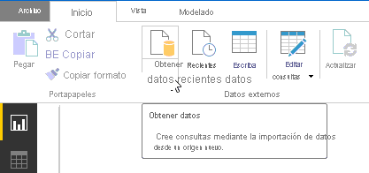
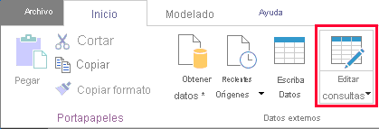
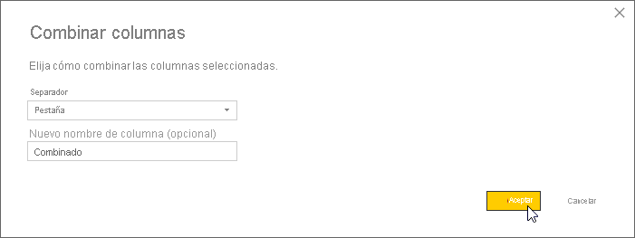
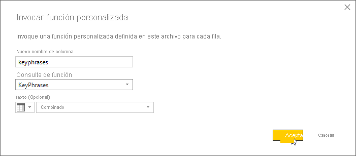
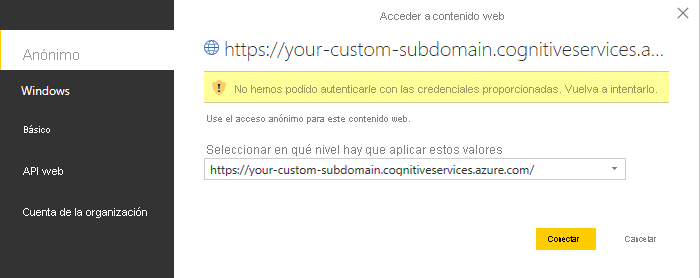
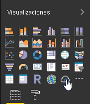
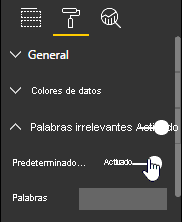
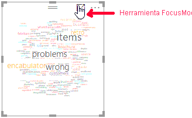

# <a name="tutorial-extract-key-phrases-from-text-stored-in-power-bi"></a>Tutorial: Extracción de frases clave del texto almacenado en Power BI

Microsoft Power BI Desktop es una aplicación gratuita que le permite conectarse a los datos, transformarlos y visualizarlos. La extracción de frases clave, una de las características de Azure Cognitive Service for Language, proporciona procesamiento de lenguaje natural. Con texto no estructurado sin formato, puede extraer las frases más importantes, analizar opiniones e identificar entidades conocidas como marcas. Juntas, estas herramientas pueden ayudarle a ver rápidamente de lo que hablan sus clientes y cómo se sienten al respecto.

En este tutorial, aprenderá a:

> [!div class="checklist"]
> * Usar Power BI Desktop para importar y transformar datos
> * Crear una función personalizada en Power BI Desktop
> * Integración de Power BI Desktop con la característica Extracción de frases clave de Azure Cognitive Service for Language
> * Use Extracción de frases clave para obtener las frases más importantes de los comentarios de los clientes
> * Crear una nube de palabras de los comentarios de clientes

## <a name="prerequisites"></a>Requisitos previos

- Microsoft Power BI Desktop. [Descarga gratuita](https://powerbi.microsoft.com/get-started/).
- Una cuenta de Microsoft Azure. [Cree una cuenta gratuita](https://azure.microsoft.com/free/cognitive-services/) o [inicie sesión](https://portal.azure.com/).
- Un recurso de idioma. Si no tiene ninguna, puede [crear una](https://ms.portal.azure.com/#create/Microsoft.CognitiveServicesTextAnalytics).
- La [clave de recurso de idioma](../../../cognitive-services-apis-create-account.md#get-the-keys-for-your-resource) que se generó automáticamente durante el registro.
- Comentarios de clientes. Puede usar [nuestros datos de ejemplo](https://aka.ms/cogsvc/ta) o sus propios datos. En este tutorial se supone que está utilizando los datos de ejemplo.

## <a name="load-customer-data"></a>Carga de datos del cliente

Para empezar, abra Power BI Desktop y cargue el archivo de valores separados por comas (CSV) `FabrikamComments.csv` que descargó en [Requisitos previos](#prerequisites). Este archivo representa un día de actividad hipotética en el foro de soporte técnico de una pequeña empresa ficticia.

> [!NOTE]
> Power BI puede usar datos de una amplia variedad de orígenes basados en web como, por ejemplo, bases de datos SQL. Consulte la [documentación de Power Query](/power-query/connectors/) para más información.

En la ventana principal de Power BI Desktop, seleccione la cinta de opciones **Inicio**. En el grupo **Datos externos** de la cinta de opciones, abra el menú desplegable **Obtener datos** y seleccione **Texto/CSV**.



Aparece el cuadro de diálogo Abrir. Vaya a la carpeta de descargas o a la carpeta donde descargó el archivo `FabrikamComments.csv`. Haga clic en el botón `FabrikamComments.csv`**Abrir**. Aparece el cuadro de diálogo de importación de CSV.


El cuadro de diálogo de importación de CSV le permite comprobar que Power BI Desktop ha detectado correctamente el juego de caracteres, el delimitador, las filas de encabezado y los tipos de columna. Toda esta información es correcta, así que haga clic en **Cargar**.

Para ver los datos cargados, haga clic en el botón **Vista de datos** del borde izquierdo del área de trabajo de Power BI. Se abre una tabla que contiene los datos, como en Microsoft Excel.


## <a name="prepare-the-data"></a>Preparación de los datos

Puede que necesite transformar los datos de Power BI Desktop antes de que estén listos para ser procesados por el servicio de Extracción de frases clave.

Los datos de ejemplo contienen una columna `subject` y una columna `comment`. Con la función Combinar columnas de Power BI Desktop, puede extraer frases clave de los datos de ambas columnas, en lugar de solo la columna `comment`.

En Power BI Desktop, seleccione la cinta de opciones **Inicio**. En el grupo **Datos externos**, haga clic en **Editar consultas**.



Seleccione `FabrikamComments` en la lista **Consultas** en el lado izquierdo de la ventana si no está ya seleccionado.

Ahora seleccione las columnas `subject` y `comment` de la tabla. Es posible que deba desplazarse horizontalmente para ver estas columnas. En primer lugar, haga clic en el encabezado de columna `subject` y, a continuación, mantenga presionada la tecla Control y haga clic en el encabezado de columna `comment`.


Seleccione la cinta de opciones **Transformar**. En el grupo **Columnas de texto** de la cinta de opciones, haga clic en **Combinar columnas**. Aparece el cuadro de diálogo Combinar columnas.



En el cuadro de diálogo Combinar columnas, elija `Tab` como separador y haga clic en **Aceptar**.

También podría considerar el filtrado de mensajes en blanco con el filtro Quitar vacíos, o quitar los caracteres no imprimibles mediante la transformación Limpiar. Si los datos contienen una columna como la columna `spamscore` del archivo de ejemplo, puede omitir los comentarios no deseados mediante un filtro de número.

## <a name="understand-the-api"></a>Información de la API

El servicio [Extracción de frases clave](https://westus.dev.cognitive.microsoft.com/docs/services/TextAnalytics-V3-1/operations/KeyPhrases) puede procesar hasta un millar de documentos de texto por cada solicitud HTTP. Power BI prefiere trabajar con registros de uno en uno, así que en este tutorial las llamadas a la API contendrán solo un documento a la vez. Key Phrases API requiere que se procesen los siguientes campos para cada documento.

| Campo | Descripción |
| - | - |
| `id`  | Un identificador único para este documento dentro de la solicitud. La respuesta también contiene este campo. De este modo, si procesa más de un documento, puede asociar fácilmente las frases clave extraídas con el documento del que proceden. En este tutorial, puesto que está procesando un solo documento por solicitud, puede codificar el valor de `id` para que sea el mismo para cada solicitud.|
| `text`  | El texto que se va a procesar. El valor de este campo procede de la columna `Merged` que creó en la [sección anterior](#prepare-the-data), que contiene el texto de comentario y de línea de asunto combinados. La API de frases clave requiere que estos datos no tengan más de 5120 caracteres.|
| `language` | El código del lenguaje natural en que está escrito el documento. Todos los mensajes de los datos de ejemplo están en inglés, por lo que puede codificar de forma rígida el valor `en` para este campo.|

## <a name="create-a-custom-function"></a>Creación de una función personalizada

Ahora está listo para crear la función personalizada que integrará Power BI y Extracción de frases clave. La función recibe el texto que se va a procesar como un parámetro. Convierte los datos a y desde el formato JSON requerido y realiza la solicitud HTTP a Key Phrases API. La función analiza entonces la respuesta de la API y devuelve una cadena que contiene una lista de valores separados por comas de las frases clave extraídas.

> [!NOTE]
> Las funciones personalizadas de Power BI Desktop se escriben en el [lenguaje de fórmulas M de Power Query](/powerquery-m/power-query-m-reference), o simplemente "M" para abreviar. M es un lenguaje de programación funcional basado en [F#](/dotnet/fsharp/). Para finalizar este tutorial no es necesario ser programador, si bien, se incluye el código necesario a continuación.

En Power BI Desktop, asegúrese de que todavía se encuentra en la ventana del Editor de consultas. Si no, seleccione la cinta de opciones **Inicio** y, en el grupo **Datos externos**, haga clic en **Editar consultas**.

Ahora, en la cinta de opciones **Inicio**, en el grupo **Nueva consulta**, abra el menú desplegable **Nuevo origen** y seleccione **Consulta en blanco**. 

Aparece una nueva consulta, denominada inicialmente `Query1`, en la lista de consultas. Haga doble clic en esta entrada y asígnele el nombre `KeyPhrases`.

Ahora, en la cinta de opciones **Inicio**, en el grupo **Consulta**, haga clic en **Editor avanzado** para abrir la ventana Editor avanzado. Elimine el código que ya está en esa ventana y pegue el código siguiente. 

> [!NOTE]
> Reemplace el punto de conexión de ejemplo siguiente (que contiene `<your-custom-subdomain>`) por el punto de conexión generado para el recurso de idioma. Para encontrar este punto de conexión, inicie sesión en [Azure Portal](https://azure.microsoft.com/features/azure-portal/), navegue hasta el recurso y seleccione **Key and endpoint** (Clave y punto de conexión).


```fsharp
// Returns key phrases from the text in a comma-separated list
(text) => let
    apikey      = "YOUR_API_KEY_HERE",
    endpoint    = "https://<your-custom-subdomain>.cognitiveservices.azure.com/text/analytics" & "/v3.0/keyPhrases",
    jsontext    = Text.FromBinary(Json.FromValue(Text.Start(Text.Trim(text), 5000))),
    jsonbody    = "{ documents: [ { language: ""en"", id: ""0"", text: " & jsontext & " } ] }",
    bytesbody   = Text.ToBinary(jsonbody),
    headers     = [#"Ocp-Apim-Subscription-Key" = apikey],
    bytesresp   = Web.Contents(endpoint, [Headers=headers, Content=bytesbody]),
    jsonresp    = Json.Document(bytesresp),
    keyphrases  = Text.Lower(Text.Combine(jsonresp[documents]{0}[keyPhrases], ", "))
in  keyphrases
```

Reemplace `YOUR_API_KEY_HERE` por su clave de recurso de idioma. También puede encontrar esta clave iniciando sesión en [Azure Portal](https://azure.microsoft.com/features/azure-portal/), navegando hasta el recurso Idioma y seleccionando la página **Key and endpoint** (Clave y punto de conexión). Asegúrese de dejar las comillas antes y después de la clave. A continuación, haga clic en **Hecho**.

## <a name="use-the-custom-function"></a>Uso de la función personalizada

Ahora puede usar la función personalizada para extraer las frases clave de cada uno de los comentarios de los clientes y almacenarlas en una nueva columna de la tabla. 

En Power BI Desktop, en la ventana del Editor de consultas, cambie a la consulta `FabrikamComments`. Seleccione la cinta de opciones **Agregar columna**. En el grupo **General**, haga clic en **Invocar función personalizada**.

<br><br>

Aparece el cuadro de diálogo Invocar función personalizada. En **Nuevo nombre de columna**, escriba `keyphrases`. En **Consulta de función**, seleccione la función personalizada que creó, `KeyPhrases`.

Aparece un nuevo campo en el cuadro de diálogo, **Texto (opcional)** . Este campo pregunta qué columna desea usar para proporcionar valores para el parámetro `text` de Key Phrases API. (Recuerde que ya ha codificado de forma rígida los valores para los parámetros `language` y `id`). Seleccione `Merged` (la columna que se creó [anteriormente](#prepare-the-data) mediante la combinación de los campos de asunto y mensaje) en el menú desplegable.



Por último, haga clic en **Aceptar**.

Si todo está listo, Power BI llama a la función personalizada una vez para cada fila de la tabla. Envía las consultas a Key Phrases API y agrega una nueva columna a la tabla para almacenar los resultados. Pero antes de que eso suceda, puede que deba especificar los valores de autenticación y privacidad.

## <a name="authentication-and-privacy"></a>Autenticación y privacidad

Después de cerrar el cuadro de diálogo Invocar función personalizada, puede aparecer un mensaje emergente que le pide que especifique cómo conectarse a Key Phrases API.


Haga clic en **Editar credenciales** y asegúrese de que esté seleccionado `Anonymous` en el cuadro de diálogo; después, haga clic en **Conectar**. 

> [!NOTE]
> Debe seleccionar `Anonymous` porque el servicio Extracción de frases clave autentica las solicitudes mediante la clave de acceso, de forma que Power BI no tiene que proporcionar credenciales para la propia solicitud HTTP.

> [!div class="mx-imgBorder"]
> 

Si ve el mensaje emergente Editar credenciales incluso después de elegir acceso anónimo, es posible que haya olvidado pegar la clave de recurso de idioma en el código de la `KeyPhrases` [función personalizada](#create-a-custom-function).

A continuación, puede aparecer un mensaje emergente que le pide que proporcione información sobre la privacidad de sus orígenes de datos. 


Haga clic en **Continuar** y elija `Public` para cada uno de los orígenes de datos del cuadro de diálogo. A continuación, haga clic en **Guardar**.


## <a name="create-the-word-cloud"></a>Creación de la nube de palabras

Una vez que se haya ocupado de los mensajes emergentes que aparecen, haga clic en **Cerrar y aplicar** en la cinta Inicio para cerrar el Editor de consultas.

Power BI Desktop tarda un momento en realizar las solicitudes HTTP necesarias. Para cada fila de la tabla, la nueva columna `keyphrases` contiene las frases clave detectadas en el texto mediante la API de frases clave. 

Usará esta columna para generar una nube de palabras. Para comenzar, haga clic en el botón **Informe** en la ventana principal de Power BI Desktop, a la izquierda del área de trabajo.

> [!NOTE]
> ¿Por qué se usan las frases clave extraídas para generar una nube de palabras en lugar del texto completo de cada comentario? Las frases clave nos proporcionan las palabras *importantes* de los comentarios de nuestros clientes, no solo las palabras *más comunes*. Además, el ajuste de tamaño de las palabras en la nube resultante no queda sesgado por el uso frecuente de una palabra en un número relativamente pequeño de comentarios.

Si aún no tiene instalado el objeto visual personalizado Word Cloud, instálelo. En el panel Visualizaciones a la derecha del área de trabajo, haga clic en los tres puntos ( **...** ) y elija **Import From Market** (Importar de Market). Si la palabra "cloud" no está entre las herramientas de visualización mostradas en la lista, puede buscar "cloud" y hacer clic en el botón **Agregar** junto a la imagen Word Cloud. Power BI instala el objeto visual Word Cloud y le informa de que se ha instalado correctamente.

<br><br>

Primero, haga clic en el icono Word Cloud en el panel Visualizaciones.



Un nuevo informe aparece en el área de trabajo. Arrastre el campo `keyphrases` desde el panel Campos hasta el campo Categoría del panel Visualizaciones. La nube de palabras aparece dentro del informe.

Ahora, cambie a la página Formato del panel Visualizaciones. En la categoría de palabras irrelevantes, active **Palabras no significativas predeterminadas** para eliminar palabras comunes cortas, como "of" de la nube. Sin embargo, como estamos visualizando frases clave, es posible que no contengan palabras irrelevantes.



Baje un poco más por este panel y desactive **Girar texto** y **Título**.



Haga clic en la herramienta Modo de enfoque en el informe para obtener una mejor vista de nuestra nube de palabras. La herramienta expande la nube de palabras para rellenar el área de trabajo completa, como se muestra a continuación.


## <a name="using-other-features"></a>Uso de otras características

Azure Cognitive Service for Language también proporciona análisis de sentimiento y detección de idioma. La detección de idioma es especialmente útil si los comentarios de su cliente no están en inglés.

Estas otras API son parecidas a Key Phrases API. Eso significa que puede integrarlas con Power BI Desktop mediante funciones personalizadas que son casi idénticas a la que creó en este tutorial. Basta con que cree una consulta en blanco y pegue el código adecuado debajo en el Editor avanzado, como hizo anteriormente. (No olvide la clave de acceso). A continuación, igual que antes, use la función para agregar una nueva columna a la tabla.

La función Análisis de sentimiento siguiente devuelve una etiqueta que indica el grado positivo del sentimiento expresado en el texto.

```fsharp
// Returns the sentiment label of the text, for example, positive, negative or mixed.
(text) => let
    apikey = "YOUR_API_KEY_HERE",
    endpoint = "<your-custom-subdomain>.cognitiveservices.azure.com" & "/text/analytics/v3.1/sentiment",
    jsontext = Text.FromBinary(Json.FromValue(Text.Start(Text.Trim(text), 5000))),
    jsonbody = "{ documents: [ { language: ""en"", id: ""0"", text: " & jsontext & " } ] }",
    bytesbody = Text.ToBinary(jsonbody),
    headers = [#"Ocp-Apim-Subscription-Key" = apikey],
    bytesresp = Web.Contents(endpoint, [Headers=headers, Content=bytesbody]),
    jsonresp = Json.Document(bytesresp),
    sentiment   = jsonresp[documents]{0}[sentiment] 
    in sentiment
```

Estas son dos versiones de una función Detección de idioma. La primera devuelve el código de idioma ISO (por ejemplo, `en` para inglés), mientras que la segunda devuelve el nombre "descriptivo" (por ejemplo, `English`). Puede advertir que solo la última línea del cuerpo difiere entre las dos versiones.

```fsharp
// Returns the two-letter language code (for example, 'en' for English) of the text
(text) => let
    apikey      = "YOUR_API_KEY_HERE",
    endpoint    = "https://<your-custom-subdomain>.cognitiveservices.azure.com" & "/text/analytics/v3.1/languages",
    jsontext    = Text.FromBinary(Json.FromValue(Text.Start(Text.Trim(text), 5000))),
    jsonbody    = "{ documents: [ { id: ""0"", text: " & jsontext & " } ] }",
    bytesbody   = Text.ToBinary(jsonbody),
    headers     = [#"Ocp-Apim-Subscription-Key" = apikey],
    bytesresp   = Web.Contents(endpoint, [Headers=headers, Content=bytesbody]),
    jsonresp    = Json.Document(bytesresp),
    language    = jsonresp [documents]{0}[detectedLanguage] [iso6391Name] in language 
```
```fsharp
// Returns the name (for example, 'English') of the language in which the text is written
(text) => let
    apikey      = "YOUR_API_KEY_HERE",
    endpoint    = "https://<your-custom-subdomain>.cognitiveservices.azure.com" & "/text/analytics/v3.1/languages",
    jsontext    = Text.FromBinary(Json.FromValue(Text.Start(Text.Trim(text), 5000))),
    jsonbody    = "{ documents: [ { id: ""0"", text: " & jsontext & " } ] }",
    bytesbody   = Text.ToBinary(jsonbody),
    headers     = [#"Ocp-Apim-Subscription-Key" = apikey],
    bytesresp   = Web.Contents(endpoint, [Headers=headers, Content=bytesbody]),
    jsonresp    = Json.Document(bytesresp),
    language    jsonresp [documents]{0}[detectedLanguage] [iso6391Name] in language 
```

Finalmente, esta es una variante de la función Frases clave ya presentada que devuelve las frases como un objeto de lista, en lugar de como una sola cadena de frases separadas por comas. 

> [!NOTE]
> La devolución de una sola cadena simplifica nuestro ejemplo de nube de palabras. Por otro lado, una lista es un formato más flexible para trabajar con las frases devueltas en Power BI. Puede manipular objetos de lista en Power BI Desktop con el grupo Columna estructurada de la cinta Transformación del Editor de consultas.

```fsharp
// Returns key phrases from the text as a list object
(text) => let
    apikey      = "YOUR_API_KEY_HERE",
    endpoint    = "https://<your-custom-subdomain>.cognitiveservices.azure.com" & "/text/analytics/v3.1/keyPhrases",
    jsontext    = Text.FromBinary(Json.FromValue(Text.Start(Text.Trim(text), 5000))),
    jsonbody    = "{ documents: [ { language: ""en"", id: ""0"", text: " & jsontext & " } ] }",
    bytesbody   = Text.ToBinary(jsonbody),
    headers     = [#"Ocp-Apim-Subscription-Key" = apikey],
    bytesresp   = Web.Contents(endpoint, [Headers=headers, Content=bytesbody]),
    jsonresp    = Json.Document(bytesresp),
    keyphrases  = jsonresp[documents]{0}[keyPhrases]
in  keyphrases
```

## <a name="next-steps"></a>Pasos siguientes

Obtenga más información sobre Azure Cognitive Service for Language, el lenguaje de fórmulas Power Query M o Power BI.

* [Información general sobre Azure Cognitive Service for Language](../../overview.md)
* [Referencia de Power Query M](/powerquery-m/power-query-m-reference)
* [Documentación de Power BI](https://powerbi.microsoft.com/documentation/powerbi-landing-page/)
