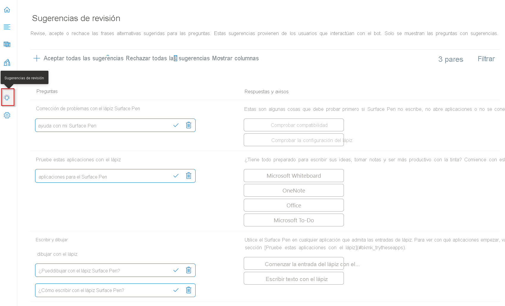

# <a name="enrich-your-project-with-active-learning"></a>Enriquecimiento de un proyecto con el aprendizaje activo

En este tutorial aprenderá a:

<!-- green checkmark -->
> [!div class="checklist"]
> * Descargar un archivo de prueba de aprendizaje activo
> * Importar el archivo de prueba en el proyecto existente
> * Aceptar o rechazar sugerencias del aprendizaje activo
> * Agregar preguntas alternativas

En este tutorial se muestra cómo mejorar un proyecto de respuesta a preguntas con el aprendizaje activo. Si observa que los clientes hacen preguntas que no forman parte del proyecto. A menudo, hay variaciones de preguntas que se parafrasean de manera diferente.

Estas variaciones, cuando se agregan como preguntas alternativas al par de respuestas a preguntas pertinente, ayudan a optimizar la base de conocimiento para responder consultas de usuarios reales. Puede agregar manualmente preguntas alternativas a los pares de respuestas a preguntas mediante el editor. Al mismo tiempo, también puede usar la característica de aprendizaje activo para generar sugerencias de aprendizaje activo basadas en las consultas de los usuarios. Sin embargo, la característica de aprendizaje activo requiere que la base de conocimiento reciba tráfico regular de los usuarios para generar sugerencias.

## <a name="enable-active-learning"></a>Habilitación del aprendizaje activo

El aprendizaje activo está activado de forma predeterminada para los recursos que tienen la respuesta a preguntas habilitada.

Para probar las sugerencias del aprendizaje activo, puede importar el archivo siguiente como un nuevo proyecto: [SampleActiveLearning.tsv](https://github.com/Azure-Samples/cognitive-services-sample-data-files/blob/master/qna-maker/knowledge-bases/SampleActiveLearning.tsv).

## <a name="download-file"></a>Descarga de archivo

Ejecute el siguiente comando desde el símbolo del sistema para descargar una copia local del archivo `SampleActiveLearning.tsv`.

```cmd
curl "https://github.com/Azure-Samples/cognitive-services-sample-data-files/blob/master/qna-maker/knowledge-bases/SampleActiveLearning.tsv" --output SampleActiveLearning.tsv
```

## <a name="import-file"></a>Importación del archivo

En el panel de edición de knowledge base del proyecto, seleccione el icono `...` (puntos suspensivos) en el menú > **Importar preguntas y respuestas** > **Importar como TSV**. Seleccione **Choose file** (Elegir archivo) para ir a la copia de `SampleActiveLearning.tsv` que descargó en el equipo en el paso anterior y, después, seleccione Listo.

> [!div class="mx-imgBorder"]
> [  ]( ../media/active-learning/import-questions.png#lightbox)

## <a name="view-and-addreject-active-learning-suggestions"></a>Visualización y adición o rechazo de sugerencias del aprendizaje activo

Una vez que se completa la importación del archivo de prueba, las sugerencias de aprendizaje activo se pueden ver en el panel de revisión de sugerencias:

> [!div class="mx-imgBorder"]
> [  ]( ../media/active-learning/review-suggestions.png#lightbox)

Estas sugerencias se pueden aceptar o rechazar mediante las opciones de la barra de menús para **Aceptar todas las sugerencias** o **Rechazar todas las sugerencias**.

Como alternativa, para aceptar o rechazar las sugerencias individuales, seleccione el símbolo de marca de verificación (aceptar) o el símbolo de papelera (rechazar) que aparece junto a preguntas individuales en la página **Revisar sugerencias**.

> [!div class="mx-imgBorder"]
> [  ]( ../media/active-learning/accept-reject.png#lightbox)

## <a name="add-alternate-questions"></a>Agregar preguntas alternativas

Aunque el aprendizaje activo sugiere automáticamente preguntas alternativas basadas en las consultas de usuario que alcanzan el proyecto, también podemos agregar variaciones de una pregunta en la página de edición de knowledge base seleccionando **Add alternate phrase** (Agregar frase alternativa) a pares de respuestas de preguntas.

Al agregar preguntas alternativas junto con el aprendizaje activo, enriquecemos aún más el proyecto con variaciones de una pregunta que ayudan a proporcionar respuestas coherentes a las consultas del usuario.

> [!NOTE]
> Cuando las preguntas alternativas tienen muchas palabras irrelevantes, es posible que afecten negativamente a la precisión de las respuestas. Por lo tanto, si la única diferencia entre las preguntas alternativas se encuentra en las palabras irrelevantes, estas preguntas alternativas no son necesarias.
> Para examinar la lista de palabras irrelevantes, consulte el [artículo sobre palabras irrelevantes](https://github.com/Azure-Samples/azure-search-sample-data/blob/master/STOPWORDS.md).

## <a name="next-steps"></a>Pasos siguientes

> [!div class="nextstepaction"]
> [Mejora de la calidad de las respuestas con sinónimos](adding-synonyms.md)
