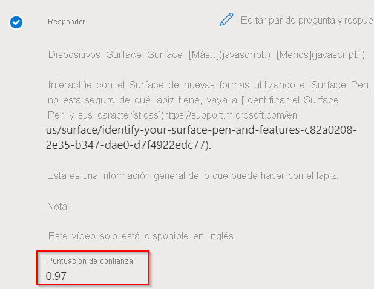

# <a name="improve-quality-of-response-with-synonyms"></a>Mejora de la calidad de las respuestas con sinónimos

En este tutorial aprenderá a:

> [!div class="checklist"]
> * Adición de sinónimos para mejorar la calidad de las respuestas
> * Evaluación de la calidad de las respuestas mediante la opción de inspección del panel Prueba

En este tutorial se muestra cómo puede mejorar la calidad de las respuestas mediante sinónimos. Supongamos que los usuarios no están obteniendo una respuesta precisa a sus consultas cuando usan formas alternativas, sinónimos o acrónimos de una palabra. Así que deciden mejorar la calidad de la respuesta mediante [Authoring API](/rest/api/cognitiveservices-qnamaker/QnAMaker4.0/Alterations) para agregar sinónimos para palabras clave.

## <a name="add-synonyms-using-authoring-api"></a>Adición de sinónimos mediante Authoring API

Vamos a agregar las siguientes palabras y sus formas alternativas para mejorar los resultados:

|Word | Formas alternativas|
|--------------|--------------------------------|
| fix problems (solucionar problemas) | `troubleshoot`, `trouble-shoot`|
| whiteboard (pizarra)   | `white-board`, `white board`   |
| Bluetooth    | `blue-tooth`, `blue tooth`     |

```json
{
    "synonyms": [
        {
            "alterations": [
                "fix problems",
                "troubleshoot",
                "trouble-shoot",
                ]
        },
        {
            "alterations": [
                "whiteboard",
                "white-board",
                "white board"
            ]
        },
        {
            "alterations": [
                "bluetooth",
                "blue-tooth",
                "blue tooth"
            ]
        }
    ]
}

```

Para el par de pregunta y respuesta "Fix problems with Surface Pen" (Corrección de problemas del lápiz para Surface) que se muestra a continuación, comparamos la respuesta a una consulta realizada con su sinónimo "solución de problemas".

## <a name="response-before-addition-of-synonym"></a>Respuesta antes de adición del sinónimo

> [!div class="mx-imgBorder"]
> [  ]( ../media/adding-synonyms/score.png#lightbox)

## <a name="response-after-addition-of-synonym"></a>Respuesta después de la adición del sinónimo

> [!div class="mx-imgBorder"]
> [  ]( ../media/adding-synonyms/score-improvement.png#lightbox)

Como puede ver, cuando no se agregó `troubleshoot` como sinónimo, se obtuvo una respuesta de confianza baja a la consulta "Cómo solucionar problemas del lápiz de Surface". Sin embargo, después de agregar `troubleshoot` como sinónimo de "solucionar problemas", recibimos la respuesta correcta a la consulta con una puntuación de confianza mayor. Una vez agregados estos sinónimos, se mejoró la relevancia de los resultados, lo cual mejora la experiencia del usuario.

> [!NOTE]
> Los sinónimos no distinguen mayúsculas de minúsculas. Es posible que los sinónimos tampoco funcionen según lo previsto si agrega palabras no significativas como sinónimos. La lista de palabras no significativas se puede encontrar aquí: [Lista de palabras no significativas](https://github.com/Azure-Samples/azure-search-sample-data/blob/master/STOPWORDS.md).

Por ejemplo, si agrega la abreviatura de **TI** para tecnología de la información, es posible que el sistema no pueda reconocer "tecnología de la información" porque **TI** es una palabra no significativa y se filtra cuando se procesa la consulta.

## <a name="next-steps"></a>Pasos siguientes

> [!div class="nextstepaction"]
> [Creación de knowledge bases en varios idiomas](multiple-languages.md)
