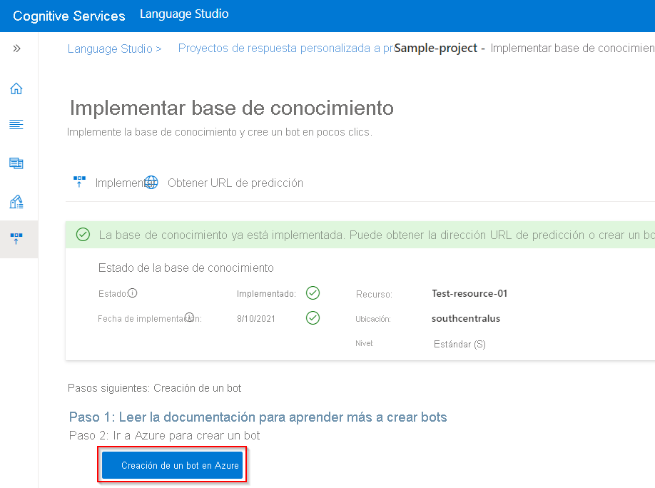
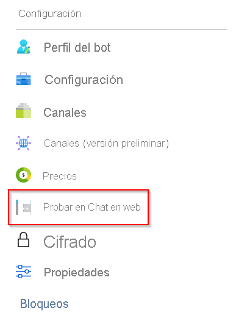
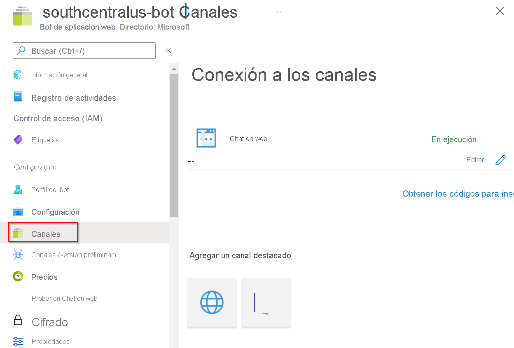

# Tutorial: Creación de un bot de preguntas más frecuentes

Cree un bot de preguntas frecuentes con respuesta a las preguntas personalizada y Azure [Bot Service](https://azure.microsoft.com/services/bot-service/) sin código.

En este tutorial aprenderá a:

<!-- green checkmark -->
> [!div class="checklist"]
> * Vincular un proyecto de respuesta a preguntas y una base de conocimiento a una instancia de Azure Bot Service
> * Implementar un bot
> * Probar el bot en Chat en web
> * Habilitar el bot en los canales admitidos

## Crear y publicar una base de conocimiento

Siga el [artículo de introducción](../how-to/create-test-deploy.md). Una vez que se haya implementado correctamente la base de conocimiento, estará listo para iniciar este artículo.

## Creación de un bot

Después de implementar el proyecto y la base de conocimiento, puede crear un bot desde la página **Deploy knowledge base** (Implementar base de conocimiento):

* Puede crear varios bots rápidamente, todos ellos apuntando a la misma base de conocimiento para diferentes regiones o planes de precios para los bots individuales.

* Si realiza cambios en la base de conocimiento y vuelve a implementarla, no es necesario realizar ninguna acción más con el bot. Ya está configurado para funcionar con la base de conocimiento y funciona con todos los cambios futuros de la base de conocimiento. Cada vez que publique una base de conocimiento, todos los bots conectados a ella se actualizarán automáticamente.

1. En el portal de Language Studio, en la página **Deploy knowledge base** (Implementar base de conocimiento) de la respuesta a preguntas, seleccione **Create bot** (Crear bot).

    > [!div class="mx-imgBorder"]
    > 

1. Se abre una nueva pestaña del explorador para Azure Portal, con la página de creación de Azure Bot Service. Configure Azure Bot Service.

    |Configuración |Valor|
    |----------|---------|
    | Bot handle (Identificador de bot)| Identificador único del bot. Este valor debe ser distinto del nombre de la aplicación. |
    | Suscripción | Seleccione su suscripción. |
    | Resource group | Seleccione un grupo de recursos existente o cree uno nuevo. |
    | Location | Seleccione la ubicación deseada. |
    | Plan de tarifa | Elegir plan de tarifa |
    |Nombre de la aplicación | Nombre de la aplicación de App Service del bot |
    |Lenguaje de SDK | C# o Node.js. Una vez creado el bot, puede descargar el código en el entorno de desarrollo local y continuar el proceso de desarrollo. |
    | Clave de autenticación de QnA | Esta clave se rellena automáticamente con el proyecto de respuesta a preguntas y la base de conocimiento implementados. |
    | Plan de App Service/ubicación | Este valor se rellena automáticamente, no cambie este valor. |

1. Una vez creado el bot, abra el recurso **Servicio de bots**.
1. En **Configuración**, seleccione **Probar en el Chat en web**.

    > [!div class="mx-imgBorder"]
    > 

1. En el aviso de chat **Escriba su mensaje**, escriba:

    `How do I setup my surface book?`

    El bot de chat muestra una respuesta de la base de conocimiento.

    > [!div class="mx-imgBorder"]
    > 

## Integración del bot con canales

Seleccione **Canales** en el recurso de Bot Service que ha creado. Puede activar el bot en otros [canales admitidos](/azure/bot-service/bot-service-manage-channels).

   >[!div class="mx-imgBorder"]
   >

## Limpieza de recursos

Si no va a seguir usando esta aplicación, elimine los recursos de respuesta a preguntas y Bot Service asociados.

## Pasos siguientes

Avance al siguiente artículo para obtener información sobre cómo personalizar el bot de preguntas más frecuentes con avisos de varios turnos.
> [!div class="nextstepaction"]
> [Avisos de múltiples turnos](guided-conversations.md)
