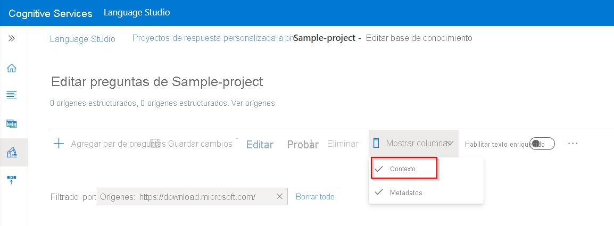
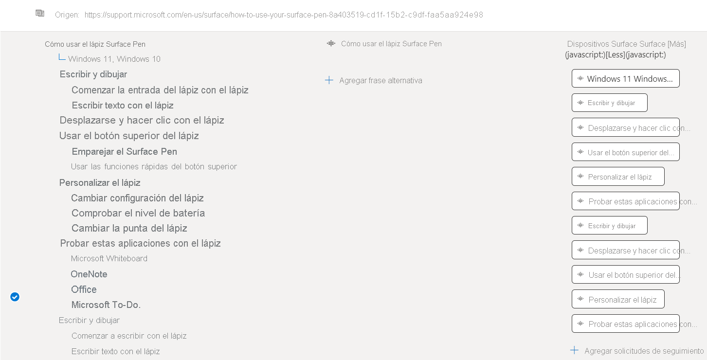
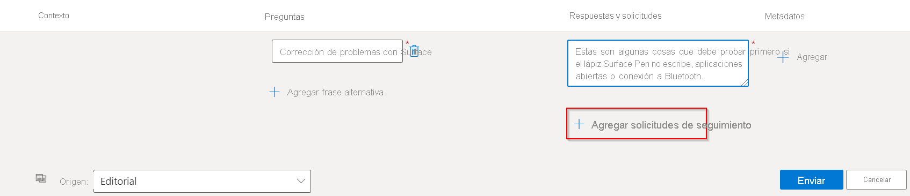
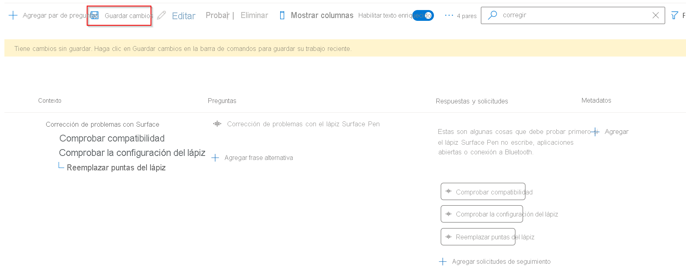
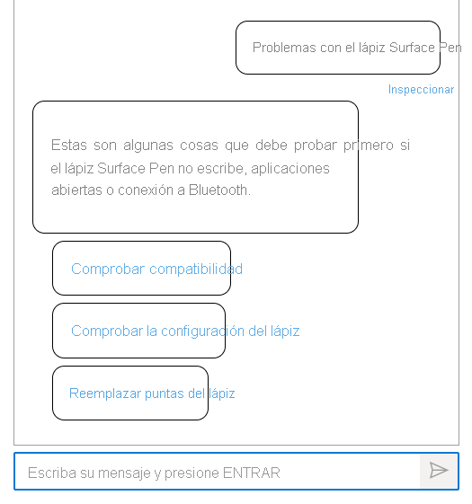

# Adición de conversaciones guiadas con solicitudes de turno múltiple

En este tutorial aprenderá a:

> [!div class="checklist"]
> * Agregar nuevos pares de preguntas y respuestas al proyecto existente
> * Agregar avisos de seguimiento para crear conversaciones guiadas
> * Prueba de los avisos de varios turnos

## Prerrequisitos

 En este tutorial, usaremos las [preguntas frecuentes del Lápiz para Surface](https://support.microsoft.com/surface/how-to-use-your-surface-pen-8a403519-cd1f-15b2-c9df-faa5aa924e98) para crear una knowledge base.

Si nunca ha creado un proyecto de respuesta a preguntas antes, se recomienda comenzar con el artículo de [introducción](../how-to/create-test-deploy.md), que le llevará paso a paso por el proceso.

## Visualización del contexto del par de respuestas a preguntas

En este ejemplo supongamos que los usuarios solicitan detalles adicionales sobre el producto Lápiz para Surface, en especial cómo solucionar problemas del Lápiz para Surface, pero no obtienen las respuestas correctas. Por lo tanto, agregamos más solicitudes para admitir escenarios adicionales y guiar a los usuarios hacia las respuestas correctas mediante solicitudes de varios turnos.

Para ver los mensajes de varios turnos asociados a pares de preguntas y respuestas, seleccione **Mostrar columnas** > **Contexto.** De forma predeterminada, ya debería estar habilitado en la página **Editar knowledge base** en la interfaz de respuesta a preguntas de Language Studio.

> [!div class="mx-imgBorder"]
> 

Se muestra el árbol de contexto donde se muestran todas las solicitudes de seguimiento vinculadas a un par de pregunta y respuesta: 

> [!div class="mx-imgBorder"]
> 

## Adición de un par de preguntas con solicitudes de seguimiento

Para ayudar a los usuarios a resolver problemas con el Lápiz para Surface, agregamos solicitudes de seguimiento:

- Adición de un nuevo par de preguntas con dos solicitudes de seguimiento
- Adición de una solicitud de seguimiento a una de las solicitudes recién agregadas

1. Adición de un nuevo par de pregunta y respuesta con dos solicitudes de seguimiento, **Comprobar compatibilidad** y **Comprobar configuración del Lápiz**. Mediante el editor, agregamos un par PyR con una solicitud de seguimiento al hacer clic en **Agregar par de preguntas**.

    > [!div class="mx-imgBorder"]
    > 
    
    Se crea una nueva fila en **Editorial**, donde se puede escribir el par de pregunta y respuesta, como se muestra a continuación:
    
    |Campo|Valor|
    |-----|----|
    |Preguntas | Corrección de problemas con Surface |
    |Respuestas y avisos | Estas son algunas cosas que debe probar primero si Surface Pen no escribe, no abre aplicaciones o no se conecta a Bluetooth.|
    
2. A continuación, agregamos una solicitud de seguimiento al par de preguntas recién creadas; para ello, seleccionamos **Agregar solicitud de seguimiento**. Rellene los detalles de la solicitud como se muestra:
    
    > [!div class="mx-imgBorder"]
    > 
    
    Indicamos **Comprobar compatibilidad** como "Texto para mostrar" para la solicitud e intentamos vincularlo a una pregunta y respuesta. Puesto que no hay ningún par de pregunta y respuesta relacionado disponible para vincular a la solicitud, cuando buscamos "Comprobar la compatibilidad del Lápiz para Surface", creamos un nuevo par de preguntas al hacer clic en **Crear enlace al nuevo par** y seleccione **Listo**. A continuación, seleccione **Save changes** (Guardar cambios).
    
    > [!div class="mx-imgBorder"]
    > 
    
3. Del mismo modo, agregamos otra solicitud **Comprobar configuración del Lápiz** para ayudar al usuario a solucionar los problemas del Lápiz para Surface y agregarle un par de preguntas.
    
    > [!div class="mx-imgBorder"]
    > 

4. Agregue otra solicitud de seguimiento a la solicitud recién creada. Ahora agregamos "Replace Pen tips" (Reemplazar puntas para el Lápiz) como solicitud de seguimiento a la solicitud creada anteriormente "Check Pen Settings".

    > [!div class="mx-imgBorder"]
    > 
    
5. Por último, guarde los cambios y pruebe estas solicitudes en el panel **Prueba**:
    
    > [!div class="mx-imgBorder"]
    > 
    
    Para una consulta de usuario **Issues with Surface Pen** (Problemas con el Lápiz de Surface), el sistema devuelve una respuesta y presenta al usuario las solicitudes recién agregadas. A continuación, el usuario selecciona uno de las solicitudes **Check Pen Settings** y se devuelve al usuario la respuesta relacionada con otra solicitud **Replace Pen Tips**, que cuando se selecciona proporciona más información al usuario. Por lo tanto, se usan varios turnos para ayudar al usuario y guiarlo hacia la respuesta deseada.
    
    > [!div class="mx-imgBorder"]
    > 

## Pasos siguientes

> [!div class="nextstepaction"]
> [Enriquecimiento de la knowledge base con el aprendizaje activo](active-learning.md)
