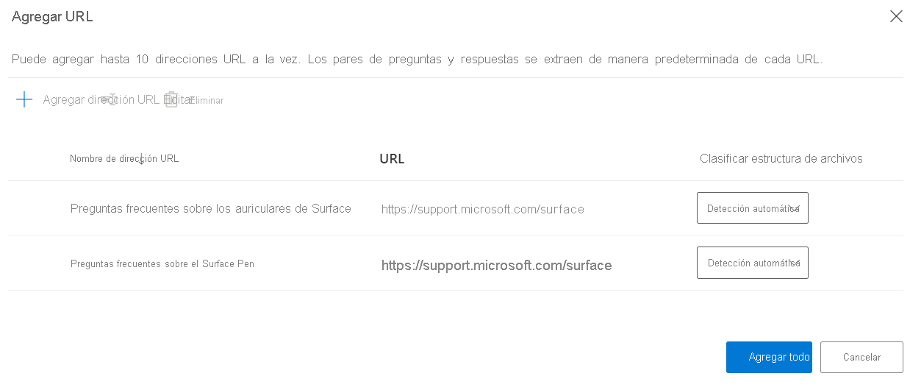
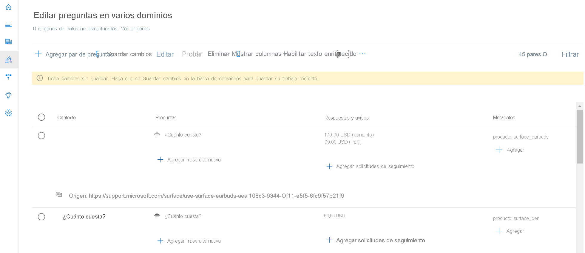
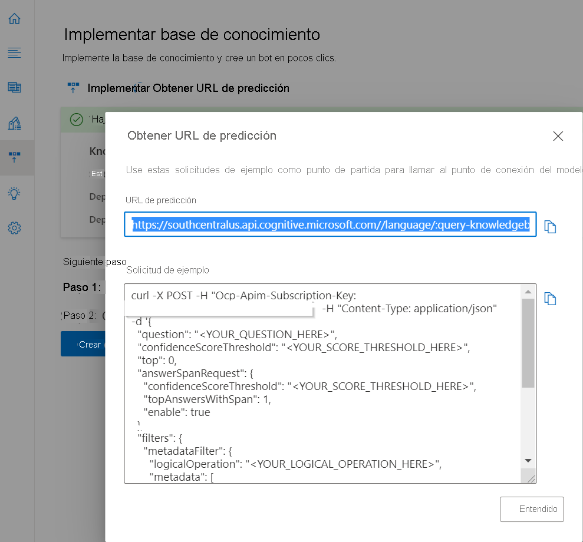
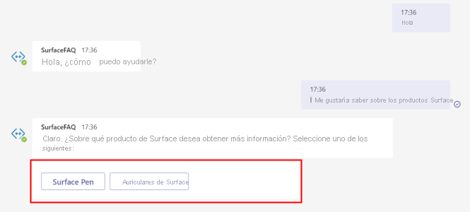
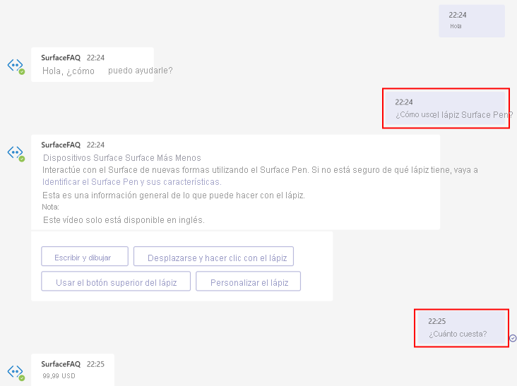
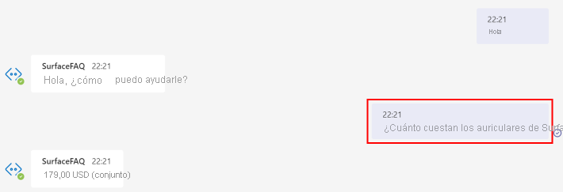

# <a name="add-multiple-domains-to-your-faq-bot"></a>Incorporación de varios dominios al bot de preguntas frecuentes

En este tutorial aprenderá a:

> [!div class="checklist"]
> * Creación de un proyecto y etiquetado de pares de preguntas y respuestas en dominios distintos con metadatos
> * Creación de un proyecto independiente para cada dominio
> * Creación de un recurso de idioma independiente para cada dominio

Al crear un bot de preguntas frecuentes, puede encontrar casos de uso que requieran que aborde consultas en varios dominios. Supongamos que el equipo de marketing de Microsoft quiere crear un bot de ayuda al cliente que responda a las consultas comunes del usuario sobre varios productos de Surface. Para simplificar el ejercicio, usaremos dos direcciones URL de preguntas frecuentes, el [lápiz de Surface](https://support.microsoft.com/surface/how-to-use-your-surface-pen-8a403519-cd1f-15b2-c9df-faa5aa924e98) y los [auriculares de Surface](https://support.microsoft.com/surface/use-surface-earbuds-aea108c3-9344-0f11-e5f5-6fc9f57b21f9) para crear el proyecto.

## <a name="create-project-with-domain-specific-metadata"></a>Creación de un proyecto con metadatos específicos de dominio

Los creadores de contenido pueden usar documentos para extraer pares de preguntas y respuestas o agregar pares de preguntas y respuestas personalizados al proyecto o knowledge base. Para agrupar estas preguntas y respuestas en dominios o categorías específicos, puede agregar metadatos.

En cuanto al bot de productos Surface, puede realizar los pasos siguientes para crear un bot que responda a las consultas de ambos tipos de productos:

1. Para agregar las siguientes direcciones URL de preguntas frecuentes como orígenes, seleccione **Add source** > **URLs** (Agregar origen > Direcciones URL) y, a continuación, **Agregar todo** una vez que haya agregado cada una de las direcciones URL siguientes:
   
   [Preguntas frecuentes del lápiz de Surface](https://support.microsoft.com/surface/how-to-use-your-surface-pen-8a403519-cd1f-15b2-c9df-faa5aa924e98)<br>[Preguntas frecuentes sobre los auriculares de Surface](https://support.microsoft.com/surface/use-surface-earbuds-aea108c3-9344-0f11-e5f5-6fc9f57b21f9)

    >[!div class="mx-imgBorder"]
    >[](../media/multiple-domains/add-url.png#lightbox)

2. En esta knowledge base, tenemos pares de preguntas y respuestas sobre dos productos y nos gustaría distinguirlos para poder buscar respuestas entre las preguntas y respuestas de un producto determinado. Para ello, se puede actualizar el campo de metadatos de los pares de preguntas y respuestas.

   Como puede ver en el ejemplo siguiente, hemos agregado metadatos con el **producto** como clave y **surface_pen** o **surface_earbuds** como valores, siempre que corresponda. Puede ampliar este ejemplo para extraer datos de varios productos y agregar un valor diferente para cada producto.

   >[!div class="mx-imgBorder"]
   >[](../media/multiple-domains/product-metadata.png#lightbox)

4. Ahora, a fin de restringir el sistema para buscar la respuesta en un producto determinado, tendrá que pasar ese producto como filtro en la API de REST de respuesta a preguntas.

    La dirección URL de la predicción de la API de REST se puede recuperar desde el panel de implementación de knowledge base:

   >[!div class="mx-imgBorder"]
   >[](../media/multiple-domains/prediction-url.png#lightbox)

    En el cuerpo JSON de la llamada API, hemos pasado *surface_pen* como valor para el *producto* de metadatos. Por lo tanto, el sistema solo buscará la respuesta entre los pares de preguntas y respuestas con los mismos metadatos.

    ```json
        {
          "question": "What is the price?",
          "top": 3
        },
        "answerSpanRequest": {
          "enable": true,
          "confidenceScoreThreshold": 0.3,
          "topAnswersWithSpan": 1
        },
        "filters": {
          "metadataFilter": {
            "metadata": [
              {
                "key": "product",
                "value": "surface_pen"
              }
            ]
          }
        }
    ```

    Puede obtener el valor de los metadatos en función de la entrada de usuario de las maneras siguientes: 

    * Tome explícitamente el dominio como entrada de usuario a través del cliente bot. Por ejemplo, tal como se muestra a continuación, puede tomar la categoría de producto como entrada de usuario cuando se inicia la conversación.

      

    * Identifique implícitamente el dominio en función del contexto del bot. Por ejemplo, en caso de que la pregunta anterior se realizara en un producto de Surface determinado, el cliente puede guardarla como contexto. Si el usuario no especifica el producto en la siguiente consulta, puede pasar el contexto del bot como metadatos a la API Generate Answer.

      

    * Extraiga la entidad de la consulta de usuario para identificar el dominio que se usará en el filtro de metadatos. Puede usar otros servicios de Cognitive Services, como [Reconocimiento de entidades con nombre (NER)](../../named-entity-recognition/overview.md) y [reconocimiento del lenguaje conversacional](../../conversational-language-understanding/overview.md) para la extracción de entidades.

      

### <a name="how-large-can-our-projects-be"></a>¿Qué tamaño pueden tener los proyectos?

Puede agregar hasta 50 000 pares de preguntas y respuestas a un único proyecto o knowledge base. Si los datos superan los 50 000 pares de preguntas y respuestas, debe considerar la posibilidad de dividir la knowledge base.

## <a name="create-a-separate-project-for-each-domain"></a>Creación de un proyecto independiente para cada dominio

También puede crear un proyecto o knowledge base independiente para cada dominio y mantener los proyectos por separado. Todas las API requieren que el usuario pase el id. del proyecto para realizar cualquier actualización en la knowledge base o capturar una respuesta a la pregunta del usuario.  

Cuando el servicio reciba la pregunta del usuario, deberá pasar el objeto `projectName` en el punto de conexión de la API de REST que se mostró para obtener una respuesta de la knowledge base correspondiente. Puede encontrar la dirección URL en la página **Deploy knowledge base** (Implementación de knowledge base) en **Get prediction URL** (Obtener dirección URL de la predicción):

`https://southcentralus.api.cognitive.microsoft.com/language/:query-knowledgebases?projectName=Test-Project-English&api-version=2021-10-01&deploymentName=production`

## <a name="create-a-separate-language-resource-for-each-domain"></a>Creación de un recurso de idioma independiente para cada dominio

Supongamos que el equipo de marketing de Microsoft quiere crear un bot de ayuda al cliente que responda a las consultas del usuario sobre varios productos de Surface y Xbox. Para ello, planea asignar distintos equipos para acceder a las bases de conocimiento en Surface y Xbox. En este caso, se recomienda crear dos recursos de QnA Maker: uno para Surface y otro para Xbox. Sin embargo, puede definir roles distintos para los usuarios que acceden al mismo recurso.
