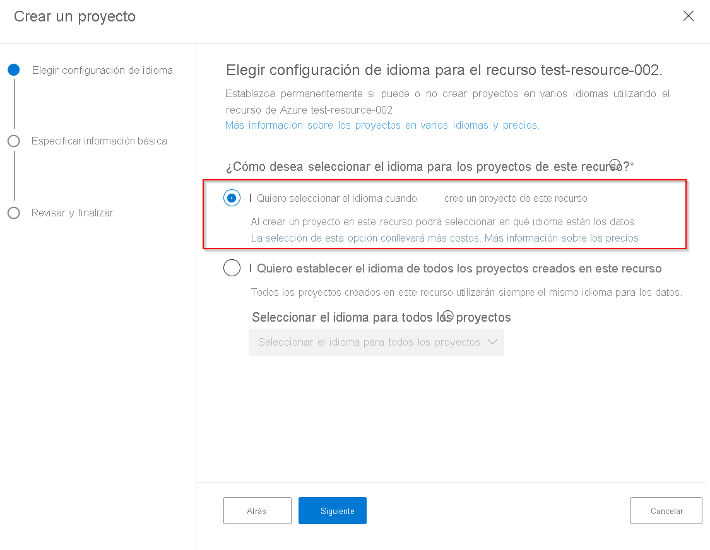
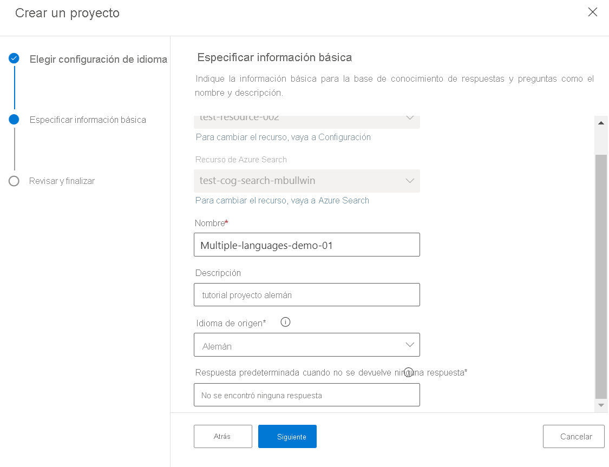
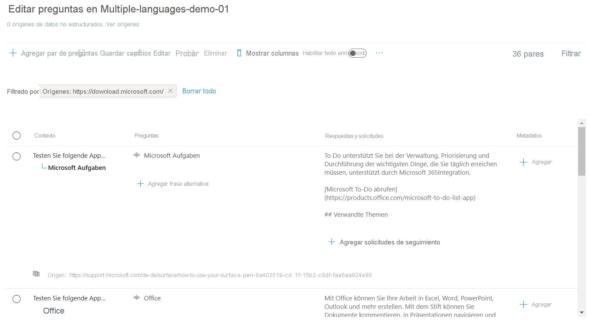
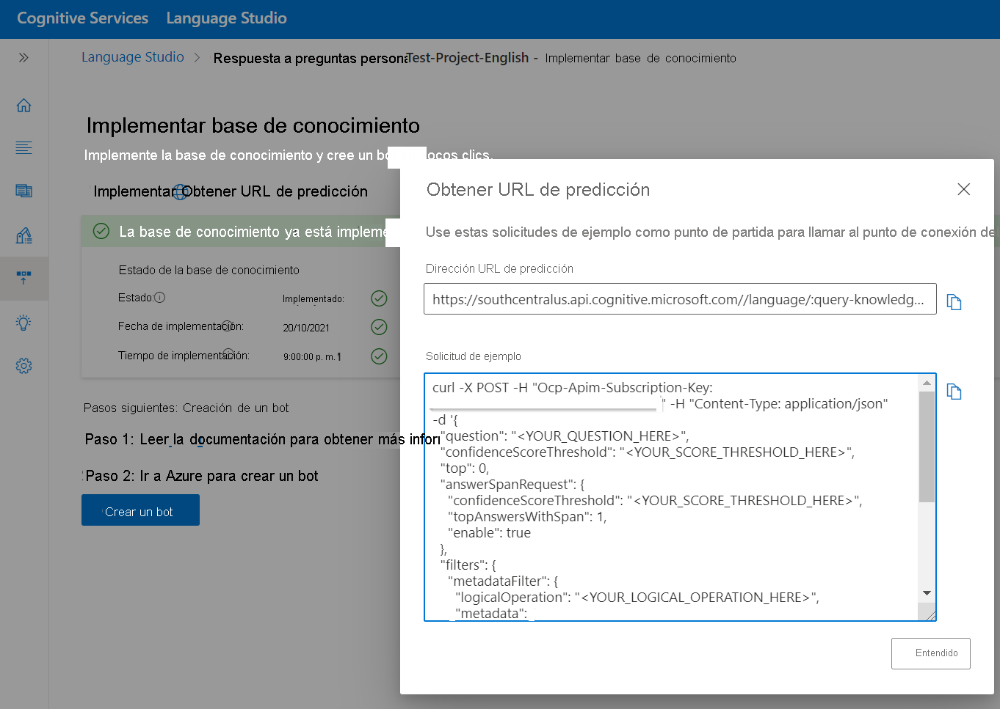

# Creación de proyectos en varios idiomas

En este tutorial aprenderá a:

<!-- green checkmark -->
> [!div class="checklist"]
> * Creación de un proyecto que admita inglés
> * Creación de un proyecto que admita alemán

Este tutorial le guiará por el proceso de creación de proyectos o knowledge bases en varios idiomas. Usamos la dirección URL de la página de [preguntas frecuentes del Lápiz para Surface](https://support.microsoft.com/surface/how-to-use-your-surface-pen-8a403519-cd1f-15b2-c9df-faa5aa924e98) para crear proyectos en alemán e inglés. A continuación, implementamos el proyecto y usamos la API de REST de respuesta a preguntas para consultar y obtener respuestas a las preguntas más frecuentes en el idioma deseado.

## Creación de un proyecto en alemán

Para poder crear un proyecto en más de un idioma, se debe establecer la configuración de varios idiomas al crear el primer proyecto asociado al recurso de idioma.

> [!div class="mx-imgBorder"]
> 

1. En la página de inicio de [Language Studio](https://aka.ms/languageStudio), seleccione Abrir respuesta a preguntas personalizadas. Seleccione **Crear proyecto** > **I want to select the language when I create a project in this resource (Deseo seleccionar el idioma al crear un proyecto en este recurso)**  > **Siguiente**.

2. Rellene la página de información básica y seleccione **Siguiente** > **Crear proyecto**.

    |Configuración| Value|
    |---|----|
    |Nombre | Nombre único para el proyecto.|
    |Descripción | Descripción única para ayudar a identificar el proyecto. |
    |Idioma de origen | Para este tutorial, seleccione Alemán. |
    |Respuesta predeterminada | Respuesta predeterminada cuando no se devuelve ninguna respuesta. |

    > [!div class="mx-imgBorder"]
    > 

3. **Agregar origen** > **Direcciones URL** > **Agregar URL** > **Agregar todos**.

    |Configuración| Valor |
    |----|------|
    | Nombre de dirección URL | Lápiz para Surface alemán |
    | URL | https://support.microsoft.com/de-de/surface/how-to-use-your-surface-pen-8a403519-cd1f-15b2-c9df-faa5aa924e98 |
    | Clasificación de la estructura de archivos | Detección automática |
    
    La respuesta a preguntas lee el documento y extrae pares de preguntas y respuestas de la dirección URL de origen para crear el proyecto o la knowledge base en alemán. Si selecciona el vínculo al origen, se abre la página de la knowledge base donde podemos editar el contenido.
    
    > [!div class="mx-imgBorder"]
    > 
    
## Creación de un proyecto en inglés

Ahora repetimos los pasos anteriores, pero esta vez seleccionamos Inglés y proporcionamos una dirección URL en inglés como origen.

1. En [Language Studio](https://aka.ms/languageStudio), abra la página de respuesta a preguntas > **Crear proyecto**.

2. Rellene la página de información básica y seleccione **Siguiente** > **Crear proyecto**.

    |Configuración| Value|
    |---|----|
    |Nombre | Nombre único para el proyecto.|
    |Descripción | Descripción única para ayudar a identificar el proyecto. |
    |Idioma de origen | Para este tutorial, seleccione Inglés. |
    |Respuesta predeterminada | Respuesta predeterminada cuando no se devuelve ninguna respuesta. |

3. **Agregar origen** > **Direcciones URL** > **Agregar URL** > **Agregar todos**.

    |Configuración| Valor |
    |-----|-----|
    | Nombre de dirección URL | Lápiz para Surface alemán |
    | URL | https://support.microsoft.com/en-us/surface/how-to-use-your-surface-pen-8a403519-cd1f-15b2-c9df-faa5aa924e98 |
    | Clasificación de la estructura de archivos | Detección automática |

## Implementación y consulta de la knowledge base

Ahora estamos listos para implementar los dos proyectos o knowledge bases, y consultarlos en el lenguaje deseado mediante la API de REST de respuesta a preguntas. Una vez implementado el proyecto, se muestra la página siguiente, que proporciona detalles para consultar la knowledge base.

> [!div class="mx-imgBorder"]
> 

El idioma de la consulta de usuario entrante se puede detectar con la [API Detección de idioma](../../language-detection/how-to/call-api.md), y el usuario puede llamar al punto de conexión y la knowledge base adecuados según el idioma detectado.
