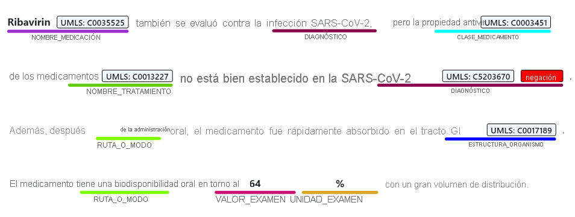
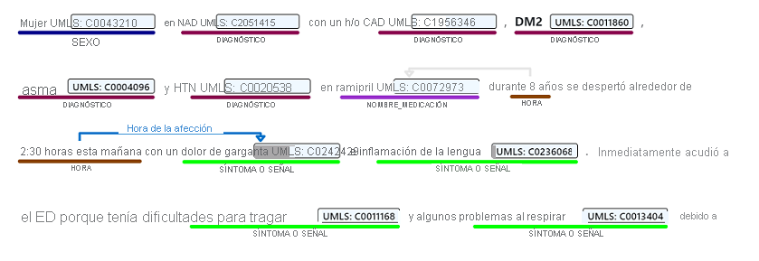
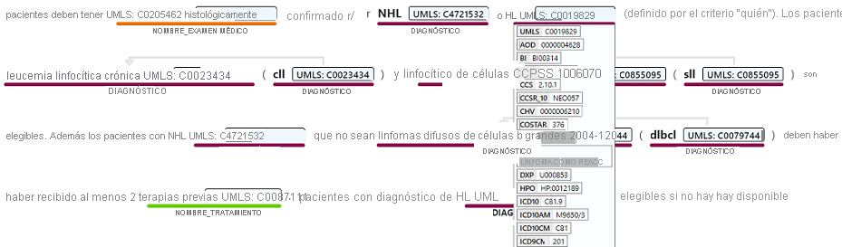
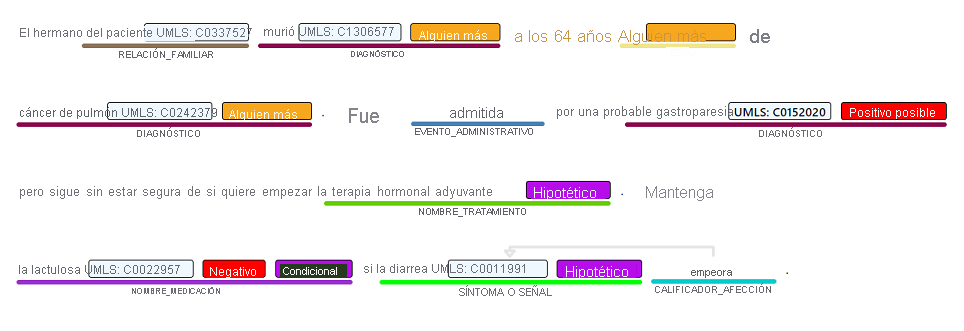

# [Reconocimiento de entidades con nombre](#tab/ner)

El reconocimiento de entidades con nombre detecta palabras y frases mencionadas en texto no estructurado que se pueden asociar a uno o varios tipos semánticos, como el diagnóstico, el nombre de los medicamentos, el síntoma, el signo o la edad.

> [!div class="mx-imgBorder"]
> 

# [Extracción de relaciones](#tab/relation-extraction)

La extracción de relaciones identifica conexiones significativas entre los conceptos mencionados en el texto. Por ejemplo, una relación de "hora de condición" se encuentra al asociar un nombre de condición con una hora o entre una abreviatura y la descripción completa.  

> [!div class="mx-imgBorder"]
> 

# [Entity Linking](#tab/entity-linking)

La vinculación de entidad anula las distintas entidades al asociar las entidades con nombre mencionadas en el texto a los conceptos que se encuentran en una base de datos de conceptos predefinida, incluido el Sistema de Lenguaje Médico Unificado (UMLS). Los conceptos médicos también tienen asignada una denominación preferida, como forma adicional de normalización.

> [!div class="mx-imgBorder"]
> 

Text Analytics para el estado admite la vinculación a los vocabularios biomédicos y de salud que se encuentran en el origen de la información del metadiccionario de sinónimos del Sistema unificado de lenguaje médico ([UMLS](https://www.nlm.nih.gov/research/umls/sourcereleasedocs/index.html)).

# [Detección de aserciones](#tab/assertion-detection) 

El significado del contenido médico se ve muy afectado por los modificadores, como las aserciones negativas o condicionales, que pueden tener implicaciones críticas si se interpretan de manera errónea. Text Analytics for Health admite tres categorías de detección de aserciones para entidades del texto: 

* Certeza
* Condicional
* Asociación

> [!div class="mx-imgBorder"]
> 

---
