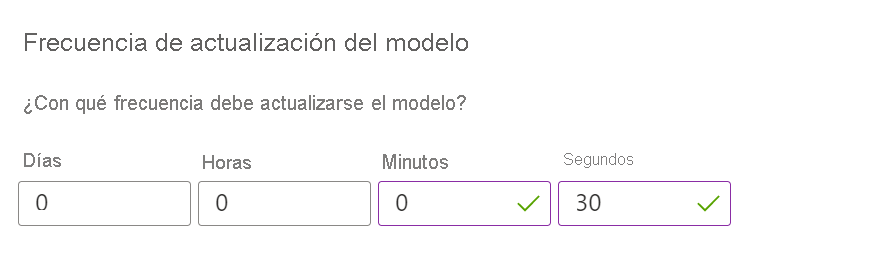

### Cambio de la frecuencia de actualización del modelo

En la página **Configuración** del recurso Personalizer de Azure Portal, cambie el valor de **Frecuencia de actualización del modelo** a 30 segundos. Con esta duración breve, el modelo se entrenará rápidamente, lo que permite ver cómo cambia la acción principal en cada iteración.

La primera vez que se instancia un bucle de Personalizer, no hay ningún modelo porque no se ha producido ninguna llamada a API Reward a partir de la que realizar el entrenamiento. Las llamadas de Rank devolverán las mismas probabilidades para cada elemento. La aplicación siempre debe clasificar el contenido mediante la salida de RewardActionId.