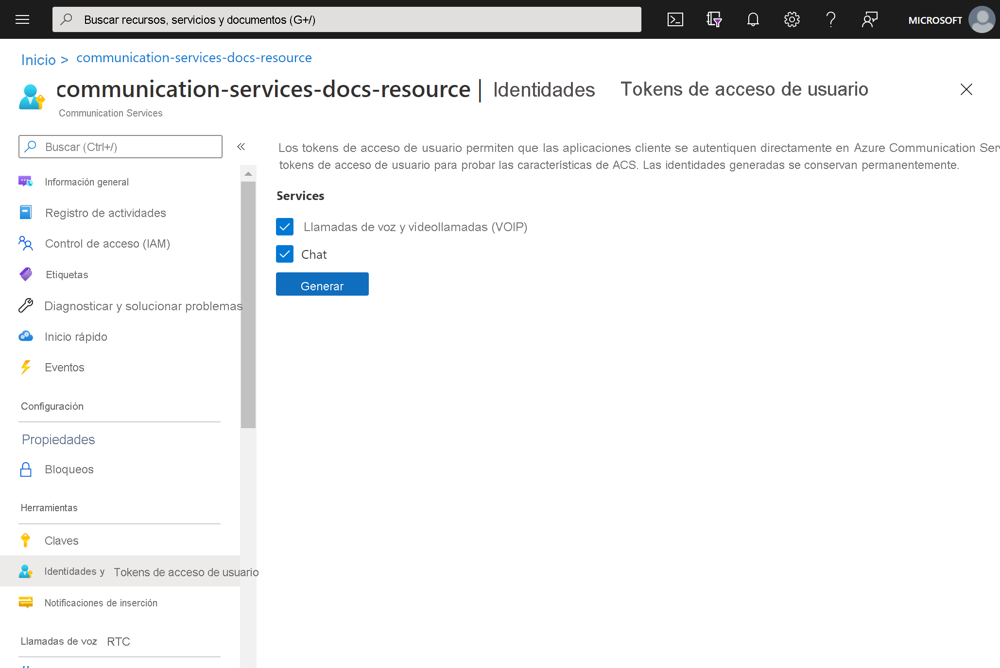
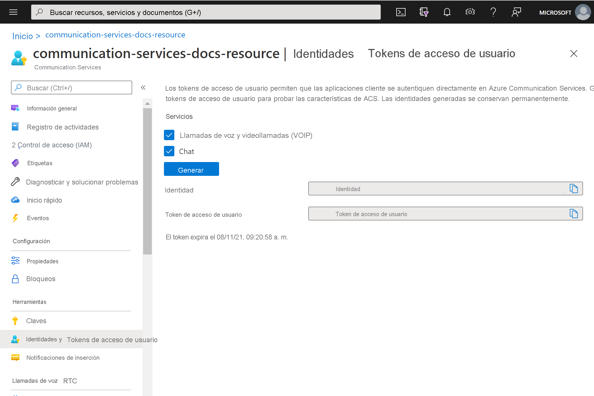

# <a name="quickstart-quickly-create-azure-communication-services-access-tokens-for-testing"></a>Inicio rápido: Creación rápida de tokens de acceso de Azure Communication Services para pruebas

En la extensión de Communication Services de [Azure Portal](https://portal.azure.com), puede generar una identidad y un token de acceso de Communication Services. Esto le permite omitir la creación de un servicio de autenticación, lo que facilita la prueba de las aplicaciones de ejemplo y escenarios de desarrollo sencillos. Esta característica está pensada para pruebas y validación a pequeña escala y no debe usarse para escenarios de producción. Para el código de producción, consulte el [inicio rápido sobre la creación de tokens de acceso](../access-tokens.md).

La herramienta presenta el comportamiento del ```Identity SDK``` en una experiencia de usuario sencilla. Los tokens y las identidades creados a través de esta herramienta, siga los mismos comportamientos y reglas como si se hubieran creado mediante el ```Identity SDK```.  Por ejemplo, los tokens de acceso expiran después de 24 horas.

## <a name="prerequisites"></a>Requisitos previos

- Un [recurso de Azure Communication Services](../create-communication-resource.md)

## <a name="create-the-access-tokens"></a>Creación de los tokens de acceso

En [Azure Portal](https://portal.azure.com), vaya a la hoja **Identidades y tokens de acceso de usuario** en el recurso de Communication Services. 

Elija el ámbito de los tokens de acceso. Puede seleccionar ninguno, uno o varios. Haga clic en **Generar**.



Verá una identidad y el token de acceso de usuario correspondiente generado. Puede copiar estas cadenas y usarlas en las [aplicaciones de ejemplo](../../samples/overview.md) y otros escenarios de prueba.



## <a name="next-steps"></a>Pasos siguientes


Puede que también le interese:

 - [Información sobre la autenticación](../../concepts/authentication.md)
 - [Información sobre la arquitectura de cliente y servidor](../../concepts/client-and-server-architecture.md)
