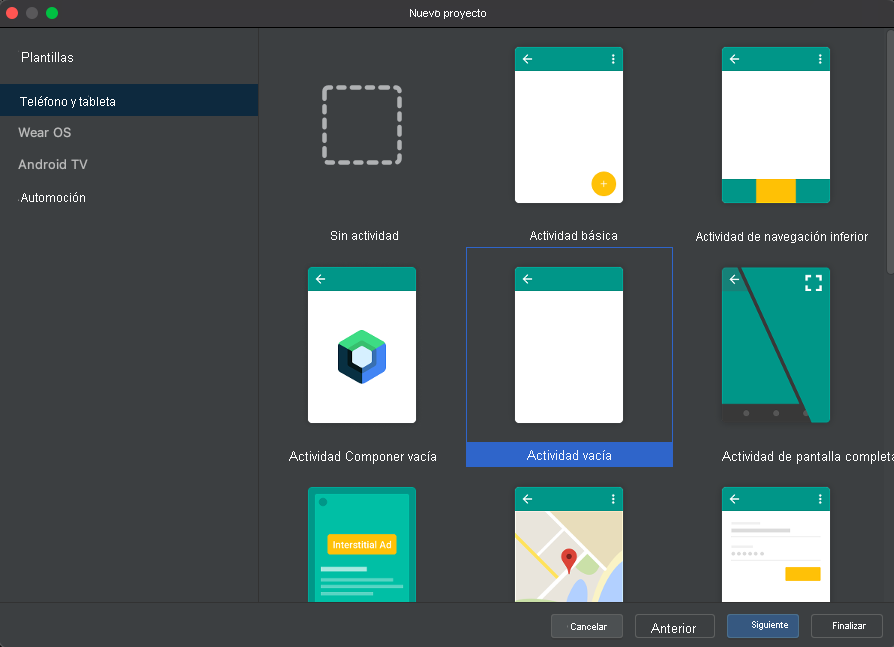
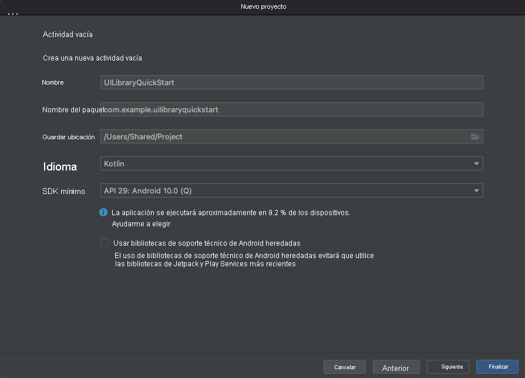

## <a name="prerequisites"></a>Requisitos previos

- Una cuenta de Azure con una suscripción activa. [Cree una cuenta gratuita](https://azure.microsoft.com/free/?WT.mc_id=A261C142F).
- Un sistema operativo que ejecute [Android Studio](https://developer.android.com/studio).
- Un recurso de Communication Services implementado. [Cree un recurso de Communication Services](../../../create-communication-resource.md).
- Token de Azure Communication Services. Consulte el [ejemplo](../../../identity/quick-create-identity.md). 

## <a name="setting-up"></a>Instalación

### <a name="creating-an-android-app-with-an-empty-activity"></a>Creación de una aplicación de Android con una actividad vacía

En Android Studio, cree un proyecto y seleccione `Empty Activity`.



Haga clic en el botón `Next` y asigne al proyecto el nombre `UILibraryQuickStart`, establezca que el lenguaje es `Java/Kotlin` y seleccione un SDK mínimo de "API 23: Android 6.0 (Marshmallow)", o superior.



Haga clic en `Finish`.

## <a name="maven-repository-credentials"></a>Credenciales del repositorio de Maven

- Debe proporcionar un token de acceso personal que tenga seleccionado el ámbito `read:packages`.
- Es posible que deba tener `SSO enabled` para ese token.
- Asegúrese también de que el usuario de GitHub tenga acceso a https://github.com/Azure/communication-preview.
- Se puede generar un token de acceso personal: [aquí](https://github.com/settings/tokens

## <a name="install-the-packages"></a>Instalación de los paquetes

En el archivo `build.gradle` de nivel de aplicación (**carpeta de la aplicación**), agregue las siguientes líneas a las secciones de dependencias y de Android.

```groovy
android {
    ...
    packagingOptions {
        pickFirst  'META-INF/*'
    }
    ...
}
```

```groovy
dependencies {
    ...
    implementation 'com.azure.android:azure-communication-ui:1.0.0-alpha.1'
    ...
}
```

En el archivo `settings.gradle` de nivel de configuración del proyecto (**carpeta de la aplicación**), agregue las siguientes líneas a los repositorios.

```groovy
dependencyResolutionManagement {
    repositoriesMode.set(RepositoriesMode.FAIL_ON_PROJECT_REPOS)
    repositories {
        ...
        maven {
            url "https://pkgs.dev.azure.com/MicrosoftDeviceSDK/DuoSDK-Public/_packaging/Duo-SDK-Feed/maven/v1"
        }
        maven {
            name='github'
            url = 'https://maven.pkg.github.com/Azure/communication-preview'
            credentials {
                username '<your GitHub user name>'
                password '<your personal access token>'
            }
        }
        ...
    }
}
```
Sincronice el proyecto con archivos de Gradle. (Android Studio -> Archivo -> Sincronizar proyecto con archivos de Gradle)

## <a name="add-a-button-to-the-activity_main"></a>Agregue un botón a activity_main

Vaya al archivo de diseño (`app/src/main/res/layout/activity_main.xml`). Aquí quitaremos el código siguiente para crear un botón para iniciar el compuesto.

```xml
<?xml version="1.0" encoding="utf-8"?>
<androidx.constraintlayout.widget.ConstraintLayout xmlns:android="http://schemas.android.com/apk/res/android"
    xmlns:app="http://schemas.android.com/apk/res-auto"
    xmlns:tools="http://schemas.android.com/tools"
    android:layout_width="match_parent"
    android:layout_height="match_parent"
    tools:context=".MainActivity">

    <Button
        android:id="@+id/startButton"
        android:layout_width="wrap_content"
        android:layout_height="wrap_content"
        android:text="Launch"
        app:layout_constraintBottom_toBottomOf="parent"
        app:layout_constraintLeft_toLeftOf="parent"
        app:layout_constraintRight_toRightOf="parent"
        app:layout_constraintTop_toTopOf="parent" />

</androidx.constraintlayout.widget.ConstraintLayout>
```

## <a name="initialize-composite"></a>Inicializar compuesto 

Ir a `MainActivity`. Aquí vamos a insertar el siguiente código para inicializar los componentes compuestos de llamada. Reemplace `"GROUP_CALL_ID"` por el identificador de grupo de la llamada, `"DISPLAY_NAME"` por su nombre y `"<USER_ACCESS_TOKEN>"` por el token.

#### <a name="kotlin"></a>[Kotlin](#tab/kotlin)

```kotlin
package com.example.uilibraryquickstart

import androidx.appcompat.app.AppCompatActivity
import android.os.Bundle
import android.widget.Button
import com.azure.android.communication.common.CommunicationTokenCredential
import com.azure.android.communication.common.CommunicationTokenRefreshOptions
import com.azure.android.communication.ui.CallCompositeBuilder
import com.azure.android.communication.ui.CallComposite
import com.azure.android.communication.ui.GroupCallOptions
import java.util.UUID

class MainActivity : AppCompatActivity() {
    override fun onCreate(savedInstanceState: Bundle?) {
        super.onCreate(savedInstanceState)
        setContentView(R.layout.activity_main)
        
        val startButton: Button = findViewById(R.id.startButton)
        startButton.setOnClickListener { l -> startCallComposite() }
    }

    private fun startCallComposite() {
        val communicationTokenRefreshOptions = CommunicationTokenRefreshOptions({ fetchToken() }, true)
        val communicationTokenCredential = CommunicationTokenCredential(communicationTokenRefreshOptions)
        val options = GroupCallOptions(
            this,
            communicationTokenCredential,
            "DISPLAY_NAME",
            UUID.fromString("GROUP_CALL_ID")
        )

        val callComposite: CallComposite = CallCompositeBuilder().build()
        callComposite.launch(options)
    }

    private fun fetchToken(): String? {
        return "USER_ACCESS_TOKEN"
    }
}
```

#### <a name="java"></a>[Java](#tab/java)

```java
package com.example.uilibraryquickstart;

import androidx.appcompat.app.AppCompatActivity;
import android.os.Bundle;
import android.widget.Button;
import com.azure.android.communication.common.CommunicationTokenCredential;
import com.azure.android.communication.common.CommunicationTokenRefreshOptions;
import com.azure.android.communication.ui.CallCompositeBuilder;
import com.azure.android.communication.ui.CallComposite;
import com.azure.android.communication.ui.GroupCallOptions;
import java.util.UUID;

public class MainActivity extends AppCompatActivity {

    @Override
    protected void onCreate(Bundle savedInstanceState) {
        super.onCreate(savedInstanceState);
        setContentView(R.layout.activity_main);

        Button startButton = findViewById(R.id.startButton);

        startButton.setOnClickListener(l -> {
            startCallComposite();
        });
    }

    private void startCallComposite() {
        CallComposite callComposite = new CallCompositeBuilder().build();

        CommunicationTokenRefreshOptions communicationTokenRefreshOptions =
                new CommunicationTokenRefreshOptions(this::fetchToken, true);
        CommunicationTokenCredential communicationTokenCredential = new CommunicationTokenCredential(communicationTokenRefreshOptions);

        GroupCallOptions options = new GroupCallOptions(this,
                communicationTokenCredential,
                "DISPLAY_NAME",
                UUID.fromString("GROUP_CALL_ID"));

        callComposite.launch(options);
    }

    private String fetchToken() {
        return "USER_ACCESS_TOKEN";
    }
}
```

-----
## <a name="run-the-code"></a>Ejecución del código

Compile e inicie la aplicación desde Android Studio.

- Haga clic en `Launch`.
- Acepte los permisos de audio y seleccione la configuración de dispositivo, micrófono y vídeo.
- Haga clic en `Join Call`.

## <a name="sample-application-code-can-be-found-here"></a>El código de la aplicación de ejemplo se puede encontrar [aquí](https://github.com/Azure-Samples/communication-services-android-quickstarts/tree/ui-library-quickstart/ui-library-quick-start).


## <a name="object-model"></a>Modelo de objetos

Las siguientes clases e interfaces controlan algunas de las características principales del SDK de la interfaz de usuario de Android para Azure Communication Services:

| Nombre                                                               | Descripción                                                                                  |
| ------------------------------------------------------------------ | -------------------------------------------------------------------------------------------- |
| [CallComposite](#create-call-composite)                            | Componente compuesto que representa una experiencia de llamada con galería de participantes y controles.    |
| [CallCompositeBuilder](#create-call-composite)                     | Compilador para compilar CallComposite con opciones.                                                 |
| [GroupCallOptions](#group-call)                                    | Se ha pasado el inicio de CallComposite para iniciar la llamada grupal.                                          |
| [TeamsMeetingOptions](#teams-meeting)                              | Se ha pasado al inicio de CallComposite para unirse a una reunión en Teams.                                |
| [ThemeConfiguration](#apply-theme-configuration)                   | Se ha insertado como opcional en CallCompositeBuilder para cambiar el color principal del compuesto.           |

## <a name="ui-library-functionality"></a>Funcionalidad de la biblioteca de interfaz de usuario

### <a name="create-call-composite"></a>Creación de un compuesto de llamada

Inicialice una instancia de `CallCompositeBuilder` y una instancia de `CallComposite` dentro de la función `startCallComposite`.

#### <a name="kotlin"></a>[Kotlin](#tab/kotlin)

```kotlin
val callComposite: CallComposite = CallCompositeBuilder().build()
```
#### <a name="java"></a>[Java](#tab/java)

```java
CallComposite callComposite = new CallCompositeBuilder().build();
```

-----
### <a name="setup-authentication"></a>Configuración de la autenticación

Inicialice una instancia de `CommunicationTokenCredential` dentro de la función `startCallComposite`. Reemplace `"<USER_ACCESS_TOKEN>"` por su token.

#### <a name="kotlin"></a>[Kotlin](#tab/kotlin)

```kotlin
val callComposite: CallComposite = CallCompositeBuilder().build()

val communicationTokenRefreshOptions = CommunicationTokenRefreshOptions(this::fetchToken, true)

val communicationTokenCredential = CommunicationTokenCredential(communicationTokenRefreshOptions)
```

#### <a name="java"></a>[Java](#tab/java)

```java
CallComposite callComposite = new CallCompositeBuilder().build();

CommunicationTokenRefreshOptions communicationTokenRefreshOptions =
                new CommunicationTokenRefreshOptions(this::fetchToken, true);

CommunicationTokenCredential communicationTokenCredential = new CommunicationTokenCredential(communicationTokenRefreshOptions);

```

Consulte la documentación relativa al [token de acceso de usuario](../../../identity/quick-create-identity.md) si aún no tiene ningún token disponible.

-----
### <a name="setup-group-call-or-teams-meeting-options"></a>Configuración de una llamada grupal u opciones de reunión en Teams

En función del tipo de llamada o reunión que quiera configurar, use el objeto de opciones adecuado.

### <a name="group-call"></a>Llamada grupal

Inicialice una instancia de `GroupCallOptions` dentro de la función `startCallComposite`.

Reemplace `"GROUP_CALL_ID"` por el identificador de grupo de la llamada.

Reemplace `"DISPLAY_NAME"` por su propio nombre.

#### <a name="kotlin"></a>[Kotlin](#tab/kotlin)

```kotlin
val options = GroupCallOptions(
            this,
            communicationTokenCredential,
            "DISPLAY_NAME",
            UUID.fromString("GROUP_CALL_ID")
        )
```

#### <a name="java"></a>[Java](#tab/java)

```java
GroupCallOptions options = new GroupCallOptions(
    this,
    communicationTokenCredential,
    "DISPLAY_NAME",
    UUID.fromString("GROUP_CALL_ID")
);
```
-----
### <a name="teams-meeting"></a>Reuniones en Teams

Inicialice una instancia de `TeamsMeetingOptions` dentro de la función `startCallComposite`.
Reemplace `"TEAMS_MEETING_LINK"` por el identificador de grupo de la llamada.

Reemplace `"DISPLAY_NAME"` por su propio nombre.

#### <a name="kotlin"></a>[Kotlin](#tab/kotlin)

```kotlin
val options = TeamsMeetingOptions(
            this,
            communicationTokenCredential,
            "DISPLAY_NAME",
           "TEAMS_MEETING_LINK"
        )
```

#### <a name="java"></a>[Java](#tab/java)

```java
TeamsMeetingOptions options = new TeamsMeetingOptions(
    this,
    communicationTokenCredential,
    "DISPLAY_NAME",
    "TEAMS_MEETING_LINK"
);
```

-----
### <a name="get-a-microsoft-teams-meeting-link"></a>Obtención de un vínculo de reunión de Microsoft Teams

Se puede recuperar un vínculo a la reunión de Teams mediante instancias de Graph API. Este proceso se detalla en la [documentación de Graph](/graph/api/onlinemeeting-createorget?preserve-view=true&tabs=http&view=graph-rest-beta).

El SDK de llamadas de Communication Services acepta un vínculo completo a la reunión en Microsoft Teams. Este vínculo se devuelve como parte del recurso `onlineMeeting`, al que se accede bajo la propiedad [`joinWebUrl`](/graph/api/resources/onlinemeeting?preserve-view=true&view=graph-rest-beta). También puede obtener la información necesaria de la reunión de la dirección URL **Unirse a la reunión** de la propia invitación a la reunión de Teams.

### <a name="launch"></a>Launch

Llame a `launch` en la instancia de `CallComposite` dentro de la función `startCallComposite`.

#### <a name="kotlin"></a>[Kotlin](#tab/kotlin)

```kotlin
callComposite.launch(options)
```

#### <a name="java"></a>[Java](#tab/java)

```java
callComposite.launch(options);
```

-----

### <a name="subscribe-to-events-from-callcomposite"></a>Suscripción a eventos de `CallComposite`

Para recibir eventos, inyecte un controlador en `CallCompositeBuilder`.

#### <a name="kotlin"></a>[Kotlin](#tab/kotlin)

```kotlin
val callComposite: CallComposite =
            CallCompositeBuilder()
                .callCompositeEventsHandler(ApplicationCallCompositeEventsHandler())
                .build()

...
import com.azure.android.communication.ui.CallCompositeEventsHandler
import com.azure.android.communication.ui.configuration.events.OnExceptionEventArgs

class ApplicationCallCompositeEventsHandler : CallCompositeEventsHandler {
    override fun onException(eventArgs: OnExceptionEventArgs) {
        //...
    }
}
```

#### <a name="java"></a>[Java](#tab/java)

```java
CallComposite callComposite =
                new CallCompositeBuilder()
                        .callCompositeEventsHandler(new ApplicationCallCompositeEventsHandler())
                        .build();
...
import com.azure.android.communication.ui.CallCompositeEventsHandler;
import com.azure.android.communication.ui.configuration.events.OnExceptionEventArgs;

class ApplicationCallCompositeEventsHandler implements CallCompositeEventsHandler {
    @Override
    public void onException(@NonNull OnExceptionEventArgs eventArgs) {
        //...
    }
}
```

-----

### <a name="apply-theme-configuration"></a>Aplicación de la configuración de tema

Para cambiar el color principal del compuesto, cree un nuevo estilo de tema en `src/main/res/values/themes.xml` y `src/main/res/values-night/themes.xml` teniendo en cuenta `AzureCommunicationUI.Theme.Calling` como tema primario. Para aplicar el tema, inserte el identificador de tema en `CallCompositeBuilder`.

```xml
<style name="MyCompany.CallComposite" parent="AzureCommunicationUI.Theme.Calling">
    <item name="azure_communication_ui_calling_primary_color">@color/purple_500</item>
</style>
```

#### <a name="kotlin"></a>[Kotlin](#tab/kotlin)

```kotlin
import com.azure.android.communication.ui.configuration.ThemeConfiguration

val communicationCallComposite: CallComposite =
        CallCompositeBuilder()
            .theme(ThemeConfiguration(R.style.MyCompany_CallComposite))
            .build()
```

#### <a name="java"></a>[Java](#tab/java)

```java
import com.azure.android.communication.ui.configuration.ThemeConfiguration;

CallComposite callComposite = 
    new CallCompositeBuilder()
        .theme(new ThemeConfiguration(R.style.MyCompany_CallComposite))
        .build();
```
