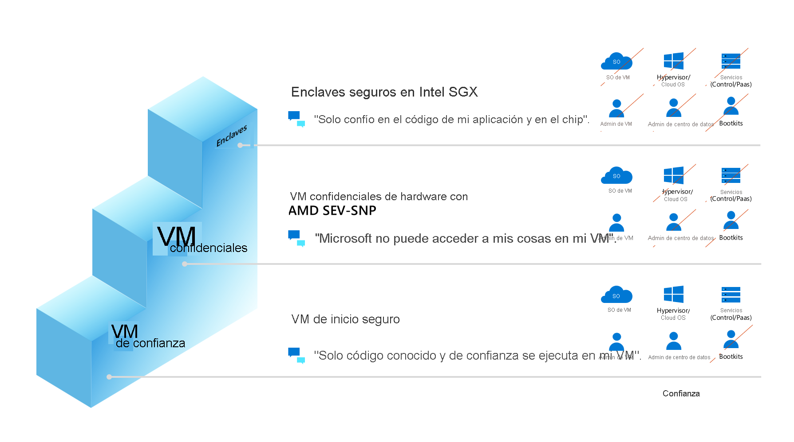

# Computación confidencial en Azure

En la actualidad, los clientes cifran tanto sus datos en reposo como los que están en tránsito, pero no mientras estén en uso en la memoria. El [Consorcio de Computación Confidencial](https://confidentialcomputing.io/) (CCC), del que Microsoft es cofundador, define la computación confidencial como la protección de los datos en uso mediante [entornos de ejecución de confianza](https://en.wikipedia.org/wiki/Trusted_execution_environment) (TEE) basados en hardware. Estos entornos impiden el acceso o la modificación no autorizados de aplicaciones y datos mientras están en uso, lo que aumenta el nivel de seguridad de las organizaciones que administran datos confidenciales y regulados. Los TEE son un entorno de confianza que proporciona un nivel de garantía de la integridad y confidencialidad de los datos, y de la integridad del código. El objetivo del modelo de amenazas de la computación confidencial es eliminar o reducir la capacidad de un operador de proveedor de nube y de otros actores del dominio del inquilino para acceder al código y a los datos mientras se ejecutan.

Las tecnologías como [Intel Software Guard Extensions](https://www.intel.com.au/content/www/au/en/architecture-and-technology/software-guard-extensions-enhanced-data-protection.html) (Intel SGX) o [AMD Secure Encrypted Virtualization](https://www.amd.com/en/processors/amd-secure-encrypted-virtualization) (SEV-SNP) son mejoras recientes de la CPU que admiten implementaciones de computación confidencial. Estas tecnologías están diseñadas como extensiones de virtualización y proporcionan conjuntos de características, como el cifrado y la integridad de la memoria, la integridad y confidencialidad del estado de la CPU, y la atestación, para crear el modelo de amenazas de la computación confidencial.

Cuando se usa con el cifrado de datos en reposo y en tránsito, la computación confidencial elimina la única barrera grande de cifrado (cifrado durante el uso) mediante la protección de conjuntos de datos confidenciales o altamente regulados y cargas de trabajo de aplicaciones en una plataforma de nube pública segura. La computación confidencial va más allá de la protección de datos genérica. Los entornos de ejecución de confianza también se usan para proteger la lógica empresarial propietaria, las funciones de análisis, los algoritmos de aprendizaje automático o aplicaciones enteras.

## Desplazamiento por la computación confidencial de Azure

Las [ofertas de Microsoft](https://aka.ms/azurecc) para la computación confidencial se extienden desde la infraestructura como servicio (IaaS) a la plataforma como servicio (PaaS), así como las herramientas de desarrollo, para respaldar el recorrido hacia la confidencialidad de los datos y del código en la nube.

## Reducción de la superficie expuesta a ataques
La base de computación de confianza (TCB) hace referencia a todos los componentes de hardware, firmware y software del sistema que proporcionan un entorno seguro. Los componentes de la TCB se consideran "críticos". Si un componente de la TCB está en peligro, toda la seguridad del sistema puede verse comprometida. Una TCB menor significa una mayor seguridad. Existe menos riesgo de exposición a diversas vulnerabilidades, malware, ataques y usuarios malintencionados. La computación confidencial de Azure pretende reducir la TCB de las cargas de trabajo en la nube ofreciendo TEE. 

### Reducción de la base de computación de confianza en Azure

Al implementar máquinas virtuales confidenciales de Azure, puede reducir la base de computación de confianza. En el caso de las soluciones de implementación de máquinas virtuales confidenciales que se ejecutan en AMD SEV-SNP, puede migrar mediante lift-and-shift las cargas de trabajo existentes y proteger los datos del operador en la nube con confidencialidad de nivel de máquina virtual. Las máquinas virtuales confidenciales con enclaves de aplicaciones de Intel SGX proporcionan control de la línea de código en las aplicaciones para minimizar la base de computación de confianza y proteger los datos tanto de los operadores en la nube como de sus operadores.  Los enclaves de aplicaciones con Intel SGX pueden requerir algunos cambios en las directivas de configuración o en el código de la aplicación.  También puede aprovechar un asociado fabricante de software independiente (ISV) o software de código abierto (OSS) para ejecutar las aplicaciones existentes dentro de un enclave de aplicaciones. 

### Escala de confianza

Azure ofrece diferentes máquinas virtuales para cargas de trabajo IaaS de computación confidencial y los clientes pueden elegir lo que es mejor para ellos en función de su posición de seguridad preferida. La figura de la "escala de confianza" muestra lo que los clientes pueden esperar desde una perspectiva de la posición de seguridad en estas ofertas de IaaS.

## Ofertas de Azure

Nuestros servicios actualmente disponibles con carácter general para el público incluyen:

- [Máquinas virtuales confidenciales con enclaves de aplicaciones Intel SGX](confidential-computing-enclaves.md). Azure ofrece las series [DCsv2](../virtual-machines/dcv2-series.md), [DCsv3 y DCdsv3](../virtual-machines/dcv3-series.md) basadas en la tecnología Intel SGX para la creación de enclaves basados en hardware. Puede compilar aplicaciones seguras basadas en el enclave para que se ejecuten en una serie de máquinas virtuales con el fin de proteger los datos de las aplicaciones y el código en uso.
- [Contenedores compatibles con enclave](enclave-aware-containers.md) que se ejecutan en Azure Kubernetes Service (AKS). Los nodos de computación confidencial de AKS usan Intel SGX para crear entornos de enclave aislados en los nodos entre cada aplicación de contenedor.
- [Always Encrypted con enclaves seguros en Azure SQL](/sql/relational-databases/security/encryption/always-encrypted-enclaves). La confidencialidad de los datos confidenciales está protegida contra el malware y los usuarios no autorizados con privilegios elevados mediante la ejecución de consultas SQL directamente dentro de un TEE cuando la instrucción SQL contiene cualquier operación sobre datos cifrados que requieran el uso del enclave seguro en el que se ejecuta el motor de base de datos.
- [Microsoft Azure Attestation](../attestation/overview.md), un servicio de atestación remota para validar la confiabilidad de varios entornos de ejecución de confianza (TEE) y comprobar la integridad de los archivos binarios que se ejecutan dentro de los entornos de ejecución de confianza.
- [HSM administrado de Azure Key Vault](/azure/key-vault/managed-hsm/) es un servicio en la nube que cumple los estándares, completamente administrado, de alta disponibilidad y de un solo inquilino que le permite proteger las claves criptográficas de las aplicaciones en la nube mediante módulos de seguridad de hardware (HSM) validados de nivel 3 de FIPS 140-2.
- [Azure IoT Edge](../iot-edge/deploy-confidential-applications.md) admite aplicaciones confidenciales que se ejecutan dentro de enclaves seguros en un dispositivo de Internet de las cosas (IoT). Los dispositivos de IoT a menudo se exponen a alteraciones y falsificación, porque los actores no válidos pueden acceder físicamente a ellos. Los dispositivos IoT Edge confidenciales agregan confianza e integridad en el perímetro mediante la protección del acceso a los datos capturados por el propio dispositivo, y almacenados en él, antes de transmitirlos en secuencias a la nube.

Otros servicios están actualmente en versión preliminar, entre los que se incluyen:

- Las máquinas virtuales confidenciales basadas en la [tecnología AMD SEV-SNP](https://azure.microsoft.com/blog/azure-and-amd-enable-lift-and-shift-confidential-computing/) están actualmente en versión preliminar y están disponibles para clientes seleccionados.
- [Inicio seguro](../virtual-machines/trusted-launch.md) está disponible en todas las máquinas virtuales de segunda generación con características de seguridad protegidas (arranque seguro, módulo de plataforma de confianza virtual y supervisión de la integridad de arranque) que sirven de protección contra kits de arranque, rootkits y malware de nivel de kernel.
- [Azure Confidential Ledger](../confidential-ledger/overview.md). ACL es un registro a prueba de alteraciones para almacenar datos confidenciales para mantener y auditar registros o para la transparencia de los datos en escenarios con varias partes. Ofrece garantías de que se escribe una vez y se leen muchas, lo que hacen que los datos no se puedan borrar ni modificar. El servicio se basa en [Confidential Consortium Framework](https://www.microsoft.com/research/project/confidential-consortium-framework/) de Microsoft Research.
- [Confidential Consortium Framework](https://github.com/microsoft/onnx-server-openenclave) es un servidor de inferencia de Machine Learning restringe que la parte del host de Machine Learning acceda tanto a la solicitud de inferencia como a su respuesta correspondiente.

## Pasos siguientes

- [Más información sobre el desarrollo de enclaves de aplicaciones](application-development.md)
