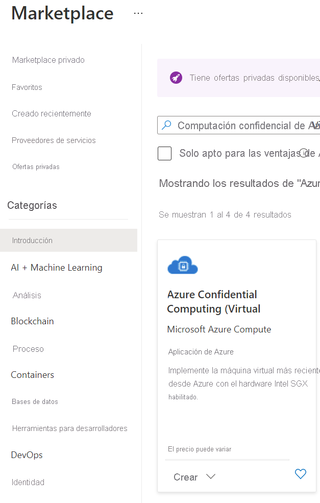

# <a name="quickstart-deploy-an-azure-confidential-computing-vm-in-the-marketplace"></a>Inicio rápido: Implementación de una máquina virtual de computación confidencial de Azure en Marketplace

Empiece a trabajar con la computación confidencial de Azure mediante Azure Portal para crear una máquina virtual con el respaldo de Intel SGX. De forma opcional, puede probar una aplicación de enclave creada con Open Enclave Software (SDK). 

Se recomienda este tutorial si está interesado en implementar una máquina virtual de computación confidencial con una configuración de plantilla. De lo contrario, se recomienda seguir el flujo de implementación de máquinas virtuales de Azure estándar [mediante el portal o la CLI](quick-create-portal.md).

## <a name="prerequisites"></a>Requisitos previos

Si no tiene una suscripción a Azure, [cree una cuenta](https://azure.microsoft.com/pricing/purchase-options/pay-as-you-go/) antes de empezar.

> [!NOTE]
> Las cuentas de evaluación gratuita no tienen acceso a las máquinas virtuales que se usan en este tutorial. Actualice a una suscripción de pago por uso.


## <a name="sign-in-to-azure"></a>Inicio de sesión en Azure

1. Inicie sesión en [Azure Portal](https://portal.azure.com/).

1. En la parte superior, seleccione **Crear un recurso**.

1. En el panel predeterminado **Introducción** , busque **Computación confidencial de Azure (máquina virtual)** .

1. Haga clic en la plantilla de **Computación confidencial de Azure (máquinas virtuales)** .

    

1. En la página de aterrizaje de la máquina virtual, seleccione **Crear**.


## <a name="configure-a-confidential-computing-virtual-machine"></a>Configuración de una máquina virtual de computación confidencial

1. En la pestaña **Aspectos básicos**, seleccione la **Suscripción** y el **Grupo de recursos** (el grupo debe estar vacío para implementar esta plantilla).

1. En **Nombre de la máquina virtual**, escriba un nombre para la nueva máquina virtual.

1. Escriba o seleccione los valores siguientes:

   * **Región**: Seleccione la región de Azure adecuada para usted.

        > [!NOTE]
        > Las máquinas virtuales de computación confidencial solo se ejecutan en hardware especializado disponible en regiones específicas. Para ver las regiones más recientes disponibles para las máquinas virtuales de la serie DCsv2, consulte las [regiones disponibles](https://azure.microsoft.com/global-infrastructure/services/?products=virtual-machines).

1. Configure la imagen del sistema operativo que le gustaría usar para la máquina virtual. Esta configuración solo admite implementaciones de imágenes y máquinas virtuales de Gen 2

    * **Ecoja una imagen**: para este tutorial, seleccione Ubuntu 18.04 LTS (Gen 2). También puede seleccionar Windows Server Datacenter 2019, Windows Server Datacenter 2016 y Ubuntu 16.04 LTS. Si decide hacerlo, se le proporcionará la información adecuada en este tutorial.
   
1. Introduzca la siguiente información en la pestaña Aspectos básicos:

   * **Tipo de autenticación**: Seleccione **Clave pública SSH** si va a crear una máquina virtual Linux. 

        > [!NOTE]
        > Para la autenticación, puede una clave pública SSH o una contraseña. La opción de SSH es más segura. Para obtener instrucciones acerca de cómo generar una clave SSH, consulte [Creación y uso de un par de claves SSH pública y privada para máquinas virtuales Linux en Azure](../virtual-machines/linux/mac-create-ssh-keys.md).

    * **Nombre de usuario**: Escriba el nombre del administrador de la máquina virtual.

    * **Clave pública SSH**: Si es aplicable, escriba la clave pública RSA.
    
    * **Contraseña**: Si procede, escriba la contraseña para la autenticación.
    
1. Introduzca la siguiente información en la pestaña "Configuración de máquina virtual":

   * Elección del tamaño de SKU de máquina virtual
   * Si ha elegido una máquina virtual **DC1s_v2**, **DC2s_v2**, **DC4s_V2**, elija un tipo de disco que sea **SSD estándar** o **SSD Premium**. Para una máquina virtual **DC8_v2**, solo puede elegir **SSD estándar** como tipo de disco.

   * **Puertos de entrada públicos**: Elija **Permitir los puertos seleccionados** y seleccione **SSH (22)** y **HTTP (80)** en la lista **Seleccionar puertos de entrada públicos**. Si va a implementar una máquina virtual Windows, seleccione **HTTP (80)** y **RDP (3389)** . En este inicio rápido, este paso es necesario para conectar la máquina virtual.
   
    >[!Note]
    > No se recomienda permitir puertos RDP/SSH para implementaciones de producción.  

     


1. Elija la opción **Supervisión** si es necesario.

1. Seleccione **Revisar + crear**.

1. En el panel **Revisar + crear**, seleccione **Crear**.

> [!NOTE]
> Vaya a la sección siguiente y siga en este tutorial si ha implementado una máquina virtual Linux. Si ha implementado una máquina virtual Windows, [siga estos pasos para conectarse a ella](../virtual-machines/windows/connect-logon.md).


## <a name="connect-to-the-linux-vm"></a>Conexión a la máquina virtual Linux

Si ya utiliza un shell de BASH, conéctese a la máquina virtual de Azure mediante el comando **ssh**. En el siguiente comando, reemplace el nombre de usuario y la dirección IP de la máquina virtual para conectarse a su máquina virtual Linux.

```bash
ssh azureadmin@40.55.55.555
```

Puede buscar la dirección IP pública de la máquina virtual en la sección Información general de la máquina virtual en Azure Portal.

:::image type="content" source="media/quick-create-portal/public-ip-virtual-machine.png" alt-text="Dirección IP en Azure Portal":::

Si utiliza Windows y no tiene un shell de BASH, instale un cliente de SSH, como PuTTY.

1. [Descargue e instale PuTTY](https://www.chiark.greenend.org.uk/~sgtatham/putty/download.html).

1. Ejecute PuTTY.

1. En la pantalla de configuración de PuTTY, escriba la dirección IP pública de la máquina virtual.

1. Seleccione **Abrir** y escriba el nombre de usuario y la contraseña en los cuadros.

Para más información acerca de cómo conectarse a máquinas virtuales Linux, consulte [Creación de máquinas virtuales Linux con Azure Portal](../virtual-machines/linux/quick-create-portal.md).

> [!NOTE]
> Si ve una alerta de seguridad de PuTTY que indique que la clave de host del servidor no se almacena en la caché del registro, elija entre las opciones siguientes. Si confía en este host, seleccione **Sí** para agregar la clave a la caché de PuTTY y siga conectándose. Si quiere conectarse solo una vez, sin agregar la clave a la caché, seleccione **No**. Si no confía en este host, seleccione **Cancelar** para abandonar la conexión.

## <a name="intel-sgx-drivers"></a>Controladores de Intel SGX

> [!NOTE]
> Los controladores de Intel SGX que ya forman parte de las imágenes de la galería de Windows Azure y Ubuntu. No se requiere ninguna instalación especial de los controladores. De manera opcional, también puede actualizar los controladores existentes incluidos en las imágenes examinando la [lista de controladores DCAP de Intel SGX](https://01.org/intel-software-guard-extensions/downloads).

## <a name="optional-testing-enclave-apps-built-with-open-enclave-sdk-oe-sdk"></a>Opcional: prueba de aplicaciones de enclave creadas con el SDK de Open Enclave (SDK de OE) <a id="Install"></a>

Siga las instrucciones detalladas para instalar el [SDK de OE](https://github.com/openenclave/openenclave) en la máquina virtual de la serie DCsv2 con una imagen de Ubuntu 18.04 LTS Gen 2. 

Si la máquina virtual se ejecuta en Ubuntu 18.04 LTS Gen 2, deberá seguir las [instrucciones de instalación de Ubuntu 18.04](https://github.com/openenclave/openenclave/blob/master/docs/GettingStartedDocs/install_oe_sdk-Ubuntu_18.04.md).


> [!NOTE]
> Los controladores de Intel SGX que ya forman parte de las imágenes de la galería de Windows Azure y Ubuntu. No se requiere ninguna instalación especial de los controladores. De forma opcional, también puede actualizar los controladores existentes incluidos en las imágenes.

## <a name="clean-up-resources"></a>Limpieza de recursos

Cuando ya no los necesite, puede eliminar el grupo de recursos, la máquina virtual y todos los recursos relacionados. 

Seleccione el grupo de recursos de la máquina virtual y haga clic en **Eliminar**. Confirme el nombre del grupo de recursos para terminar de eliminar los recursos.

## <a name="next-steps"></a>Pasos siguientes

En este inicio rápido, ha implementado una máquina virtual de computación confidencial y ha instalado el SDK de Open enclave. Para más información sobre las máquinas virtuales de computación confidencial en Azure, consulte [Soluciones en Virtual Machines](virtual-machine-solutions.md). 

Descubra cómo puede crear aplicaciones de computación confidencial. Para ello, continúe con los ejemplos del SDK de Open Enclave en GitHub. 

> [!div class="nextstepaction"]
> [Compilación de ejemplos del SDK de Open Enclave](https://github.com/openenclave/openenclave/blob/master/samples/README.md)
