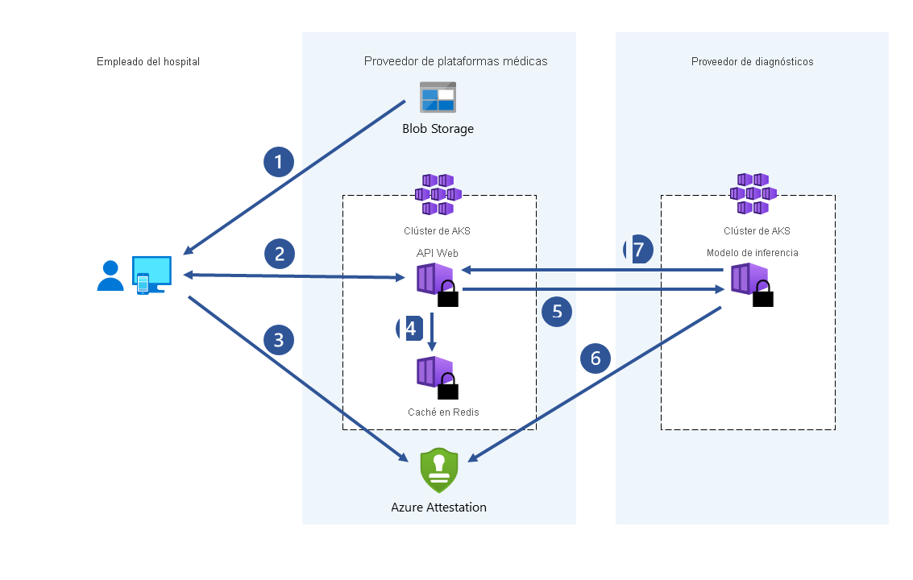

# Casos de uso y escenarios
La computación confidencial se aplica a diversos casos de uso para proteger los datos en sectores regulados, como la administración pública, los servicios financieros y los institutos sanitarios. Por ejemplo, impedir el acceso a datos confidenciales ayuda a proteger la identidad digital de los ciudadanos de todas las partes implicadas, incluido el proveedor de servicios en la nube que los almacena. Los mismos datos confidenciales pueden contener datos biométricos que se utilizan para buscar y quitar imágenes conocidas de explotación de menores, evitar la trata de personas y ayudar en las investigaciones forenses digitales.

En este artículo se proporciona información general acerca de varios escenarios comunes de la computación confidencial de Azure. Las recomendaciones de este artículo sirven como punto de partida para desarrollar una aplicación mediante marcos y servicios de computación confidencial.

Después de leer este artículo, podrá responder a las preguntas siguientes:

- ¿Cuáles son algunos de los escenarios de computación confidencial de Azure?
- ¿Cuáles son las ventajas de usar la computación confidencial de Azure para escenarios con varias entidades, mejorar la privacidad de los datos del cliente y redes de cadena de bloques?

## Motivaciones
La computación confidencial de Azure le permite aprovechar las funcionalidades de computación confidencial en un entorno virtualizado. Ahora puede usar herramientas, software e infraestructura de nube para crear a partir de hardware seguro.  

**Impida el acceso no autorizado**: Ejecute información confidencial en la nube. Confíe en que Azure proporciona la mejor protección de datos posible, con poco o ningún cambio respecto a lo que se hace hoy.

**Cumplimiento normativo**: Migre a la nube y mantenga el control total de los datos para satisfacer las regulaciones gubernamentales para proteger la información personal y la dirección IP de la organización.

**Colaboración segura y que no es de confianza**: Afronte los problemas de escala de trabajo de todo el sector mediante la combinación de datos entre organizaciones, incluso competidores, para desbloquear amplios análisis de datos y obtener información más detallada.

**Procesamiento aislado**: Ofrezca una nueva ola de productos que eliminen la responsabilidad sobre los datos privados con un procesamiento ciego. El proveedor de servicios no puede ni siquiera recuperar los datos de usuario. 

## Cálculo seguro de varias entidades

Las transacciones empresariales y la colaboración en proyectos requieren compartir información entre varias partes. A menudo, los datos que se comparten son confidenciales. Los datos pueden contener información personal, registros financieros, registros médicos, datos de ciudadanos particulares, etc. Las organizaciones públicas y privadas requieren que sus datos se protejan contra el acceso no autorizado. A veces, estas organizaciones incluso quieren proteger los datos de los operadores o ingenieros de infraestructura informática, arquitectos de seguridad, consultores empresariales y científicos de datos.

Por ejemplo, el uso del aprendizaje automático para los servicios sanitarios ha aumentado de forma masiva a medida que hemos obtenido acceso a mayores conjuntos de datos y a imágenes de pacientes captadas por dispositivos médicos. El diagnóstico de las enfermedades y el desarrollo de medicamentos se benefician de diversos orígenes de datos. Los hospitales y los institutos de salud pueden colaborar al compartir sus registros médicos de pacientes con un entorno de ejecución de confianza (TEE) centralizado. Los servicios de aprendizaje automático que se ejecutan en el TEE agregan y analizan datos. Este análisis de datos agregados puede aportar una mayor precisión de la predicción debido a los modelos de entrenamiento en conjuntos de datos consolidados. Con la computación confidencial, los hospitales pueden minimizar los riesgos de poner en peligro la privacidad de sus pacientes.

La computación confidencial de Azure permite procesar datos de varios orígenes sin exponer los datos de entrada a otras entidades. Este tipo de cálculo seguro permite escenarios como la lucha contra el blanqueo de dinero, la detección de fraudes y el análisis seguro de los datos de atención sanitaria.

Varios orígenes pueden cargar sus datos en un enclave de una máquina virtual. Una entidad indica al enclave que realice el cálculo con los datos o que los procese. Ninguna entidad (ni siquiera la que ejecuta el análisis) puede ver los datos de otra que se hayan cargado en el enclave.

En la informática segura de varias entidades, los datos cifrados van al enclave. El enclave descifra los datos mediante una clave, realiza el análisis, obtiene un resultado y devuelve un resultado cifrado que una entidad puede descifrar con la clave designada.

### Lucha contra el blanqueo de dinero

En este ejemplo de cálculo seguro de varias entidades, varios bancos comparten los datos entre sí sin exponer los datos personales de sus clientes. Los bancos ejecutan análisis acordados en el conjunto de datos confidenciales combinados. El análisis del conjunto de datos agregado puede detectar si un usuario mueve dinero entre varios bancos sin que unos bancos accedan a los datos de los restantes.

Gracias a la computación confidencial, estas instituciones financieras pueden aumentar los índices de detección de fraudes, abordar escenarios de blanqueo de dinero, reducir falsos positivos y seguir aprendiendo de conjuntos de datos más grandes.

### Desarrollo de fármacos en el sector sanitario

Los centros sanitarios asociados aportan conjuntos de datos sanitarios privados para entrenar un modelo de Machine Learning. Cada instalación solo puede ver su propio conjunto de datos. Ninguna otra instalación, ni siquiera el proveedor de nube, puede ver el modelo de datos o de entrenamiento. Todas las instalaciones se benefician del uso del modelo entrenado. Al crear el modelo con más datos, aumentó su precisión. Cada instalación que ha contribuido al entrenamiento del modelo puede utilizarlo y recibir resultados útiles.

## Privacidad de los datos del cliente mejorada

A pesar de que el nivel de seguridad que aporta Microsoft Azure se está convirtiendo rápidamente en uno de los principales impulsores de la adopción de la informática en la nube, los clientes confían en su proveedor en distinta medida. El cliente solicita lo siguiente:

- Hardware mínimo, software y TCB (bases informáticas de confianza) operativas para cargas de trabajo confidenciales.
- Cumplimiento técnico, en lugar de solo directivas y procesos empresariales.
- Transparencia sobre las garantías, los riesgos residuales y las mitigaciones que obtienen.

La computación confidencial va en esta dirección al permitir a los clientes un mayor control de las TCB que se usan para ejecutar sus cargas de trabajo en la nube. La computación confidencial de Azure permite a los clientes definir con precisión todo el hardware y el software que tiene acceso a sus cargas de trabajo (datos y código) y facilita los mecanismos técnicos para aplicar esta garantía de forma verificable. En resumen, los clientes conservan el control total sobre sus secretos.

### Soberanía de los datos

En la administración y en las agencias públicas, la computación confidencial de Azure es una solución para aumentar el grado de confianza respecto a la capacidad de proteger la soberanía de los datos en la nube pública. Además, gracias a la adopción cada vez mayor de las funcionalidades de computación confidencial en los servicios de PaaS en Azure, este mayor grado de confianza se puede lograr con un impacto reducido en la capacidad de innovación que aportan los servicios en la nube pública. Esta combinación de factores hace que la computación confidencial de Azure sea una respuesta muy eficaz a las necesidades de soberanía y transformación digital de los servicios gubernamentales.

### Cadena de confianza reducida

Gracias a una enorme inversión e innovación innovadora en la computación confidencial se ha podido quitar el proveedor de servicios en la nube de la cadena de confianza hasta un grado sin precedentes. La computación confidencial de Azure ofrece el mayor nivel de soberanía disponible en el mercado hoy en día, lo que permite a los clientes y gobiernos satisfacer sus necesidades de soberanía actuales y seguir sacando provecho de la innovación en el futuro.

La computación confidencial puede expandir el número de cargas de trabajo aptas para la implementación en la nube pública. Esto puede dar lugar a una rápida adopción de servicios públicos para migraciones y nuevas cargas de trabajo, lo que mejora rápidamente la posición de seguridad de los clientes y habilita pronto escenarios innovadores.

### Escenarios BYOK (Bring Your Own Key)

La adopción de módulos seguros de hardware (HSM) permite la transferencia segura de claves y certificados a un almacenamiento en la nube protegido ([HSM administrado de Azure Key Vault](\..\key-vault\managed-hsm\overview.md)) sin permitir que el proveedor de servicios en la nube acceda a dicha información confidencial. Los secretos que se transfieren nunca existen fuera de un HSM en formato de texto no cifrado, lo que permite escenarios para la soberanía de claves y certificados que genera y administra el cliente, pero que siguen usando un almacenamiento seguro basado en la nube.

## Cadena de bloques segura

Una red de cadena de bloques es una red de nodos descentralizada. Estos nodos los ejecutan y mantienen operadores o validadores que desean garantizar la integridad y alcanzar el consenso sobre el estado de la red. Los nodos son réplicas de libros de contabilidad y se usan para realizar el seguimiento de las transacciones de una cadena de bloques. Cada nodo tiene una copia completa del historial de transacciones, lo que garantiza la integridad y disponibilidad en una red distribuida.

Las tecnologías de cadena de bloques basadas en la computación confidencial pueden usar la privacidad basada en hardware para habilitar la confidencialidad de los datos y los cálculos seguros. En algunos casos, todo el libro de contabilidad se cifra para proteger el acceso a los datos. A veces, la propia transacción se puede producir en un módulo de proceso dentro del enclave del nodo.
