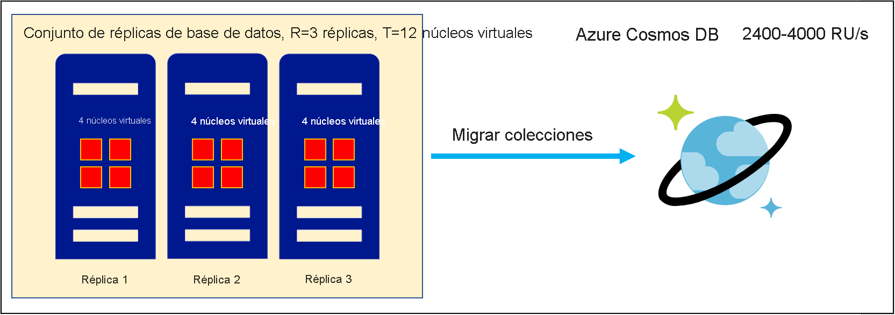
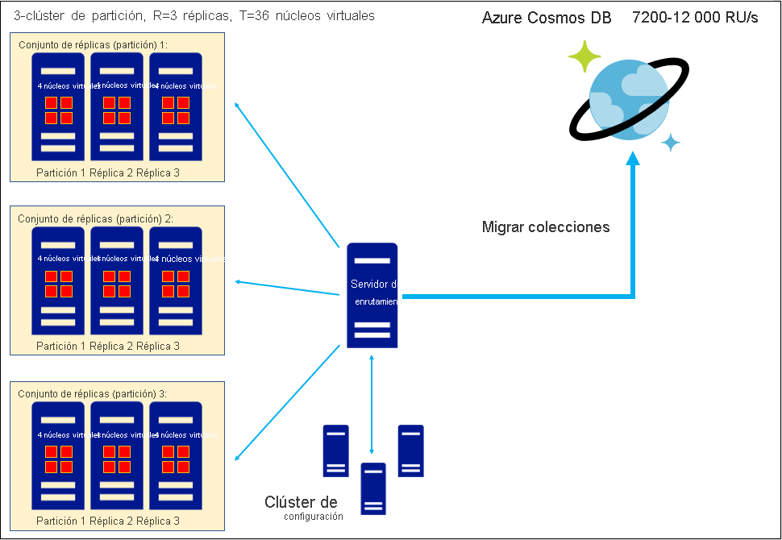
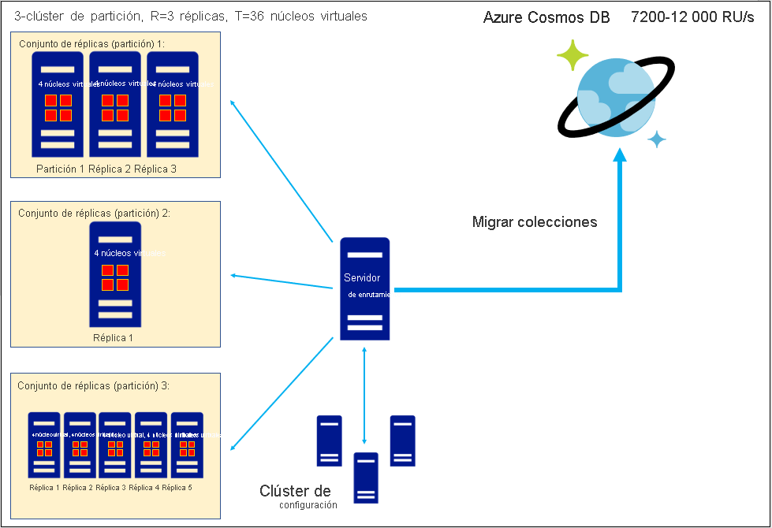

# Conversión del número de núcleos virtuales o vCPU de una base de datos no relacional en RU/s de Azure Cosmos DB
[!INCLUDE[appliesto-sql-api](includes/appliesto-sql-api.md)]
[!INCLUDE[appliesto-mongodb-api](includes/appliesto-mongodb-api.md)]

En este artículo, se explica cómo calcular las unidades de solicitud (RU/s) de Azure Cosmos DB cuando va a considerar la migración de datos, pero lo único que sabe es el número total de núcleos virtuales o vCPU de los conjunto de réplicas de base de datos existentes. Al migrar uno o varios conjuntos de réplicas a Azure Cosmos DB, cada colección de esos conjuntos de réplicas se almacenará como una colección de Azure Cosmos DB que consta de un clúster particionado con un factor de replicación 4x. Puede leer más sobre nuestra arquitectura en esta [guía de creación de particiones y escalado](partitioning-overview.md). Las unidades de solicitud son la forma en la que se aprovisiona la capacidad de rendimiento en una colección. Puede [leer la guía de unidades de solicitud](request-units.md) y la [guía de aprovisionamiento](set-throughput.md) de RU/s para más información. Al migrar una colección, Azure Cosmos DB aprovisiona particiones suficientes para atender las unidades de solicitud aprovisionadas y almacenar los datos. Por lo tanto, la estimación de RU/s de las colecciones es un paso importante para determinar el ámbito de la escala del patrimonio de datos planeado de Azure Cosmos DB antes de la migración. En función de nuestra experiencia con miles de clientes, hemos encontrado que esta fórmula nos ayuda a llegar a una estimación aproximada de RU/s como punto de partida a partir de los núcleos virtuales o vCPU: 

`
Provisioned RU/s = C*T/R
`

* *T*: número total de núcleos virtuales o vCPU de los conjunto de réplicas **de almacenamiento de datos** de la base de datos existente. 
* *R*: factor de replicación de los conjunto de réplicas **de almacenamiento de datos** existentes. 
* *C*: RU/s recomendadas aprovisionadas por núcleo virtual o vCPU. Este valor se deriva de la arquitectura de Azure Cosmos DB:
    * *C = 600 RU/s/núcleo virtual* para SQL API de Azure Cosmos DB
    * *C = 1000 RU/s/núcleo virtual* para Azure Cosmos DB API para MongoDB v4.0
    * Las estimaciones de *C* para Cassandra API, Gremlin API u otras API no están disponibles actualmente.

Los valores de *C* se proporcionan anteriormente. ***T* se debe determinar examinando el número de núcleos virtuales o vCPU de cada conjunto de réplicas de almacenamiento de datos de la base de datos existente y sumando para obtener el total**. Si no puede calcular *T*, considere la posibilidad de seguir nuestra [guía de estimación de RU/s mediante Capacity Planner de Azure Cosmos DB](estimate-ru-with-capacity-planner.md) en lugar de esta guía. *T* no debe incluir *núcleos virtuales* ni *vCPU* asociados al servidor de enrutamiento o al clúster de configuración de la base de datos existente, si tiene esos componentes. 

Para *R*, se recomienda utilizar el factor de replicación promedio de los conjuntos de réplicas de la base de datos. Si esta información no está disponible, *R=3* es una buena regla general. 

Las API de interoperabilidad de Azure Cosmos DB se ejecutan sobre SQL API e implementan sus propias arquitecturas únicas. Por lo tanto, la API de Azure Cosmos DB para MongoDB v4.0 tiene un valor de *C* diferente al de SQL API de Azure Cosmos DB.

## Ejemplo trabajado: estimación de RU/s para la migración de un único conjunto de réplicas

Considere un único conjunto de réplicas con un factor de replicación *R=3* basado en una SKU de servidor de cuatro núcleos. Entonces
* *T* = 12 núcleos virtuales
* *R* = 3

En ese caso, las unidades de solicitud recomendadas para SQL API de Azure Cosmos DB son:

`
Provisioned RU/s, SQL API = (600 RU/s/vCore) * (12 vCores) / (3) = 2,400 RU/s
`

Y las unidades de solicitud recomendadas para la API de Azure Cosmos DB para MongoDB son:

`
Provisioned RU/s, API for MongoDB = (1,000 RU/s/vCore) * (12 vCores) / (3) = 4,000 RU/s
`

## Ejemplo trabajado: estimación de RU/s al migrar un clúster de conjuntos de réplicas homogéneos

Considere un clúster con particiones y replicado que consta de tres conjuntos de réplicas, cada uno con un factor de replicación de tres, donde cada servidor es una SKU de cuatro núcleos. Entonces
* *T* = 36 núcleos virtuales
* *R* = 3

En ese caso, las unidades de solicitud recomendadas para SQL API de Azure Cosmos DB son:

`
Provisioned RU/s, SQL API = (600 RU/s/vCore) * (36 vCores) / (3) = 7,200 RU/s
`

Y las unidades de solicitud recomendadas para la API de Azure Cosmos DB para MongoDB son:

`
Provisioned RU/s, API for MongoDB = (1,000 RU/s/vCore) * (36 vCores) / (3) = 12,000 RU/s
`

## Ejemplo trabajado: estimación de RU/s al migrar un clúster de conjuntos de réplicas heterogéneos

Considere un clúster con particiones y replicado que consta de tres conjuntos de réplicas, en los que cada servidor se basa en una SKU de cuatro núcleos. Los conjuntos de réplicas son "heterogéneos" en el sentido de que cada uno tiene un factor de replicación diferente: 3x, 1x y 5x, respectivamente. El enfoque recomendado es usar el factor de replicación promedio al calcular las unidades de solicitud. Entonces
* *T* = 36 núcleos virtuales
* *Promedio de R* = (3+1+5)/3 = 3

En ese caso, las unidades de solicitud recomendadas para SQL API de Azure Cosmos DB son:

`
Provisioned RU/s, SQL API = (600 RU/s/vCore) * (36 vCores) / (3) = 7,200 RU/s
`

Y las unidades de solicitud recomendadas para la API de Azure Cosmos DB para MongoDB son:

`
Provisioned RU/s, API for MongoDB = (1,000 RU/s/vCore) * (36 vCores) / (3) = 12,000 RU/s
`

## Sugerencias para obtener una estimación de RU/s más precisa

*Migración desde una base de datos administrada en la nube:* si actualmente usa una base de datos administrada en la nube, estos servicios a menudo parecen aprovisionarse en unidades de *núcleos virtuales* o *vCPU* (es decir, *T*), pero de hecho, el número de núcleos que aprovisiona establece el valor de *núcleos virtuales/réplica* o *vCPU/réplica* (*T/R*) para un conjunto de réplicas de *R* nodos; el número real de núcleos es *R* veces más de lo que aprovisionó explícitamente. Se recomienda determinar si esta descripción se aplica a la base de datos administrada en la nube actual y, si es así, debe multiplicar el número nominal de *núcleos virtuales* o *vCPU* aprovisionados por *R* para obtener una estimación precisa de *T*.

*Núcleos virtuales frente a vCPU:* en este artículo, tratamos "núcleo virtual" y "vCPU" como sinónimos, por lo que *C* tiene unidades de *RU/s/núcleo virtual* o *RU/s/vCPU*, sin distinción. Sin embargo, en la práctica, esta simplificación puede no ser precisa en algunas situaciones. Estos términos pueden tener significados diferentes. Por ejemplo, si las CPU físicas admiten hyperthreading, es posible que *1 vCPU = 2 núcleos virtuales* o algún otro valor. En general, la relación *núcleo virtual*/*vCPU* depende del hardware y se recomienda investigar cuál es la relación en el hardware del clúster existente y si el proceso del clúster se aprovisiona en términos de *núcleos virtuales* o *vCPU*. Si *vCPU* y *núcleo virtual* tienen significados diferentes en el hardware, se recomienda tratar las estimaciones anteriores de *C* como si tuvieran unidades de *RU/s/núcleovirtual* y, si es necesario, convertir *T* de vCPU a núcleo virtual mediante el factor de conversión adecuado para el hardware.

## Resumen

La estimación de RU/s a partir de *núcleos virtuales* o *vCPU* requiere recopilar información sobre el total de *núcleos virtuales*/*vCPU* y el factor de replicación de los conjuntos de réplicas de base de datos existentes. A continuación, puede usar relaciones conocidas entre los *núcleos virtuales*/ *vCPU* y el rendimiento para calcular las unidades de solicitud (RU/s) de Azure Cosmos DB. La búsqueda de esta estimación de unidades de solicitud será un paso importante para anticipar la escala del patrimonio de datos de Azure Cosmos DB después de la migración.

En la tabla siguiente, se resume la relación entre *núcleos virtuales* y *vCPU* para SQL API y la API para MongoDB v4.0 de Azure Cosmos DB:

| Núcleos virtuales | RU/s (SQL API)  (factor de replicación=3) | RU/s (API para MongoDB v4.0)  (factor de replicación=3) |
|-------------|----------------|------------------|
| 3           | 600            |            1000  |
| 6           | 1200            |            2000  |
| 12           | 2400            |            4000  |
| 24           | 4800            |            8000  |
| 48           | 9600            |            16000  |
| 96           | 19200            |            32000  |
| 192           | 38 400            |            64000  |
| 384           | 76 800            |            128000  |

## Pasos siguientes
* [Precios de Azure Cosmos DB](https://azure.microsoft.com/pricing/details/cosmos-db/)
* [Planeamiento y administración de los costos de Azure Cosmos DB](plan-manage-costs.md)
* [Opciones para migrar los datos locales o en la nube a Azure Cosmos DB](cosmosdb-migrationchoices.md)
* [Tutorial: Use la herramienta de migración de datos para migrar los datos a Azure Cosmos DB](import-data.md)
* [Pasos previos a la migración para migraciones de datos de MongoDB a la API de Azure Cosmos DB para MongoDB](mongodb/pre-migration-steps.md). Este documento incluye vínculos a distintas herramientas de migración que puede usar una vez que haya terminado de planear.

[regions]: https://azure.microsoft.com/regions/