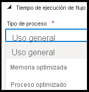

# Retirada de la opción optimizada del proceso de flujo de datos

[!INCLUDE[appliesto-adf-asa-md](includes/appliesto-adf-asa-md.md)]

Los flujos de datos de Azure Data Factory y Azure Synapse Analytics proporcionan un mecanismo con poco código para transformar datos en trabajos de ETL a escala mediante un paradigma de diseño gráfico. Los flujos de datos se ejecutan en el recurso Integration Runtime sin servidor de Azure Data Factory y Azure Synapse Analytics. La naturaleza escalable de los entornos de ejecución de integración de Azure Data Factory y Azure Synapse Analytics ha habilitado tres opciones de proceso diferentes para el entorno de Azure Databricks Spark que se usa para ejecutar flujos de datos a escala: Optimizada para memoria, De uso general y Optimizados para proceso. Las clases recomendadas del proceso de flujo de datos son Optimizados para memoria y De uso general que se van a utilizar con Integration Runtime para cargas de trabajo de producción. Como Optimizados para proceso no será a menudo suficiente en los casos de uso comunes con flujos de datos, se recomienda utilizar flujos de datos optimizados De uso general u Optimizados para memoria en cargas de trabajo de producción.

## Pasos de migración

De aquí hasta el 31 de agosto de 2024, los flujos de datos Optimizados para proceso seguirán funcionando en las canalizaciones existentes. Para evitar la interrupción del servicio, quite los flujos de datos Optimizados para proceso existentes antes del 31 de agosto de 2024 y siga los pasos siguientes para crear una nueva actividad de flujo de datos y de Azure Integration Runtime. Al crear una nueva actividad de flujo de datos:

1. Cree una nueva instancia de Azure Integration Runtime con "De uso general" u "Optimizados para memoria" como tipo de proceso.
2. Establezca la actividad de flujo de datos mediante cualquiera de esos tipos de proceso.

   

## Comparación entre diferentes opciones de proceso 

| Opción de proceso              | Rendimiento                                                  |
| :-------------------- | :----------------------------------------------------------- |
| Flujos de datos de uso general (básico) | Adecuados para casos de uso general en cargas de trabajo de producción |
| Flujos de datos optimizados para memoria (estándar) | Tiempo de ejecución con el mejor rendimiento para flujos de datos cuando se trabaja con grandes conjuntos de datos y muchos cálculos |
| Flujos de datos Optimizados para proceso (en desuso) | No se recomienda para las cargas de trabajo de producción. |

* [Visite la página de precios de Azure Data Factory para obtener los precios actualizados más recientes disponibles para flujos De uso general y Optimizados para memoria](https://azure.microsoft.com/pricing/details/data-factory/data-pipeline/)
* [Puede encontrar información más detallada en Preguntas frecuentes sobre flujos de datos aquí](https://aka.ms/dataflowsqa)  
* [Publicar preguntas y encontrar respuestas sobre flujos de datos en Microsoft Q&A](https://aka.ms/datafactoryqa)
