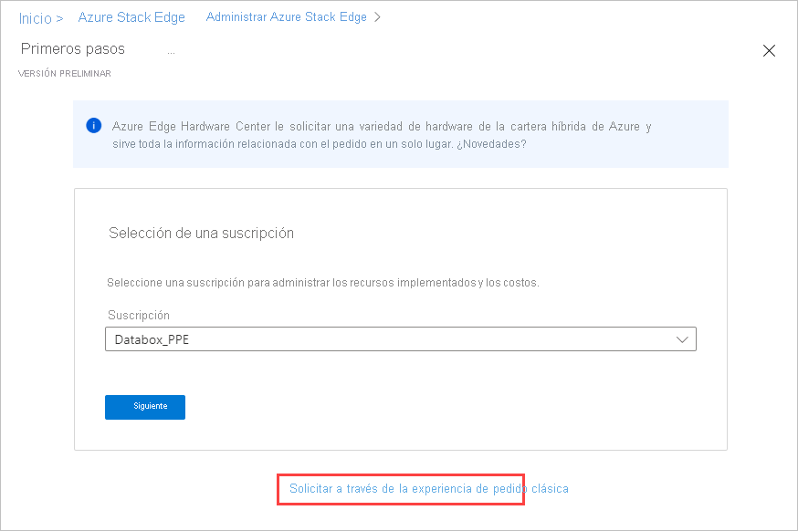

# <a name="tutorial-prepare-to-deploy-azure-stack-edge-pro-r"></a>Tutorial: Preparación de la implementación de Azure Stack Edge Pro R

Este es el primer tutorial de la serie de tutoriales de implementación necesarios para implementar completamente Azure Stack Edge Pro R. En este tutorial se describe cómo preparar Azure Portal para implementar un recurso de Azure Stack Edge. En el tutorial se usa un dispositivo Azure Stack Edge Pro R de 1 nodo que se distribuye con un sistema de alimentación ininterrumpida (SAI).

Para completar el proceso de instalación y configuración se necesitan privilegios de administrador. La preparación del portal dura menos de 10 minutos.

En este tutorial, aprenderá a:

> [!div class="checklist"]
>
> * Crear un nuevo recurso
> * Obtención de la clave de activación

### <a name="get-started"></a>Introducción

Para implementar Azure Stack Edge Pro R, consulte los siguientes tutoriales en el orden indicado.

| Para realizar este paso | Use estos documentos |
| --- | --- |
| **Preparación** |Estos pasos se deben completar como preparación para la próxima implementación. |
| **[Lista de comprobación de la configuración de implementación](#deployment-configuration-checklist)** |Use esta lista de comprobación para recopilar y registrar información antes y durante la implementación. |
| **[Requisitos previos de implementación](#prerequisites)** |Estos requisitos previos garantizan que el entorno esté preparado para la implementación. |
|  | |
|**Tutoriales de implementación** |Estos tutoriales son necesarios para implementar el dispositivo Azure Stack Edge Pro R en producción. |
|**[1. Preparación de Azure Portal para el dispositivo](azure-stack-edge-pro-r-deploy-prep.md)** |Cree y configure el recurso de Azure Stack Edge antes de instalar un dispositivo físico de Azure Stack Box Edge. |
|**[2. Instalación del dispositivo](azure-stack-edge-pro-r-deploy-install.md)**|Inspeccione y conecte los cables del dispositivo físico.  |
|**[3. Conexión del dispositivo](azure-stack-edge-pro-r-deploy-connect.md)** |Una vez instalado el dispositivo, conéctese a la interfaz de usuario web local del dispositivo.  |
|**[4. Configuración de la red](azure-stack-edge-pro-r-deploy-configure-network-compute-web-proxy.md)** |Configure la red, incluida la red de proceso y los valores de proxy web para el dispositivo.   |
|**[5. Configuración del dispositivo](azure-stack-edge-pro-r-deploy-set-up-device-update-time.md)** |Asigne un nombre de dispositivo y un dominio DNS, configure el servidor de actualización y la hora del dispositivo. |
|**[6. Configuración de la seguridad](azure-stack-edge-pro-r-deploy-configure-certificates-vpn-encryption.md)** |Configure los certificados, la VPN y el cifrado en reposo para el dispositivo. Use certificados generados por el dispositivo o aporte sus propios certificados.   |
|**[7. Activación del dispositivo](azure-stack-edge-pro-r-deploy-activate.md)** |Use la clave de activación del servicio para activar el dispositivo. El dispositivo está listo para configurar recursos compartidos SMB o NFS o conectarse a través de REST. |
|**[8. Configuración de proceso](azure-stack-edge-gpu-deploy-configure-compute.md)** |Configure el rol de proceso en el dispositivo. Se crea también un clúster de Kubernetes. |

Ya puede empezar a configurar Azure Portal.

## <a name="deployment-configuration-checklist"></a>Lista de comprobación de la configuración de implementación

Antes de implementar el dispositivo, deberá recopilar información para configurar el software en el dispositivo de Azure Stack Edge Pro. La preparación de parte de esta información con antelación simplifica el proceso de implementación del dispositivo en el entorno. Use la [lista de comprobación de la configuración de implementación de Azure Stack Edge Pro R](azure-stack-edge-pro-r-deploy-checklist.md) para anotar los detalles de la configuración cuando implemente el dispositivo.

## <a name="prerequisites"></a>Prerrequisitos

A continuación, encontrará los requisitos previos para configurar su recurso de Azure Stack Edge, el dispositivo de Azure Stack Edge y la red de centros de datos.

### <a name="for-the-azure-stack-edge-resource"></a>Para el recurso de Azure Stack Edge

[!INCLUDE [Azure Stack Edge resource prerequisites](../../includes/azure-stack-edge-gateway-resource-prerequisites.md)]

### <a name="for-the-azure-stack-edge-device"></a>Para el dispositivo de Azure Stack Edge

Antes de implementar un dispositivo físico, asegúrese de que:

- Ha revisado la información de seguridad de este dispositivo en: [Instrucciones de seguridad para Azure Stack Edge Pro R](azure-stack-edge-pro-r-safety.md).
[!INCLUDE [Azure Stack Edge device prerequisites](../../includes/azure-stack-edge-gateway-device-prerequisites.md)] 

### <a name="for-the-datacenter-network"></a>Para la red del centro de datos

Antes de comenzar, asegúrese de que:

- La red del centro de datos está configurada según los requisitos de red para el dispositivo de Azure Stack Edge. Para más información, consulte [Requisitos del sistema para Azure Stack Edge Pro R](azure-stack-edge-pro-r-system-requirements.md).

- Para las condiciones de funcionamiento normales del dispositivo, tiene:

    - Un ancho de banda mínimo de 10 Mbps para garantizar que el dispositivo se mantiene actualizado.
    - Un ancho de banda mínimo de 20 Mbps dedicado a carga y descarga para transferir archivos.

## <a name="create-a-new-resource"></a>Crear un nuevo recurso

Si ya tiene un recurso de Azure Stack Edge para administrar el dispositivo físico, omita este paso y vaya a [Obtención de la clave de activación](#get-the-activation-key).

---

### <a name="azure-edge-hardware-center-preview"></a>[Azure Edge Hardware Center (versión preliminar)](#tab/azure-edge-hardware-center)

Azure Edge Hardware Center (versión preliminar) es un nuevo servicio que le permite explorar y pedir una variedad de hardware de la cartera híbrida de Azure, incluidos los dispositivos Azure Stack Edge Pro.

Cuando realiza un pedido mediante Azure Edge Hardware Center, puede solicitar varios dispositivos para que se envíen a más de una dirección y puede reutilizar el envío para direcciones de otros pedidos.

La realización de un pedido mediante Azure Edge Hardware Center creará un recurso de Azure que contendrá toda la información relacionada con el pedido. Se creará un recurso para cada una de las unidades solicitadas. Tendrá que crear un recurso de Azure Stack Edge después de recibir el dispositivo para activarlo y administrarlo.

[!INCLUDE [Create order in Azure Edge Hardware Center](../../includes/azure-edge-hardware-center-new-order.md)]

#### <a name="create-management-resources-for-devices"></a>Creación de recursos de administración para dispositivos

Para administrar los dispositivos que solicite desde Azure Edge Hardware Center, creará recursos de administración en Azure Stack Edge. 

Cuando se activa un dispositivo, el recurso de administración se asocia a un elemento del pedido. Podrá abrir el elemento del pedido desde el recurso de administración y abrir el recurso de administración desde el elemento del pedido. 

Una vez enviado un dispositivo, se agrega el vínculo **Configurar hardware** al detalle del elemento del pedido, lo que le proporciona una manera directa de abrir un asistente para crear un recurso de administración. También puede usar la opción **Crear recurso de administración** en Azure Stack Edge.

[!INCLUDE [Create management resource](../../includes/azure-edge-hardware-center-create-management-resource.md)]

### <a name="portal-classic"></a>[Portal (clásico)](#tab/azure-portal)

Siga estos pasos en Azure Portal para crear un recurso de Azure Stack Edge.

1. Use sus credenciales de Microsoft Azure para iniciar sesión en Azure Portal, en esta dirección URL: [https://portal.azure.com](https://portal.azure.com).

2. En **Servicios de Azure**, busque y seleccione **Azure Stack Edge**. A continuación, seleccione **+ Crear**. 

3. En **Manage Azure Stack Edge devices** (Administrar dispositivos Azure Stack Edge), seleccione el vínculo **Try Azure Edge Hardware Center** (Probar Azure Edge Hardware Center).

    

    Se abrirá la pantalla **Get started** (Comenzar) para crear un pedido en Azure Edge Hardware Center. 

4. Si no desea realizar el pedido mediante Hardware Center, seleccione **Order using classic ordering experience** (Realizar el pedido mediante la experiencia de pedidos clásica) en la pantalla **Get started** (Comenzar).

   

3. Seleccione la suscripción que quiere usar para el dispositivo de Azure Stack Edge Pro. Seleccione el país al que desea enviar el dispositivo físico. Seleccione **Mostrar dispositivos**.

    

4. Seleccione el tipo de dispositivo. En **Azure Stack Edge**, elija **Azure Stack Edge Pro R** y, a continuación, elija **Seleccionar**. Si ve algún problema o no puede seleccionar el tipo de dispositivo, vaya a [Solución de problemas de pedidos](azure-stack-edge-troubleshoot-ordering.md).

    

5. En función de las necesidades de su empresa, puede seleccionar **Azure Stack Edge Pro R de nodo único** o **Azure Stack Edge Pro R de nodo único con SAI**.  

    

6. En la pestaña **Datos básicos**, escriba o seleccione los siguientes **detalles del proyecto**.
    
    |Configuración  |Value  |
    |---------|---------|
    |Subscription    |La suscripción se rellena automáticamente según la selección anterior. La suscripción está vinculada a la cuenta de facturación. |
    |Resource group  |Cree un nuevo grupo o seleccione uno existente.<br>Más información sobre los [grupos de recursos de Azure](../azure-resource-manager/management/overview.md).     |

7. Escriba o seleccione los siguientes **detalles de la instancia**.

    |Configuración  |Value  |
    |---------|---------|
    |Nombre   | Nombre descriptivo que identifique el recurso.<br>El nombre tiene entre 2 y 50 caracteres que contiene letras, números y guiones.<br> El nombre comienza y termina con una letra o un número.        |
    |Region     |Para una lista de todas las regiones en las que está disponible el recurso de Azure Stack Edge, consulte [Productos de Azure disponibles por región](https://azure.microsoft.com/global-infrastructure/services/?products=databox&regions=all). Si usa Azure Government, todas las regiones de gobierno están disponibles como se muestra en las [regiones de Azure](https://azure.microsoft.com/global-infrastructure/regions/).<br> Elija la ubicación más cercana a la región geográfica donde quiera implementar el dispositivo.|

    


8. Seleccione **Siguiente: Dirección de envío**.

    - Si ya tiene un dispositivo, seleccione el cuadro combinado **I have a Azure Stack Edge Pro R device** (Tengo un dispositivo Azure Stack Edge Pro R).

        

    - Si este es el pedido del nuevo dispositivo, escriba el nombre de contacto, la empresa, la dirección de envío y la información de contacto.

        

9. Seleccione **Siguiente: Etiquetas**. También tiene la opción de proporcionar etiquetas para clasificar los recursos y consolidar la facturación. Seleccione **Siguiente: Review + create** (Revisar y crear).

10. En la pestaña **Revisar y crear**, revise la información de **Detalles de precios**, **Términos de uso** y los detalles de su recurso. Seleccione el cuadro combinado **I have reviewed the privacy terms** (He revisado los términos de privacidad).

     

    También se le notifica que, durante la creación de recursos, se habilita una identidad de servicio administrada (MSI) que le permite autenticarse en los servicios en la nube. Esta identidad existe mientras exista el recurso.

11. Seleccione **Crear**.

    Se tarda unos minutos en crear el recurso. También se crea una MSI que permite al dispositivo Azure Stack Edge comunicarse con el proveedor de recursos en Azure.

    Cuando el recurso se haya creado e implementado correctamente, recibirá una notificación. Haga clic en **Go to resource** (Ir al recurso).

    

Una vez realizado el pedido, Microsoft lo revisa y se pone en contacto con usted (por correo electrónico) para indicarle los detalles del envío.

<!-- - If this is restored, it must go above "After the resource is successfully created." The azure-stack-edge-resource-1.png would seem superfluous in that case.--> 

> [!NOTE]
> Si quiere crear varios pedidos al mismo tiempo o clonar un pedido existente, puede usar los [scripts de Azure Samples](https://github.com/Azure-Samples/azure-stack-edge-order). Para más información, consulte el archivo LÉAME.

Si surgen problemas durante el proceso de pedido, consulte [Solución de problemas de pedidos](azure-stack-edge-troubleshoot-ordering.md).

### <a name="azure-cli"></a>[CLI de Azure](#tab/azure-cli)

Si es necesario, prepare el entorno de la CLI de Azure.

[!INCLUDE [azure-cli-prepare-your-environment-no-header.md](../../includes/azure-cli-prepare-your-environment-no-header.md)]

Para crear un recurso de Azure Stack Edge, ejecute los comandos siguientes en la CLI de Azure.

1. Cree un grupo de recursos utilizando el comando [az group create](/cli/azure/group#az_group_create) o utilice un grupo de recursos existente:

   ```azurecli
   az group create --name myasepgpu1 --location eastus
   ```

1. Para crear un dispositivo, utilice el comando [az databoxedge device create](/cli/azure/databoxedge/device#az_databoxedge_device_create):

   ```azurecli
   az databoxedge device create --resource-group myasepgpu1 \
      --device-name myasegpu1 --location eastus --sku EdgePR_Base
   ```

   Elija la ubicación más cercana a la región geográfica donde quiera implementar el dispositivo. La región almacena solo los metadatos para la administración de dispositivos. Los datos reales se pueden almacenar en cualquier cuenta de almacenamiento.

   Para una lista de todas las regiones en las que está disponible el recurso de Azure Stack Edge, consulte [Productos de Azure disponibles por región](https://azure.microsoft.com/global-infrastructure/services/?products=databox&regions=all). Si usa Azure Government, todas las regiones de gobierno están disponibles como se muestra en las [regiones de Azure](https://azure.microsoft.com/global-infrastructure/regions/).

1. Para crear un pedido, ejecute el comando [az databoxedge order create](/cli/azure/databoxedge/order#az_databoxedge_order_create):

   ```azurecli
   az databoxedge order create --resource-group myasepgpu1 \
      --device-name myasegpu1 --company-name "Contoso" \
      --address-line1 "1020 Enterprise Way" --city "Sunnyvale" \
      --state "California" --country "United States" --postal-code 94089 \
      --contact-person "Gus Poland" --email-list gus@contoso.com --phone 4085555555
   ```

Se tarda unos minutos en crear el recurso. Ejecute el comando [az databoxedge order show](/cli/azure/databoxedge/order#az_databoxedge_order_show) para ver el pedido:

```azurecli
az databoxedge order show --resource-group myasepgpu1 --device-name myasegpu1 
```

Una vez realizado el pedido, Microsoft lo revisará y se pondrá en contacto con usted por correo electrónico para indicarle los detalles del envío.

---

## <a name="get-the-activation-key"></a>Obtención de la clave de activación

Cuando el recurso de Azure Stack Edge esté en funcionamiento, tendrá que obtener la clave de activación. Esta clave se usa para activar y conectar el dispositivo de Azure Stack Edge Pro con el recurso. Puede obtener esta clave ahora mientras está en Azure Portal.

1. Seleccione el recurso que ha creado y, a continuación, seleccione **Información general**.

2. En el panel derecho, escriba un nombre para la instancia de Azure Key Vault o acepte el nombre predeterminado. El nombre puede tener entre 3 y 24 caracteres.

   Se crea un almacén de claves para cada recurso de Azure Stack Edge que se activa con el dispositivo. El almacén de claves permite almacenar los secretos y acceder a ellos; por ejemplo, la clave de integridad del canal (CIK) del servicio se almacena en el almacén de claves.

   Una vez que haya especificado un nombre de almacén de claves, seleccione **Generar clave de activación** para crear una clave de activación.

   

   Espere unos minutos a que se creen el almacén de claves y la clave de activación. Seleccione el icono de copia para copiar la clave y guárdela para su uso posterior.

> [!IMPORTANT]
> - La clave de activación expira tres días después de generarla.
> - Si la clave ha expirado, genere una nueva. La clave antigua no es válida.

## <a name="next-steps"></a>Pasos siguientes

En este tutorial, ha obtenido información acerca de varios temas relacionados con Azure Stack Edge, como:

> [!div class="checklist"]
> * Crear un nuevo recurso
> * Obtención de la clave de activación

En el siguiente tutorial aprenderá a instalar Azure Stack Edge.

> [!div class="nextstepaction"]
> [Instalación de Azure Stack Edge](./azure-stack-edge-pro-r-deploy-install.md)
