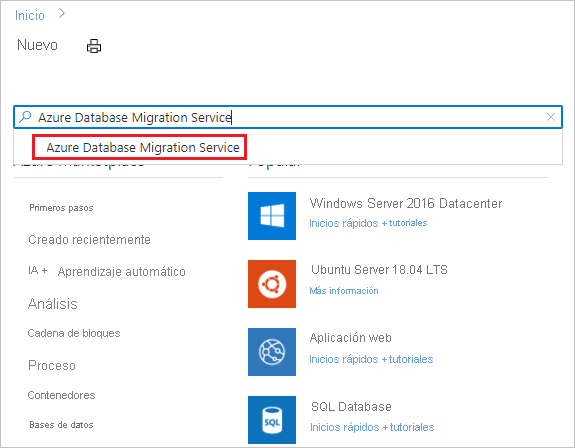
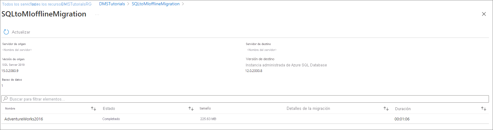

# Tutorial: Migración de SQL Server a Instancia administrada de Azure SQL sin conexión con Database Migration Service

Azure Database Migration Service se puede usar para migrar las bases de datos de una instancia de SQL Server a una [Instancia administrada de Azure SQL](../azure-sql/managed-instance/sql-managed-instance-paas-overview.md). Para ver otros métodos que pueden requerir algún esfuerzo manual, vea el artículo [De SQL Server a Azure SQL Managed Instance](../azure-sql/migration-guides/managed-instance/sql-server-to-managed-instance-guide.md).

En este tutorial, migrará la base de datos [AdventureWorks2016](/sql/samples/adventureworks-install-configure#download-backup-files) desde una instancia local de SQL Server hasta una instancia administrada de SQL Database mediante Azure Database Migration Service.

Aprenderá a:
> [!div class="checklist"]
>
> - Registrar el proveedor de recursos de Azure DataMigration.
> - Crear una instancia de Azure Database Migration Service.
> - Crear un proyecto de migración mediante Azure Database Migration Service.
> - Ejecutar la migración.
> - Supervisar la migración

> [!IMPORTANT]
> En las migraciones sin conexión de SQL Server a Instancia administrada de SQL, Azure Database Migration Service puede crear los archivos de copia de seguridad. Como alternativa, puede proporcionar la última copia de seguridad completa de la base de datos en el recurso compartido de red de SMB, que será la que use el servicio para migrar las bases de datos. Cada copia de seguridad se puede escribir en un archivo de copia de seguridad independiente o en varios archivos de copia de seguridad. Sin embargo, no se admite la anexación de varias copias de seguridad en un único medio de copia de seguridad. Tenga en cuenta que también puede usar copias de seguridad comprimidas para reducir la probabilidad de experimentar posibles problemas con la migración de copias de seguridad de gran tamaño.

[!INCLUDE [online-offline](../../includes/database-migration-service-offline-online.md)]

En este artículo se describe una migración en línea desde SQL Server hasta una Instancia administrada de SQL. Para migraciones en línea, consulte [Migración de SQL Server a una instancia administrada de SQL en línea mediante DMS](tutorial-sql-server-managed-instance-online.md).

## Requisitos previos

Para completar este tutorial, necesita:

- Descargar e instalar [SQL Server 2016 o una versión posterior](https://www.microsoft.com/sql-server/sql-server-downloads).
- Habilitar el protocolo TCP/IP, que se deshabilita de forma predeterminada durante la instalación de SQL Server Express, siguiendo las instrucciones del artículo [Habilitar o deshabilitar un protocolo de red de servidor](/sql/database-engine/configure-windows/enable-or-disable-a-server-network-protocol#SSMSProcedure).
- [Restaure la base de datos AdventureWorks2016 a la instancia de SQL Server.](/sql/samples/adventureworks-install-configure#restore-to-sql-server)
- Cree una instancia de Azure Virtual Network para Azure Database Migration Service mediante el modelo de implementación de Azure Resource Manager, que proporciona conectividad de sitio a sitio a los servidores de origen local mediante [ExpressRoute](../expressroute/expressroute-introduction.md) o [VPN](../vpn-gateway/vpn-gateway-about-vpngateways.md). [Obtenga información sobre topologías de red para migraciones de Instancia administrada de SQL mediante Azure Database Migration Service](./resource-network-topologies.md). Para más información sobre la creación de una red virtual, consulte la documentación de [Virtual Network](../virtual-network/index.yml)y, especialmente, los artículos de inicio rápido con detalles paso a paso.

    > [!NOTE]
    > Durante la configuración de la red virtual, si usa ExpressRoute con emparejamiento de red a Microsoft, agregue los siguientes [puntos de conexión](../virtual-network/virtual-network-service-endpoints-overview.md) de servicio a la subred en la que se aprovisionará el servicio:
    > - Punto de conexión de base de datos de destino (por ejemplo, punto de conexión de SQL, punto de conexión de Cosmos DB, etc.)
    > - Punto de conexión de Storage
    > - Punto de conexión de Service Bus
    >
    > Esta configuración es necesaria porque Azure Database Migration Service no tiene conexión a Internet.

- Asegúrese de que las reglas del grupo de seguridad de red de la red virtual no bloquean el puerto de salida 443 de ServiceTag para ServiceBus, Storage y AzureMonitor. Para más información sobre el filtrado del tráfico con grupos de seguridad de red para redes virtuales, vea el artículo [Filtrado del tráfico de red con grupos de seguridad de red](../virtual-network/virtual-network-vnet-plan-design-arm.md).
- Configure el [Firewall de Windows para acceder al motor de base de datos de origen](/sql/database-engine/configure-windows/configure-a-windows-firewall-for-database-engine-access).
- Abra el firewall de Windows para que Azure Database Migration Service pueda acceder al servidor SQL Server de origen; de forma predeterminada, es el puerto TCP 1433. Si la instancia predeterminada está escuchando en otro puerto, agréguelo al firewall.
- Si se ejecutan varias instancias con nombre de SQL Server con puertos dinámicos, puede ser conveniente habilitar el servicio SQL Browser y permitir el acceso al puerto UDP 1434 mediante los firewalls para que Azure Database Migration Service pueda conectarse a una instancia con nombre en el servidor de origen.
- Si va a usar un dispositivo de firewall delante de las bases de datos de origen, puede que sea necesario agregar reglas de firewall para permitir que Azure Database Migration Service acceda a las bases de datos de origen para realizar la migración, así como archivos a través del puerto SMB 445.
- Cree una Instancia administrada de SQL mediante los pasos que se describen en el artículo [Creación de una Instancia administrada de SQL en Azure Portal](../azure-sql/managed-instance/instance-create-quickstart.md).
- Asegúrese de que los inicios de sesión usados para conectar SQL Server de origen y SQL Managed Instance de destino son miembros del rol de servidor sysadmin.

    >[!NOTE]
    >De forma predeterminada, Azure Database Migration Service solo admite la migración de inicios de sesión de SQL. Sin embargo, puede habilitar la capacidad de migrar inicios de sesión de Windows de la siguiente manera:
    >
    >- Asegúrese de que la instancia de SQL Managed Instance de destino tenga acceso de lectura de AAD, que pueda configurar un usuario con el rol **Administrador global** mediante Azure Portal.
    >- Configure la instancia de Azure Database Migration Service para habilitar las migraciones de inicio de sesión de usuario o grupo de Windows, que se configuran mediante Azure Portal, en la página Configuración. Después de habilitar esta configuración, reinicie el servicio para que los cambios se apliquen.
    >
    > Después de reiniciar el servicio, los inicios de sesión de usuario o grupo de Windows aparecen en la lista de inicios de sesión disponibles para la migración. En el caso de los inicios de sesión de usuario o grupo de Windows que migre, se le pedirá que proporcione el nombre de dominio asociado. No se admiten las cuentas de usuario de servicio (cuenta con el nombre de dominio NT AUTHORITY) y las cuentas de usuario virtual (nombre de cuenta con el nombre de dominio NT SERVICE).

- Cree un recurso compartido de red que pueda usar Azure Database Migration Service para hacer copia de seguridad de la base de datos de origen.
- Asegúrese de que la cuenta de servicio que ejecuta la instancia de SQL Server de origen tiene privilegios de escritura en el recurso compartido de red que haya creado, y que la cuenta del equipo del servidor de origen tiene acceso de lectura y escritura para el mismo recurso compartido.
- Anote un usuario de Windows (y su contraseña) que tenga privilegios de control total sobre el recurso compartido de red que creó anteriormente. Azure Database Migration Service suplanta la credencial de usuario para cargar los archivos de copia de seguridad en el contenedor de Azure Storage para la operación de restauración.
- Cree un contenedor de blobs y recupere su URI de SAS mediante los pasos del artículo [Administración de recursos Azure Blob Storage con el Explorador de Storage](../vs-azure-tools-storage-explorer-blobs.md#get-the-sas-for-a-blob-container), asegúrese de seleccionar todos los permisos (lectura, escritura, eliminación, lista) en la ventana de directiva al crear el URI de SAS. Estos detalles proporcionan a Azure Database Migration Service acceso al contenedor de cuentas de almacenamiento para cargar los archivos de copia de seguridad usados para migrar bases de datos a la instancia administrada de SQL.

    > [!NOTE]
    > Azure Database Migration Service no admite el uso de un token de SAS de nivel de cuenta al configurar la cuenta de almacenamiento durante el paso para [configurar las opciones de migración](#configure-migration-settings).
    
[!INCLUDE [resource-provider-register](../../includes/database-migration-service-resource-provider-register.md)]

## Creación de una instancia de Azure Database Migration Service

1. En el menú de Azure Portal o en la página **principal**, seleccione **Crear un recurso**. Busque y seleccione **Azure Database Migration Service**.

    

2. En la pantalla **Azure Database Migration Service**, seleccione **Crear**.

    

3. En la pantalla de aspectos básicos **Crear el servicio de migración**:

     - Seleccione la suscripción.
     - Cree un grupo de recursos o seleccione uno existente.
     - Especifique un nombre para la instancia de Azure Database Migration Service.
     - Seleccione la ubicación en la que quiere crear la instancia de Azure Database Migration Service.
     - Elija **Azure** como modo de servicio.
     - Seleccione un plan de tarifa. Para más información sobre los costos y planes de tarifa, vea la [página de precios](https://aka.ms/dms-pricing).

    

     - Seleccione **Siguiente: Redes**.

4. En la pantalla de red **Crear el servicio de migración**:

    - Seleccione una red virtual existente o cree una nueva. La red virtual proporciona a Azure Database Migration Service acceso al servidor SQL Server de origen y a la instancia de Azure SQL Managed Instance de destino.
     
    - Para más información sobre cómo crear una red virtual en Azure Portal, consulte el artículo [Creación de una red virtual con Azure Portal](../virtual-network/quick-create-portal.md).
    
    - Para más información, consulte el artículo [Topologías de red para migraciones de Azure SQL Managed Instance mediante Azure Database Migration Service](./resource-network-topologies.md).

    

    - Seleccione **Revisar y crear** para revisar los detalles y luego **Crear** para crear el servicio.

## Creación de un proyecto de migración

Después de crear una instancia del servicio, búsquela en Azure Portal, ábrala y cree un proyecto de migración.

1. En el menú de Azure Portal, seleccione **Todos los servicios**. Busque y seleccione **Azure Database Migration Service**.

    

2. En la pantalla **Azure Database Migration Services**, seleccione el nombre de la instancia de Azure Database Migration Service que creó.

3. Seleccione **Nuevo proyecto de migración**.

     

4. En la pantalla **New migration project** (Nuevo proyecto de migración), especifique el nombre del proyecto; en el cuadro de texto **Source server type** (Tipo de servidor de origen), seleccione **SQL Server**; en el cuadro de texto **Target server type** (Tipo de servidor de destino), seleccione **Azure SQL Database Managed Instance** (Instancia administrada de Azure SQL Database) y, finalmente, en **Choose type of activity** (Elegir tipo de actividad), seleccione **Offline data migration** (Migración de datos sin conexión).

   

5. Seleccione **Crear y ejecutar una actividad** para crear el proyecto y ejecutar la actividad de migración.

## Especificación de los detalles de origen

1. En la pantalla **Seleccionar origen**, especifique los detalles de conexión de la instancia de SQL Server de origen.

    Asegúrese de usar un nombre de dominio completo (FQDN) para el nombre de la instancia de SQL Server de origen. También puede usar la dirección IP en los casos en que no sea posible la resolución de nombres de DNS.

2. Si no ha instalado ningún certificado de confianza en el servidor, seleccione la casilla **Certificado de servidor de confianza**.

    Si no hay ningún certificado de confianza instalado, SQL Server genera un certificado autofirmado cuando se inicia la instancia. Este certificado se usa para cifrar las credenciales de las conexiones del cliente.

    > [!CAUTION]
    > Las conexiones TLS cifradas mediante un certificado autofirmado no proporcionan una gran seguridad. Son susceptibles de sufrir ataques de tipo "Man in the middle". No debe confiar en TLS con certificados autofirmados en un entorno de producción, ni en servidores conectados a Internet.

   

3. Seleccione **Siguiente: Seleccionar destino**.

## Especificación de los detalles de destino

1. En la pantalla **Seleccionar destino**, especifique los detalles de conexión del destino, que es la instancia administrada de SQL aprovisionada previamente a la que se migra la base de datos **AdventureWorks2016**.

    Si aún no ha aprovisionado la Instancia administrada de SQL, seleccione el [vínculo](../azure-sql/managed-instance/instance-create-quickstart.md) para hacerlo. Aun así, puede continuar con la creación del proyecto y, a continuación, cuando la instancia administrada de SQL esté lista, regresar a este proyecto específico para ejecutar la migración.

    

2. Seleccione **Next: Select databases** (Siguiente: Seleccionar bases de datos). En la pantalla **Seleccionar bases de datos**, seleccione la base de datos **AdventureWorks2016** para la migración.

   

    > [!IMPORTANT]
    > Si usa SQL Server Integration Services (SSIS), DMS no admite actualmente la migración de la base de datos de catálogo de los proyectos o paquetes de SSIS (SSISDB) desde SQL Server hasta la Instancia administrada de SQL. Sin embargo, puede aprovisionar SSIS en Azure Data Factory (ADF) y volver a implementar los proyectos o paquetes de SSIS en la SSISDB de destino que hospeda la Instancia administrada de SQL. Para más información acerca de la migración de paquetes de SSIS, consulte el artículo [Migración de paquetes de SQL Server Integration Services a Azure](./how-to-migrate-ssis-packages.md).

3. Seleccione **Siguiente: Seleccionar inicios de sesión**.

## Selección de inicios de sesión

1. En la pantalla **Seleccionar inicios de sesión**, seleccione los inicios de sesión que desea migrar.

    >[!NOTE]
    >De forma predeterminada, Azure Database Migration Service solo admite la migración de inicios de sesión de SQL. Para habilitar la compatibilidad con la migración de inicios de sesión de Windows, consulte la sección **Requisitos previos** de este tutorial.

    

2. Seleccione **Siguiente: Configuración de valores de migración**.

## Configuración de valores de migración

1. En la pantalla **Configurar los valores de la migración**, proporcione los detalles siguientes:

    | Parámetro | Descripción |
    |--------|---------|
    |**Elegir la opción de copia de seguridad de origen** | Elija la opción **I will provide latest backup files** (Proporcionaré los archivos de copia de seguridad más recientes) cuando tenga archivos de la copia de seguridad completa disponibles para que DMS los use para la migración de la base de datos. Elija la opción **I will let Azure Database Migration Service create backup files** (Dejaré que Azure Database Migration Service cree archivos de copia de seguridad) cuando desee que DMS realice una copia de seguridad completa de la base de datos de origen al principio y usarla para la migración. |
    |**Recurso compartido de la ubicación de red** | El recurso compartido de red de SMB local en el que Azure Database Migration Service puede realizar copias de seguridad de la base de datos de origen. La cuenta de servicio que ejecuta la instancia de SQL Server de origen debe tener privilegios de escritura en este recurso compartido de red. Proporcione un FQDN o direcciones IP del servidor en el recurso compartido de red como, por ejemplo, "\\\servername.domainname.com\backupfolder" o "\\\IP address\backupfolder".|
    |**Nombre de usuario** | Asegúrese de que el usuario de Windows tiene privilegio de control total sobre el recurso compartido de red que especificó anteriormente. Azure Database Migration Service suplanta la credencial de usuario para cargar los archivos de copia de seguridad en el contenedor de Azure Storage para la operación de restauración. Si las bases de datos con TDE habilitado se seleccionan para la migración, el usuario de Windows anterior debe ser la cuenta de administrador integrada y se debe deshabilitar [User Account Control](/windows/security/identity-protection/user-account-control/user-account-control-overview) para que Azure Database Migration Service se cargue y elimine los archivos de certificados. |
    |**Contraseña** | Contraseña del usuario. |
    |**Configuración de cuentas de almacenamiento** | Identificador URI de SAS que proporciona a Azure Database Migration Service acceso al contenedor de la cuenta de almacenamiento en el que el servicio carga los archivos de copia de seguridad y que se usa para la migración de bases de datos a la instancia administrada de SQL. [Más información sobre cómo obtener el identificador URI de SAS para el contenedor de blobs](../vs-azure-tools-storage-explorer-blobs.md#get-the-sas-for-a-blob-container). Este URI de SAS debe ser para el contenedor de blobs, no para la cuenta de almacenamiento.|
    |**Configuración TDE** | Si va a migrar las bases de datos de origen con el cifrado de datos transparente (TDE) habilitado, deberá tener privilegios de escritura en la instancia administrada de SQL de destino.  En el menú desplegable, seleccione la suscripción en la que se aprovisiona la instancia administrada de SQL.  En el menú desplegable, seleccione la **Instancia administrada de Azure SQL Database** de destino. |

    

2. Seleccione **Siguiente: Resumen**.

## Examen del resumen de la migración

1. En la pantalla **Resumen**, en el cuadro de texto **Nombre de actividad**, especifique un nombre para la actividad de migración.

2. Revise y compruebe los detalles relacionados con el proyecto de migración.

    

## Ejecución de la migración

- Seleccione **Iniciar migración**.

  Aparece la ventana de actividad de migración que muestra el estado de migración actual de las bases de datos y los inicios de sesión.

## Supervisión de la migración

1. En la pantalla de la actividad de migración, seleccione **Actualizar** para actualizar la pantalla.

   

2. Puede ampliar aún más las bases de datos y las categorías de inicio de sesión para supervisar el estado de migración de los respectivos objetos de servidor.

   

3. Una vez completada la migración, compruebe la base de datos de destino en el entorno de SQL Managed Instance.

## Recursos adicionales

- Para consultar un tutorial que muestra cómo migrar una base de datos a SQL Managed Instance mediante el comando T-SQL RESTORE, consulte [Restauración de una copia de seguridad para SQL Managed Instance mediante el comando Restore](../azure-sql/managed-instance/restore-sample-database-quickstart.md).
- Para más información sobre SQL Managed Instance, consulte [¿Qué es SQL Managed Instance?](../azure-sql/managed-instance/sql-managed-instance-paas-overview.md).
- Para más información sobre cómo conectar las aplicaciones a SQL Managed Instance, consulte [Conexión de aplicaciones](../azure-sql/managed-instance/connect-application-instance.md).
