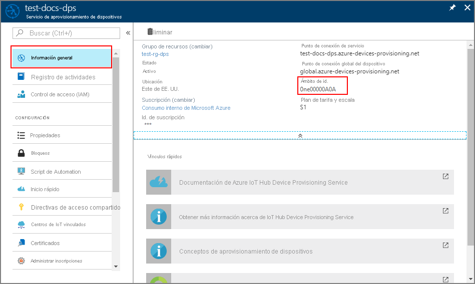
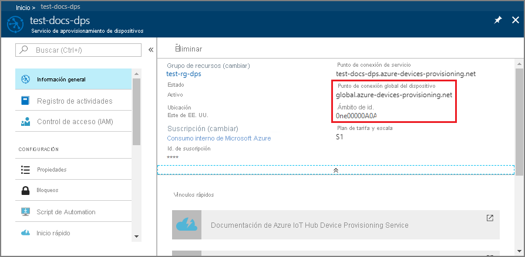

# <a name="quickstart-provision-a-simulated-tpm-device"></a>Inicio rápido: Aprovisionamiento de un dispositivo de TPM simulado

En esta guía de inicio rápido creará un dispositivo de TPM simulado en una máquina Windows. Después de configurar el dispositivo, lo aprovisionará en un centro de IoT mediante Azure IoT Hub Device Provisioning Service. A continuación, usará un código de ejemplo para inscribir el dispositivo con una instancia de Device Provisioning Service.

Si no conoce el proceso de aprovisionamiento, consulte la información general sobre el [aprovisionamiento](about-iot-dps.md#provisioning-process).  Asegúrese de completar los pasos descritos en [Configuración del servicio Azure IoT Hub Device Provisioning con Azure Portal](./quick-setup-auto-provision.md) antes de continuar.

Azure IoT Hub Device Provisioning Service admite dos tipos de inscripciones:

* Los [grupos de inscripción](concepts-service.md#enrollment-group) se usan para inscribir varios dispositivos relacionados.

* Las [inscripciones individuales](concepts-service.md#individual-enrollment), en cambio, se usan para inscribir un único dispositivo.

En este artículo se muestran las inscripciones individuales.

## <a name="prerequisites"></a>Requisitos previos

* Si no tiene una suscripción a Azure, cree una [cuenta gratuita](https://azure.microsoft.com/free/?ref=microsoft.com&utm_source=microsoft.com&utm_medium=docs&utm_campaign=visualstudio) antes de empezar.

* Realice los pasos que se describen en [Configuración de IoT Hub Device Provisioning Service con Azure Portal](./quick-setup-auto-provision.md).

Los siguientes requisitos previos corresponden a un entorno de desarrollo de Windows. En el caso de Linux o macOS, consulte la sección correspondiente en [Preparación del entorno de desarrollo](https://github.com/Azure/azure-iot-sdk-c/blob/master/doc/devbox_setup.md) en la documentación del SDK.

::: zone pivot="programming-language-ansi-c"

* [Visual Studio](https://visualstudio.microsoft.com/vs/) 2019 con la carga de trabajo ["Desarrollo para el escritorio con C++"](/cpp/ide/using-the-visual-studio-ide-for-cpp-desktop-development) habilitada. También se admiten Visual Studio 2015 y Visual Studio 2017.

::: zone-end

::: zone pivot="programming-language-csharp"

* Instale el [SDK de .NET Core 2.1](https://dotnet.microsoft.com/download), o cualquier versión posterior, en una máquina con Windows. Para comprobar la versión, use el siguiente comando.

    ```bash
    dotnet --info
    ```

::: zone-end

::: zone pivot="programming-language-nodejs"

* Instale [Node.js v4.0+](https://nodejs.org).

::: zone-end

::: zone pivot="programming-language-python"

* Instale [Python 2.x o 3.x](https://www.python.org/downloads/). Asegúrese de usar la instalación de 32 bits o 64 bits en función del programa de instalación. Cuando se le solicite durante la instalación, asegúrese de agregar Python a las variables de entorno específicas de la plataforma.

* Si usa el sistema operativo Windows, instale el [paquete redistribuible de Visual C++](https://support.microsoft.com/help/2977003/the-latest-supported-visual-c-downloads) para permitir el uso de archivos DLL nativos de Python.

* [Visual Studio](https://visualstudio.microsoft.com/vs/) 2019 con la carga de trabajo ["Desarrollo para el escritorio con C++"](/cpp/ide/using-the-visual-studio-ide-for-cpp-desktop-development) habilitada. También se admiten Visual Studio 2015 y Visual Studio 2017.

* [Sistema de compilación de CMake](https://cmake.org/download/).

::: zone-end

::: zone pivot="programming-language-java"

* Instale [Java SE Development Kit 8](/azure/developer/java/fundamentals/java-support-on-azure) o cualquier versión posterior, en la máquina.

* Descargue e instale [Maven](https://maven.apache.org/install.html).

::: zone-end

* Instale la última versión de [Git](https://git-scm.com/download/). Asegúrese de que Git se ha agregado a las variables de entorno accesibles desde la ventana de comandos. Consulte las [herramientas de cliente de Git de Software Freedom Conservancy](https://git-scm.com/download/) para instalar la versión más reciente de las herramientas `git`, lo que incluye *Git Bash*, la aplicación de línea de comandos que puede usar para interactuar con su repositorio de Git local.

<a id="setupdevbox"></a>

## <a name="prepare-your-development-environment"></a>Preparación del entorno de desarrollo

::: zone pivot="programming-language-ansi-c"

En esta sección, preparará un entorno de desarrollo para compilar el [SDK de Azure IoT para C](https://github.com/Azure/azure-iot-sdk-c) y el simulador de dispositivos de [TPM](/windows/device-security/tpm/trusted-platform-module-overview) de ejemplo.

1. Descargue el último [sistema de compilación CMake](https://cmake.org/download/).

    >[!IMPORTANT]
    >Confirme que los requisitos previos de Visual Studio (Visual Studio y la carga de trabajo "Desarrollo para el escritorio con C++") estén instalados en la máquina **antes** de empezar la instalación de `CMake`. Una vez que los requisitos previos están en su lugar, y se ha comprobado la descarga, instale el sistema de compilación de CMake. Igualmente, tenga en cuenta que las versiones anteriores del sistema de compilación CMake no generan el archivo de solución que se usa en este artículo. Asegúrese de usar la versión más reciente de CMake.

2. Abra un explorador web y vaya a la [página de la versión del SDK de Azure IoT para C](https://github.com/Azure/azure-iot-sdk-c/releases/latest).

3. Seleccione la pestaña **Etiquetas** en la parte superior de la página.

4. Copie el nombre de etiqueta de la versión más reciente del SDK de Azure IoT para C.

5. Abra un símbolo del sistema o el shell de Bash de Git. Ejecute los siguientes comandos para clonar la versión más reciente del repositorio de GitHub del [SDK de Azure IoT para C](https://github.com/Azure/azure-iot-sdk-c). (Reemplace `<release-tag>` con el nombre de la etiqueta que copió en el paso anterior).

    ```cmd/sh
    git clone -b <release-tag> https://github.com/Azure/azure-iot-sdk-c.git
    cd azure-iot-sdk-c
    git submodule update --init
    ```

    Esta operación puede tardar varios minutos en completarse.

6. Una vez completada la operación, ejecute los siguientes comandos desde el directorio `azure-iot-sdk-c`:

    ```cmd/sh
    mkdir cmake
    cd cmake
    ```

::: zone-end

::: zone pivot="programming-language-csharp"

1. Abra un entorno de línea de comandos de Git CMD o Git Bash.

2. Utilice el siguiente comando para clonar el repositorio de GitHub de los [ejemplos de Azure IoT para C#](https://github.com/Azure-Samples/azure-iot-samples-csharp):

    ```cmd
    git clone https://github.com/Azure-Samples/azure-iot-samples-csharp.git
    ```

::: zone-end

::: zone pivot="programming-language-nodejs"

1. Abra un entorno de línea de comandos de Git CMD o Git Bash.

2. Clone el repositorio de GitHub [azure-utpm-c](https://github.com/Azure-Samples/azure-iot-samples-csharp) con el siguiente comando:

    ```cmd/sh
    git clone https://github.com/Azure/azure-utpm-c.git --recursive
    ```

::: zone-end

::: zone pivot="programming-language-python"

1. Abra un entorno de línea de comandos de Git CMD o Git Bash.
  
2. Clone el repositorio de GitHub [Python](https://github.com/Azure/azure-iot-sdk-python) con el siguiente comando:

    ```cmd/sh
    git clone --single-branch --branch v1-deprecated https://github.com/Azure/azure-iot-sdk-python.git --recursive
    ```

3. Cree una carpeta en su copia local de este repositorio GitHub para el proceso de compilación de CMake. 

    ```cmd/sh
    cd azure-iot-sdk-python/c
    mkdir cmake
    cd cmake
    ```

4. Siga [estas instrucciones](https://github.com/Azure/azure-iot-sdk-python/blob/v1-deprecated/doc/python-devbox-setup.md) para compilar los paquetes de Python.

   > [!NOTE]
   > Si ejecuta `build_client.cmd`, asegúrese de usar la marca `--use-tpm-simulator`.
   > 
   > [!NOTE]
   > Si usa `pip`, asegúrese de instalar también el paquete `azure-iot-provisioning-device-client`. Tenga en cuenta que los paquetes de PIP publicados utilizan el TPM real y no el simulador. Para usar el simulador, debe compilar desde el código fuente mediante la marca `--use-tpm-simulator`.

::: zone-end

::: zone pivot="programming-language-java"

1. Abra un entorno de línea de comandos de Git CMD o Git Bash.
  
2. Clone el repositorio de GitHub [Java](https://github.com/Azure/azure-iot-sdk-java.git) con el siguiente comando:

    ```cmd/sh
    git clone https://github.com/Azure/azure-iot-sdk-java.git --recursive
    ```

::: zone-end

## <a name="build-and-run-the-tpm-device-simulator"></a>Compilación y ejecución del simulador de dispositivos de TPM

En esta sección, compilará y ejecutará el simulador de TPM. Este simulador escucha a través de un socket en los puertos 2321 y 2322. No cierre la ventana de comandos. Debe mantener este simulador ejecutándose hasta el final de esta guía de inicio rápido.

::: zone pivot="programming-language-ansi-c"

1. Ejecute el siguiente comando para compilar el SDK de Azure IoT para C que incluye el código de ejemplo del simulador de dispositivos TPM. Se genera una solución de Visual Studio para el dispositivo simulado en el directorio `cmake`. Este ejemplo proporciona un [mecanismo de atestación](concepts-service.md#attestation-mechanism) de TPM mediante la autenticación del token de firma de acceso compartido (SAS).

    ```cmd
    cmake -Duse_prov_client:BOOL=ON ..
    ```

    >[!TIP]
    >Si `cmake` no encuentra el compilador de C++, es posible que obtenga errores de compilación durante la ejecución del comando anterior. Si eso sucede, pruebe a ejecutar este comando en el [símbolo del sistema de Visual Studio](/dotnet/framework/tools/developer-command-prompt-for-vs).

2. Una vez realizada la compilación, las últimas líneas de salida son similares a las siguientes:

    ```cmd/sh
    $ cmake -Duse_prov_client:BOOL=ON ..
    -- Building for: Visual Studio 16 2019
    -- The C compiler identification is MSVC 19.23.28107.0
    -- The CXX compiler identification is MSVC 19.23.28107.0

    ...

    -- Configuring done
    -- Generating done
    -- Build files have been written to: C:/code/azure-iot-sdk-c/cmake
    ```

3. Vaya a la carpeta raíz del repositorio Git clonado.

4. Ejecute el simulador de [TPM](/windows/device-security/tpm/trusted-platform-module-overview) mediante la ruta de acceso que se muestra a continuación.

    ```cmd/sh
    cd ..
    .\provisioning_client\deps\utpm\tools\tpm_simulator\Simulator.exe
    ```

    El simulador no muestra ningún resultado. Deje que continúe ejecutándose mientras simula un dispositivo TPM.

::: zone-end

::: zone pivot="programming-language-csharp"

1. En el menú principal de la instancia de Device Provisioning Service, seleccione **Información general**.

2. Copie el valor de del **Ámbito de id.**

     

3. En un símbolo del sistema, cambie los directorios al directorio del proyecto del ejemplo de aprovisionamiento de dispositivo de TPM.

    ```cmd
    cd .\azure-iot-samples-csharp\provisioning\Samples\device\TpmSample
    ```

4. Escriba el siguiente comando para compilar y ejecutar el ejemplo de aprovisionamiento de dispositivos TPM (reemplace `<IDScope>` con el ámbito de id. del servicio de aprovisionamiento).

    ```cmd
    dotnet run <IDScope>
    ```

    >[!NOTE]
    >Este comando iniciará el simulador de chip de TPM en un símbolo del sistema independiente. En Windows, es posible que encuentre una alerta de seguridad de Windows que le pregunte si quiere permitir que `Simulator.exe` se comunique en redes públicas. Para los fines de este ejemplo, puede cancelar la solicitud.

5. La ventana de comandos original muestra la **_clave de aprobación_**, el **_identificador de registro_** y un **_identificador de dispositivo_** sugerido, ya que son necesarios para la inscripción del dispositivo. Anote estos valores. Usará estos valores para crear una inscripción individual en la instancia de Device Provisioning Service.

   > [!NOTE]
   > No confunda la ventana que contiene la salida del comando con la ventana que contiene la salida desde el simulador de TPM. Es posible que tenga que seleccionar la ventana de comandos original para pasarla al primer plano.

::: zone-end

::: zone pivot="programming-language-nodejs"

1. Vaya a la carpeta raíz de GitHub.

2. Ejecute el simulador de [TPM](/windows/device-security/tpm/trusted-platform-module-overview) para que sea el [HSM](https://azure.microsoft.com/blog/azure-iot-supports-new-security-hardware-to-strengthen-iot-security/) para el dispositivo simulado.

    ```cmd/sh
    .\azure-utpm-c\tools\tpm_simulator\Simulator.exe
    ```

3. Cree una nueva carpeta vacía denominada **registerdevice**. En la carpeta **registerdevice**, cree un archivo _package.json_ mediante el siguiente comando en el símbolo del sistema (asegúrese de responder todas las preguntas de `npm` o acepte los valores predeterminados si le van bien):

    ```cmd/sh
    npm init
    ```

4. Instale los siguientes paquetes precursores:

    ```cmd/sh
    npm install node-gyp -g
    npm install ffi -g
    ```

    > [!NOTE]
    > Hay algunos problemas conocidos al instalar los paquetes anteriores. Para resolver estos problemas, ejecute `npm install --global --production windows-build-tools` desde un símbolo del sistema en modo **Ejecutar como administrador**, ejecute `SET VCTargetsPath=C:\Program Files (x86)\MSBuild\Microsoft.Cpp\v4.0\V140` después de reemplazar la ruta de acceso por la versión instalada y, luego, vuelva a ejecutar los comandos de la instalación anterior.
    >

5. Instale todos los paquetes necesarios ejecutando el siguiente comando en el símbolo del sistema en la carpeta **registerdevice**:

    ```cmd/sh
    npm install --save azure-iot-device azure-iot-device-mqtt azure-iot-security-tpm azure-iot-provisioning-device-http azure-iot-provisioning-device
    ```

    El comando instala los siguientes paquetes:

   * un cliente de seguridad que funciona con TPM: `azure-iot-security-tpm`
   * un transporte para que el dispositivo se conecte al servicio Device Provisioning: `azure-iot-provisioning-device-http` o `azure-iot-provisioning-device-amqp`
   * un cliente que use el transporte y el cliente de seguridad: `azure-iot-provisioning-device`
   * el cliente de dispositivo: `azure-iot-device`
   * un transporte: `azure-iot-device-amqp`, `azure-iot-device-mqtt` o `azure-iot-device-http`
   * el cliente de seguridad que ya ha instalado: `azure-iot-security-tpm`

     > [!NOTE]
     > Los ejemplos de esta guía de inicio rápido utilizan los transportes `azure-iot-provisioning-device-http` y `azure-iot-device-mqtt`.
     >

6. Abra el editor de texto que prefiera.

7. En la carpeta **registerdevice**, cree un nuevo archivo _ExtractDevice.js_.

8. Agregue las siguientes instrucciones `require` al principio del archivo **ExtractDevice.js** :

    ```Javascript

    'use strict';
    
    var tpmSecurity = require('azure-iot-security-tpm');
    var tssJs = require("tss.js");
    
    var myTpm = new tpmSecurity.TpmSecurityClient(undefined, new tssJs.Tpm(true));
    ```

9. Agregue la siguiente función para implementar el método:

    ```Javascript

    myTpm.getEndorsementKey(function(err, endorsementKey) {
      if (err) {
        console.log('The error returned from get key is: ' + err);
      } else {
        console.log('the endorsement key is: ' + endorsementKey.toString('base64'));
        myTpm.getRegistrationId((getRegistrationIdError, registrationId) => {
          if (getRegistrationIdError) {
            console.log('The error returned from get registration id is: ' + getRegistrationIdError);
          } else {
            console.log('The Registration Id is: ' + registrationId);
            process.exit();
          }
        });
      }
    });
    ```

10. Guarde y cierre el archivo _ExtractDevice.js_.

    ```cmd/sh
    node ExtractDevice.js
    ```

11. Ejecute el ejemplo.

12. La ventana de salida muestra los valores de **_Clave de aprobación_** e **_Id. de registro_** necesarios para la inscripción del dispositivo. Copie estos valores.

::: zone-end

::: zone pivot="programming-language-python"

1. Ejecute el siguiente comando para habilitar la autenticación del token de SAS (el comando también genera una solución de Visual Studio para el dispositivo simulado):

    ```cmd/sh
    cmake -Duse_prov_client:BOOL=ON -Duse_tpm_simulator:BOOL=ON ..
    ```

2. Abra un segundo símbolo del sistema.

3. En el segundo símbolo del sistema, vaya a la carpeta del simulador de TPM.

4. Ejecute el simulador de [TPM](/windows/device-security/tpm/trusted-platform-module-overview) para que sea el [HSM](https://azure.microsoft.com/blog/azure-iot-supports-new-security-hardware-to-strengthen-iot-security/) para el dispositivo simulado.

5. Seleccione **Permitir acceso**. Este simulador escucha a través de un socket en los puertos 2321 y 2322. No cierre esta ventana de comandos; la ejecución del no debe interrumpirse hasta el final de esta guía de inicio rápido.

  ```cmd/sh
  .\azure-iot-sdk-python\c\provisioning_client\deps\utpm\tools\tpm_simulator\Simulator.exe
  ```

  

::: zone-end

::: zone pivot="programming-language-java"

1. Ejecute el simulador de [TPM](/windows/device-security/tpm/trusted-platform-module-overview) para que sea el [HSM](https://azure.microsoft.com/blog/azure-iot-supports-new-security-hardware-to-strengthen-iot-security/) para el dispositivo simulado.

2. Seleccione **Permitir acceso**. Este simulador escucha a través de un socket en los puertos 2321 y 2322. No cierre esta ventana de comandos; la ejecución del no debe interrumpirse hasta el final de esta guía de inicio rápido.

    ```cmd/sh
    .\azure-iot-sdk-java\provisioning\provisioning-tools\tpm-simulator\Simulator.exe
    ```

    

3. Abra un segundo símbolo del sistema.

4. En el segundo símbolo del sistema, vaya a la carpeta raíz y compile las dependencias de ejemplo.

    ```cmd/sh
    cd azure-iot-sdk-java
    mvn install -DskipTests=true
    ```

5. Navegue hasta la carpeta de ejemplos.

    ```cmd/sh
    cd provisioning/provisioning-samples/provisioning-tpm-sample
    ```

::: zone-end

::: zone pivot="programming-language-ansi-c, programming-language-python,programming-language-java"

<a id="simulatetpm"></a>

## <a name="read-cryptographic-keys-from-the-tpm-device"></a>Lectura de las claves criptográficas desde el dispositivo de TPM

En esta sección, compilará y ejecutará un ejemplo que leerá la clave de aprobación y el id. de registro del simulador de TPM que dejó ejecutándose y que aún está escuchando a través de los puertos 2321 y 2322. Estos valores se usarán para la inscripción de dispositivos en la instancia del servicio Device Provisioning.

::: zone-end

::: zone pivot="programming-language-ansi-c"

1. Inicie Visual Studio.

2. Abra la solución que creó en la carpeta *cmake* denominada `azure_iot_sdks.sln`.

3. En el menú de Visual Studio, seleccione **Compilar** > **Compilar solución** para compilar todos los proyectos de la solución.

4. En el *Explorador de soluciones* de Visual Studio, vaya a la carpeta **Aprovisionar\_Herramientas**. Haga clic con el botón derecho en el proyecto **tpm_device_provision** y seleccione **Establecer como proyecto de inicio**. 

5. En el menú de Visual Studio, seleccione **Depurar** > **Iniciar sin depurar** para ejecutar la solución. La aplicación lee y muestra un **_identificador de registro_** y una **_clave de aprobación_**. Anote o copie estos valores. Los usará en la sección siguiente para la inscripción del dispositivo.

::: zone-end

::: zone pivot="programming-language-python"

1. Inicie Visual Studio.

2. Abra la solución que creó en la carpeta *cmake* denominada `azure_iot_sdks.sln`.

3. En el menú de Visual Studio, seleccione **Compilar** > **Compilar solución** para compilar todos los proyectos de la solución.

4. Haga clic con el botón derecho en el proyecto **tpm_device_provision** y seleccione **Establecer como proyecto de inicio**.

5. Ejecute la solución. La ventana de salida muestra los valores de **_Clave de aprobación_** e **_Id. de registro_** necesarios para la inscripción del dispositivo. Copie estos valores.

::: zone-end

::: zone pivot="programming-language-java"

1. Inicie sesión en Azure Portal, seleccione el botón **Todos los recursos** en el menú de la izquierda y abra la instancia de Device Provisioning Service. Anote los valores de _Ámbito de id._ y _Provisioning Service Global Endpoint_ (Punto de conexión global del servicio de aprovisionamiento).

    

2. Edite el archivo `src/main/java/samples/com/microsoft/azure/sdk/iot/ProvisioningTpmSample.java` para que incluya el _Ámbito de id._ y el _Provisioning Service Global Endpoint_ (Punto de conexión global del Servicio de aprovisionamiento) tal y como se indicó antes.  

    ```java
    private static final String idScope = "[Your ID scope here]";
    private static final String globalEndpoint = "[Your Provisioning Service Global Endpoint here]";
    private static final ProvisioningDeviceClientTransportProtocol PROVISIONING_DEVICE_CLIENT_TRANSPORT_PROTOCOL = ProvisioningDeviceClientTransportProtocol.HTTPS;
    ```

3. Guarde el archivo.

4. Use los siguientes comandos para compilar el proyecto, vaya a la carpeta de destino y ejecute el archivo .jar que creó (reemplace `{version}` con su versión de Java):

    ```cmd/sh
    mvn clean install
    cd target
    java -jar ./provisioning-tpm-sample-{version}-with-deps.jar
    ```

5. Cuando el programa comience a ejecutarse, mostrará la *_Clave de aprobación_* y el *_Id. de registro_*.  Copie estos valores para la sección siguiente. Asegúrese de dejar el programa en ejecución.
  
::: zone-end


<a id="portalenrollment"></a>

## <a name="create-a-device-enrollment-entry"></a>Creación de una entrada de inscripción de dispositivo

1. Inicie sesión en [Azure Portal](https://portal.azure.com).

2. En el menú de la izquierda o en la página del portal, seleccione **Todos los recursos**.

3. Seleccione la instancia de Device Provisioning Service.

4. En el menú de **Configuración**, seleccione **Administrar inscripciones**.

5. En la parte superior de la página, seleccione **+ Agregar inscripción individual**.

6. En el panel **Agregar inscripción**, escriba la siguiente información:

   * Seleccione **TPM** como *Mecanismo* de atestación de identidad.
   * Escriba los valores de *Id. de registro* y *Clave de aprobación* del dispositivo de TPM que anotó anteriormente.
   * Seleccione un centro de IoT vinculado con el servicio de aprovisionamiento.
   * De forma opcional, puede proporcionar la siguiente información:
       * Escriba un *identificador de dispositivo* único (puede usar **test-docs-device** o proporcionar el suyo propio). Asegúrese de evitar datos confidenciales al asignar nombre al dispositivo. Si decide escribir un nombre, se usará en su lugar el identificador de registro para identificar el dispositivo.
       * Actualice el **Estado inicial del dispositivo gemelo** con la configuración inicial deseada para el dispositivo.
   * Una vez completado, presione el botón **Guardar**.

        

7. Seleccione **Guardar**.

## <a name="register-the-device"></a>Registro del dispositivo

En esta sección, configurará el código de ejemplo para usar [Advanced Message Queuing Protocol (AMQP)](https://wikipedia.org/wiki/Advanced_Message_Queuing_Protocol) para enviar la secuencia de arranque del dispositivo a la instancia de Device Provisioning Service. Esta secuencia de arranque hará que el dispositivo se registre en un centro de IoT vinculado a la instancia de Device Provisioning Service.

::: zone pivot="programming-language-ansi-c"

<a id="firstbootsequence"></a>

1. En Azure Portal, seleccione la pestaña **Información general** de Device Provisioning Service.

2. Copie el valor de del **_Ámbito de id_**.

    
3. En la ventana del *Explorador de soluciones* de Visual Studio, desplácese hasta la carpeta **Aprovisionar\_Ejemplos**. Expanda el proyecto de ejemplo denominado **prov\_dev\_client\_sample**. Expanda **Archivos de código fuente** y abra **prov\_dev\_cliente\_sample.c**.

4. Cerca de la parte superior del archivo, busque las instrucciones `#define` para cada protocolo de dispositivo, tal como se muestra a continuación. Asegúrese de que solo `SAMPLE_AMQP` tenga quitada la marca de comentario.

    Actualmente, el protocolo [MQTT no se admite para la inscripción individual de TPM](https://github.com/Azure/azure-iot-sdk-c#provisioning-client-sdk).

    ```c
    //
    // The protocol you wish to use should be uncommented
    //
    //#define SAMPLE_MQTT
    //#define SAMPLE_MQTT_OVER_WEBSOCKETS
    #define SAMPLE_AMQP
    //#define SAMPLE_AMQP_OVER_WEBSOCKETS
    //#define SAMPLE_HTTP
    ```

5. Busque la constante `id_scope` y reemplace el valor por el valor de **Ámbito de id.** que copió anteriormente. 

    ```c
    static const char* id_scope = "0ne00002193";
    ```

6. Busque la definición de la función `main()` en el mismo archivo. Asegúrese de que la variable `hsm_type` está establecida en `SECURE_DEVICE_TYPE_X509` y no en `SECURE_DEVICE_TYPE_TPM`, tal como se muestra a continuación.

    ```c
    SECURE_DEVICE_TYPE hsm_type;
    //hsm_type = SECURE_DEVICE_TYPE_TPM;
    hsm_type = SECURE_DEVICE_TYPE_X509;
    ```

7. Haga clic con el botón derecho en el proyecto **prov\_dev\_client\_sample** y seleccione **Set as Startup Project** (Establecer como proyecto de inicio).

8. En el menú de Visual Studio, seleccione **Depurar** > **Iniciar sin depurar** para ejecutar la solución. En la solicitud para volver a compilar el proyecto, seleccione **Sí** para recompilar el proyecto antes de ejecutarlo.

    La salida siguiente es un ejemplo del cliente de dispositivo de aprovisionamiento de ejemplo que ha arrancado correctamente y se conecta a la instancia del servicio Device Provisioning para obtener información de IoT Hub y registrarse:

     ```cmd
    Provisioning API Version: 1.2.7

    Registering... Press enter key to interrupt.

    Provisioning Status: PROV_DEVICE_REG_STATUS_CONNECTED
    Provisioning Status: PROV_DEVICE_REG_STATUS_ASSIGNING
    Provisioning Status: PROV_DEVICE_REG_STATUS_ASSIGNING

    Registration Information received from service:
    test-docs-hub.azure-devices.net, deviceId: test-docs-cert-device
    ```

::: zone-end

::: zone pivot="programming-language-nodejs"

1. En Azure Portal, seleccione la pestaña **Información general** de Device Provisioning Service.

2. Copie el valor de del **_Ámbito de id_**.

      

3. Abra el editor de texto que prefiera.

4. En la carpeta **registerdevice**, cree un nuevo archivo _RegisterDevice.js_.

5. Agregue las instrucciones `require` al principio del archivo _RegisterDevice.js_:

    ```Javascript

    'use strict';

    var ProvisioningTransport = require('azure-iot-provisioning-device-http').Http;
    var iotHubTransport = require('azure-iot-device-mqtt').Mqtt;
    var Client = require('azure-iot-device').Client;
    var Message = require('azure-iot-device').Message;
    var tpmSecurity = require('azure-iot-security-tpm');
    var ProvisioningDeviceClient = require('azure-iot-provisioning-device').ProvisioningDeviceClient;
    ```

    > [!NOTE]
    > El **SDK de IoT de Azure para Node.js** admite protocolos adicionales, como _AMQP_, _AMQP WS_ y _MQTT WS_.  Para ver más ejemplos, consulte [Samples for the Azure IoT Device Provisioning Service SDK for Node.js](https://github.com/Azure/azure-iot-sdk-node/tree/master/provisioning/device/samples) (Ejemplos del SDK de servicio de aprovisionamiento de dispositivos de Azure IoT para Node.js).
    > 

6. Agregue las variables **globalDeviceEndpoint** e **idScope** y úselas para crear una instancia de **ProvisioningDeviceClient**. Reemplace **{globalDeviceEndpoint}** e **{idScope}** por los valores de **_Punto de conexión global del dispositivo_**  y **_Ámbito de id_** del **paso 1**:

    ```Javascript

    var provisioningHost = '{globalDeviceEndpoint}';
    var idScope = '{idScope}';

    var tssJs = require("tss.js");
    var securityClient = new tpmSecurity.TpmSecurityClient('', new tssJs.Tpm(true));
    // if using non-simulated device, replace the above line with following:
    //var securityClient = new tpmSecurity.TpmSecurityClient();

    var provisioningClient = ProvisioningDeviceClient.create(provisioningHost, idScope, new ProvisioningTransport(), securityClient);
    ```

7. Agregue la siguiente función para implementar el método en el dispositivo:

    ```JavaScript

    provisioningClient.register(function(err, result) {
      if (err) {
        console.log("error registering device: " + err);
      } else {
        console.log('registration succeeded');
        console.log('assigned hub=' + result.registrationState.assignedHub);
        console.log('deviceId=' + result.registrationState.deviceId);
        var tpmAuthenticationProvider = tpmSecurity.TpmAuthenticationProvider.fromTpmSecurityClient(result.registrationState.deviceId, result.registrationState.assignedHub, securityClient);
        var hubClient = Client.fromAuthenticationProvider(tpmAuthenticationProvider, iotHubTransport);

        var connectCallback = function (err) {
          if (err) {
            console.error('Could not connect: ' + err.message);
          } else {
            console.log('Client connected');
            var message = new Message('Hello world');
            hubClient.sendEvent(message, printResultFor('send'));
          }
        };

        hubClient.open(connectCallback);

        function printResultFor(op) {
          return function printResult(err, res) {
            if (err) console.log(op + ' error: ' + err.toString());
            if (res) console.log(op + ' status: ' + res.constructor.name);
            process.exit(1);
          };
        }
      }
    });
    ```

8. Guarde el archivo _RegisterDevice.js_ y ciérrelo. 

9. Ejecute el siguiente comando:

    ```cmd/sh
    node RegisterDevice.js
    ```

10. Tenga en cuenta los mensajes que simulan el arranque del dispositivo y la conexión al servicio Device Provisioning para obtener la información del centro de IoT.

::: zone-end

::: zone pivot="programming-language-python"

1. Vaya a la carpeta de ejemplos del repositorio de Git.

    ```cmd/sh
    cd azure-iot-sdk-python/provisioning_device_client/samples
    ```

2. Con el IDE de Python, edite la secuencia de comandos de Python denominada **aprovisionamiento\_dispositivo\_cliente\_sample.py** (reemplazar) `{globalServiceEndpoint}` y `{idScope}` con los valores que copió previamente). Asegúrese también de que *SECURITY\_DEVICE\_TYPE* está establecido en `ProvisioningSecurityDeviceType.TPM`.

    ```python
    GLOBAL_PROV_URI = "{globalServiceEndpoint}"
    ID_SCOPE = "{idScope}"
    SECURITY_DEVICE_TYPE = ProvisioningSecurityDeviceType.TPM
    PROTOCOL = ProvisioningTransportProvider.HTTP
    ```

    

3. Ejecute el ejemplo.

    ```cmd/sh
    python provisioning_device_client_sample.py
    ```

4. Tenga en cuenta los mensajes que simulan el arranque del dispositivo y la conexión al servicio Device Provisioning para obtener la información del centro de IoT.

::: zone-end

::: zone pivot="programming-language-java"

1. En la ventana de comandos que ejecuta el código de ejemplo de Java en la máquina, presione *Entrar* para seguir ejecutando la aplicación. Tenga en cuenta los mensajes que simulan el arranque del dispositivo y la conexión al servicio Device Provisioning para obtener la información del centro de IoT.  

    

::: zone-end

## <a name="confirm-your-device-provisioning-registration"></a>Confirmación del registro de aprovisionamiento de dispositivos

1. Vaya a [Azure Portal](https://portal.azure.com).

2. En el menú de la izquierda o en la página del portal, seleccione **Todos los recursos**.

3. Seleccione el centro de IoT al que se asignó el dispositivo.

4. En el menú **Exploradores**, seleccione **Dispositivos de IoT**.

5. Si el dispositivo se aprovisionó correctamente, el id. del dispositivo debe aparecer en la lista, con el **estado** configurado como *habilitado*. Si no ve el dispositivo, seleccione **Actualizar** en la parte superior de la página.

    :::zone pivot="programming-language-ansi-c"

     

    :::zone-end

    :::zone pivot="programming-language-csharp"

      

    ::: zone-end

    ::: zone pivot="programming-language-nodejs"

    

    ::: zone-end

    ::: zone pivot="programming-language-python"

     

    ::: zone-end

    ::: zone pivot="programming-language-java"

     

    ::: zone-end


> [!NOTE]
> Si ha cambiado el valor predeterminado de *Estado inicial del dispositivo gemelo* en la entrada de inscripción para el dispositivo, el dispositivo puede extraer el estado gemelo deseado desde el centro y actuar en consecuencia. Para más información, consulte [Información y uso de dispositivos gemelos en IoT Hub](../iot-hub/iot-hub-devguide-device-twins.md).
>

## <a name="clean-up-resources"></a>Limpieza de recursos

Si planea seguir trabajando con el ejemplo de cliente de dispositivo y explorándolo, no quite los recursos que se hayan creado en esta guía de inicio rápido. Si no va a continuar, use el siguiente comando para eliminar todos los recursos que se hayan creado en la guía de inicio rápido.

### <a name="delete-your-device-enrollment"></a>Eliminación de la inscripción de dispositivos

1. Cierre la ventana de salida de ejemplo del cliente del dispositivo en su máquina.

2. En Azure Portal, seleccione **Todos los recursos** en el menú de la izquierda.

3. Seleccione la instancia de Device Provisioning Service.

4. En el menú de **Configuración**, seleccione **Administrar inscripciones**.

5. Seleccione la pestaña **Inscripciones individuales**.

6. Active la casilla situada junto al campo *ID. DE REGISTRO* del dispositivo que ha inscrito en esta guía de inicio rápido.

7. En la parte superior de la página, seleccione **Eliminar**.

### <a name="delete-your-device-registration-from-iot-hub"></a>Elimine el registro del dispositivo de IoT Hub

1. En Azure Portal, seleccione **Todos los recursos** en el menú de la izquierda.

2. Seleccione IoT Hub.

3. En el menú **Exploradores**, seleccione **Dispositivos de IoT**.

4. Seleccione la casilla situada junto al campo *ID. DE DISPOSITIVO* del dispositivo que registró en esta guía de inicio rápido.

5. En la parte superior de la página, seleccione **Eliminar**.

## <a name="next-steps"></a>Pasos siguientes

En este inicio rápido, ha creado un dispositivo de TPM simulado en su máquina y lo ha aprovisionado con IoT Hub mediante Azure IoT Hub Device Provisioning Service. Para obtener información sobre cómo inscribir un dispositivo de TPM mediante programación, siga la guía de inicio rápido para la inscripción de un dispositivo de TPM mediante programación.

> [!div class="nextstepaction"]
> [Inicio rápido: Inscripción de dispositivos de TPM en Azure IoT Hub Device Provisioning Service](quick-enroll-device-tpm.md)