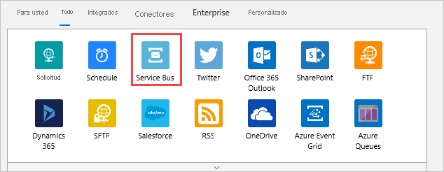
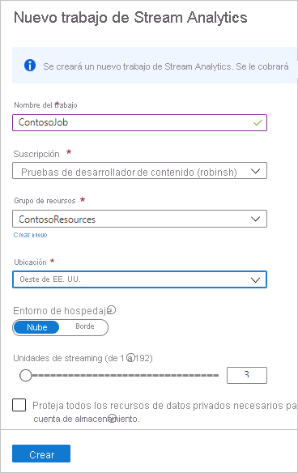
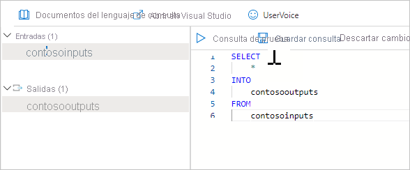

# <a name="tutorial-part-2---view-the-routed-messages"></a>Tutorial: Parte 2: Visualización de los mensajes enrutados

[!INCLUDE [iot-hub-include-routing-intro](../../includes/iot-hub-include-routing-intro.md)]

[!INCLUDE [updated-for-az](../../includes/updated-for-az.md)]

## <a name="rules-for-routing-the-messages"></a>Reglas de enrutamiento de los mensajes

Las siguientes son las reglas de enrutamiento de mensajes que se configuraron en la parte 1 de este tutorial y que se verán en funcionamiento en esta segunda parte.

|Valor |Resultado|
|------|------|
|level="storage" |Se escribe en Azure Storage.|
|level="critical" |Es escribe en una cola de Service Bus. Una aplicación lógica recupera el mensaje de 
 la cola y utiliza Office 365 para enviar por correo electrónico el mensaje.|
|default |Se muestran estos datos con Power BI.|

Ahora, cree los recursos a los que enrutar los mensajes, ejecute una aplicación para enviar los mensajes al centro y visualice el enrutamiento en acción.

## <a name="create-a-logic-app"></a>Crear una aplicación lógica  

La cola de Service Bus se debe usar para recibir los mensajes designados como críticos. Configure una aplicación lógica que supervise la cola de Service Bus y envíe un correo electrónico cuando se agregue un mensaje a la cola.

1. En [Azure Portal](https://portal.azure.com), seleccione **+ Crear un recurso**. Escriba **aplicación lógica** en el cuadro de búsqueda y seleccione Entrar. En los resultados de la búsqueda que se muestran, seleccione Logic App y seleccione **Crear** para pasar al panel **Crear aplicación lógica**. Rellene los campos.

   **Suscripción**: Seleccione su suscripción a Azure.

   **Grupo de recursos**: seleccione **Crear nuevo** en el campo Grupo de recursos. Especifique **ContosoResources** como nombre del grupo de recursos. 

   **Detalles de la instancia**
   **Tipo**: seleccione **Consumo** para el tipo de instancia. 

   En **Nombre de la aplicación lógica**, especifique el nombre de la aplicación lógica. En este tutorial se usa **ContosoLogicApp**. 

   **Región**: use la ubicación del centro de datos más cercano. En este tutorial se usa **Oeste de EE. UU.**

   **Enable Log Analytics** (Habilitar Log Analytics): establezca este botón de alternancia para no habilitar Log Analytics. 

   

   Seleccione **Revisar + crear**. Puede que la aplicación tarde unos minutos en implementarse. Cuando haya terminado, se mostrará una pantalla que proporciona información general de la implementación. 

2. Vaya a la aplicación lógica. Si todavía está en la página de implementación, puede seleccionar **Ir al recurso**. Otra manera de llegar a la aplicación lógica es seleccionar **Grupos de recursos**, seleccionar el grupo de recursos (en este tutorial se usa **ContosoResources**) y, a continuación, seleccionar la aplicación lógica en la lista de recursos. 

    Desplácese hacia abajo hasta que vea un icono casi vacío para **Aplicación lógica en blanco +** y selecciónelo. La pestaña predeterminada de la pantalla es "Para usted". Si este panel está en blanco, seleccione **Todos** para ver los conectores y desencadenadores disponibles.

3. Seleccione **Service Bus** de la lista de conectores.

   

4. En esta captura de pantalla, se muestra una lista de desencadenadores. Seleccione el que indica **Cuando se recibe un mensaje en una cola (autocompletar)** .

   

5. Rellene los campos de la pantalla siguiente con la información de conexión.

   **Nombre de la conexión**: ContosoConnection
   
   Seleccione el espacio de nombres de Service Bus. En este tutorial se usa **ContosoSBNamespace**. Se recuperan y cargan el nombre de la clave (RootManageSharedAccessKey) y los derechos (Escuchar, Administrar, Enviar). Seleccione **RootManageSharedAccessKey**. El botón **Crear** cambia a azul (activo). Selecciónelo; se mostrará la pantalla de selección de cola.  

6. A continuación, se le pedirá información sobre la cola.  

   

   **Nombre de cola:** este campo es el nombre de la cola desde la que se envía el mensaje. Haga clic en esta lista desplegable y seleccione el nombre de la cola que se estableció en los pasos de configuración. En este tutorial se usa **contososbqueue**.

   **Tipo de cola:** tipo de cola. Seleccione **Principal** en la lista desplegable.

   Tome los valores predeterminados para los demás campos. Seleccione **Guardar** para guardar la configuración del diseñador de aplicaciones lógicas.

7. Seleccione **+ Nuevo paso**. Se muestra el panel **Elegir una operación**. Seleccione **Office 365 Outlook**. En la lista, busque y seleccione **Enviar correo electrónico (V2)** . Inicie sesión en la cuenta de Office 365.   

8. Rellene los campos que se usarán al enviar un correo electrónico sobre el mensaje de la cola. 

    

   **Para:** escriba la dirección de correo electrónico donde se va a enviar la advertencia.

   **Asunto:** rellene el asunto del correo electrónico.

   **Cuerpo**: escriba algo de texto para el cuerpo. Haga clic en **Agregar contenido dinámico** para mostrar los campos que puede seleccionar para incluir en el correo electrónico. Si no ve ninguno, seleccione **Ver más** para ver más opciones. Seleccione **Contenido** para que el cuerpo del correo electrónico se muestre en el mensaje de error.

9. Haga clic en **Guardar** para guardar los cambios. Cierre el diseñador de aplicaciones lógicas. 

## <a name="set-up-azure-stream-analytics"></a>Configuración de Azure Stream Analytics

Para ver los datos en una visualización de Power BI, primero es preciso configurar un trabajo de Stream Analytics que los recupere. Recuerde que los únicos mensajes que se envían al punto de conexión predeterminado y que el trabajo de Stream Analytics recuperará para la visualización de Power BI son aquellos en que **level** está establecido en **normal**.

### <a name="create-the-stream-analytics-job"></a>Creación del trabajo de Stream Analytics

1. Escriba **trabajo** **stream** **analytics** en el cuadro de búsqueda de [Azure Portal](https://portal.azure.com) y seleccione **Entrar**. Seleccione **Crear** para llegar a la pantalla del trabajo de Stream Analytics y, a continuación, vuelva a seleccionar **Crear** para acceder a la pantalla de creación. 

2. Escriba la siguiente información para el trabajo.

   **Nombre del trabajo**: Nombre del trabajo. El nombre debe ser único globalmente. En este tutorial se usa **contosoJob**.

   **Suscripción**: la suscripción de Azure que está utilizando para este tutorial.

   **Grupo de recursos**: use el mismo grupo de recursos que IoT Hub. En este tutorial se usa **ContosoResources**.

   **Ubicación**: use la misma ubicación que en el script de instalación. En este tutorial se usa **Oeste de EE. UU.**

   

3. Seleccione **Crear** para crear el trabajo. Esto puede tardar unos minutos.

    Para volver al trabajo, seleccione **Ir al recurso**. También puede seleccionar **Grupos de recursos**. En este tutorial se usa **ContosoResources**. A continuación, seleccione el grupo de recursos y el trabajo de Stream Analytics en la lista de recursos.

### <a name="add-an-input-to-the-stream-analytics-job"></a>Adición de una entrada al trabajo de Stream Analytics

1. En **Topología de trabajo**, seleccione **Entradas**.

2. En el panel **Entradas**, seleccione **Agregar entrada de flujo** y seleccione IoT Hub. En la pantalla que aparece, rellene los campos siguientes:

   **Alias de entrada**: En este tutorial se usa **contosoinputs**.

   Seleccione **Seleccionar centro de IoT de entre las suscripciones** y, a continuación, seleccione la suscripción en la lista desplegable.
   
   **IoT Hub**: seleccione el centro de IoT. En este tutorial se usa **ContosoTestHub**.

   **Grupo de consumidores**: seleccione el grupo de consumidores que configuró en la parte 1 de este tutorial. En este tutorial se usa **contosoconsumers**.

   **Nombre de directiva de acceso compartido**: Seleccione **Servicio**. El portal rellena automáticamente el campo Clave de directiva de acceso compartido.

   **Punto de conexión**: seleccione **Mensajería**. (si selecciona Supervisión de operaciones, obtendrá los datos de telemetría de IoT Hub, en lugar de los datos que va a enviar). 

   En cuanto al resto de los campos, acepte los valores predeterminados. 

   

3. Seleccione **Guardar**.

### <a name="add-an-output-to-the-stream-analytics-job"></a>Adición de una salida al trabajo de Stream Analytics

1. En **Topología de trabajo**, seleccione **Salidas**.

2. En el panel **Salidas**, seleccione **Agregar** y **Power BI**. En la pantalla que aparece, rellene los campos siguientes:

   **Alias de salida**: el alias único para la salida. En este tutorial se usa **contosooutputs**. 

   Seleccione **Select Group workspace from your subscriptions** (Seleccionar el área de trabajo de grupo entre las suscripciones). En **Área de trabajo de grupo**, especifique **Mi área de trabajo**.

   **Modo de autenticación**: seleccione **Token de usuario**. 

   **Nombre del conjunto de datos**: nombre del conjunto de datos que se va a usar en Power BI. En este tutorial se usa **contosodataset** 

   **Nombre de la tabla**: nombre de la tabla que se va a usar en Power BI. En este tutorial se usa **contosotable**.

3. Seleccione **Autorizar** e inicie sesión en su cuenta de Power BI (El inicio de sesión puede llevar más de un intento).

   

4. Seleccione **Guardar**.

### <a name="configure-the-query-of-the-stream-analytics-job"></a>Configuración de la consulta del trabajo de Stream Analytics

1. En **Topología de trabajo**, seleccione **Consulta**.

2. Reemplace `[YourInputAlias]` por el alias de entrada del trabajo. En este tutorial se usa **contosoinputs**.

3. Reemplace `[YourOutputAlias]` por el alias de salida del trabajo. En este tutorial se usa **contosooutputs**.

   

4. Seleccione **Guardar**.

5. Cierre el panel Consulta. Volverá a la vista de recursos del grupo de recursos. Seleccione el trabajo de Stream Analytics. Este tutorial lo llama **contosoJob**.

### <a name="run-the-stream-analytics-job"></a>Ejecución del trabajo de Stream Analytics

En el trabajo de Stream Analytics, seleccione **Iniciar** > **Ahora** > **Iniciar**. Una vez que el trabajo se inicia correctamente, su estado cambia de **Detenido** a **En ejecución**.

Para configurar el informe de Power BI, necesita datos, por lo que deberá configurar Power BI después de crear el dispositivo y ejecutar la aplicación de simulación de dispositivo para generar algunos datos.

## <a name="run-simulated-device-app"></a>Ejecución de una aplicación de simulación de dispositivo

En la parte 1 de este tutorial configuró un dispositivo de simulación, para lo que usó un dispositivo IoT. Si aún no lo ha descargado, descárguelo aquí, no en la aplicación de consola de .NET que simula el dispositivo que envía mensajes del dispositivo a la nube a un centro de IoT.

Esta aplicación envía mensajes para cada uno de los distintos métodos de enrutamiento. En esa descarga hay también una carpeta que contiene la plantilla de Azure Resource Manager completa y el archivo de parámetros, así como los scripts de la CLI de Azure y PowerShell.

Si no descargó los archivos del repositorio en la parte 1 de este tutorial, hágalo ahora desde la [simulación de dispositivo IoT](https://github.com/Azure-Samples/azure-iot-samples-csharp/archive/main.zip). Al seleccionar este vínculo se descarga un repositorio que contiene varias aplicaciones; la solución que busca está en iot-hub/Tutorials/Routing/IoT_SimulatedDevice.sln. 

Haga doble clic en el archivo de la solución (IoT_SimulatedDevice.sln) para abrir el código en Visual Studio y abra Program.cs. Sustituya `{your hub name}` por el nombre de host de IoT Hub. El formato del nombre de host de IoT Hub es **{nombre de iot hub} .azure-devices.net**. Para este tutorial, el nombre de host del centro es **ContosoTestHub.azure devices.net**. A continuación, sustituya `{your device key}` por la clave de dispositivo que guardó anteriormente al configurar el dispositivo simulado. 

   ```csharp
        static string s_myDeviceId = "Contoso-Test-Device";
        static string s_iotHubUri = "ContosoTestHub.azure-devices.net";
        // This is the primary key for the device. This is in the portal. 
        // Find your IoT hub in the portal > IoT devices > select your device > copy the key. 
        static string s_deviceKey = "{your device key}";
   ```

## <a name="run-and-test"></a>Ejecución y prueba

Ejecución de la aplicación de consola. Espere unos minutos. Puede ver los mensajes que se envían en la pantalla de la consola de la aplicación.

La aplicación envía un nuevo mensaje de dispositivo a nube a IoT Hub cada segundo. El mensaje contiene un objeto serializado mediante JSON serializado con el identificador de dispositivo, la temperatura, la humedad y el nivel de mensaje, cuyo valor predeterminado es `normal`. Asigna de forma aleatoria un nivel de `critical` o `storage`, lo que hace que el mensaje se enrute a la cuenta de almacenamiento o a la cola de Service Bus (lo que desencadena que la aplicación lógica envíe un correo electrónico). Las lecturas predeterminadas (`normal`) se pueden mostrar en un informe de Power BI. 

Si todo está configurado correctamente, debería verá los siguientes resultados:

1. Empieza a recibir correos electrónicos acerca de mensajes críticos.

   

   Este resultado significa que las instrucciones siguientes son reales. 

   * El enrutamiento a la cola de Service Bus funciona correctamente.
   * La aplicación lógica que recupera el mensaje de la cola de Service Bus funciona correctamente.
   * El conector de aplicación lógica con Outlook funciona correctamente. 

2. En [Azure Portal](https://portal.azure.com), seleccione **Grupos de recursos** y un grupo de recursos. En este tutorial se usa **ContosoResources**. 

    Seleccione la cuenta de almacenamiento, seleccione **Contenedores** y, a continuación, el contenedor que almacena los resultados. En este tutorial se usa **contosoresults**. Debe ver una carpeta y puede explorar en profundidad los directorios hasta que vea uno o varios archivos. Abra cualquiera de ellos; contienen las entradas enrutadas a la cuenta de almacenamiento. 

   

Este resultado significa que la instrucción siguiente es real.

   * El enrutamiento a la cuenta de almacenamiento funciona correctamente.

Con la aplicación en ejecución, configure la visualización de Power BI para ver los mensajes que proceden del punto de conexión predeterminado.

## <a name="set-up-the-power-bi-visualizations"></a>Configuración de las visualizaciones de Power BI

1. Inicie sesión en su cuenta de [Power BI](https://powerbi.microsoft.com/).

2. Seleccione **Mi área de trabajo**. Se mostrará al menos un conjunto de datos que se ha creado. Si no aparece nada, ejecute la aplicación **Dispositivo simulado** durante otros 5 a 10 minutos para transmitir más datos. Una vez que aparezca el área de trabajo, tendrá un conjunto de datos llamado ContosoDataset. Haga clic con el botón derecho en los tres puntos verticales situados a la derecha del nombre del conjunto de datos. En la lista desplegable, seleccione **Crear informe**.

     

3. Busque en la sección **Visualizaciones** del lado derecho y seleccione **Gráfico de líneas** para seleccionar un gráfico de líneas en la página del informe de Power BI. Arrastre el gráfico para rellenar el espacio horizontalmente. Ahora, en la sección **Campos** de la derecha, abra ContosoTable. Seleccione **EventEnqueuedUtcTime**. Debe colocarse en el eje X. Seleccione **temperatura** y arrástrelo al campo **Valores** para temperatura. Esto agrega la temperatura al gráfico. Debe tener algo similar al siguiente gráfico:

     

4. Haga clic en la mitad inferior del área del gráfico. Vuelva a seleccionar **Gráfico de líneas**. Se crea un gráfico bajo el primero.

5. En la tabla, seleccione **EventQueuedTime** y se colocará en el campo Eje. Arrastre **humedad** al campo Valores. Ahora verá ambos gráficos.

     

   Ha enviado mensajes desde el punto de conexión predeterminado de IoT Hub a Azure Stream Analytics. A continuación, ha agregado un informe de Power BI para mostrar los datos, agregando dos gráficos para representar la temperatura y la humedad. 

7. Para guardar el informe, seleccione **Archivo > Guardar** y escriba un nombre para el informe cuando se le solicite. Guarde el informe en el área de trabajo.

Debería poder ver datos en ambos gráficos. Este resultado significa que las instrucciones siguientes son reales:

   * El enrutamiento al punto de conexión predeterminado funciona correctamente.
   * El trabajo de Azure Stream Analytics se transmite correctamente.
   * La visualización de Power BI está configurada correctamente.

Puede actualizar los gráficos para ver los datos más recientes. Para ello, debe seleccionar el botón Actualizar, que se encuentra en la parte superior de la ventana de Power BI. 

## <a name="clean-up-resources"></a>Limpieza de recursos 

Si desea quitar todos los recursos de Azure que ha creado en las dos partes de este tutorial, elimine el grupo de recursos. Esta acción elimina también todos los recursos del grupo. En este caso, quita la instancia de IoT Hub, el espacio de nombres y la cola de Service Bus, la aplicación lógica, la cuenta de almacenamiento y el propio grupo de recursos. También puede eliminar los recursos de Power BI y borrar los mensajes de correo electrónico enviados durante el tutorial.

### <a name="clean-up-resources-in-the-power-bi-visualization"></a>Limpieza de recursos en la visualización de Power BI

Inicie sesión en su cuenta de [Power BI](https://powerbi.microsoft.com/). Vaya a su área de trabajo. En este tutorial se usa **My Workspace**. Para quitar la visualización de Power BI, vaya a Conjuntos de datos y seleccione el icono de la papelera para eliminarlo. En este tutorial se usa **contosodataset** Al quitar el conjunto de datos, se quita también el informe.

### <a name="use-the-azure-cli-to-clean-up-resources"></a>Uso de la CLI de Azure para quitar recursos

Para quitar el grupo de recursos, use el comando [az group delete](/cli/azure/group#az_group_delete). `$resourceGroup` se estableció en **ContosoResources** al principio de este tutorial.

```azurecli-interactive
az group delete --name $resourceGroup
```

### <a name="use-powershell-to-clean-up-resources"></a>Uso de PowerShell para quitar recursos

Para quitar el grupo de recursos, use el comando [Remove-AzResourceGroup](/powershell/module/az.resources/remove-azresourcegroup). `$resourceGroup` se estableció en **ContosoResources** al principio de este tutorial.

```azurepowershell-interactive
Remove-AzResourceGroup -Name $resourceGroup
```

### <a name="clean-up-test-emails"></a>Limpieza de correos electrónicos de prueba

También puede que desee eliminar los correos electrónicos de la bandeja de entrada que se generaron mediante la aplicación lógica mientras se ejecutaba la aplicación de dispositivo.

## <a name="next-steps"></a>Pasos siguientes

En este tutorial de dos partes, ha aprendido a utilizar el enrutamiento de mensajes para enrutar los mensajes de IoT Hub a diferentes destinos mediante la realización de las siguientes tareas.  

**Parte I: Creación de recursos, configuración del enrutamiento de mensajes**
> [!div class="checklist"]
> * Creación de los recursos: un centro de IoT, una cuenta de almacenamiento, una cola de Service Bus y un dispositivo simulado.
> * Configure los puntos de conexión y las rutas de los mensajes en IoT Hub para la cuenta de almacenamiento y la cola de Service Bus.

**Parte II: Envío de mensajes al centro, visualización de los resultados del enrutamiento**
> [!div class="checklist"]
> * Crear una aplicación lógica que se desencadena y se envía un correo electrónico cuando se agrega un mensaje a la cola de Service Bus.
> * Descargar y ejecutar una aplicación que simule que un dispositivo IoT envía mensajes al centro para las diferentes opciones de enrutamiento.
>
> * Crear una visualización de Power BI para los datos enviados al punto de conexión predeterminado.
>
> * Vea los resultados...
> * ... en la cola de Service Bus y en los mensajes de correo electrónico.
> * ... en la cuenta de almacenamiento.
> * ... en la visualización de Power BI.


En el siguiente tutorial aprender a administrar el estado de un dispositivo IoT. 

> [!div class="nextstepaction"]
> [Configuración y uso de métricas y diagnósticos con un centro de IoT](tutorial-use-metrics-and-diags.md)
