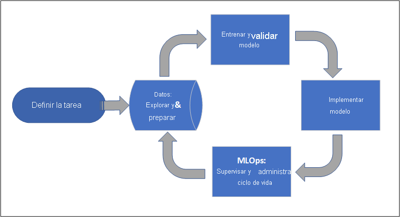
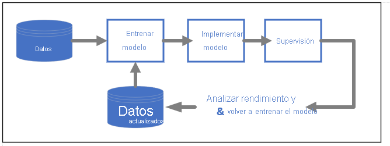

# ¿Qué es Azure Machine Learning?

Azure Machine Learning es un servicio en la nube que permite acelerar y administrar el ciclo de vida de los proyectos de aprendizaje automático. Los profesionales de aprendizaje automático, científicos de datos e ingenieros pueden usarlo en sus flujos de trabajo diarios: entrenamiento e implementación de modelos y administración de MLOps.

Puede crear un modelo en Azure Machine Learning o usar un modelo creado a partir de una plataforma de código abierto, como Pytorch, TensorFlow o Scikit-learn. Las herramientas de MLOps le ayudan a supervisar, volver a entrenar y volver a implementar modelos. 

> [!Tip]
> **Evaluación gratuita**  Si no tiene una suscripción a Azure, cree una cuenta gratuita antes de empezar. [Pruebe la versión gratuita o de pago de Azure Machine Learning](https://azure.microsoft.com/free/machine-learning/search/). Puede obtener créditos para gastarlos en servicios de Azure. Después de que se agoten los créditos, puede mantener la cuenta y usar los [servicios gratuitos de Azure](https://azure.microsoft.com/free/). No se le realizará ningún cargo en su tarjeta de crédito a menos que cambie explícitamente la configuración y lo solicite.

## ¿Para quién es Azure Machine Learning?

Azure Machine Learning es para individuos y equipos que implementan MLOps dentro de su organización para que los modelos de aprendizaje automático entren en producción en un entorno de producción seguro y auditable.

Los científicos de datos y los ingenieros de ML encontrarán herramientas para acelerar y automatizar sus flujos de trabajo diarios. Los desarrolladores de aplicaciones encontrarán herramientas para integrar modelos en aplicaciones o servicios. Los desarrolladores de plataformas encontrarán un sólido conjunto de herramientas, respaldado con API duraderas de Azure Resource Manager, para crear herramientas de ML avanzadas.

Las empresas que trabajan en la nube de Microsoft Azure encontrarán una seguridad conocida y el control de acceso basado en rol (RBAC) para la infraestructura. Puede configurar un proyecto para denegar el acceso a los datos protegidos y seleccionar operaciones.

### Colaboración para equipos de aprendizaje automático

A menudo, los proyectos de aprendizaje automático requieren un equipo con conjuntos de aptitudes variados para la creación y el mantenimiento. Azure Machine Learning cuenta con herramientas que permiten la colaboración, como:

- Cuadernos compartidos, recursos de proceso, datos y entornos
- Seguimiento y capacidad de auditoría que muestra quién realizó cambios y cuándo
- Control de versiones de recursos

### Herramientas para desarrolladores

Los desarrolladores encuentran interfaces conocidas en Azure Machine Learning, como las siguientes:

- [SDK de Python](/python/api/overview/azure/ml/)
- [API REST de Azure Resource Manager](/rest/api/azureml/)
- [Versión 2 de la CLI (versión preliminar)](/cli/azure/ml)

### Interfaz de usuario del Estudio 

[Estudio de Azure Machine Learning](https://ml.azure.com) es una interfaz gráfica de usuario para un área de trabajo del proyecto. En el Estudio, puede hacer lo siguiente:

- Ver ejecuciones, métricas, registros, salidas, etc.
- Crear y editar cuadernos y archivos.
- Administrar recursos comunes, como:
    - Credenciales de datos
    - Proceso
    - Entornos
- Visualizar las métricas de ejecución, los resultados y los informes.
- Visualice las canalizaciones creadas a través de interfaces de desarrollador.
- Crear trabajos de AutoML.

Además, el diseñador tiene una interfaz de arrastrar y colocar en la que puede entrenar e implementar modelos. 

Si es usuario de Estudio de ML (clásico), [obtenga información sobre el desuso de Estudio (clásico) y la diferencia entre él y Estudio de Azure Machine Learning](overview-what-is-machine-learning-studio.md#ml-studio-classic-vs-azure-machine-learning-studio).

## Preparación y seguridad para empresas

Azure Machine Learning se integra con la plataforma en la nube de Azure para agregar seguridad a los proyectos de ML. 

Las integraciones de seguridad incluyen:

- Redes virtuales de Azure con grupos de seguridad de red 
- Azure Key Vault, donde puede guardar secretos de seguridad, como la información de acceso de las cuentas de almacenamiento
- La configuración de Azure Container Registry subyacente de una red virtual

Consulte [Tutorial: Configuración de un área de trabajo segura](tutorial-create-secure-workspace.md).

## Integraciones de Azure para soluciones completas

Otras integraciones con los servicios de Azure admiten un proyecto de aprendizaje automático integral. Entre ellas, las siguientes:

- Azure Synapse Analytics para procesar y transmitir datos con Spark
- Azure Arc, donde puede ejecutar servicios de Azure en un entorno de Kubernetes
- Opciones de almacenamiento y bases de datos, como Azure SQL Database, Azure Storage blobs, etc.
- Azure App Service, que le permite implementar y administrar aplicaciones con tecnología de ML

## Flujo de trabajo del proyecto de aprendizaje automático

Normalmente, los modelos se desarrollan como parte de un proyecto con varios objetivos. Los proyectos suelen implicar a más de una persona. Al experimentar con datos, algoritmos y modelos, el desarrollo es iterativo. 

### Ciclo de vida del proyecto

Aunque el ciclo de vida del proyecto puede variar según el proyecto, a menudo tendrá el aspecto siguiente:

Un área de trabajo organiza un proyecto y permite la colaboración para muchos usuarios que trabajan con un objetivo común. Los usuarios de un área de trabajo pueden compartir fácilmente los resultados de sus ejecuciones de experimentación en la interfaz de usuario del Estudio o usar recursos con versiones para trabajos como entornos y referencias de almacenamiento.

Para obtener más información, consulte [Administrar áreas de trabajo de Azure Machine Learning](how-to-manage-workspace.md?tabs=python).

Cuando un proyecto está listo para ponerse en marcha, el trabajo de los usuarios se puede automatizar en una canalización de aprendizaje automático y desencadenarse según una programación o una solicitud HTTPS.

Los modelos pueden implementarse en la solución de inferencia administrada, tanto en tiempo real como por lotes, lo que simplifica la administración de la infraestructura que suele ser necesaria para implementar los modelos.

## Entrenamiento de modelos

En Azure Machine Learning, puede ejecutar el script de entrenamiento en la nube o crear un modelo desde cero. A menudo, los clientes incorporan modelos que han creado y entrenado en marcos de código abierto, a fin de ponerlos en marcha en la nube. 

### Abierto e interoperable

Los científicos de datos pueden usar modelos en Azure Machine Learning que han creado en marcos comunes de Python, como: 

- PyTorch
- TensorFlow
- scikit-learn
- XGBoost
- LightGBM

También se admiten otros lenguajes y marcos, como: 
- R
- .NET

Consulte [Integración de código abierto con Azure Machine Learning](concept-open-source.md).

### Caracterización automatizada y selección de algoritmos (AutoML)

En un proceso repetitivo y lento, los científicos de datos usan la experiencia previa y la intuición en el aprendizaje automático clásico para seleccionar el algoritmo y la caracterización de datos adecuados para el entrenamiento. Automated ML (AutoML) acelera este proceso y se puede usar a través de la interfaz de usuario del Estudio o el SDK de Python.

Consulte [¿Qué es el aprendizaje automático automatizado?](concept-automated-ml.md).

### Optimización de hiperparámetros

La optimización de los hiperparámetros, o el ajuste de los hiperparámetros, puede ser una tarea tediosa. Azure Machine Learning puede automatizar esta tarea para los comandos con parámetros arbitrarios con poca modificación en la definición de trabajo. Los resultados se visualizan en el Estudio.

Consulte [Ajuste de los hiperparámetros](how-to-tune-hyperparameters.md).

### Entrenamiento distribuido de varios nodos

La eficacia del entrenamiento para el aprendizaje profundo y, en ocasiones, los trabajos de aprendizaje automático clásicos se pueden mejorar considerablemente a través del entrenamiento distribuido de varios nodos. Los clústeres de proceso de Azure Machine Learning ofrecen las opciones de GPU más recientes.

Son compatibles mediante Kubernetes conectado con Azure Arc (versión preliminar) y los clústeres de proceso de Azure ML:

- PyTorch
- TensorFlow
- MPI

La distribución de MPI se puede usar para Horovod o una lógica personalizada de varios nodos. Además, Apache Spark se admite a través de clústeres de Spark de Azure Synapse Analytics (versión preliminar).

Consulte [Entrenamiento distribuido con Azure Machine Learning](concept-distributed-training.md).

### Entrenamiento perfectamente paralelo

El escalado de un proyecto de aprendizaje automático puede requerir el escalado del entrenamiento de modelos perfectamente paralelos. Este patrón es común en escenarios como la previsión de demanda, donde se puede entrenar un modelo para muchos almacenes.

## Implementación de modelos

Para poner un modelo en producción, este se implementa. Los puntos de conexión administrados de Azure Machine Learning abstraen la infraestructura necesaria para la puntuación de modelos por lotes o en tiempo real (en línea) (inferencia).

### Puntuación por lotes y en tiempo real (inferencia)

La *puntuación por lotes* o la *inferencia por lotes* implica invocar un punto de conexión con una referencia a los datos. El punto de conexión por lotes ejecuta trabajos de forma asincrónica para procesar datos en paralelo en clústeres de proceso y almacenarlos para su posterior análisis.

La *puntuación en tiempo real*, o la *inferencia en línea*, consiste en invocar un punto de conexión con una o más implementaciones de modelos y recibir una respuesta en tiempo casi real a través de HTTP. El tráfico se puede dividir en varias implementaciones, lo que permite probar nuevas versiones del modelo, desviar inicialmente cierta cantidad de tráfico y aumentarlo una vez se establece la confianza en el nuevo modelo.    

Vea:
 - [Implementación de un modelo con un punto de conexión administrado en tiempo real](how-to-deploy-managed-online-endpoints.md)
 - [Uso de puntos de conexión por lotes para la puntuación](how-to-use-batch-endpoint.md) 

## MLOps: DevOps para aprendizaje automático 

DevOps para modelos de aprendizaje automático, a menudo denominados MLOps, es un proceso para desarrollar modelos para la fase de producción. El ciclo de vida de un modelo desde el entrenamiento hasta la implementación debe ser auditable si no se puede reproducir.

### Ciclo de vida del modelo de ML 

Obtenga más información sobre [MLOps en Azure Machine Learning](concept-model-management-and-deployment.md).

### Integraciones que habilitan MLOP

Azure Machine Learning se ha creado teniendo en cuenta el ciclo de vida de los modelos. Incluso puede auditar una confirmación y un entorno específicos del ciclo de vida de los modelos. 

Algunas características clave que habilitan MLOps incluyen:

- Integración de `git`
- Integración de MLflow
- Programación de la canalización de aprendizaje automático
- Integración de Azure Event Grid para desencadenadores personalizados
- Facilidad de uso con herramientas CI/CD, como Acciones de GitHub o Azure DevOps

Además, Azure Machine Learning incluye características para la supervisión y auditoría:
- Artefactos de trabajo, como instantáneas de código, registros y otras salidas
- Linaje entre trabajos y recursos, como contenedores, datos y recursos de proceso

## Pasos siguientes

Empiece a usar Azure Machine Learning:
- [Configuración de un área de trabajo de Azure Machine Learning](quickstart-create-resources.md)
- [Tutorial: Compilación de un primer proyecto de aprendizaje automático](tutorial-1st-experiment-hello-world.md)
- [Versión preliminar: Ejecución de trabajos de entrenamiento de modelos con la versión 2 de la CLI](how-to-train-cli.md)
