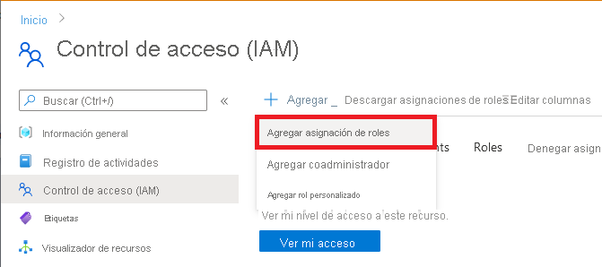

# <a name="how-to-create-a-secure-workspace"></a>Procedimiento para crear un área de trabajo segura

En este artículo, aprenderá a crear y un área de trabajo de Azure Machine Learning segura y a conectarse a ella. Las áreas de trabajo seguras usan Azure Virtual Network para crear un límite de seguridad en torno a los recursos usados por Azure Machine Learning. 

En este tutorial, realizará las siguientes tareas:

> [!div class="checklist"]
> * Cree una instancia de Azure Virtual Network (VNet) para __proteger las comunicaciones entre los servicios de la red virtual__.
> * Crear una cuenta de Azure Storage (blob y archivo) detrás de la red virtual. Este servicio se usa como __almacenamiento predeterminado para el área de trabajo__.
> * Crear una instancia de Azure Key Vault detrás de la red virtual. Este servicio se usa para __almacenar los secretos que usa el área de trabajo__. Por ejemplo, la información de seguridad necesaria para acceder a la cuenta de almacenamiento.
> * Crear una instancia de Azure Container Registry (ACR). Este servicio se usa como repositorio para imágenes de Docker. Las __imágenes de Docker proporcionan los entornos de proceso necesarios al entrenar un modelo de Machine Learning o implementar un modelo entrenado como punto de conexión__.
> * Crear un área de trabajo de Azure Machine Learning.
> * Crear un jumpbox. Un jumpbox es una máquina virtual de Azure que está detrás de la red virtual. Como la red virtual restringe el acceso desde la red pública de Internet, __el jumpbox se usa como una manera de conectarse a los recursos detrás de la red virtual__.
> * Configurar Estudio de Azure Machine Learning para que funcione detrás de una red virtual. Estudio proporciona una __interfaz web para Azure Machine Learning__.
> * Creará un clúster de proceso de Azure Machine Learning. Los clústeres de proceso se usan al __entrenar modelos de Machine Learning en la nube__. En aquellas configuraciones en que Azure Container Registry está detrás de la red virtual, también se usa para compilar imágenes de Docker.
> * Conectarse al jumpbox y usar Estudio de Azure Machine Learning.

Si su entorno cumple los requisitos previos y está familiarizado con el uso de plantillas de Resource Manager, los cinco primeros pasos de este tutorial también se pueden completar seleccionando el botón "Implementar en Azure". Puede continuar leyendo en la sección sobre cómo [conectar al área de trabajo](#connect-to-the-workspace).

[](https://portal.azure.com/#create/Microsoft.Template/uri/https%3A%2F%2Fraw.githubusercontent.com%2FAzure%2Fazure-quickstart-templates%2Fmaster%2Fquickstarts%2Fmicrosoft.machinelearningservices%2Fmachine-learning-advanced%2Fazuredeploy.json)
[](https://portal.azure.us/#create/Microsoft.Template/uri/https%3A%2F%2Fraw.githubusercontent.com%2FAzure%2Fazure-quickstart-templates%2Fmaster%2Fquickstarts%2Fmicrosoft.machinelearningservices%2Fmachine-learning-advanced%2Fazuredeploy.json)

## <a name="prerequisites"></a>Requisitos previos

* Familiaridad con redes virtuales de Azure y redes IP
* Aunque en la mayoría de los pasos de este artículo se usan Azure Portal o Estudio de Azure Machine Learning, en algunos se utiliza la extensión CLI de Azure para Machine Learning.

## <a name="create-a-virtual-network"></a>Creación de una red virtual

Para crear un cliente de red virtual, siga estos pasos:

1. En [Azure Portal](https://portal.azure.com), seleccione el menú del portal de la parte superior izquierda. En dicho menú, seleccione __+ Crear un recurso__ y escriba __Virtual Network__ en el cuadro de búsqueda. Seleccione la entrada __Virtual Network__ y, después, seleccione __Crear__.


    :::image type="content" source="./media/tutorial-create-secure-workspace/create-resource-search-vnet.png" alt-text="La búsqueda de la interfaz de usuario de creación de un recurso":::

    :::image type="content" source="./media/tutorial-create-secure-workspace/create-resource-vnet.png" alt-text="Creación de una red virtual":::

1. En la sección __Datos básicos__, seleccione la __suscripción__ de Azure que se usará para este recurso y, después, seleccione o cree un __grupo de recursos__. En __Detalles de instancia__, escriba un __nombre__ descriptivo para la red virtual y seleccione la __región__ en la que desea crearla.

    :::image type="content" source="./media/tutorial-create-secure-workspace/create-vnet-basics.png" alt-text="Imagen de la configuración de red virtual básica":::

1. Seleccione la pestaña __Direcciones IP__. La configuración predeterminada debe ser similar a la siguiente imagen:

    :::image type="content" source="./media/tutorial-create-secure-workspace/create-vnet-ip-address-default.png" alt-text="Pantalla Dirección IP predeterminada":::

    Siga estos pasos para configurar tanto la dirección IP como una subred para los recursos de entrenamiento y puntuación:

    > [!TIP]
    > Aunque puede usar una sola subred para todos los recursos de Azure ML, en los pasos de este artículo se muestra cómo crear dos subredes para separar los recursos de entrenamiento y puntuación.
    >
    > El área de trabajo y otros servicios de dependencia irán a la subred de entrenamiento. Los recursos de otras subredes, como la subred de puntuación, los pueden seguir utilizando.

    1. Fíjese en el valor predeterminado de __Espacio de direcciones IPv4__. En la captura de pantalla, el valor es __172.17.0.0/16__. __El valor puede ser diferente en su caso__. Aunque puede usar otro valor, el resto de los pasos de este tutorial se basan en el valor 172.17.0.0/16.
    1. Seleccione la subred __predeterminada__ y, después, seleccione __Quitar la subred__.
    
        :::image type="content" source="./media/tutorial-create-secure-workspace/delete-default-subnet.png" alt-text="Captura de pantalla de la eliminación de la subred predeterminada":::

    1. Para crear una subred que contenga el área de trabajo, los servicios de dependencia y los recursos usados para el entrenamiento, seleccione __+ Agregar subred__ y use los siguientes valores para la subred:
        * __Nombre de subred__: Entrenamiento
        * __Intervalo de direcciones de la subred__: 172.17.0.0/24
        * __Servicios__: seleccione los siguientes servicios:
            * __Microsoft.Storage__
            * __Microsoft.KeyVault__
            * __Microsoft.ContainerRegistry__

        :::image type="content" source="./media/tutorial-create-secure-workspace/vnet-add-training-subnet.png" alt-text="Captura de pantalla de la subred Entrenamiento":::

    1. Para crear una subred para los recursos de proceso que se usan para puntuar los modelos, seleccione __+ Agregar subred__ de nuevo y use los valores siguientes:
        * __Nombre de subred:__ Puntuación
        * Intervalo de direcciones de subred __: 172.17.1.0/24__
        * __Servicios__: seleccione los siguientes servicios:
            * __Microsoft.Storage__
            * __Microsoft.KeyVault__
            * __Microsoft.ContainerRegistry__

        :::image type="content" source="./media/tutorial-create-secure-workspace/vnet-add-scoring-subnet.png" alt-text="Captura de pantalla de la subred Puntuación":::

1. Seleccione __Seguridad__. En __BastionHost__, seleccione __Habilitar__. [Azure Bastion](../bastion/bastion-overview.md) proporciona una manera segura de acceder al jumpbox de máquina virtual que creará dentro de la red virtual en un paso posterior. Use los valores siguientes para los campos restantes:

    * __Nombre del bastión__: un nombre único para esta instancia de Bastion
    * __Espacio de AzureBastionSubnetAddress__: 172.17.2.0/27
    * __Dirección IP pública__: cree una dirección IP pública.

    Deje los demás campos con los valores predeterminados.

    :::image type="content" source="./media/tutorial-create-secure-workspace/create-bastion.png" alt-text="Captura de pantalla de la configuración de Azure Bastion":::

1. Seleccione __Revisar + crear__.

    :::image type="content" source="./media/tutorial-create-secure-workspace/create-vnet-ip-address-final.png" alt-text="Captura de pantalla en la que se muestra el botón Revisar y crear":::

1. Compruebe que la información es correcta y seleccione __Crear__.

    :::image type="content" source="./media/tutorial-create-secure-workspace/create-vnet-review.png" alt-text="Captura de pantalla de la página de revisión":::

## <a name="create-a-storage-account"></a>Crear una cuenta de almacenamiento

1. En [Azure Portal](https://portal.azure.com), seleccione el menú del portal de la parte superior izquierda. En el menú, seleccione __+Crear un recurso__ y, después, escriba __Storage account__. Seleccione la entrada __Storage account__ y, después, seleccione __Crear__.
1. En la pestaña __Datos básicos__, seleccione la __suscripción__, el __grupo de recursos__ y la __región__ que usó anteriormente para la red virtual. Escriba un valor único en __Nombre de la cuenta de almacenamiento__ y en __Redundancia__, seleccione __Almacenamiento con redundancia local (LRS)__ .

    :::image type="content" source="./media/tutorial-create-secure-workspace/create-storage.png" alt-text="Imagen de la configuración básica de la cuenta de almacenamiento":::

1. En la pestaña __Redes__, seleccione __Punto de conexión privado__ y, después, seleccione __+ Agregar punto de conexión privado__.

    :::image type="content" source="./media/tutorial-create-secure-workspace/storage-enable-private-endpoint.png" alt-text="Interfaz de usuario para agregar la red privada de blobs":::

1. En el formulario __Crear punto de conexión privado__, use los siguientes valores:
    * __Suscripción__: la misma suscripción de Azure que contiene los recursos anteriores que ha creado.
    * __Grupo de recursos__: el mismo grupo de recursos de Azure que contiene los recursos anteriores que ha creado.
    * __Ubicación__: la misma región de Azure que contiene los recursos anteriores que ha creado.
    * __Nombre__: un nombre único para este punto de conexión privado.
    * __Subrecurso de destino__: blob.
    * __Red virtual__: la red virtual que creó anteriormente.
    * __Subred__: Entrenamiento (172.17.0.0/24).
    * __Integración de DNS privado__: sí
    * __Zona DNS privada__: privatelink.blob.core.windows.net.

    Seleccione __Aceptar__ para crear el punto de conexión privado.

1. Seleccione __Revisar + crear__. Compruebe que la información es correcta y seleccione __Crear__.

1. Una vez que se haya creado la cuenta de almacenamiento, seleccione __Ir al recurso__:

    :::image type="content" source="./media/tutorial-create-secure-workspace/storage-go-to-resource.png" alt-text="Ir al nuevo recurso de almacenamiento":::

1. En el menú de navegación izquierdo, seleccione __Redes__, la pestaña __Conexiones de punto de conexión privado__ y, después, __+ Punto de conexión privado__:

    > [!NOTE]
    > Aunque ha creado un punto de conexión privado para Blob Storage en los pasos anteriores, también debe crear uno para File Storage.

    :::image type="content" source="./media/tutorial-create-secure-workspace/storage-file-networking.png" alt-text="Interfaz de usuario para redes de cuentas de almacenamiento":::

1. En el formulario __Crear un punto de conexión privado__, use la misma __subscripción__, __grupo de recursos__ y __región__ que ha usado para los recursos anteriores. Escriba un valor único en el campo __Nombre__.

    :::image type="content" source="./media/tutorial-create-secure-workspace/storage-file-private-endpoint.png" alt-text="Interfaz de usuario para agregar el punto de conexión privado de archivo":::

1. Seleccione __Siguiente: Recurso__ y, después, establezca __Subrecurso de destino__ en __archivo__.

    :::image type="content" source="./media/tutorial-create-secure-workspace/storage-file-private-endpoint-resource.png" alt-text="Agregar el subrecurso de 'archivo'":::

1. Seleccione __Siguiente: Configuración__ y use los valores siguientes:
    * __Red virtual__: la red virtual que ha creado antes.
    * __Subred__: Entrenamiento.
    * __Integrar con la zona DNS privada__: sí
    * __Zona DNS privada__: privatelink.file.core.windows.net.

    :::image type="content" source="./media/tutorial-create-secure-workspace/storage-file-private-endpoint-config.png" alt-text="Interfaz de usuario para configurar el punto de conexión privado de archivo":::

1. Seleccione __Revisar + crear__. Compruebe que la información es correcta y seleccione __Crear__.

## <a name="create-a-key-vault"></a>Creación de un Almacén de claves

1. En [Azure Portal](https://portal.azure.com), seleccione el menú del portal de la parte superior izquierda. En el menú, seleccione __+Crear un recurso__ y, después, escriba __Key Vault__. Seleccione la entrada __Key Vault__ y, después, seleccione __Crear__.
1. En la pestaña __Datos básicos__, seleccione la __suscripción__, el __grupo de recursos__ y la __región__ que usó anteriormente para la red virtual. Escriba un valor único en __Nombre de Key Vault__. Deje los demás campos con los valores predeterminados.

    :::image type="content" source="./media/tutorial-create-secure-workspace/create-key-vault.png" alt-text="Crear un almacén de claves":::.

1. En la pestaña __Redes__, seleccione __Punto de conexión privado__ y, después, seleccione __+ Agregar__.

    :::image type="content" source="./media/tutorial-create-secure-workspace/key-vault-networking.png" alt-text="Redes del almacén de claves":::

1. En el formulario __Crear punto de conexión privado__, use los siguientes valores:
    * __Suscripción__: la misma suscripción de Azure que contiene los recursos anteriores que ha creado.
    * __Grupo de recursos__: el mismo grupo de recursos de Azure que contiene los recursos anteriores que ha creado.
    * __Ubicación__: la misma región de Azure que contiene los recursos anteriores que ha creado.
    * __Nombre__: un nombre único para este punto de conexión privado.
    * __Subrecurso de destino__: almacén.
    * __Red virtual__: la red virtual que creó anteriormente.
    * __Subred__: Entrenamiento (172.17.0.0/24).
    * __Integración de DNS privado__: sí
    * __Zona DNS privada__: privatelink.vaultcore.azure.net

    Seleccione __Aceptar__ para crear el punto de conexión privado.

    :::image type="content" source="./media/tutorial-create-secure-workspace/key-vault-private-endpoint.png" alt-text="Configurar un punto de conexión privado del almacén de claves":::

1. Seleccione __Revisar + crear__. Compruebe que la información es correcta y seleccione __Crear__.

## <a name="create-a-container-registry"></a>Creación de un registro de contenedor

1. En [Azure Portal](https://portal.azure.com), seleccione el menú del portal de la parte superior izquierda. En el menú, seleccione __+Crear un recurso__ y, después, escriba __Container Registry__. Seleccione a entrada __Container Registry__ y, después, seleccione __Crear__.
1. En la pestaña __Datos básicos__, seleccione la __suscripción__, el __grupo de recursos__ y la __ubicación__ que usó anteriormente para la red virtual. Escriba un valor único en __Nombre de registro__ y en __SKU__ seleccione __Prémium__.

    :::image type="content" source="./media/tutorial-create-secure-workspace/create-container-registry.png" alt-text="Creación de un registro de contenedor":::

1. En la pestaña __Redes__, seleccione __Punto de conexión privado__ y, después, seleccione __+ Agregar__.

    :::image type="content" source="./media/tutorial-create-secure-workspace/container-registry-networking.png" alt-text="Redes de Container Registry":::

1. En el formulario __Crear punto de conexión privado__, use los siguientes valores:
    * __Suscripción__: la misma suscripción de Azure que contiene los recursos anteriores que ha creado.
    * __Grupo de recursos__: el mismo grupo de recursos de Azure que contiene los recursos anteriores que ha creado.
    * __Ubicación__: la misma región de Azure que contiene los recursos anteriores que ha creado.
    * __Nombre__: un nombre único para este punto de conexión privado.
    * __Subrecurso de destino__: registro.
    * __Red virtual__: la red virtual que creó anteriormente.
    * __Subred__: Entrenamiento (172.17.0.0/24).
    * __Integración de DNS privado__: sí
    * __Zona DNS privada__: privatelink.azurecr.io

    Seleccione __Aceptar__ para crear el punto de conexión privado.

    :::image type="content" source="./media/tutorial-create-secure-workspace/container-registry-private-endpoint.png" alt-text="Configurar un punto de conexión privado del registro de contenedor":::

1. Seleccione __Revisar + crear__. Compruebe que la información es correcta y seleccione __Crear__.
1. Tras crear el registro de contenedor, seleccione __Ir al recurso__.

    :::image type="content" source="./media/tutorial-create-secure-workspace/container-registry-go-to-resource.png" alt-text="Seleccionar &quot;Ir al recurso&quot;":::

1. En la izquierda de la página, seleccione __Claves de acceso__ y, después, habilite __Usuario administrador__. Esta configuración es necesaria cuando se usa Azure Container Registry dentro de una red virtual con Azure Machine Learning.

    :::image type="content" source="./media/tutorial-create-secure-workspace/container-registry-admin-user.png" alt-text="Captura de pantalla del botón de alternancia del usuario administrador":::

## <a name="create-a-workspace"></a>Crear un área de trabajo

1. En [Azure Portal](https://portal.azure.com), seleccione el menú del portal de la parte superior izquierda. En el menú, seleccione __+Crear un recurso__ y, después, escriba __Machine Learning__. Seleccione la entrada __Machine Learning__ y, después, seleccione __Crear__.

    :::image type="content" source="./media/tutorial-create-secure-workspace/machine-learning-create.png" alt-text="{alt-text}":::

1. En la pestaña __Datos básicos__, seleccione la __suscripción__, el __grupo de recursos__ y la __región__ que usó anteriormente para la red virtual. Utilice los siguientes valores en los restantes campos:
    * __Nombre del área de trabajo__: nombre único para el espacio de trabajo.
    * __Cuenta de almacenamiento__: seleccione la cuenta de almacenamiento que creó anteriormente.
    * __Almacén de claves__: seleccione el almacén de claves que creó anteriormente.
    * __Application Insights__: use el valor predeterminado.
    * __Registro de contenedor__: use el registro de contenedor que creó anteriormente.

    :::image type="content" source="./media/tutorial-create-secure-workspace/create-machine-learning-workspace.png" alt-text="Configuración básica del área de trabajo":::

1. En la pestaña __Redes__, seleccione __Punto de conexión privado__ y, después, seleccione __+ Agregar__.

    :::image type="content" source="./media/tutorial-create-secure-workspace/machine-learning-workspace-networking.png" alt-text="Redes del área de trabajo":::

1. En el formulario __Crear punto de conexión privado__, use los siguientes valores: 
    * __Suscripción__: la misma suscripción de Azure que contiene los recursos anteriores que ha creado.
    * __Grupo de recursos__: el mismo grupo de recursos de Azure que contiene los recursos anteriores que ha creado.
    * __Ubicación__: la misma región de Azure que contiene los recursos anteriores que ha creado.
    * __Nombre__: un nombre único para este punto de conexión privado.
    * __Subrecurso de destino__: amlworkspace
    * __Red virtual__: la red virtual que creó anteriormente.
    * __Subred__: Entrenamiento (172.17.0.0/24).
    * __Integración de DNS privado__: sí
    * __Zona DNS privada__: deje las dos zonas DNS privadas con los valores predeterminados de __privatelink.api.azureml.ms__ y __privatelink.notebooks.azure.net__.

    Seleccione __Aceptar__ para crear el punto de conexión privado.

    :::image type="content" source="./media/tutorial-create-secure-workspace/machine-learning-workspace-private-endpoint.png" alt-text="Captura de pantalla de la configuración de la red privada del área de trabajo":::

1. Seleccione __Revisar + crear__. Compruebe que la información es correcta y seleccione __Crear__.
1. Una vez que se haya creado el área de trabajo, seleccione __Ir al recurso__.
1. En la sección __Configuración__ de la izquierda, seleccione __Conexiones de punto de conexión privado__ y, después, seleccione el vínculo de la columna __Punto de conexión privado__:

    :::image type="content" source="./media/tutorial-create-secure-workspace/workspace-private-endpoint-connections.png" alt-text="Captura de pantalla de conexiones de punto de conexión privado del área de trabajo":::

1. Una vez que aparezca la información del punto de conexión privado, seleccione __Configuración de DNS__ en la izquierda de la página. Guarde la dirección IP y la información del nombre de dominio completo en esta página, ya que se usará más adelante.

    :::image type="content" source="./media/tutorial-create-secure-workspace/workspace-private-endpoint-dns.png" alt-text="Captura de pantalla de las entradas IP y FQDN":::

> [!IMPORTANT]
> Todavía hay que realizar algunos pasos en la configuración para poder usar completamente el área de trabajo. Sin embargo, estos pasos requieren que se conecte al área de trabajo.

## <a name="enable-studio"></a>Habilitación de Estudio

Estudio de Azure Machine Learning es una aplicación web que permite administrar fácilmente áreas de trabajo. Sin embargo, necesita algo más de configuración para poder usarse con recursos protegidos dentro de una red virtual. Para habilitar Estudio, siga estos pasos:

1. En Azure Portal, seleccione una cuenta de almacenamiento y, después, seleccione __Access Control (IAM)__ .
1. Seleccione __+ Agregar__ y, luego, __Agregar asignación de roles (versión preliminar)__ .

    

1. En la pestaña __Rol__, seleccione __Colaborador de datos de Storage Blob__.

    

1. En la pestaña __Miembros__, seleccione __Usuario, grupo o entidad de servicio__ en el área __Asignar acceso a__ y, después, seleccione __+ Seleccionar miembros__. En el cuadro de diálogo __Seleccionar miembros__, escriba el nombre como área de trabajo de Azure Machine Learning. Seleccione la entidad de servicio para el área de trabajo y, después, use el botón __Seleccionar__.

    :::image type="content" source="./media/tutorial-create-secure-workspace/studio-select-service-principal.png" alt-text="Captura de pantalla de la selección del nombre de la entidad de servicio":::

1. En la pestaña **Revisión y asignación**, seleccione **Revisión y asignación** para asignar el rol.

1. Cuando use una cuenta Azure Storage que tenga un punto de conexión privado, agregue la entidad de servicio del área de trabajo como __lector__ de los puntos de conexión privados de almacenamiento. En Azure Portal, seleccione una cuenta de almacenamiento y, después, seleccione __Redes__. Luego, seleccione __Conexiones de punto de conexión privado__.

    :::image type="content" source="./media/tutorial-create-secure-workspace/storage-private-endpoint-select.png" alt-text="Captura de pantalla de puntos de conexión privados de almacenamiento":::

1. En __cada uno de los puntos de conexión privados de la lista__, siga estos pasos:

    1. Seleccione el vínculo de la columna __Punto de conexión privado__.
    
        :::image type="content" source="./media/tutorial-create-secure-workspace/storage-private-endpoint-selected.png" alt-text="Captura de pantalla de los puntos de conexión que se seleccionan":::

    1. Seleccione __Control de acceso (IAM)__ en el lado izquierdo.
    1. Seleccione __+ Agregar__ y, luego, __Agregar asignación de roles (versión preliminar)__ .

        

    1. En la pestaña __Rol__, seleccione __Lector__.

        

    1. En la pestaña __Miembros__, seleccione __Usuario, grupo o entidad de servicio__ en el área __Asignar acceso a__ y, después, seleccione __+ Seleccionar miembros__. En el cuadro de diálogo __Seleccionar miembros__, escriba el nombre como área de trabajo de Azure Machine Learning. Seleccione la entidad de servicio para el área de trabajo y, después, use el botón __Seleccionar__.

    1. En la pestaña **Revisión y asignación**, seleccione **Revisión y asignación** para asignar el rol.

## <a name="connect-to-the-workspace"></a>Conexión a un área de trabajo

Hay varias formas de conectarse a un área de trabajo protegida. En los pasos de este artículo se usa un __jumpbox__, que es una máquina virtual de la red virtual. Puede conectarse a él mediante un explorador web y Azure Bastion. En la tabla siguiente se enumeran otras formas de conectarse al área de trabajo segura:

| Método | Descripción |
| ----- | ----- |
| [Azure VPN Gateway](../vpn-gateway/vpn-gateway-about-vpngateways.md) | Conecta redes locales a la red virtual a través de una conexión privada. La conexión se realiza a través de la red pública de Internet. |
| [ExpressRoute](https://azure.microsoft.com/services/expressroute/) | Conecta redes locales a la nube a través de una conexión privada. La conexión se realiza mediante un proveedor de conectividad. |

> [!IMPORTANT]
> Al usar una __puerta de enlace de VPN__ o __ExpressRoute__, deberá planear cómo funciona la resolución de nombres entre los recursos locales y los de la red virtual. Para obtener más información, vea [Creación de un servidor DNS personalizado](how-to-custom-dns.md).

### <a name="create-a-jump-box-vm"></a>Creación de un jumpbox (máquina virtual)

Siga estos pasos para crear una instancia de Data Science Virtual Machine para usarla como jumpbox:

1. En [Azure Portal](https://portal.azure.com), seleccione el menú del portal de la parte superior izquierda. En el menú, seleccione __+Crear un recurso__ y, después, escriba __Data science virtual machine__. Seleccione la entrada __Data science virtual machine - Windows 2019__ y, después, seleccione __Crear__.
1. En la pestaña __Datos básicos__, seleccione la __suscripción__, el __grupo de recursos__ y la __región__ que usó anteriormente para la red virtual. Escriba unos valores únicos en los campos __Nombre de máquina virtual__ __Nombre de usuario__ y __Contraseña__. Deje los restantes campos con los valores predeterminados.

    :::image type="content" source="./media/tutorial-create-secure-workspace/create-virtual-machine-basic.png" alt-text="Imagen de la configuración básica de la máquina virtual":::

1. Seleccione __Redes__ y, después, seleccione la __red virtual__ que creó anteriormente. Use la siguiente información para establecer los restantes campos:

    * Seleccione la subred __Entrenamiento__.
    * En __IP pública__, seleccione __Ninguna__.
    * Deje los demás campos con los valores predeterminados.

    :::image type="content" source="./media/tutorial-create-secure-workspace/create-virtual-machine-network.png" alt-text="Imagen de la configuración de la red de una máquina virtual":::

1. Seleccione __Revisar + crear__. Compruebe que la información es correcta y seleccione __Crear__.


### <a name="connect-to-the-jump-box"></a>Conexión al jumpbox

1. Una vez que se haya creado la máquina virtual, seleccione __Ir al recurso__.
1. En la parte superior de la página, seleccione __Conectar__ y, después, __Bastion__.

    :::image type="content" source="./media/tutorial-create-secure-workspace/virtual-machine-connect.png" alt-text="Imagen de la interfaz de usuario con Conectar/Bastion":::

1. Seleccione __Usar Bastion__ y especifique la información de autenticación de la máquina virtual y se establecerá una conexión en el explorador.

    :::image type="content" source="./media/tutorial-create-secure-workspace/use-bastion.png" alt-text="Imagen del cuadro de diálogo Usar bastión":::

## <a name="create-a-compute-cluster-and-compute-instance"></a>Creación de un clúster de proceso y una instancia de proceso

Los trabajos de entrenamiento usan un clúster de proceso. Una instancia de proceso proporciona un cuaderno de Jupyter Notebook en un recurso de proceso compartido asociado a un área de trabajo.

1. Desde una conexión de Azure Bastion al jumpbox, abra el explorador __Microsoft Edge__ en el escritorio remoto.
1. En la sesión del explorador remoto, vaya a __https://ml.azure.com__ . Cuando se le solicite, autentíquese con su cuenta de Azure AD.
1. En la página de __bienvenida de Estudio__, seleccione el __área de trabajo de Machine Learning__ que ha creado y, después, seleccione __Introducción__.

    > [!TIP]
    > Si la cuenta de Azure AD tiene acceso a varias suscripciones o directorios, use la lista desplegable __Directorio y suscripción__ para seleccionar la que contiene el área de trabajo.

    :::image type="content" source="./media/tutorial-create-secure-workspace/studio-select-workspace.png" alt-text="Captura de pantalla del cuadro de diálogo Seleccionar área de trabajo":::

1. En Estudio, seleccione __Compute__, __Clústeres de proceso__ y, después, __+ Nuevo__.

    :::image type="content" source="./media/tutorial-create-secure-workspace/studio-new-compute-cluster.png" alt-text="Captura de pantalla del nuevo flujo de trabajo del clúster de proceso":::

1. En el cuadro de diálogo __Máquina virtual__, seleccione __Siguiente__ para aceptar la configuración predeterminada de la máquina virtual.

    :::image type="content" source="./media/tutorial-create-secure-workspace/studio-new-compute-vm.png" alt-text="Captura de pantalla de la configuración de la máquina virtual del clúster de proceso":::
    
1. En el cuadro de diálogo __Parámetros de configuración__, escriba __cpu-cluster__ en __Nombre del proceso__. En __Subred__ seleccione __Entrenamiento__ y, después, seleccione __Crear__ para crear el clúster.

    > [!TIP]
    > Los clústeres de proceso escalan dinámicamente los nodos del clúster según sea necesario. Se recomienda dejar el número mínimo de nodos en 0 para reducir los costos cuando el clúster no está en uso.

    :::image type="content" source="./media/tutorial-create-secure-workspace/studio-new-compute-settings.png" alt-text="Captura de pantalla de la nueva configuración del clúster de proceso":::

1. En Estudio, seleccione __Compute__, __Instancia de Compute__ y, después, __+ Nuevo__.

    :::image type="content" source="./media/tutorial-create-secure-workspace/create-compute-instance.png" alt-text="Captura de pantalla del nuevo flujo de trabajo de la instancia de proceso":::

1. En el cuadro de diálogo __Máquina virtual__, escriba un __nombre de equipo__ único y seleccione __Siguiente: Configuración avanzada__.

    :::image type="content" source="./media/tutorial-create-secure-workspace/create-compute-instance-vm.png" alt-text="Captura de pantalla de la configuración de la máquina virtual de la instancia de proceso":::

1. En el cuadro de diálogo __Configuración avanzada__, en __Subred__, seleccione __Entrenamiento__ y, después, seleccione __Crear__.

    :::image type="content" source="./media/tutorial-create-secure-workspace/create-compute-instance-settings.png" alt-text="Captura de pantalla de la configuración de una instancia de proceso":::

> [!TIP]
> Al crear un clúster de proceso o una instancia de proceso, Azure Machine Learning agrega dinámicamente un grupo de seguridad de red. Este grupo contiene las reglas siguientes, que son específicas para el clúster y la instancia de proceso:
> 
> * Permitir el tráfico TCP entrante en los puertos 29876-29877 desde la etiqueta de servicio `BatchNodeManagement`.
> * Permitir el tráfico TCP entrante en el puerto 44224 desde la etiqueta de servicio `AzureMachineLearning`.
>
> En la captura de pantalla siguiente se muestra un ejemplo de estas reglas:
>
> :::image type="content" source="./media/how-to-secure-training-vnet/compute-instance-cluster-network-security-group.png" alt-text="Captura de pantalla de un grupo de seguridad de red":::

Para más información sobre cómo crear un clúster de proceso, incluido cómo hacerlo con Python y la CLI, consulte los artículos siguientes:

* [Creación de un clúster de proceso](how-to-create-attach-compute-cluster.md)
* [Crear una instancia de proceso](how-to-create-manage-compute-instance.md)

## <a name="configure-image-builds"></a>Configuración de compilaciones de imágenes

Cuando Azure Container Registry está detrás de la red virtual, Azure Machine Learning no puede usarla para compilar directamente imágenes de Docker (que se usan para el entrenamiento y la implementación). En su lugar, configure el área de trabajo para usar el clúster de proceso que creó anteriormente. Siga estos pasos para crear un clúster de proceso y configurar el área de trabajo para usarla para compilar imágenes:

1. Vaya a [https://shell.azure.com/](https://shell.azure.com/) para abrir Azure Cloud Shell.
1. En Cloud Shell, use el siguiente comando para instalar la CLI 1.0 para Azure Machine Learning:

    ```azurecli-interactive
    az extension add -n azure-cli-ml
    ```

1. Para actualizar el área de trabajo para que se use el clúster de proceso para compilar imágenes de Docker. Reemplace `docs-ml-rg` por el grupo de recursos. Reemplace `docs-ml-ws` por el área de trabajo. Reemplace `cpu-cluster` por el clúster de proceso que se va a usar:

    ```azurecli-interactive
    az ml workspace update -g docs-ml-rg -w docs-ml-ws --image-build-compute cpu-cluster
    ```

    > [!NOTE]
    > Puede usar el mismo clúster de proceso para entrenar modelos y compilar imágenes de Docker para el área de trabajo.

## <a name="use-the-workspace"></a>Uso del área de trabajo

En este momento, puede usar Estudio para trabajar interactivamente con cuadernos en la instancia de proceso y ejecutar trabajos de entrenamiento en el clúster de proceso. Para ver un tutorial sobre el uso de la instancia de proceso y el clúster de proceso, consulte [Ejecución de un script de Python](tutorial-1st-experiment-hello-world.md).

## <a name="stop-compute-instance-and-jump-box"></a>Detención de una instancia de proceso y un jumpbox

> [!WARNING]
> Mientras estén en ejecución (se hayan iniciado), la instancia de proceso y jumpbox seguirán cobrando su suscripción. Para evitar el exceso de costos, __deténgalos__ cuando no estén en uso.

El clúster de proceso escala dinámicamente entre el número mínimo y máximo de nodos establecido al crearlo. Si ha aceptado los valores predeterminados, el mínimo es 0, que desactiva eficazmente el clúster cuando no está en uso.
### <a name="stop-the-compute-instance"></a>Detención de la instancia de proceso

En Estudio, seleccione __Compute__, __Clústeres de proceso__ y, después, seleccione la instancia de proceso. Por último, seleccione __Detener__ en la parte superior de la página.

:::image type="content" source="./media/tutorial-create-secure-workspace/compute-instance-stop.png" alt-text="Captura de pantalla del botón Detener de una instancia de proceso":::
### <a name="stop-the-jump-box"></a>Detención del jumpbox

Una vez que se haya creado, seleccione la máquina virtual en Azure Portal y, después, use el botón __Detener__. Cuando esté listo para usarla de nuevo, pulse el botón __Iniciar__ para iniciarla.

:::image type="content" source="./media/tutorial-create-secure-workspace/virtual-machine-stop.png" alt-text="Captura de pantalla del botón Detener de la máquina virtual":::

También puede configurar el jumpbox para que se apague automáticamente en un momento concreto. Para ello, seleccione __Apagado automático__, __Habilitar__, establezca una hora y seleccione __Guardar__.

:::image type="content" source="./media/tutorial-create-secure-workspace/virtual-machine-auto-shutdown.png" alt-text="Captura de pantalla de la opción Apagado automático":::

## <a name="clean-up-resources"></a>Limpieza de recursos

Si tiene previsto seguir usando el área de trabajo protegida y otros recursos, omita esta sección.

Para eliminar todos los recursos creados en este artículo, siga estos pasos:

1. En Azure Portal, seleccione __Grupos de recursos__ a la izquierda del todo.
1. En la lista, seleccione el grupo de recursos que ha creado en este tutorial.
1. Seleccione __Eliminar grupo de recursos__.

    :::image type="content" source="./media/tutorial-create-secure-workspace/delete-resources.png" alt-text="Captura de pantalla del botón Eliminar grupo de recursos":::

1. Escriba el nombre del grupo de recursos y, después, seleccione __Eliminar__.
## <a name="next-steps"></a>Pasos siguientes

Ahora que ha creado un área de trabajo segura y puede acceder a Estudio, aprenda a ejecutar un [script de Python](tutorial-1st-experiment-hello-world.md) mediante Azure Machine Learning.