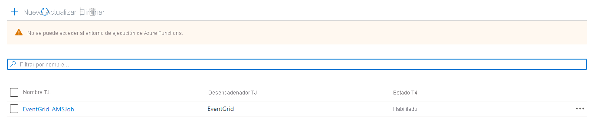
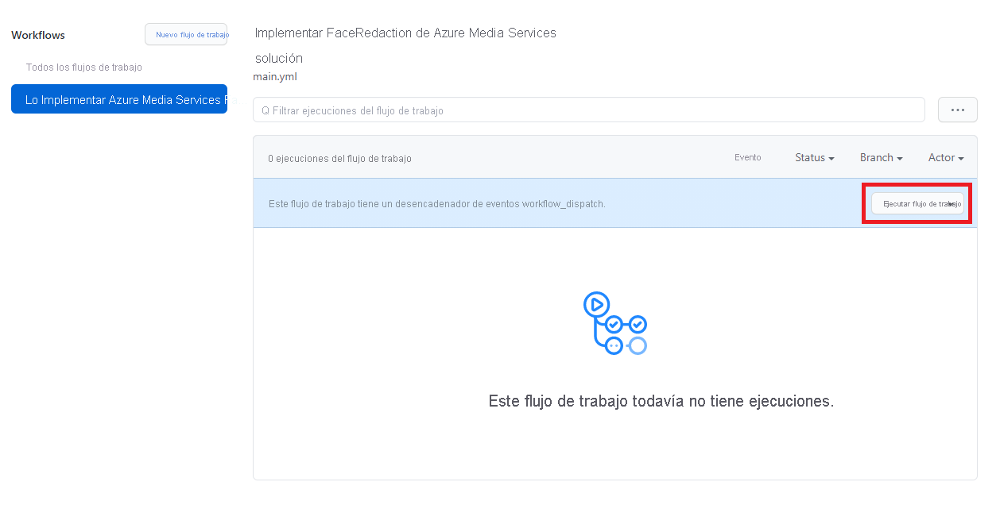

# <a name="event-based-face-redaction"></a>Difuminado de caras basado en eventos

[!INCLUDE [media services api v3 logo](./includes/v3-hr.md)]

## <a name="introduction"></a>Introducción
 
En algunos escenarios o casos de uso, Azure Media Services debería procesar o analizar vídeos en el momento en que los vídeos llegan a un almacén de datos. Un caso de uso de ejemplo podría ser el caso en el que un equipo quiere analizar vídeos de un sitio o una planta para ver si las personas que allí se encuentran siguen las instrucciones de seguridad (por ejemplo, llevar cascos). En este caso de uso, un dispositivo Edge en el sitio podría capturar los vídeos cuando se detecta movimiento y, a continuación, enviarlos a Azure. Para cumplir con los estándares de privacidad, las caras de las personas capturadas en los vídeos deben difuminarse antes de que el equipo pueda analizarlas. Para poder compartir los vídeos enriquecidos lo antes posible con el equipo, el paso de difuminado de caras debe realizarse en el momento en que un vídeo llega a Azure. En esta guía de inicio rápido se muestra cómo usar Azure Media Services en un escenario basado en eventos de este tipo en Azure. Los vídeos cargados en una cuenta de almacenamiento se transformarán mediante un trabajo en Azure Media Services. Se utiliza la API de Media Services v3.

La transformación específica que se usará se denomina [Face Redactor](./analyze-face-redaction-concept.md). Se trata de un valor predeterminado de Azure Media Analytics, que permite modificar el vídeo al desenfocar las caras de los individuos seleccionados.

Al final de la guía de inicio rápido, podrá difuminar caras en un vídeo:

 

## <a name="solution-overview"></a>Información general de la solución

 
          
En esta guía de inicio rápido se muestra cómo implementar la solución que encuentra en la información general de la solución anterior. Comienza con una cuenta de almacenamiento (Azure Data Lake Storage Gen2), con un agente de escucha de eventos conectado a esta (Event Grid), que desencadena una función de Azure cuando se cargan nuevos archivos .mp4 en la cuenta de almacenamiento. La función de Azure envía un trabajo a una transformación configurada previamente en Azure Media Services. El vídeo difuminado resultante se almacenará en una cuenta de Blob Storage.

## <a name="prerequisites"></a>Requisitos previos

- Si no tiene una suscripción a Azure, cree una [cuenta gratuita](https://azure.microsoft.com/free/?WT.mc_id=A261C142F) antes de empezar.
- Cree un grupo de recursos para utilizarlo con esta guía de inicio rápido.

## <a name="get-the-sample-and-understand-its-deployment"></a>Obtenga la muestra y analice su implementación

Cree una bifurcación del [repositorio de muestras de Python](https://github.com/Azure-Samples/media-services-v3-python). En esta guía de inicio rápido, trabajaremos con la muestra FaceRedactorEventBased.

La implementación de esta muestra consta de tres pasos independientes: implementar los servicios de Azure para configurar la solución general, implementar la aplicación de función que envía un trabajo a Azure Media Services cuando se carga un nuevo archivo y configurar el desencadenador de Eventgrid. Hemos creado un flujo de trabajo de Acciones de GitHub que realiza estos pasos. Por lo tanto, esta solución se puede implementar agregando las variables necesarias al entorno GitHub, lo que significa que no se requiere ninguna herramienta de desarrollo local.

## <a name="create-a-service-principal"></a>Creación de una entidad de servicio

Antes de que se pueda ejecutar el flujo de trabajo de Acciones de GitHub, es necesario crear una entidad de servicio que tenga roles de *colaborador* y *lector de datos de Storage Blob* en el grupo de recursos. Esta entidad de servicio será la aplicación que aprovisionará y configurará todos los servicios de Azure en nombre de Acciones de GitHub. La entidad de servicio también se usa después de implementar la solución para generar un token de SAS para los vídeos que deben procesarse.

Para crear la entidad de servicio y darle los roles necesarios en el grupo de recursos, rellene las variables del siguiente comando bash y ejecútelo en el Cloud Shell:
```bash
# Replace <subscription-id>, <name-of-resource-group> and <name-of-app> with the corresponding values. 
# Make sure to use a unique name for the app name parameter.

app_name="<name-of-app>"
resource_group="<name-of-resource-group>"
subscription_id="<subscription-id>"

az ad sp create-for-rbac --name $app_name --role contributor \
                     --scopes /subscriptions/$subscription_id/resourceGroups/$resource_group \
                     --sdk-auth

object_id=$(az ad sp list --display-name $app_name --query [0].objectId -o tsv)

az role assignment create --assignee $object_id --role "Storage Blob Data Reader" \
                      --scope /subscriptions/$subscription_id/resourceGroups/$resource_group
```
  
El comando debe generar un objeto JSON similar a este:
   
```json
{
  "clientId": "<GUID>",
  "clientSecret": "<GUID>",
  "subscriptionId": "<GUID>",
  "tenantId": "<GUID>",
  (...)
}
```
Asegúrese de copiar la salida y de que esté disponible para el paso siguiente.
 
## <a name="add-service-principal-details-to-github-secrets"></a>Agregar detalles de entidad de servicio a secretos de GitHub 

Los detalles de la entidad de servicio deben almacenarse como un [secreto GitHub](https://docs.github.com/en/actions/reference/encrypted-secrets) para que Acciones de GitHub pueda implementar y configurar los servicios necesarios en Azure. Vaya al repositorio Configuración -> secretos del repositorio bifurcado y haga clic en "Crear nuevos secretos". Cree los secretos siguientes:
 - Cree "AZURE_CREDENTIALS" y pegue la salida del paso anterior (json completo). En el flujo de trabajo de Acciones GitHub, este secreto se usará para crear una conexión a Azure. 
 - Cree "CLIENT_ID" y pegue el valor de "clientId" del paso anterior.
 - Cree "CLIENT_SECRET" y pegue el valor de "clientSecret" del paso anterior.
 - Cree "TENANT_ID" y pegue el valor de "tenantId" del paso anterior.
 
## <a name="create-the-env-file"></a>Creación del archivo .env

Copie el contenido del archivo sample.env que se encuentra en el repositorio bifurcado en la carpeta VideoAnalytics/FaceRedactorEventBased. A continuación, cree su propio archivo .env haciendo clic en Agregar archivo -> Crear nuevo archivo. Asigne un nombre al archivo *.env* y rellene las variables. Cuando haya terminado, haga clic en "Confirmar nuevo archivo". Ahora estamos listos para implementar la solución, pero primero examinaremos los archivos de código que vamos a usar.

## <a name="examine-the-code-for-provisioning-the-azure-resources"></a>Examine el código para aprovisionar los recursos de Azure

El siguiente script de Bash aprovisiona los servicios de Azure que se usan en esta solución. El script de Bash usa la CLI de Azure y ejecuta las siguientes acciones:
- Cargue variables de entorno en variables locales.
- Defina nombres para ADLSgen2, una cuenta genérica de Azure Storage, Azure Media Services, aplicación de funciones de Azure y una suscripción y tema del sistema de Event Grid.
- Aprovisione los servicios de Azure definidos.

[!code-bash[Main](../../../media-services-v3-python/VideoAnalytics/FaceRedactorEventBased/AzureServicesProvisioning/deploy_resources.azcli)]

## <a name="examine-azure-function-code"></a>Examine el código de función de Azure

Después de aprovisionar correctamente los recursos de Azure, estamos a punto para implementar el código de Python en nuestra función de Azure. El **archivo /azure-function/EventGrid_AMSJob/__init__.py** contiene la lógica para desencadenar un trabajo de AMS cada vez que un archivo llega al sistema de archivos de Azure Data Lake Gen2. Este script lleva a cabo los pasos siguientes:
- Importe de dependencias y bibliotecas.
- Uso del enlazador de funciones para escuchar Azure Event Grid.
- Toma y definición de variables del esquema de eventos.
- Creación de un recurso de entrada/salida para el trabajo de AMS.
- Conecte a Azure Data Lake Gen2 mediante el cliente de DataLakeService y genere un token de SAS para usarlo como autenticación para la entrada del trabajo de AMS.
- Configure y cree el trabajo.

[!code-python[Main](../../../media-services-v3-python/VideoAnalytics/FaceRedactorEventBased/AzureFunction/EventGrid_AMSJob/__init__.py)]

## <a name="examine-the-code-for-configuring-the-azure-resources"></a>Examine el código para configurar los recursos de Azure 

El siguiente script de Bash se usa para configurar los recursos una vez aprovisionados. La ejecución de este script es el último paso de la implementación de la solución, después de implementar nuestro código de función. El script ejecuta los siguientes pasos:
- Configuración de los ajustes de la aplicación para la función de la aplicación.
- Creación de un tema del sistema de Azure Event Grid.
- Cree la suscripción a eventos para que, cuando se cree un blob en la carpeta sin procesar de ADLSg2, se desencadene la función de Azure.
- Cree la transformación de Azure Media Services mediante una llamada API de REST. Se llamará a esta transformación en la función de Azure.

> [!NOTE]
> Actualmente, ni el SDK de Python Azure Media Services v3, ni la CLI de Azure admiten la creación de una transformación FaceRedaction. Por lo tanto, utilizamos el método API de REST para crear el trabajo de transformación.

[!code-bash[Main](../../../media-services-v3-python/VideoAnalytics/FaceRedactorEventBased/AzureServicesProvisioning/configure_resources.azcli)]
 
## <a name="enable-github-actions-pipeline"></a>Habilitación de canalización de Acciones de GitHub
 El archivo de flujo de trabajo de este repositorio contiene los pasos para ejecutar la implementación de esta solución. Para iniciar el flujo de trabajo, debe habilitarse para su propio repositorio. Para habilitarlo, vaya a la pestaña Acciones del repositorio y seleccione "I understand my workflows, go ahead and enable them" (Comprendo mis flujos de trabajo, proceda a habilitarlos).
 
  
 
Después de habilitar las Acciones de GitHub, puede encontrar el archivo de carga de trabajo aquí: [.github/workflows/main.yml](https://github.com/Azure-Samples/media-services-v3-python/blob/main/.github/workflows/main.yml).  Aparte de los desencadenadores, hay un trabajo de compilación con un par de pasos. Se incluyen los pasos siguientes:
- **Env**: aquí, se definen diversas variables de entorno, que hacen referencia a los Secretos GitHub que agregamos anteriormente.
- **Archivo de entorno de lectura**: el archivo de entorno se lee para el trabajo de compilación.
- **Resolver dependencias de proyecto mediante Pip**: las bibliotecas necesarias en nuestras funciones de Azure se cargan en el entorno de Acciones de GitHub
- **Inicio de sesión de Azure**: en este paso se usa el Secreto GitHub para iniciar sesión en la CLI de Azure con la información de la entidad de servicio.
- **Implementación de recursos de Azure mediante el archivo de script de la CLI de Azure**: ejecuta el script de implementación para aprovisionar los recursos de Azure
- **Implementar código de función de Azure**: este paso empaqueta e implementa la función de Azure en el directorio "./azure-function". Cuando la función de Azure se implementa correctamente, debe estar visible en el Azure Portal con el nombre "EventGrid_AMSJob":
 

- **Configuración de recursos de Azure mediante el archivo de script de la CLI de Azure**: si todos son correctos, el último paso es configurar los servicios de Azure implementados para activar el agente de escucha de eventos.

Después de habilitar los flujos de trabajo, seleccione el flujo de trabajo "Implementar la solución FaceRedaction de Azure Media Service" y seleccione "Ejecutar flujo de trabajo". Ahora, la solución se implementará mediante las variables agregadas en los pasos anteriores. Espere un par de minutos y compruebe que se ha ejecutado correctamente.

 

## <a name="test-your-solution"></a>Prueba de la solución
Vaya al explorador de almacenamiento de su ADLS Gen2 en Azure Portal. Cargue un vídeo al contenedor sin procesar. Si busca un vídeo de prueba, descargue uno de [este sitio web](https://www.pexels.com/search/videos/group/). Consulte la imagen siguiente para obtener instrucciones sobre cómo cargar un vídeo en la cuenta de almacenamiento de ADLS Gen2:

 

Compruebe en la instancia de Azure Media Services que se crea un trabajo; para ello, vaya a su cuenta de Azure Media Services y seleccione Transformaciones y trabajos en el menú. A continuación, seleccione la transformación de difuminado de caras.

 

Esta página debe mostrar el trabajo desencadenado por la función de Azure. El trabajo puede estar terminado o aún en proceso.

  

Al seleccionar el trabajo, verá algunos detalles sobre el trabajo específico. Si selecciona el nombre del recurso de salida y, a continuación, usa el vínculo al contenedor de almacenamiento que está vinculado a este, puede ver el vídeo procesado cuando finalice el trabajo.

  

## <a name="clean-up-resources"></a>Limpieza de recursos

Cuando haya terminado con la guía de inicio rápido, elimine los recursos creados en el grupo de recursos. Además, puede eliminar el repositorio bifurcado.

## <a name="next-steps"></a>Pasos siguientes

Si desea modificar este ejemplo, lo más probable es que quiera ejecutar el código localmente. Para el desarrollo local, las variables del archivo sample.env son suficientes porque la entidad de servicio no es necesaria cuando una cuenta de usuario inicia sesión en la CLI de Azure instalada localmente. Para obtener instrucciones sobre cómo trabajar localmente con la función de Azure, consulte [estos documentos](../../azure-functions/create-first-function-vs-code-python.md).
