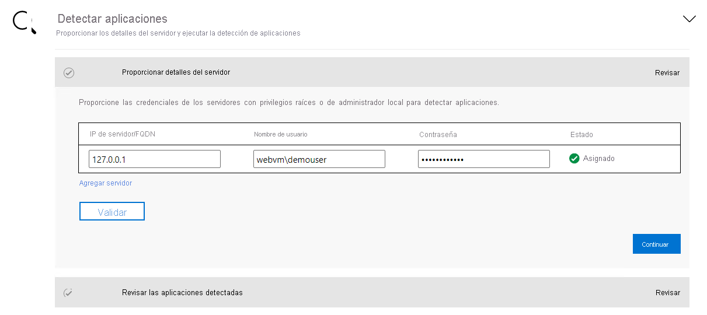

# <a name="aspnet-app-containerization-and-migration-to-azure-app-service"></a>Contenedorización de aplicaciones de ASP.NET y migración a Azure App Service

En este artículo, aprenderá a incluir aplicaciones de ASP.NET en contenedores y a migrarlas a [Azure App Service](https://azure.microsoft.com/services/app-service/) mediante la herramienta Azure Migrate App Containerization. El proceso de contenedorización no requiere acceso a su código base y proporciona una manera sencilla de incluir las aplicaciones existentes en contenedores. La herramienta usa el estado de ejecución de las aplicaciones en un servidor para determinar los componentes de la aplicación. Luego, le ayuda a empaquetarlos en una imagen de contenedor. Después, puede implementar la aplicación contenedorizada en Azure App Service.

La herramienta Azure Migrate App Containerization admite actualmente las siguientes acciones:

- Contenedorización de las aplicaciones de ASP.NET e implementación en contenedores de Windows en App Service.
- Contenedorización de aplicaciones de ASP.NET e su implementación en contenedores de Windows en Azure Kubernetes Service (AKS). [Más información sobre este escenario de contenedorización](./tutorial-app-containerization-aspnet-kubernetes.md)
- Inclusión en contenedores de aplicaciones web de Java en Apache Tomcat (en servidores Linux) e implementación en contenedores de Linux en AKS. [Más información sobre este escenario de contenedorización](./tutorial-app-containerization-java-kubernetes.md)
- Inclusión en contenedores de aplicaciones web de Java en Apache Tomcat (en servidores Linux) e implementación en contenedores de Linux en App Service. [Más información sobre este escenario de contenedorización](./tutorial-app-containerization-java-app-service.md)

La herramienta App Containerization le ayuda a:

- **Detección de los componentes de una aplicación.** La herramienta se conecta de forma remota a los servidores de aplicaciones que ejecutan la aplicación de ASP.NET y detecta los componentes de la aplicación. Crea un archivo Dockerfile que se puede usar para crear una imagen de contenedor para la aplicación.
- **Compile la imagen de contenedor.** Puede inspeccionar y personalizar aún más el archivo Dockerfile en función de los requisitos de la aplicación y usarlo para compilar la imagen de contenedor de la aplicación. La imagen de contenedor de la aplicación se inserta en la instancia de Azure Container Registry que especifique.
- **Implementación en Azure App Service.**  Luego, la herramienta genera los archivos de implementación necesarios para implementar la aplicación contenedorizada en Azure App Service.

> [!NOTE]
> La herramienta Azure Migrate App Containerization le ayuda a detectar tipos de aplicación concretos (ASP.NET y aplicaciones web Java en Apache Tomcat), así como sus componentes, en un servidor de aplicaciones. Para detectar servidores y el inventario de las aplicaciones, roles y características que se ejecutan en equipos locales, use la [herramienta de detección y valoración de Azure Migrate](./tutorial-discover-vmware.md).

No todas las aplicaciones se beneficiarán de un cambio directo a los contenedores sin realizar un rediseño significativo. Pero estas son algunas de las ventajas de migrar las aplicaciones existentes a los contenedores sin reescribirlas:

- **Uso mejorado de la infraestructura.** Cuando se usan contenedores, varias aplicaciones pueden compartir recursos y hospedarse en la misma infraestructura. Esto puede ayudarlo a consolidar la infraestructura y mejorar su utilización.
- **Administración simplificada.** Al hospedar las aplicaciones en una plataforma administrada moderna, como AKS y App Service, puede simplificar los procedimientos de administración. Esta simplificación se puede conseguir al retirar o reducir los procesos de administración y mantenimiento de la infraestructura que tradicionalmente realizaría con una infraestructura de su propiedad.
- **Portabilidad de las aplicaciones.** Debido a la mayor adopción y estandarización de los formatos y las plataformas de especificación de contenedores, la portabilidad de la aplicación deja de ser un problema.
- **Adopte la administración moderna mediante DevOps.** El uso de contenedores le ayuda a adoptar y normalizar los procedimientos modernos de administración y seguridad, y la transición a DevOps.


En este tutorial, aprenderá a:

> [!div class="checklist"]
> * Configurar una cuenta de Azure.
> * Instalar la herramienta Azure Migrate App Containerization.
> * Detectar la aplicación ASP.NET.
> * Compile la imagen de contenedor.
> * Implementar la aplicación contenedorizada en App Service.

> [!NOTE]
> Los tutoriales proporcionan la ruta de implementación más sencilla para un escenario, de modo que pueda configurar rápidamente una prueba de concepto. Los tutoriales usan opciones predeterminadas siempre que es posible y no muestran todos los valores y las rutas de acceso.

## <a name="prerequisites"></a>Requisitos previos

Antes de comenzar este tutorial, debe:

**Requisito** | **Detalles**
--- | ---
**Identificar la máquina en la que se va a instalar la herramienta** | Necesita una máquina Windows en la que instalar y ejecutar la herramienta Azure Migrate App Containerization. La máquina Windows puede ejecutar un sistema operativo de servidor (Windows Server 2016 o posterior) o de cliente (Windows 10) (la herramienta se puede ejecutar en el escritorio). <br/><br/> La máquina Windows que ejecuta la herramienta debe tener conectividad de red con los servidores o las máquinas virtuales que hospedan las aplicaciones de ASP.NET que se incluirán en contenedores.<br/><br/> Asegúrese de que haya disponibles 6 GB en la máquina Windows que ejecuta la herramienta Azure Migrate App Containerization. Este espacio es para almacenar artefactos de aplicación. <br/><br/> La máquina Windows debe tener acceso a Internet, ya sea directamente o a través de un proxy. <br/> <br/>Si la herramienta Microsoft Web Deployment no está ya instalada en la máquina que ejecuta la herramienta App Containerization y el servidor de aplicaciones, instálela. Puede [descargar la herramienta](https://aka.ms/webdeploy3.6).
**Servidores de aplicaciones** | Habilite la comunicación remota con PowerShell en los servidores de aplicaciones: inicie sesión en el servidor de aplicaciones y siga [estas instrucciones para activar la comunicación remota con PowerShell](/powershell/module/microsoft.powershell.core/enable-psremoting). <br/><br/> Si el servidor de aplicaciones ejecuta Windows Server 2008 R2, asegúrese de que esté instalada la versión 5.1 de PowerShell en el servidor de aplicaciones. Siga las instrucciones que se indican [aquí para descargar e instalar PowerShell 5.1](/powershell/scripting/windows-powershell/wmf/setup/install-configure) en el servidor de aplicaciones. <br/><br/> Si la herramienta Microsoft Web Deployment no está ya instalada en la máquina que ejecuta la herramienta App Containerization y el servidor de aplicaciones, instálela. Puede [descargar la herramienta](https://aka.ms/webdeploy3.6).
**Aplicación ASP.NET** | La herramienta admite actualmente: <br> <ul><li> Aplicaciones de ASP.NET que usan .NET Framework 3.5, o cualquier versión posterior.<br/> <li>Servidores de aplicaciones que ejecutan Windows Server 2008 R2, o cualquier versión posterior (los servidores de aplicaciones deben ejecutar PowerShell 5.1). <br/><li> Aplicaciones que se ejecutan en Internet Information Services 7.5, o cualquier versión posterior.</ul> <br/><br/> La herramienta no admite actualmente: <br/> <ul><li>Aplicaciones que requieren la autenticación de Windows (actualmente, AKS no admite gMSA). <br/> <li> Aplicaciones que dependen de otros servicios de Windows hospedados fuera de Internet Information Services.


## <a name="prepare-an-azure-user-account"></a>Preparación de una cuenta de usuario de Azure

Si no tiene una suscripción a Azure, cree una [cuenta gratuita](https://azure.microsoft.com/pricing/free-trial/) antes de empezar.

Después de que haya configurado la suscripción, necesitará una cuenta de usuario de Azure que tenga lo siguiente:
- Permisos de propietario en la suscripción a Azure.
- Permisos para registrar aplicaciones de Azure Active Directory.

Si acaba de crear una cuenta de Azure gratuita, es el propietario de la suscripción. Si no es el propietario, trabaje con él para asignar los permisos, como se indica a continuación:

1. En Azure Portal, busque "suscripciones". En **Servicios**, seleccione **Suscripciones**:

    

2. En la página **Suscripciones**, seleccione aquella en la que desee crear un proyecto de Azure Migrate.
3. En la suscripción, en el panel izquierdo, seleccione **Control de acceso (IAM)** .
4. En la pestaña **Comprobar acceso**, busque la cuenta de usuario correspondiente.
5. En **Agregar una asignación de roles**, seleccione **Agregar**:

    

6. En la página **Agregar asignación de roles**, seleccione el rol **Propietario** y después seleccione la cuenta (**azmigrateuser** en el ejemplo). Después, seleccione **Guardar**.

    

   Su cuenta de Azure también necesita permisos para registrar aplicaciones de Azure Active Directory.
8. En Azure Portal, vaya a **Azure Active Directory** > **Usuarios** > **Configuración de usuario**.
9. En **Configuración de usuario**, compruebe que los usuarios de Azure AD puedan registrar aplicaciones (de forma predeterminada, el valor de esta opción es **Sí**).

      

10. Si la opción **Registros de aplicaciones** se ha establecido en **No**, pida al administrador global o de inquilinos que asigne el permiso necesario. Como alternativa, el administrador global o de inquilinos puede asignar el rol Desarrollador de aplicaciones a una cuenta para permitir el registro de aplicaciones de Azure Active Directory. Para más información, consulte [Asignación de roles a usuarios](../active-directory/fundamentals/active-directory-users-assign-role-azure-portal.md).

## <a name="download-and-install-the-azure-migrate-app-containerization-tool"></a>Descarga e instalación de la herramienta de Azure Migrate App Containerization

1. [Descargue el instalador de Azure Migrate App Containerization](https://go.microsoft.com/fwlink/?linkid=2134571) en una máquina Windows.
2. Abra PowerShell en modo de administrador y cambie el directorio de PowerShell a la carpeta que contiene el instalador.
3. Ejecute el script de instalación mediante este comando:

   ```powershell
   .\AppContainerizationInstaller.ps1
   ```

## <a name="open-the-app-containerization-tool"></a>Abra la herramienta App Containerization

1. Abra un explorador en cualquier máquina que pueda conectarse a la máquina Windows que ejecuta la herramienta App Containerization. Vaya a la dirección URL de la herramienta: **https://*nombre o dirección IP de la máquina*:44369**.

   Como alternativa, puede abrir la aplicación desde el escritorio mediante el acceso directo de la misma.

2. Si ve una advertencia que indica que la conexión no es privada, seleccione **Opciones avanzadas** y vaya al sitio web. Esta advertencia aparece porque la interfaz web usa un certificado TLS/SSL autofirmado.
3. En la pantalla de inicio de sesión, use la cuenta de administrador local de la máquina para iniciar sesión.
4. Seleccione **Aplicaciones web ASP.NET** como el tipo de aplicación que quiere incluir en un contenedor.
5. En la lista **Target Azure service** (Servicio de Azure de destino), seleccione **Containers on Azure App Service (Contenedores en Azure App Service)** :

   

### <a name="complete-the-tool-prerequisites"></a>Realización de los requisitos previos de la herramienta
1. Acepte los términos de licencia y lea la información de terceros.
6. En la aplicación web de la herramienta **Configurar los requisitos previos**, complete estos pasos:
   - **Conectividad.** La herramienta comprueba si la máquina Windows tiene acceso a Internet. Si la máquina usa un proxy:
     1. Seleccione **Configurar el proxy** para especifique la dirección del proxy (con los formatos de dirección IP o FQDN) y el puerto de escucha.
     1. Especifique las credenciales si el proxy requiere autenticación.
       
     1. Si ha agregado detalles del proxy o deshabilitado el proxy o la autenticación, seleccione **Guardar** para volver a desencadenar la comprobación de conectividad.
     
     Solo se admite un proxy HTTP.
   - **La instalación se actualiza.** La herramienta busca las actualizaciones más recientes y las instala. También puede [instalar de manera manual la versión más reciente de la herramienta](https://go.microsoft.com/fwlink/?linkid=2134571).
   - **Instale la herramienta Microsoft Web Deploy.** La herramienta comprueba si la herramienta Microsoft Web Deployment está instalada en la máquina Windows que ejecuta la herramienta Azure Migrate App Containerization.
   - **Habilite la comunicación remota con PowerShell.** La herramienta le solicita que se asegure de está habilitada la comunicación remota de PowerShell en los servidores de aplicaciones que ejecutan las aplicaciones de ASP.NET que se incluirán en contenedores.


## <a name="sign-in-to-azure"></a>Inicio de sesión en Azure

1. Seleccione **Iniciar sesión** para iniciar sesión en su cuenta de Azure.

   Necesita un código de dispositivo para autenticarse con Azure. Al seleccionar **Iniciar sesión**, se debería abrir una ventana que contenga el código del dispositivo. Si la ventana no aparece, asegúrese de que ha deshabilitado el bloqueador de elementos emergentes en el explorador.
2. Seleccione **Copiar código e Iniciar sesión** para copiar el código del dispositivo y abrir un símbolo del sistema de inicio de sesión de Azure en una nueva pestaña del explorador:

    

3. En la pestaña nueva, pegue el código del dispositivo y complete el inicio de sesión mediante las credenciales de la cuenta de Azure. Después de que haya iniciado sesión, puede cerrar la pestaña del explorador y volver a la interfaz web de la herramienta App Containerization.
4. Seleccione el **inquilino de Azure** que quiere usar.
5. Especifique la **suscripción a Azure** que quiera usar.

## <a name="discover-aspnet-applications"></a>Supervisión de aplicaciones ASP.NET

La herramienta App Containerization se conecta de forma remota a los servidores de aplicaciones mediante las credenciales proporcionadas e intenta detectar las aplicaciones ASP.NET hospedadas en dichos servidores de aplicaciones.

1. Especifique la **dirección IP/el nombre de dominio completo del servidor** y las credenciales del servidor que ejecuta la aplicación de ASP.NET que se deben usar para conectarse de forma remota al servidor para la detección de las aplicaciones.
    - Las credenciales especificadas deben corresponder a un administrador local (Windows) en el servidor de aplicaciones.
    - En el caso de las cuentas de dominio (el usuario debe ser administrador en el servidor de aplicaciones), coloque delante del nombre de usuario el nombre de dominio con este formato: *<dominio\nombre de usuario>* .
    - En el caso de las cuentas locales (el usuario debe ser administrador en el servidor de aplicaciones), coloque delante del nombre de usuario el nombre de host con este formato: *<dominio\nombre de host>* .
    - Puede ejecutar la detección de aplicaciones en un máximo de cinco servidores a la vez.

2. Seleccione **Validar** para comprobar que puede acceder al servidor de aplicaciones desde la máquina que ejecuta la herramienta y que las credenciales son válidas. Una vez validada correctamente, la columna **Estado** tendrá el valor **Asignado**:

    

3. Seleccione **Continuar** para iniciar la detección de aplicaciones en los servidores de aplicaciones seleccionados.

4. Una vez finalizada la detección de aplicaciones, seleccione las aplicaciones que desea incluir en contenedores:

    

6. Especifique un nombre para el contenedor de destino de cada aplicación seleccionada. Especifique el nombre del contenedor como <*nombre:etiqueta*>, donde *etiqueta* se usa para la imagen del contenedor. Por ejemplo, puede especificar el nombre del contenedor de destino como *appname:v1*.   

### <a name="parameterize-application-configurations"></a>Parametrización de las configuraciones de la aplicación
Al parametrizar la configuración, esta pasa a estar disponible como parámetro en el momento de la implementación. La parametrización le permite configurar un valor al implementar la aplicación, en lugar de codificar dicho valor de forma rígida en un valor específico en la imagen del contenedor. Por ejemplo, esta opción es útil para parámetros como las cadenas de conexión de base de datos.
1. Seleccione **Configuraciones de aplicaciones** para revisar las configuraciones detectadas.
2. Seleccione los parámetros que desea parametrizar y, después, seleccione **Aplicar**:

   

### <a name="externalize-file-system-dependencies"></a>Externalización de las dependencias del sistema de archivos

 Puede agregar otras carpetas que use la aplicación. Especifique si deben formar parte de la imagen de contenedor o se deben externalizar en almacenamiento persistente a través del recurso compartido de archivos de Azure. El uso de almacenamiento persistente funciona bien con las aplicaciones con estado que almacenan ese estado fuera del contenedor o que almacenan otro contenido estático en el sistema de archivos.

1. Seleccione **Editar** en **Carpetas de aplicaciones** para revisar las carpetas de aplicaciones detectadas. Estas carpetas se han identificado como artefactos obligatorios que la aplicación necesita. Se copiarán en la imagen de contenedor.

2. Seleccione **Agregar carpetas** y especifique las rutas de acceso de las carpetas que desea agregar.
3. Para agregar varias carpetas al mismo volumen, separe los valores con comas.
4. Seleccione **Recurso compartido de archivos de Azure** como opción de almacenamiento si quiere que las carpetas se almacenen fuera del contenedor en almacenamiento persistente.
5. Seleccione **Guardar** después de revisar las carpetas de las aplicaciones:

   

6. Seleccione **Continuar** para continuar con la fase de compilación de la imagen de contenedor.

## <a name="build-container-image"></a>Compilar la imagen del contenedor


1. En la lista desplegable, seleccione una instancia de [Azure Container Registry](../container-registry/index.yml) que se usará para compilar y almacenar las imágenes de contenedor de las aplicaciones. Puede usar una instancia de Azure Container Registry existente o crear una mediante la selección de **Crear nuevo registro**:

    

   > [!NOTE]
   > Solo se muestran los registros de contenedor de Azure con la cuenta del usuario administrador habilitada. Actualmente, la cuenta del usuario administrador es necesaria para implementar una imagen desde un registro de contenedor de Azure en Azure App Service. Para más información, consulte [Autenticación con un registro de contenedor de Azure](../container-registry/container-registry-authentication.md#admin-account).

2. Los archivos Dockerfile necesarios para compilar las imágenes de contenedor de cada aplicación seleccionada se genera al principio del paso de compilación. Seleccione **Revisar** para revisar el archivo Dockerfile. También puede agregar cualquier personalización necesaria al archivo Dockerfile en el paso de revisión y guardar los cambios antes de iniciar el proceso de compilación.

3. Seleccione las aplicaciones para las que desea compilar imágenes y, después, seleccione **Compilar**. Al seleccionar **Compilar**, se iniciará la compilación de la imagen de contenedor para cada aplicación. La herramienta supervisa el estado de la compilación y le permitirá continuar con el paso siguiente cuando la compilación finalice.

4.  Para supervisar el progreso de la compilación, seleccione **Compilación en curso** en la columna de estado. El vínculo se activará un par de minutos después de desencadenar el proceso de compilación.  

5. Después de haber completado la compilación, seleccione **Continuar** para especificar la configuración de la implementación:

    

## <a name="deploy-the-containerized-app-on-azure-app-service"></a>Implementación de la aplicación contenedorizada en Azure App Service

Después de que se haya compilado la imagen de contenedor, el paso siguiente consiste en implementar la aplicación como un contenedor en [Azure App Service](https://azure.microsoft.com/services/app-service/).

1. Seleccione el plan de Azure App Service que debe usar la aplicación.

   Si no tiene un plan de App Service o desea crear uno, seleccione **Crear nuevo plan de App Service** para hacerlo.      
1. Seleccione **Continuar** después de seleccionar el plan de App Service.

2. Si ha optado por parametrizar las configuraciones de la aplicación, especifique el almacén de secretos que se usará para la aplicación. Puede elegir un almacén de claves de Azure o la configuración de la aplicación de App Service para administrar los secretos de la aplicación. Para más información, consulte [Configuración de cadenas de conexión](../app-service/configure-common.md#configure-connection-strings).

     - Si ha seleccionado la configuración de la aplicación de App Service para administrar los secretos, seleccione **Continuar**.
     - Si desea usar un almacén de claves de Azure para administrar los secretos de aplicación, especifique el que desea usar.     
         - Si no tiene ningún almacén de claves de Azure o desea crear uno, puede hacerlo seleccionando **Create new Azure Key Vault** (Crear almacén de claves de Azure).
         - La herramienta asignará automáticamente los permisos necesarios para administrar secretos por medio del almacén de claves.

3. Si ha agregado más directorios o carpetas, y ha seleccionado la opción de recurso compartido de archivos de Azure para el almacenamiento persistente, especifique el recurso compartido de archivos de Azure que debe usar la herramienta App Containerization en la implementación. La herramienta copiará las carpetas de la aplicación que configuró para Azure Files y los montará en el contenedor de aplicaciones durante la implementación. 

   Si no tiene ningún recurso compartido de archivos de Azure o quiere crearlo, seleccione **Create new Storage Account and file share** (Crear cuenta de almacenamiento y recurso compartido de archivos).  

4. Ahora debe especificar la configuración de implementación de la aplicación. Haga clic en **Configurar** para personalizar la implementación de la aplicación. En el paso de configuración se pueden especificar las siguientes personalizaciones:
     - **Nombre**. Especifique un nombre único para la aplicación. Este nombre se utilizará para generar la dirección URL de la aplicación. También se usará como prefijo para otros recursos creados como parte de la implementación.
     - **Configuración de la aplicación.** Para cualquier configuración de aplicación que se haya parametrizado, especifique los valores que se usarán para la implementación actual.
     - **Configuración del almacenamiento.** Revise la información de las carpetas de la aplicación que se han configurado para el almacenamiento persistente.

    

5. Tras guardar la configuración de implementación de la aplicación, la herramienta generará el archivo YAML de implementación de Kubernetes para la aplicación.
     - Seleccione **Revisar** para revisar la configuración de implementación de las aplicaciones.
     - Seleccione las aplicaciones que desea implementar.
     - Seleccione **Implementar** para iniciar la implementación de las aplicaciones seleccionadas.

         

     - Tras implementar la aplicación, puede seleccionar la columna **Estado de implementación** para realizar el seguimiento de los recursos que se implementaron para la aplicación.


## <a name="troubleshoot-problems"></a>Solucionar problemas

Para solucionar los problemas que aparezcan en la herramienta App Containerization, puede ver los archivos de registro en la máquina Windows que ejecuta la herramienta. Los archivos de registro de la herramienta se encuentran en *C:\ProgramData\Microsoft Azure Migrate App Containerization\Logs*.

## <a name="next-steps"></a>Pasos siguientes

- [Contenedorización de las aplicaciones web de ASP.NET e implementación en contenedores de Windows en AKS](./tutorial-app-containerization-aspnet-kubernetes.md)
- [Contenedorización de aplicaciones web de Java en Apache Tomcat (en servidores Linux) e implementación en contenedores Linux en AKS](./tutorial-app-containerization-java-kubernetes.md)
- [Contenedorización de aplicaciones web de Java en Apache Tomcat (en servidores Linux) e implementación en contenedores de Linux en App Service](./tutorial-app-containerization-java-app-service.md)
