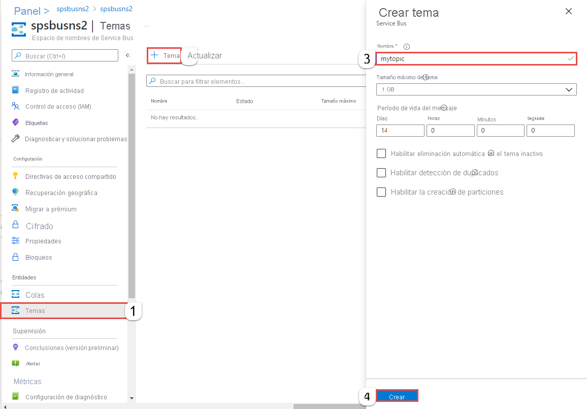

## Creación de un tema mediante Azure Portal
1. En la página **Espacio de nombres de Service Bus**, seleccione **Temas** en el menú izquierdo.
2. En la barra de herramientas, seleccione **+ Tema**. 
4. Escriba un **nombre** para el tema. Deje las restantes opciones con sus valores predeterminados.
5. Seleccione **Crear**.

    

## Crear suscripciones en el tema
1. Seleccione el **tema** que creó en la sección anterior. 
    
    
2. En la página **Tema de Service Bus**, seleccione **Suscripciones** en el menú izquierdo y, a continuación, **+ Suscripción** en la barra de herramientas. 
    
    
3. En la página **Crear suscripción**, siga estos pasos:
    1. Escriba **S1** como **nombre** de la suscripción.
    1. Escriba **3** en **Max delivery count** (Número máximo de entregas).
    1. Luego, seleccione **Create** (Crear) para guardar la suscripción. 

        
4. Repita dos veces el paso anterior para crear suscripciones denominadas **S2** y **S3**.