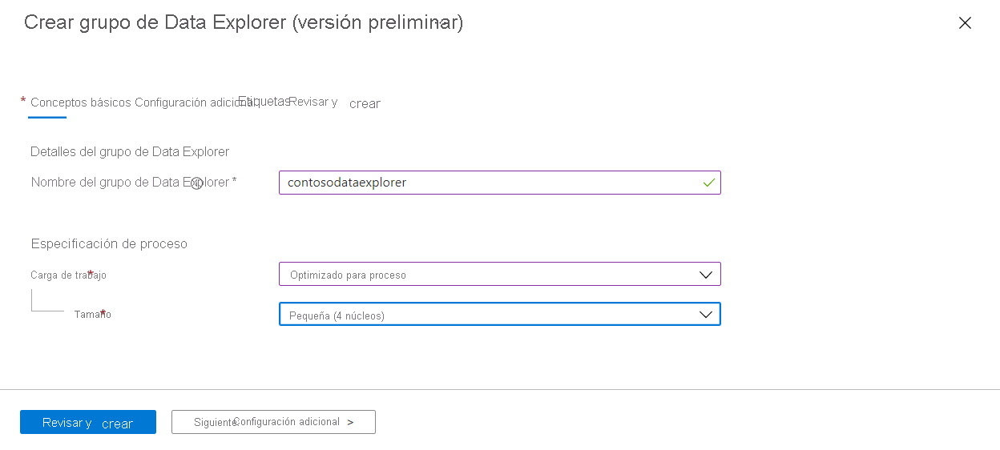
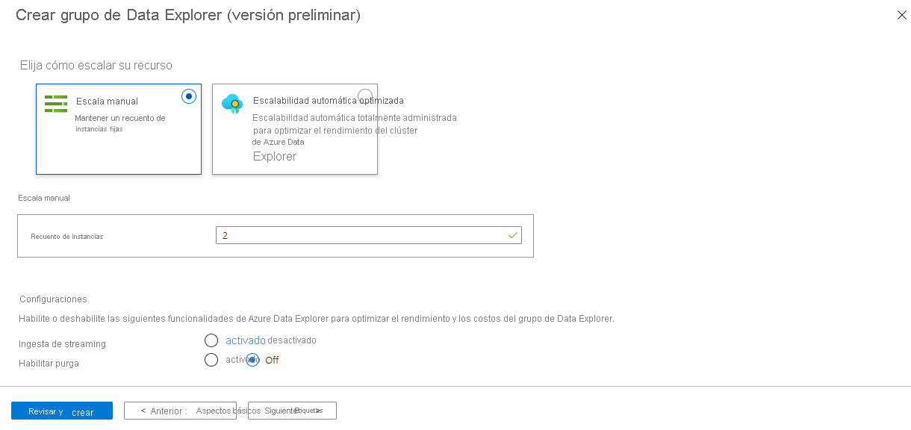
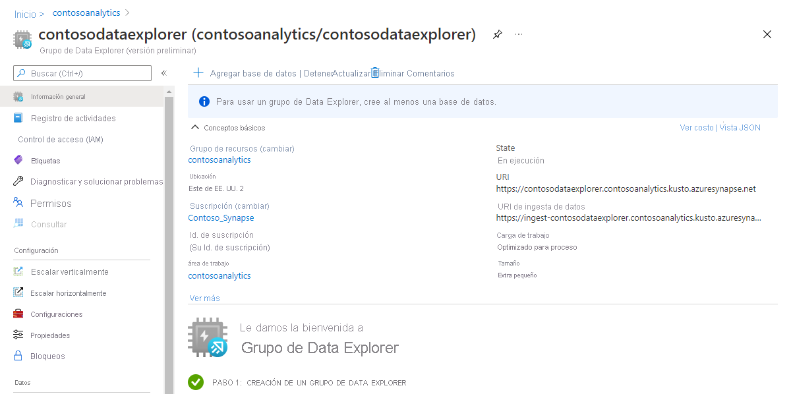
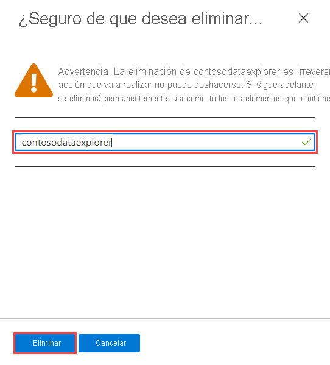

# Guía de inicio rápido: Creación de un grupo del Explorador de datos mediante Azure Portal (versión preliminar)

El Explorador de datos de Azure Synapse es un servicio de análisis de datos rápido y totalmente administrado para analizar en tiempo real grandes volúmenes de datos que se transmiten desde aplicaciones, sitios web, dispositivos IoT, etc. Para usar Data Explorer, primero debe crear un grupo del Explorador de datos.

En este artículo se describen los pasos para crear un grupo del Explorador de datos en un área de trabajo de Synapse mediante Azure Portal.

> [!IMPORTANT]
> La facturación de las instancias de Data Explorer se prorratea por minuto, tanto si se usan como si no. Asegúrese de cerrar la instancia de Data Explorer después de que haya terminado de usarla, o configure un breve tiempo de espera. Para obtener más información, consulte los **Recursos de limpieza**.

Si no tiene una suscripción a Azure, [cree una cuenta gratuita antes de empezar](https://azure.microsoft.com/free/).

## Prerrequisitos

- Una suscripción a Azure: [cree una cuenta gratuita](https://azure.microsoft.com/free/)
- [Área de trabajo de Synapse](../quickstart-create-workspace.md)

## Inicio de sesión en Azure Portal

Inicie sesión en el [Portal de Azure](https://portal.azure.com/)

## Desplazamiento al área de trabajo de Synapse

1. Vaya al área de trabajo de Synapse en la que se va a crear el grupo del Explorador de datos. Para ello, escriba el nombre del servicio (o el nombre del recurso directamente) en la barra de búsqueda.

    

1. En la lista de áreas de trabajo, escriba el nombre (o una parte del nombre) del área que desea abrir. En este ejemplo, se usará un área de trabajo denominado **contosoanalytics**.

    

## Creación de un grupo del Explorador de datos nuevo

1. En el área de trabajo de Synapse en la que quiera crear el grupo del Explorador de datos, seleccione **Nuevo grupo del Explorador de datos** en la barra superior.

    

1. En la pestaña **Datos básicos**, escriba la siguientes información:

    | Configuración | Valor sugerido | Descripción |
    |--|--|--|
    | Nombre del grupo del Explorador de datos | contosodataexplorer | Este es el nombre que tendrá el grupo del Explorador de datos. |
    | Carga de trabajo | Proceso optimizado | Esta carga de trabajo proporciona una mayor proporción de almacenamiento de CPU a SSD. |
    | Tamaño del nodo | Pequeña (4 núcleos) | Establézcalo en el menor tamaño para reducir los costos de este artículo de inicio rápido |

    

    > [!IMPORTANT]
    > Tenga en cuenta que existen limitaciones específicas para los nombres que los grupos del Explorador de datos pueden usar. Los nombres solo deben contener letras minúsculas y números, deben tener entre 4 y 15 caracteres y deben empezar por una letra.

1. Seleccione **Siguiente: Configuración adicional**. Use la siguiente configuración y deje los valores predeterminados para el resto de la configuración.

    | Configuración | Valor sugerido | Descripción |
    |--|--|--|
    | Ampliación | Escala manual | En este inicio rápido no se necesitará la escalabilidad automática |
    | Recuento de números | 2 | Establézcalo en el menor tamaño para reducir los costos de este artículo de inicio rápido |

    

1. Seleccione **Siguiente: etiquetas**. No agregue ninguna etiqueta.
1. Seleccione **Revisar + crear**.
1. Revise los detalles para asegurarse de que son correctos y, a continuación, seleccione **Crear**.

    El grupo del Explorador de datos iniciará el proceso de aprovisionamiento.

    

1. Una vez completado el aprovisionamiento, vuelva a la página de **Información general** del área de trabajo y compruebe que aparece la nueva página principal del grupo del Explorador de datos.

    

## Limpieza de los recursos del grupo del Explorador de datos mediante Azure Portal

Siga estos pasos para eliminar el grupo del Explorador de datos del área de trabajo mediante Azure Portal.

> [!WARNING]
> Al eliminar un grupo del Explorador de datos, se quitará también el motor de análisis del área de trabajo, por lo que no será posible conectarse al grupo y todas las consultas, canalizaciones y cuadernos que usen este grupo eliminado dejarán de funcionar.

### Eliminación del grupo del Explorador de datos

1. Vaya a los grupos del Explorador de datos en el área de trabajo.
1. Para quitar el grupo del Explorador de datos (en este caso, **contosodataexplorer**), seleccione **Más [...]**  > **Eliminar**.

    

1. Para confirmar la eliminación, escriba el nombre del grupo que se está eliminando y luego seleccione **Eliminar**.

    

1. Una vez que el proceso se complete correctamente, compruebe que el grupo ya no aparece en la lista.

## Pasos siguientes

[Guía de inicio rápido: Creación de un grupo del Explorador de datos con Synapse Studio](data-explorer-create-pool-studio.md)
